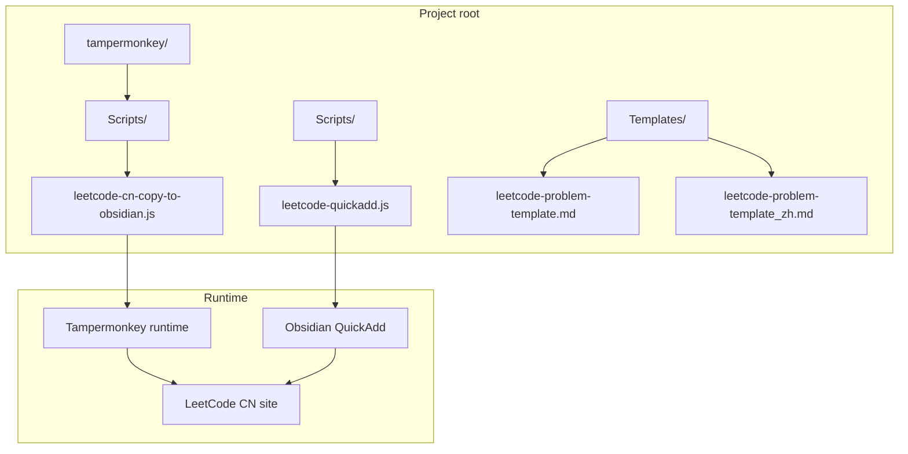
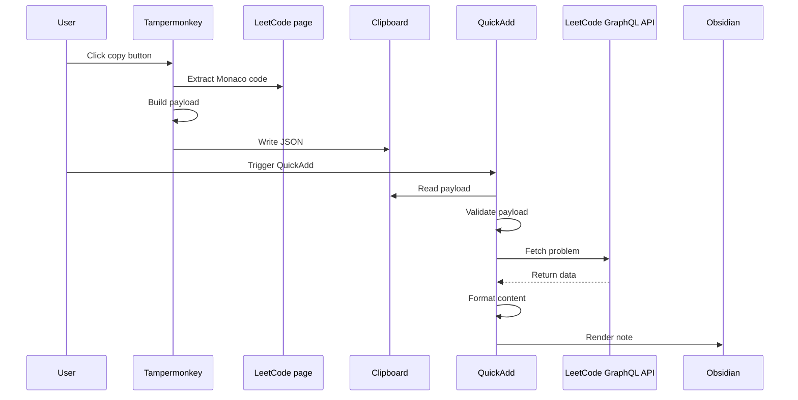
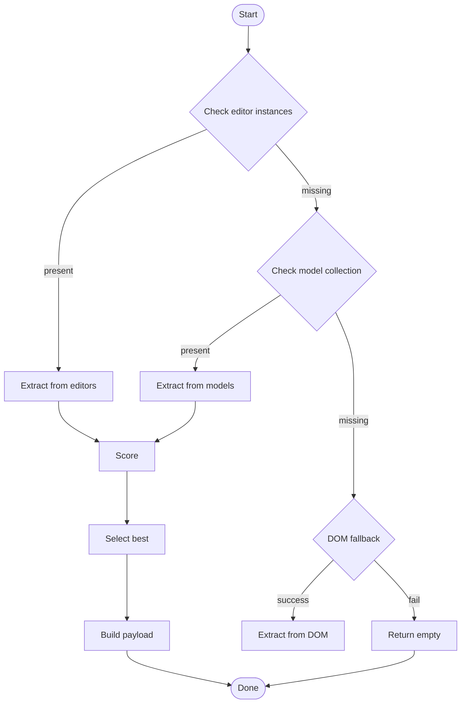
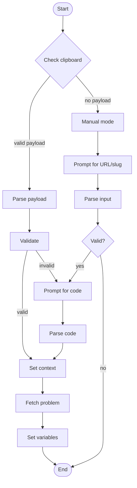
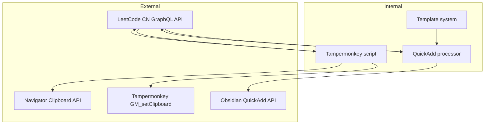

# Browser Extension Features

<cite>
**Files referenced in this document**
- [Scripts/leetcode-quickadd.js](file://Scripts/leetcode-quickadd.js)
- [tampermonkey/Scripts/leetcode-cn-copy-to-obsidian.js](file://tampermonkey/Scripts/leetcode-cn-copy-to-obsidian.js)
- [Templates/leetcode-problem-template.md](file://Templates/leetcode-problem-template.md)
- [Templates/leetcode-problem-template_zh.md](file://Templates/leetcode-problem-template_zh.md)
</cite>

## Table of Contents
1. [Introduction](#introduction)
2. [Project Structure](#project-structure)
3. [Core Components](#core-components)
4. [Architecture Overview](#architecture-overview)
5. [Detailed Component Analysis](#detailed-component-analysis)
6. [Dependency Analysis](#dependency-analysis)
7. [Performance Considerations](#performance-considerations)
8. [Troubleshooting Guide](#troubleshooting-guide)
9. [Conclusion](#conclusion)
10. [Appendix](#appendix)

## Introduction

This is a browser extension system designed for LeetCode CN that simplifies migrating data from the online programming platform to local knowledge tools such as Obsidian. The system has two primary components:

1. **Tampermonkey userscript**: extracts the code from the LeetCode page and packs it into a standardized JSON payload.
2. **Obsidian QuickAdd plugin**: reads the payload from the clipboard and generates a structured note.

The extension supports many programming languages, intelligently identifies the correct Monaco editor model, and ships with full error-handling and debugging facilities.

## Project Structure

The project follows a modular layout with the following key directories and files:

**Diagram sources**
- [Scripts/leetcode-quickadd.js:1-50](file://Scripts/leetcode-quickadd.js#L1-L50)
- [tampermonkey/Scripts/leetcode-cn-copy-to-obsidian.js:1-20](file://tampermonkey/Scripts/leetcode-cn-copy-to-obsidian.js#L1-L20)

**Section sources**
- [Scripts/leetcode-quickadd.js:1-100](file://Scripts/leetcode-quickadd.js#L1-L100)
- [tampermonkey/Scripts/leetcode-cn-copy-to-obsidian.js:1-50](file://tampermonkey/Scripts/leetcode-cn-copy-to-obsidian.js#L1-L50)

## Core Components

### 1. Tampermonkey Code Extractor

**Overview**:
- Extracts the current solution code from the Monaco editor on the LeetCode page.
- Detects and normalizes the language id.
- Builds a standardized JSON payload and sends it through the clipboard.

**Key features**:
- Supports many languages (C++, Java, Python, JavaScript, etc.).
- Layered extraction strategy (editors → models → DOM fallback).
- Smart scoring algorithm picks the best snippet.
- Comprehensive error handling and debug support.

**Section sources**
- [tampermonkey/Scripts/leetcode-cn-copy-to-obsidian.js:147-303](file://tampermonkey/Scripts/leetcode-cn-copy-to-obsidian.js#L147-L303)

### 2. Obsidian QuickAdd Processor

**Overview**:
- Reads the standardized LeetCode payload from the clipboard.
- Fetches full problem details from the LeetCode GraphQL API.
- Produces template variables that match the template layout.

**Key features**:
- Priority handling: clipboard → manual input → GraphQL fetch.
- Markdown formatting and post-processing.
- Configurable tag prefix.
- Sanitizes file names against illegal characters.

**Section sources**
- [Scripts/leetcode-quickadd.js:83-166](file://Scripts/leetcode-quickadd.js#L83-L166)

### 3. Template System

**Overview**:
- Provides bilingual (EN/CN) templates.
- Structured layout for problem statement, hints, and solution.
- Automated variable substitution and formatting.

**Section sources**
- [Templates/leetcode-problem-template_zh.md:1-41](file://Templates/leetcode-problem-template_zh.md#L1-L41)

## Architecture Overview

The system follows an "extract → transmit → process → render" pipeline:

**Diagram sources**
- [tampermonkey/Scripts/leetcode-cn-copy-to-obsidian.js:316-363](file://tampermonkey/Scripts/leetcode-cn-copy-to-obsidian.js#L316-L363)
- [Scripts/leetcode-quickadd.js:87-104](file://Scripts/leetcode-quickadd.js#L87-L104)

## Detailed Component Analysis

### Deep Dive: Tampermonkey Code Extractor

#### Extraction Algorithm

The extractor uses a multi-tier strategy that adapts to different page states:

**Diagram sources**
- [tampermonkey/Scripts/leetcode-cn-copy-to-obsidian.js:147-303](file://tampermonkey/Scripts/leetcode-cn-copy-to-obsidian.js#L147-L303)

#### Scoring Algorithm

The scoring algorithm combines several factors to pick the best snippet:

| Factor | Weight | Description |
|---|---|---|
| Language detected | 100 | Recognized as a valid programming language |
| Class declaration | 100 | Contains a class-style pattern |
| Keyword match | 80 | Python/Go function patterns |
| Code length | up to 500 | Prefers longer, complete code |
| Structural integrity | -100 | Penalizes plain data structures |

**Section sources**
- [tampermonkey/Scripts/leetcode-cn-copy-to-obsidian.js:101-145](file://tampermonkey/Scripts/leetcode-cn-copy-to-obsidian.js#L101-L145)

#### Payload Construction

The standardized JSON payload contains:

| Field | Type | Required | Description |
|---|---|---|---|
| type | string | yes | Payload type id |
| version | number | yes | Version number |
| url | string | yes | Problem page URL |
| titleSlug | string | yes | Unique problem id |
| language | string | yes | Programming language |
| code | string | yes | Solution code |
| copiedAt | string | yes | Timestamp |

**Section sources**
- [tampermonkey/Scripts/leetcode-cn-copy-to-obsidian.js:336-344](file://tampermonkey/Scripts/leetcode-cn-copy-to-obsidian.js#L336-L344)

### Deep Dive: Obsidian QuickAdd Processor

#### Input-Handling Pipeline

The processor supports three modes, in priority order:

**Diagram sources**
- [Scripts/leetcode-quickadd.js:114-166](file://Scripts/leetcode-quickadd.js#L114-L166)

#### Markdown-Conversion Engine

The processor includes a full HTML→Markdown converter that handles complex problem content:

**Supported elements**:
- Examples: detected and converted into Obsidian-friendly callouts.
- Constraints: converted into warning callouts.
- Headings: identifies localized heading text (English & Chinese).
- Lists: preserves nesting and ordering.

**Section sources**
- [Scripts/leetcode-quickadd.js:436-546](file://Scripts/leetcode-quickadd.js#L436-L546)

### Template System Analysis

#### Template Variable Mapping

The template system exposes a rich set of variables:

| Variable | Source | Purpose |
|---|---|---|
| {{VALUE:id}} | problem data | Problem id |
| {{VALUE:title}} | problem data | Localized title |
| {{VALUE:link}} | problem data | Problem URL |
| {{VALUE:difficulty}} | problem data | Difficulty tag |
| {{VALUE:problemStatement}} | HTML→MD | Problem statement |
| {{VALUE:formattedHints}} | problem data | Hints |
| {{VALUE:tags}} | problem data | Tag list |
| {{VALUE:fileName}} | composed | File name |
| {{VALUE:language}} | context | Code language |
| {{VALUE:solutionCode}} | context | Solution code |
| {{VALUE:sourceUrl}} | context | Source URL |

**Section sources**
- [Scripts/leetcode-quickadd.js:410-430](file://Scripts/leetcode-quickadd.js#L410-L430)

## Dependency Analysis

### Cross-Component Dependencies

**Diagram sources**
- [tampermonkey/Scripts/leetcode-cn-copy-to-obsidian.js:305-314](file://tampermonkey/Scripts/leetcode-cn-copy-to-obsidian.js#L305-L314)
- [Scripts/leetcode-quickadd.js:368-378](file://Scripts/leetcode-quickadd.js#L368-L378)

### Error Handling

The system implements layered error handling:

1. **Network errors**: graceful fallback when GraphQL fails.
2. **Clipboard errors**: handles permission denial and unsupported APIs.
3. **Code-extraction failures**: layered fallback always returns at least empty code.
4. **Template-rendering errors**: safe handling for HTML parse failures.

**Section sources**
- [Scripts/leetcode-quickadd.js:399-404](file://Scripts/leetcode-quickadd.js#L399-L404)
- [tampermonkey/Scripts/leetcode-cn-copy-to-obsidian.js:329-334](file://tampermonkey/Scripts/leetcode-cn-copy-to-obsidian.js#L329-L334)

## Performance Considerations

### Code-Extraction Performance

1. **Lazy initialization**: button is created and positioned on demand.
2. **Caching**: avoids redundant DOM queries.
3. **Smart scoring**: quickly filters candidates.
4. **Memory management**: cleans up listeners and timers.

### Network Performance

1. **Deduplication**: prevents duplicate GraphQL queries.
2. **Timeouts**: reasonable request timeouts.
3. **Retries**: limited automatic retries.

## Troubleshooting Guide

### Common Issues

#### Issue 1: Clipboard payload not readable
**Symptom**: QuickAdd reports no LeetCode problem detected.
**Fixes**:
1. Confirm Tampermonkey script is installed and enabled.
2. Check browser clipboard permissions.
3. Click copy again and check the console.

#### Issue 2: Empty extracted code
**Symptom**: QuickAdd shows empty code.
**Fixes**:
1. Use debug mode to inspect available models.
2. Confirm a real language is selected.
3. Make sure the Monaco editor finished loading.

#### Issue 3: Template variables not filled
**Symptom**: notes are missing parts.
**Fixes**:
1. Verify variable syntax in the template.
2. Check the GraphQL response.
3. Read the console for errors.

### Debugging Tips

1. **Enable debug mode**: run `__LC_OBSIDIAN_DEBUG_MODELS__()` in the console.
2. **Inspect scoring**: read model scores and previews.
3. **Monitor network**: check the GraphQL response.
4. **Validate payload**: confirm the JSON in the clipboard.

**Section sources**
- [tampermonkey/Scripts/leetcode-cn-copy-to-obsidian.js:498-525](file://tampermonkey/Scripts/leetcode-cn-copy-to-obsidian.js#L498-L525)

## Conclusion

This browser-extension system provides a complete and robust solution for transferring LeetCode problem data into Obsidian. Design highlights include:

1. **Layered fallbacks**: works under varying page states.
2. **Smart code recognition**: scoring picks the best snippet.
3. **Standardized data format**: a unified payload travels across components.
4. **Solid error handling**: detailed messages and graceful degradation.

The system provides an extensible foundation that can be customized for specific needs.

## Appendix

### Configuration Options

#### Tampermonkey
- `MODEL_INDEX_OVERRIDE`: manually specify the model index (default `null` for automatic).

#### QuickAdd
- `LeetCode Tag Prefix`: tag-prefix string (default `leetcode/`).

### Use Cases

1. **Quick note creation**: copy code straight from LeetCode into Obsidian.
2. **Batch study notes**: export multiple problems' notes.
3. **Team collaboration**: standardize team-wide study materials.
4. **Personal knowledge base**: build a comprehensive coding knowledge base.

### Recommendations for Developers

1. **Version compatibility**: keep up with LeetCode page changes.
2. **Performance monitoring**: watch network and DOM ops.
3. **UX**: refine button interaction and visual feedback.
4. **Bug reports**: collect feedback to improve error handling.
