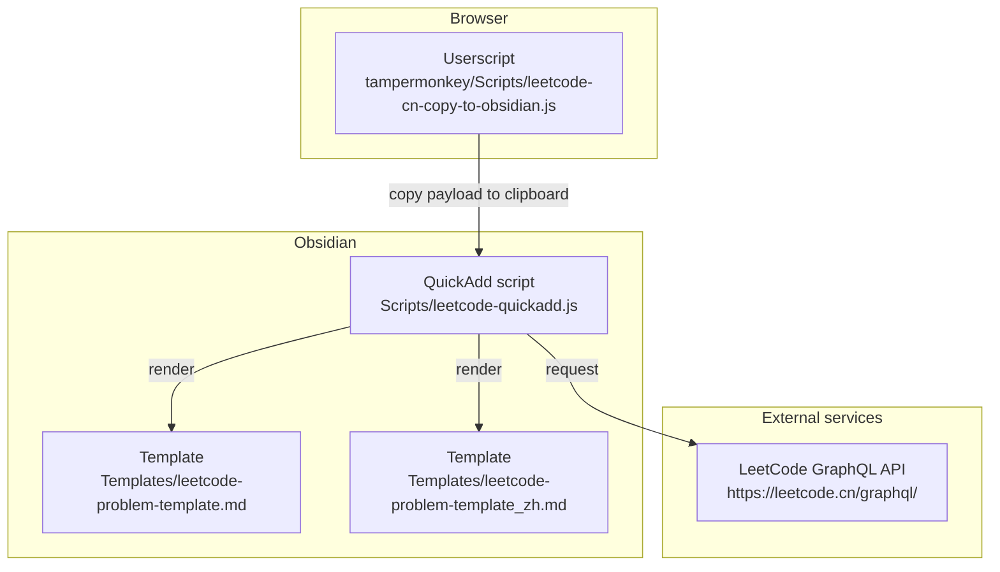
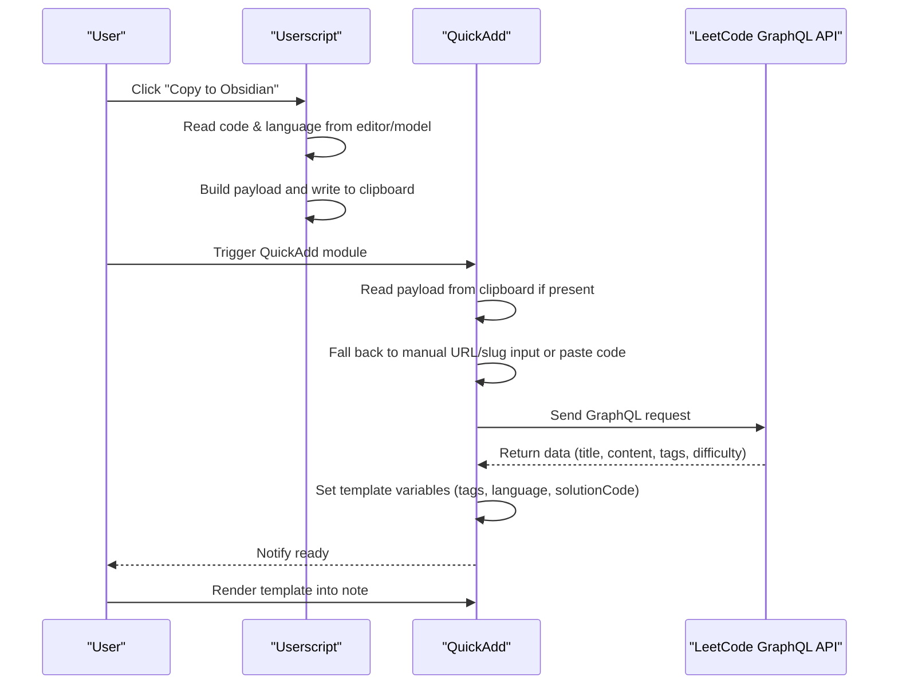
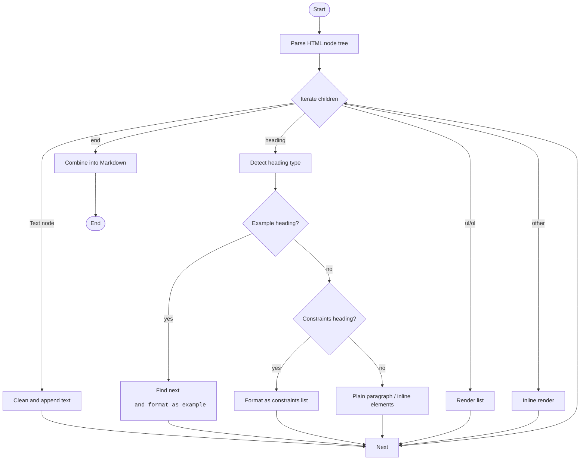
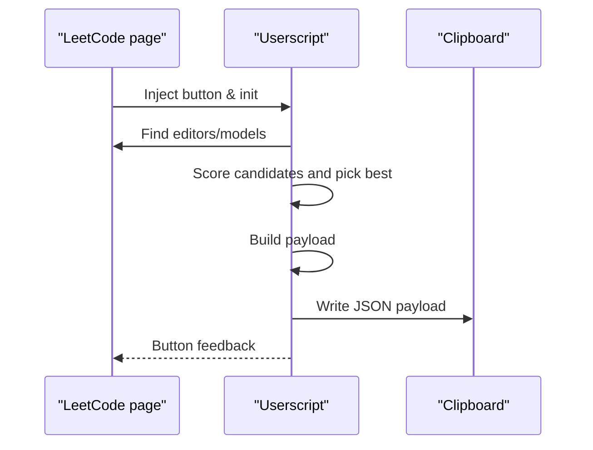
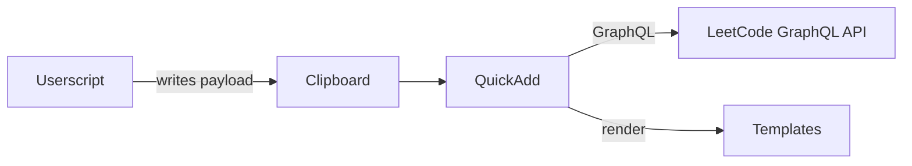

# Configuration and Customization

<cite>
**Files referenced in this document**
- [Scripts/leetcode-quickadd.js](file://Scripts/leetcode-quickadd.js)
- [Templates/leetcode-problem-template.md](file://Templates/leetcode-problem-template.md)
- [Templates/leetcode-problem-template_zh.md](file://Templates/leetcode-problem-template_zh.md)
- [tampermonkey/Scripts/leetcode-cn-copy-to-obsidian.js](file://tampermonkey/Scripts/leetcode-cn-copy-to-obsidian.js)
</cite>

## Table of Contents
1. [Introduction](#introduction)
2. [Project Structure](#project-structure)
3. [Core Components](#core-components)
4. [Architecture Overview](#architecture-overview)
5. [Detailed Component Analysis](#detailed-component-analysis)
6. [Dependency Analysis](#dependency-analysis)
7. [Performance Considerations](#performance-considerations)
8. [Troubleshooting Guide](#troubleshooting-guide)
9. [Conclusion](#conclusion)
10. [Appendix](#appendix)

## Introduction
This guide is for users of the LeetCode-to-Obsidian workflow. It systematically covers configurable options, default behaviors, advanced customization (template variables, API endpoints, formatting rules), and migration / backup recommendations. By understanding each module's responsibility and the data flow, you can efficiently generate and manage algorithm-study notes in Obsidian.

## Project Structure
The project consists of three parts:
- **QuickAdd script**: reads context from the clipboard or manual input, calls GraphQL to fetch problem info, and sets QuickAdd template variables.
- **Templates**: ship in two flavors (English and Chinese), used to render the body, tags, difficulty, and other fields.
- **Userscript**: injects a "Copy to Obsidian" button on LeetCode CN pages, packaging the URL, language, and code into a clipboard payload for the QuickAdd script.

Diagram sources
- [Scripts/leetcode-quickadd.js:1-104](file://Scripts/leetcode-quickadd.js#L1-L104)
- [Templates/leetcode-problem-template.md:1-35](file://Templates/leetcode-problem-template.md#L1-L35)
- [Templates/leetcode-problem-template_zh.md:1-41](file://Templates/leetcode-problem-template_zh.md#L1-L41)
- [tampermonkey/Scripts/leetcode-cn-copy-to-obsidian.js:305-363](file://tampermonkey/Scripts/leetcode-cn-copy-to-obsidian.js#L305-L363)

Section sources
- [Scripts/leetcode-quickadd.js:1-104](file://Scripts/leetcode-quickadd.js#L1-L104)
- [Templates/leetcode-problem-template.md:1-35](file://Templates/leetcode-problem-template.md#L1-L35)
- [Templates/leetcode-problem-template_zh.md:1-41](file://Templates/leetcode-problem-template_zh.md#L1-L41)
- [tampermonkey/Scripts/leetcode-cn-copy-to-obsidian.js:1-536](file://tampermonkey/Scripts/leetcode-cn-copy-to-obsidian.js#L1-L536)

## Core Components
- **QuickAdd script (QuickAdd module)**
  - Configuration: tag-prefix setting (text type, default `leetcode/`).
  - Main flow: read clipboard payload → manual URL/slug input → fetch problem → set template variables → notify.
  - Data sources: LeetCode GraphQL API; language normalization map; HTML→Markdown.
- **Templates**
  - English and Chinese templates each define frontmatter, headings, paragraphs, and code-block placeholders.
  - Variables: id, title, link, difficulty, tags, problemStatement, formattedHints, language, solutionCode, titleSlug, fileName, etc.
- **Userscript (Tampermonkey)**
  - Injects a floating button on LeetCode CN pages, copies URL, language, and code into the clipboard as a unified payload.
  - Includes debug helpers to diagnose model and language identification.

Section sources
- [Scripts/leetcode-quickadd.js:56-70](file://Scripts/leetcode-quickadd.js#L56-L70)
- [Scripts/leetcode-quickadd.js:83-104](file://Scripts/leetcode-quickadd.js#L83-L104)
- [Scripts/leetcode-quickadd.js:339-404](file://Scripts/leetcode-quickadd.js#L339-L404)
- [Scripts/leetcode-quickadd.js:410-430](file://Scripts/leetcode-quickadd.js#L410-L430)
- [Templates/leetcode-problem-template.md:1-35](file://Templates/leetcode-problem-template.md#L1-L35)
- [Templates/leetcode-problem-template_zh.md:1-41](file://Templates/leetcode-problem-template_zh.md#L1-L41)
- [tampermonkey/Scripts/leetcode-cn-copy-to-obsidian.js:316-363](file://tampermonkey/Scripts/leetcode-cn-copy-to-obsidian.js#L316-L363)

## Architecture Overview
The diagram below shows the full path from copying in the browser to rendering in Obsidian, including configuration, data flow, and key processing steps.

Diagram sources
- [Scripts/leetcode-quickadd.js:114-166](file://Scripts/leetcode-quickadd.js#L114-L166)
- [Scripts/leetcode-quickadd.js:339-404](file://Scripts/leetcode-quickadd.js#L339-L404)
- [Scripts/leetcode-quickadd.js:410-430](file://Scripts/leetcode-quickadd.js#L410-L430)
- [tampermonkey/Scripts/leetcode-cn-copy-to-obsidian.js:316-363](file://tampermonkey/Scripts/leetcode-cn-copy-to-obsidian.js#L316-L363)

## Detailed Component Analysis

### Configuration Options and Defaults
- **Tag prefix (text)**
  - Key: `LeetCode Tag Prefix`
  - Type: text
  - Default: `leetcode/`
  - Description: a uniform prefix prepended to each problem tag for easier classification and search.
  - Applied in: tag-formatting logic, prepended to each topic tag's slug.
- **Language normalization map**
  - Purpose: normalizes language identifiers to Markdown code-block aliases.
  - Effect: controls language highlighting and downstream processing.
- **Difficulty localization**
  - Purpose: maps Easy/Medium/Hard to 简单/中等/困难.
  - Effect: applied to frontmatter and tag display.

Section sources
- [Scripts/leetcode-quickadd.js:56-70](file://Scripts/leetcode-quickadd.js#L56-L70)
- [Scripts/leetcode-quickadd.js:789-799](file://Scripts/leetcode-quickadd.js#L789-L799)
- [Scripts/leetcode-quickadd.js:295-333](file://Scripts/leetcode-quickadd.js#L295-L333)

### Template Variables and Rendering
- **Available variables (from QuickAdd's variable assignment)**
  - id, title, link, difficulty, problemStatement, formattedHints, tags, fileName, language, solutionCode, titleSlug, difficultyLink, sourceUrl
- **Placeholders inside templates**
  - English template frontmatter: created, modified, completed, leetcode-index, link, difficulty, tags. Body: Problem Statement, Hints, Approach, Solution, Complexity Analysis, Reflections.
  - Chinese template: similar frontmatter; body sections in Chinese; the code block language is driven by `{{VALUE:language}}`.
- **Code-block language**
  - Determined by `{{VALUE:language}}`. Make sure it matches the language normalization map to avoid highlight glitches.

Section sources
- [Scripts/leetcode-quickadd.js:410-430](file://Scripts/leetcode-quickadd.js#L410-L430)
- [Templates/leetcode-problem-template.md:1-35](file://Templates/leetcode-problem-template.md#L1-L35)
- [Templates/leetcode-problem-template_zh.md:1-41](file://Templates/leetcode-problem-template_zh.md#L1-L41)

### API Endpoint and Request
- **LeetCode GraphQL endpoint**
  - URL: `https://leetcode.cn/graphql/`
  - Query: `questionData` (fetches problem info by `titleSlug`).
  - Headers: `Content-Type`, `Referer`, `Origin`.
- **Failure handling**
  - On empty data or network exception, the script shows an error notice and aborts.

Section sources
- [Scripts/leetcode-quickadd.js:49-49](file://Scripts/leetcode-quickadd.js#L49-L49)
- [Scripts/leetcode-quickadd.js:339-404](file://Scripts/leetcode-quickadd.js#L339-L404)

### HTML-to-Markdown Formatting Rules
- **Headings and paragraphs**
  - Walks the HTML node tree, preserving line breaks and inline styles (bold, italic, sup, code, image, link).
- **Examples and hints**
  - Recognizes "Example N", "Hints", and "Follow up" titles, converts them to Obsidian callouts.
  - For standalone `<pre>` blocks containing input/output/explanation labels, formats them as examples.
- **Lists**
  - Supports ordered/unordered lists with recursive nesting.
- **Text cleanup**
  - Trims excessive whitespace, collapses newlines, escapes special characters.

Diagram sources
- [Scripts/leetcode-quickadd.js:436-546](file://Scripts/leetcode-quickadd.js#L436-L546)
- [Scripts/leetcode-quickadd.js:548-783](file://Scripts/leetcode-quickadd.js#L548-L783)

### Userscript (Tampermonkey) Copy Flow
- **Code-extraction strategy**
  - First extracts code and language from editor instances.
  - Falls back to scoring across model collections.
  - Final fallback: read `<textarea>` value from the DOM.
- **Payload schema**
  - Fields: type, version, url, titleSlug, language, code, copiedAt.
- **Debug mode**
  - Lists every model with previews to help diagnose language detection.

Diagram sources
- [tampermonkey/Scripts/leetcode-cn-copy-to-obsidian.js:147-303](file://tampermonkey/Scripts/leetcode-cn-copy-to-obsidian.js#L147-L303)
- [tampermonkey/Scripts/leetcode-cn-copy-to-obsidian.js:305-363](file://tampermonkey/Scripts/leetcode-cn-copy-to-obsidian.js#L305-L363)

## Dependency Analysis
- **QuickAdd script**
  - Browser Clipboard API (read userscript payload).
  - LeetCode GraphQL API (fetch problem info).
  - Templates (render notes).
- **Userscript**
  - Monaco editor API (read code & language).
  - Browser Clipboard API (write payload).

Diagram sources
- [Scripts/leetcode-quickadd.js:238-271](file://Scripts/leetcode-quickadd.js#L238-L271)
- [Scripts/leetcode-quickadd.js:339-404](file://Scripts/leetcode-quickadd.js#L339-L404)
- [Templates/leetcode-problem-template.md:1-35](file://Templates/leetcode-problem-template.md#L1-L35)
- [Templates/leetcode-problem-template_zh.md:1-41](file://Templates/leetcode-problem-template_zh.md#L1-L41)
- [tampermonkey/Scripts/leetcode-cn-copy-to-obsidian.js:305-363](file://tampermonkey/Scripts/leetcode-cn-copy-to-obsidian.js#L305-L363)

## Performance Considerations
- **Network requests**
  - GraphQL only fires on a valid clipboard payload or valid manual input, avoiding redundant calls.
- **Text processing**
  - HTML→Markdown conversion involves DOM parsing and regex; keep input concise to minimize processing cost.
- **Template rendering**
  - The variable count is small, so rendering is cheap. Keep the language normalization aligned with code-block highlighting to avoid duplicate work.

## Troubleshooting Guide
- **Clipboard read failure**
  - Symptom: no valid payload detected, manual mode kicks in.
  - Diagnose: ensure browser permission allows clipboard reads; verify the userscript actually writes the payload; confirm the `type` field is `leetcode-cn-obsidian`.
- **Title slug not recognized**
  - Symptom: notice "no LeetCode title slug detected".
  - Diagnose: enter the full URL or title slug; verify it matches `https://leetcode.cn/problems/{slug}/`.
- **GraphQL request failure**
  - Symptom: "failed to fetch problem info".
  - Diagnose: check connectivity; verify the endpoint and headers; check console errors.
- **Tag prefix not applied**
  - Symptom: tags lack the prefix.
  - Diagnose: confirm the setting was saved; verify the formatter actually concatenates the prefix.
- **Wrong language highlighting**
  - Symptom: code-block language is incorrect.
  - Diagnose: check whether the language is in the normalization map; verify `{{VALUE:language}}` value.
- **Code not extracted**
  - Symptom: `solutionCode` empty.
  - Diagnose: confirm userscript picked the right model; use the debug helper to inspect candidates; paste manually if needed.

Section sources
- [Scripts/leetcode-quickadd.js:89-92](file://Scripts/leetcode-quickadd.js#L89-L92)
- [Scripts/leetcode-quickadd.js:114-166](file://Scripts/leetcode-quickadd.js#L114-L166)
- [Scripts/leetcode-quickadd.js:382-403](file://Scripts/leetcode-quickadd.js#L382-L403)
- [Scripts/leetcode-quickadd.js:789-799](file://Scripts/leetcode-quickadd.js#L789-L799)
- [Scripts/leetcode-quickadd.js:295-333](file://Scripts/leetcode-quickadd.js#L295-L333)
- [tampermonkey/Scripts/leetcode-cn-copy-to-obsidian.js:316-363](file://tampermonkey/Scripts/leetcode-cn-copy-to-obsidian.js#L316-L363)

## Conclusion
By configuring the tag prefix, language map, and template variables sensibly together with the userscript's payload mechanism, you can automate LeetCode-to-Obsidian note generation. For team or cross-device scenarios, fixing the tag prefix and language aliases improves searchability and consistency.

## Appendix

### Configuration Checklist and Recommendations
- **Tag prefix**
  - Type: text
  - Default: `leetcode/`
  - Recommendation: use `team/` or a custom namespace for cross-vault search.
- **Language map**
  - Recommendation: ensure all common languages are present to avoid broken highlighting.
- **Template variables**
  - Recommendation: customize sections per personal taste, but keep id, title, link, difficulty, tags, problemStatement, formattedHints, language, solutionCode, titleSlug, fileName.

Section sources
- [Scripts/leetcode-quickadd.js:56-70](file://Scripts/leetcode-quickadd.js#L56-L70)
- [Scripts/leetcode-quickadd.js:295-333](file://Scripts/leetcode-quickadd.js#L295-L333)
- [Templates/leetcode-problem-template.md:1-35](file://Templates/leetcode-problem-template.md#L1-L35)
- [Templates/leetcode-problem-template_zh.md:1-41](file://Templates/leetcode-problem-template_zh.md#L1-L41)

### Advanced Customization
- **Custom variables**
  - Extend the QuickAdd variable assignment (e.g. add `sourceUrl`, `difficultyLink`) and reference them in templates.
- **Custom API endpoint**
  - Modify the GraphQL endpoint and headers in the script to switch sites or add a self-hosted proxy.
- **Adjust formatting rules**
  - Add new heading types or list-rendering rules in the HTML→Markdown conversion logic.

Section sources
- [Scripts/leetcode-quickadd.js:410-430](file://Scripts/leetcode-quickadd.js#L410-L430)
- [Scripts/leetcode-quickadd.js:339-404](file://Scripts/leetcode-quickadd.js#L339-L404)
- [Scripts/leetcode-quickadd.js:436-546](file://Scripts/leetcode-quickadd.js#L436-L546)

### Migration and Backup
- **Migration**
  - Note your tag-prefix setting and language map.
  - Export template files; keep EN and CN templates in sync.
- **Backup**
  - Periodically back up QuickAdd module configuration and templates.
  - Track userscript versions for rollback / upgrade.

### Real-World Configurations
- **Scenario 1: team collaboration**
  - Tag prefix `team/`, difficulty in Chinese, Chinese template.
- **Scenario 2: personal study**
  - Default `leetcode/`, English template, English difficulty.
- **Scenario 3: multi-language**
  - Add new language aliases to keep highlighting consistent.

### Validation
- **Validation steps**
  - Use the userscript to copy a payload, confirm the clipboard contains type/url/titleSlug/language/code.
  - Trigger the QuickAdd module and verify variables are filled.
  - Check rendered output for tag prefix, language highlighting, and difficulty.
- **Test recommendations**
  - Run end-to-end tests on problems of varying difficulty and language.
  - Use the debug helper to confirm model selection and language detection.

Section sources
- [Scripts/leetcode-quickadd.js:238-271](file://Scripts/leetcode-quickadd.js#L238-L271)
- [Scripts/leetcode-quickadd.js:83-104](file://Scripts/leetcode-quickadd.js#L83-L104)
- [Templates/leetcode-problem-template_zh.md:30-32](file://Templates/leetcode-problem-template_zh.md#L30-L32)
- [tampermonkey/Scripts/leetcode-cn-copy-to-obsidian.js:498-525](file://tampermonkey/Scripts/leetcode-cn-copy-to-obsidian.js#L498-L525)
