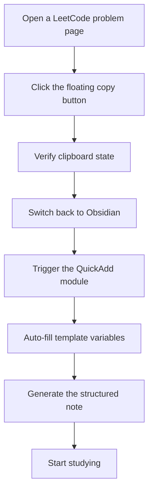
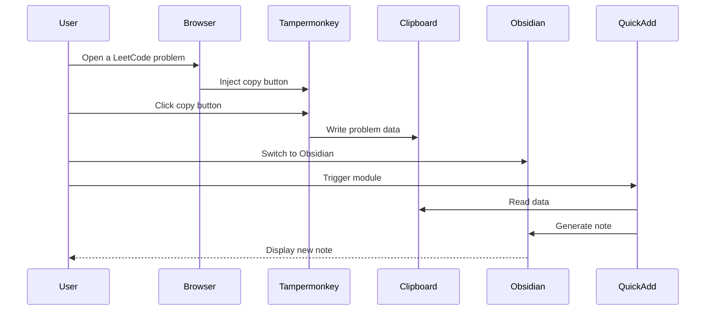

# Getting Started

<cite>
**Files referenced in this document**
- [Scripts/leetcode-quickadd.js](file://Scripts/leetcode-quickadd.js)
- [Templates/leetcode-problem-template.md](file://Templates/leetcode-problem-template.md)
- [Templates/leetcode-problem-template_zh.md](file://Templates/leetcode-problem-template_zh.md)
- [tampermonkey/Scripts/leetcode-cn-copy-to-obsidian.js](file://tampermonkey/Scripts/leetcode-cn-copy-to-obsidian.js)
</cite>

## Table of Contents
1. [Introduction](#introduction)
2. [Requirements](#requirements)
3. [Installation Steps](#installation-steps)
4. [Configuration Steps](#configuration-steps)
5. [First-Time Workflow](#first-time-workflow)
6. [Template Files](#template-files)
7. [FAQ](#faq)
8. [Usage Examples](#usage-examples)
9. [Troubleshooting](#troubleshooting)
10. [Summary](#summary)

## Introduction

This is an automation toolkit that copies LeetCode problems from the browser straight into the Obsidian note-taking app. Two components work in concert:

- **Tampermonkey userscript**: adds a floating button on the LeetCode page that one-click copies the problem info and code to the clipboard.
- **Obsidian QuickAdd plugin**: reads the data from the clipboard, fills a predefined template, and generates a structured study note.

Both English and Chinese UIs are supported, with full problem-info extraction, code formatting, and tag management.

## Requirements

### Browser Support
- **Chrome / Chromium**: latest version recommended
- **Firefox**: Tampermonkey supported
- **Edge**: Tampermonkey supported

### Obsidian Version
- **Obsidian v0.16.0 or above**
- **QuickAdd plugin**: must be installed and enabled
- **Tampermonkey extension**: required for clipboard handoff

### System Requirements
- **OS**: Windows, macOS, Linux
- **Memory**: 4 GB RAM minimum
- **Network**: stable internet (required for the LeetCode API)

## Installation Steps

### Step 1: Install Tampermonkey

1. Open your browser's extension store.
2. Search for "Tampermonkey".
3. Install it and restart the browser.
4. Confirm the icon appears in the address bar.

### Step 2: Install the LeetCode Copy Script

1. Locate the script at `tampermonkey/Scripts/leetcode-cn-copy-to-obsidian.js`.
2. Right-click and "Save as" to download.
3. Open the extension management page.
4. Click "Manage userscripts".
5. Choose "Import userscript".
6. Select the downloaded JS file.
7. Confirm installation and grant access to LeetCode.

### Step 3: Install the Obsidian QuickAdd Plugin

1. Open Obsidian.
2. Go to Settings → Plugins.
3. Enable "Community plugins".
4. Search for "QuickAdd".
5. Install and restart Obsidian.
6. Enable QuickAdd in the settings.

### Step 4: Configure the QuickAdd Module

1. Open QuickAdd settings in Obsidian.
2. Click "Add module".
3. Choose "Import from file".
4. Navigate to `Scripts/leetcode-quickadd.js`.
5. Select the file and confirm.
6. Restart Obsidian to ensure the module loads completely.

## Configuration Steps

### Configure the Tag Prefix

1. Open Obsidian Settings → QuickAdd.
2. Locate the "LeetCode Puller CN" module.
3. Edit the **LeetCode Tag Prefix** option.
4. Default is `leetcode/`; customize as needed.
5. Save your settings.

### Configure Template Files

1. Copy the template files into your vault.
2. In QuickAdd, create a new template group.
3. Add the two templates:
   - `leetcode-problem-template.md` (English)
   - `leetcode-problem-template_zh.md` (Chinese)
4. Bind a hotkey or trigger for each template as desired.

### Permission Setup

#### Browser Permissions
- **Clipboard access**: required by the userscript.
- **Site access**: required for `leetcode.cn`.
- **Extension permissions**: Tampermonkey needs to modify page content.

#### Obsidian Permissions
- **File-system access**: for writing new notes.
- **Template access**: for reading templates.
- **Network access**: for the LeetCode API.

## First-Time Workflow

### Workflow Overview



**Diagram sources**
- [Scripts/leetcode-quickadd.js:83-104](file://Scripts/leetcode-quickadd.js#L83-L104)
- [tampermonkey/Scripts/leetcode-cn-copy-to-obsidian.js:316-363](file://tampermonkey/Scripts/leetcode-cn-copy-to-obsidian.js#L316-L363)

### Detailed Steps

#### Step 1: Copy Code from LeetCode

1. Open any LeetCode problem page.
2. Confirm the floating button appears in the bottom-right corner.
3. Click the button to copy.
4. Watch the button color change to confirm success.
5. The button briefly turns green on success.

#### Step 2: Trigger QuickAdd in Obsidian

1. Switch to Obsidian.
2. Open your target vault.
3. Trigger via any of these methods:
   - Hotkey: `Ctrl/Cmd + Shift + Q`
   - Command palette: search "QuickAdd"
   - Module menu: select "LeetCode Puller CN"

#### Step 3: Auto-Fill and Generate the Note

1. The script reads the clipboard automatically.
2. Fetches problem details from the LeetCode API.
3. Fills the template variables.
4. Generates a structured note file.
5. Opens the new note for editing.

## Template Files

### English Template (`leetcode-problem-template.md`)

Suitable for English-speaking users with a standard note structure:

```mermaid
classDiagram
class EnglishTemplate {
+created : {{DATE}}
+modified :
+completed : false
+leetcode-index : {{VALUE : id}}
+link : {{VALUE : link}}
+difficulty : {{VALUE : difficulty}}
+tags : {{VALUE : tags}}
+title : {{VALUE : title}}
+problemStatement : {{VALUE : problemStatement}}
+hints : {{VALUE : formattedHints}}
+solution : {{VALUE : solutionCode}}
}
class TemplateVariables {
+VALUE : id : Problem id
+VALUE : title : Title
+VALUE : link : Link
+VALUE : difficulty : Difficulty
+VALUE : problemStatement : Statement
+VALUE : formattedHints : Hints
+VALUE : tags : Tags
+VALUE : fileName : File name
+VALUE : language : Language
+VALUE : solutionCode : Solution code
+VALUE : sourceUrl : Source URL
+VALUE : titleSlug : Slug
}
EnglishTemplate --> TemplateVariables : "uses"
```

**Diagram sources**
- [Templates/leetcode-problem-template.md:1-35](file://Templates/leetcode-problem-template.md#L1-L35)

### Chinese Template (`leetcode-problem-template_zh.md`)

Designed for Chinese users with localized terminology:

- **题目描述** — Problem Statement
- **提示** — Hints
- **解题思路** — Localized "Approach"
- **代码实现** — includes a dynamic language tag
- **复杂度分析** — Time and space complexity
- **复盘总结** — Reflection section

**Section sources**
- [Templates/leetcode-problem-template_zh.md:1-41](file://Templates/leetcode-problem-template_zh.md#L1-L41)

### Template Variable Mapping

| Variable | Source | Description |
|---|---|---|
| `{{VALUE:id}}` | LeetCode API | Problem id |
| `{{VALUE:title}}` | LeetCode API | Title |
| `{{VALUE:link}}` | LeetCode API | Link |
| `{{VALUE:difficulty}}` | LeetCode API | Difficulty |
| `{{VALUE:problemStatement}}` | HTML → Markdown | Formatted statement |
| `{{VALUE:formattedHints}}` | LeetCode API | Formatted hints |
| `{{VALUE:tags}}` | LeetCode API | Topic tags |
| `{{VALUE:fileName}}` | composed | File name |
| `{{VALUE:language}}` | clipboard | Programming language |
| `{{VALUE:solutionCode}}` | clipboard | Solution code |
| `{{VALUE:sourceUrl}}` | clipboard | Source URL |
| `{{VALUE:titleSlug}}` | clipboard | Slug |

**Section sources**
- [Scripts/leetcode-quickadd.js:410-430](file://Scripts/leetcode-quickadd.js#L410-L430)

## FAQ

### Q1: The clipboard cannot be read.

**Symptom**: QuickAdd reports "no LeetCode title slug detected".

**Fix**:
1. Confirm Tampermonkey copied data successfully.
2. Check browser clipboard permissions.
3. Click the copy button again.
4. Manually input URL or slug in Obsidian.

**Section sources**
- [Scripts/leetcode-quickadd.js:114-166](file://Scripts/leetcode-quickadd.js#L114-L166)

### Q2: LeetCode API request failed.

**Symptom**: "Failed to fetch problem info" appears.

**Fix**:
1. Check network connectivity.
2. Confirm LeetCode is reachable.
3. Wait a few minutes and retry.
4. Disable any network proxy that may block the request.

**Section sources**
- [Scripts/leetcode-quickadd.js:339-404](file://Scripts/leetcode-quickadd.js#L339-L404)

### Q3: Wrong language detected.

**Symptom**: code-block language tag is incorrect.

**Fix**:
1. Inspect the language map in the userscript.
2. Confirm the editor has the right language selected.
3. Adjust the language tag in the template manually.
4. Update the script to support new languages.

**Section sources**
- [Scripts/leetcode-quickadd.js:295-323](file://Scripts/leetcode-quickadd.js#L295-L323)

### Q4: Variables aren't replaced.

**Symptom**: notes still contain raw `{{VALUE:...}}`.

**Fix**:
1. Make sure the QuickAdd module imported correctly.
2. Verify the variable syntax in the template.
3. Restart Obsidian.
4. Confirm the template path is correct.

**Section sources**
- [Scripts/leetcode-quickadd.js:410-430](file://Scripts/leetcode-quickadd.js#L410-L430)

## Usage Examples

### Example 1: Full Study Workflow



**Diagram sources**
- [tampermonkey/Scripts/leetcode-cn-copy-to-obsidian.js:316-363](file://tampermonkey/Scripts/leetcode-cn-copy-to-obsidian.js#L316-L363)
- [Scripts/leetcode-quickadd.js:83-104](file://Scripts/leetcode-quickadd.js#L83-L104)

### Example 2: Manual Input Mode

When the clipboard is empty, the script falls back to manual mode:

1. **Enter the URL**: `https://leetcode.cn/problems/two-sum/`
2. **Or enter the slug**: `two-sum`
3. **Paste your code**: paste the solution directly.
4. **Confirm**: the script processes and generates the note.

**Section sources**
- [Scripts/leetcode-quickadd.js:134-166](file://Scripts/leetcode-quickadd.js#L134-L166)

### Expected Output

After a successful run, you'll get an Obsidian note containing:

- **Structured layout**: full problem information.
- **Formatted content**: Markdown-ready statement and hints.
- **Code block**: with the correct language tag.
- **Tag system**: auto-applied LeetCode tags.
- **Naming**: standardized file name from `id. title`.

## Troubleshooting

### Network Issues

**Symptom**: API request times out or fails.

**Diagnostics**:
1. Check connectivity status.
2. Try other websites to confirm.
3. Inspect firewall / proxy settings.
4. Try a different network.

**Fixes**:
- Wait for the network to recover.
- Configure a proxy.
- Use a VPN.
- Check DNS settings.

### Permission Issues

**Symptom**: clipboard access denied.

**Fixes**:
1. Grant clipboard access in browser settings.
2. Check security settings.
3. Use HTTPS pages.
4. Reinstall Tampermonkey.

### Template Loading Issues

**Symptom**: template files not found.

**Fixes**:
1. Verify the path.
2. Check file permissions.
3. Verify file encoding.
4. Re-import the template.

### Compatibility Issues

**Symptom**: features misbehave or crash.

**Fixes**:
1. Check Obsidian version requirements.
2. Update QuickAdd to the latest version.
3. Check Tampermonkey version.
4. Read plugin changelogs.

## Summary

The LeetCode-to-Obsidian automation toolkit gives you a full solution for managing and learning algorithm problems. With proper configuration, you can:

- **Save time**: automated extraction and note generation.
- **Stay consistent**: standardized note layout and structure.
- **Boost productivity**: less manual input, more learning.
- **Learn better**: structured notes encourage reflection.

### Next Steps

1. **Customize templates**: tailor the layout to your needs.
2. **Build a tag taxonomy**: create a personal classification system.
3. **Integrate other tools**: combine with Anki, Notion, etc.
4. **Back up regularly**: keep your study data safe.

By following this guide step by step, you should have a smooth installation and start enjoying an efficient algorithm-study experience.
