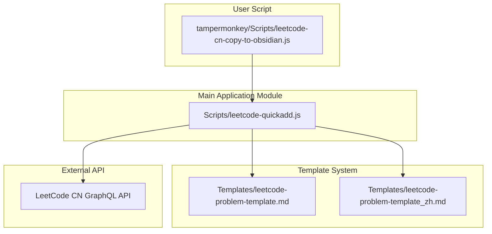
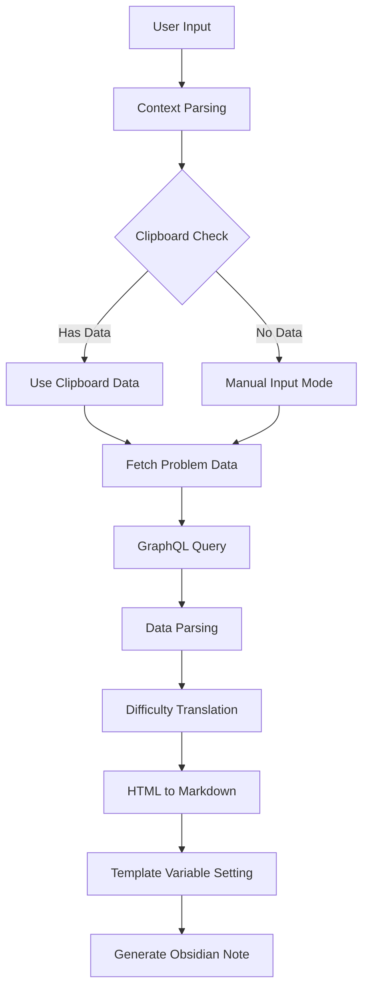
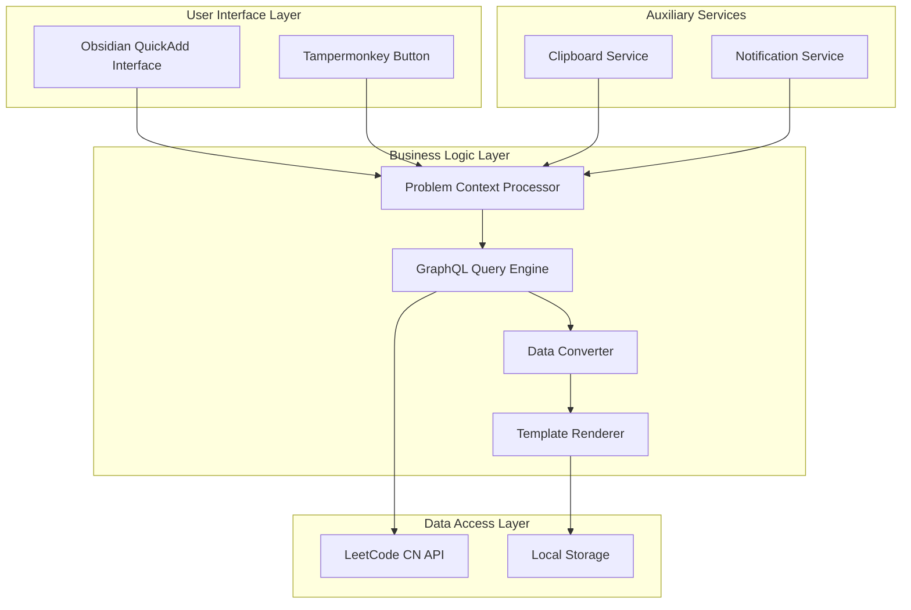
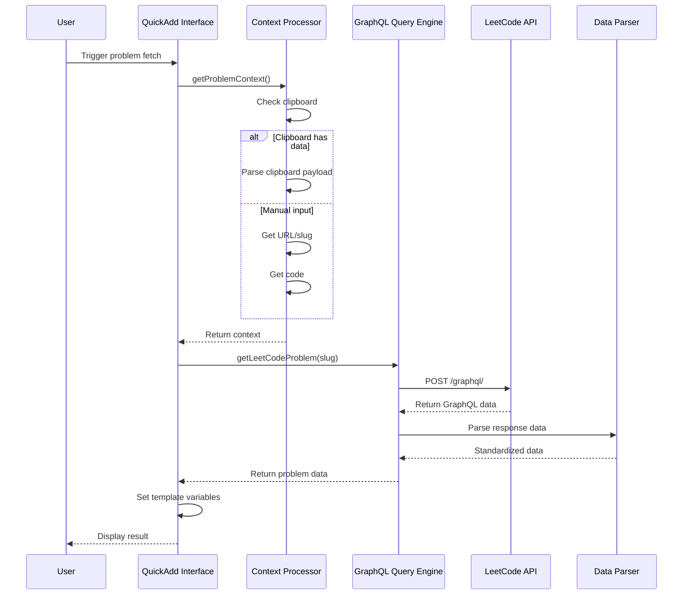
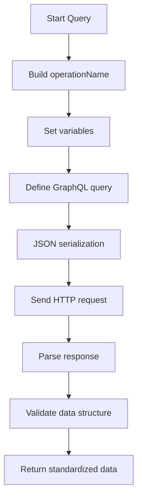
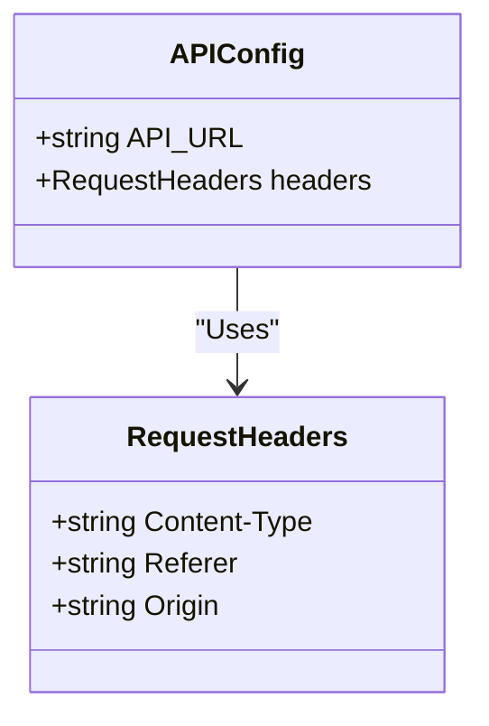
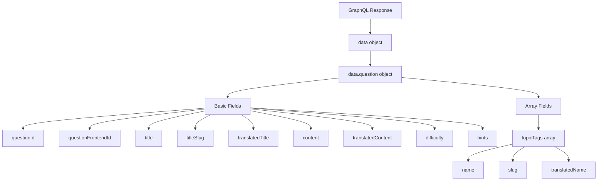
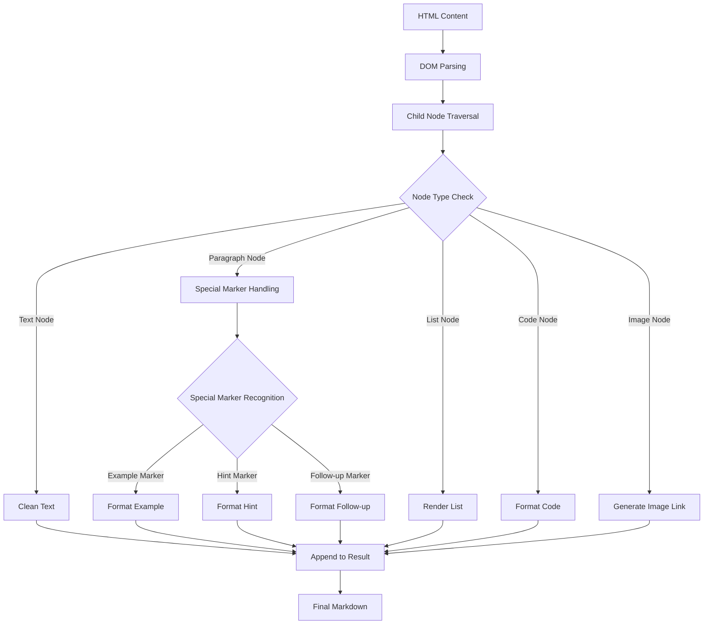
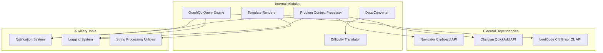
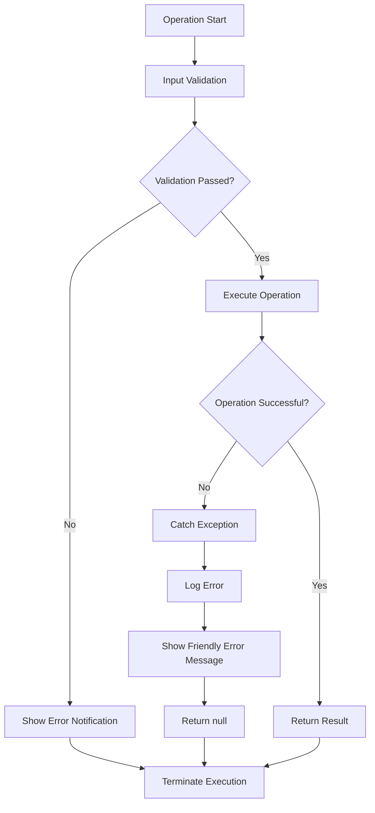

# API Integration and Data Retrieval

<cite>
**Referenced Files in This Document**
- [Scripts/leetcode-quickadd.js](file://Scripts/leetcode-quickadd.js)
- [Templates/leetcode-problem-template.md](file://Templates/leetcode-problem-template.md)
- [Templates/leetcode-problem-template_zh.md](file://Templates/leetcode-problem-template_zh.md)
- [tampermonkey/Scripts/leetcode-cn-copy-to-obsidian.js](file://tampermonkey/Scripts/leetcode-cn-copy-to-obsidian.js)
</cite>

## Table of Contents
1. [Introduction](#introduction)
2. [Project Structure](#project-structure)
3. [Core Components](#core-components)
4. [Architecture Overview](#architecture-overview)
5. [Detailed Component Analysis](#detailed-component-analysis)
6. [Dependency Analysis](#dependency-analysis)
7. [Performance Considerations](#performance-considerations)
8. [Troubleshooting Guide](#troubleshooting-guide)
9. [Conclusion](#conclusion)

## Introduction

This document provides a detailed introduction to the API integration and data retrieval features in the LeetCode-to-Obsidian integration system. The system fetches problem data from LeetCode CN via GraphQL queries, supports multiple input methods (clipboard, manual input), and provides full data conversion and template rendering capabilities.

The system's core features include:
- GraphQL query implementation and request sending mechanism
- Problem data parsing and standardization
- Difficulty level translation logic
- HTML-to-Markdown format conversion
- Collaboration mechanism with Tampermonkey scripts

## Project Structure

The project adopts a modular design with the following components:



**Diagram Sources**
- [Scripts/leetcode-quickadd.js:1-50](file://Scripts/leetcode-quickadd.js#L1-L50)
- [Templates/leetcode-problem-template.md:1-35](file://Templates/leetcode-problem-template.md#L1-L35)
- [tampermonkey/Scripts/leetcode-cn-copy-to-obsidian.js:1-50](file://tampermonkey/Scripts/leetcode-cn-copy-to-obsidian.js#L1-L50)

**Section Sources**
- [Scripts/leetcode-quickadd.js:1-100](file://Scripts/leetcode-quickadd.js#L1-L100)
- [Templates/leetcode-problem-template.md:1-35](file://Templates/leetcode-problem-template.md#L1-L35)
- [Templates/leetcode-problem-template_zh.md:1-41](file://Templates/leetcode-problem-template_zh.md#L1-L41)
- [tampermonkey/Scripts/leetcode-cn-copy-to-obsidian.js:1-100](file://tampermonkey/Scripts/leetcode-cn-copy-to-obsidian.js#L1-L100)

## Core Components

### Main Functional Modules

The system's core features consist of the following main modules:

1. **Problem Retrieval Module** (`getLeetCodeProblem` function)
2. **Context Processing Module** (`getProblemContext` function)
3. **Data Conversion Module** (HTML-to-Markdown conversion)
4. **Template Rendering Module** (QuickAdd variable setting)
5. **Difficulty Translation Module** (`translateDifficulty` function)

### Data Flow Architecture



**Diagram Sources**
- [Scripts/leetcode-quickadd.js:83-166](file://Scripts/leetcode-quickadd.js#L83-L166)
- [Scripts/leetcode-quickadd.js:339-404](file://Scripts/leetcode-quickadd.js#L339-L404)

**Section Sources**
- [Scripts/leetcode-quickadd.js:83-166](file://Scripts/leetcode-quickadd.js#L83-L166)
- [Scripts/leetcode-quickadd.js:339-404](file://Scripts/leetcode-quickadd.js#L339-L404)

## Architecture Overview

### System Architecture Diagram



**Diagram Sources**
- [Scripts/leetcode-quickadd.js:56-104](file://Scripts/leetcode-quickadd.js#L56-L104)
- [Scripts/leetcode-quickadd.js:339-404](file://Scripts/leetcode-quickadd.js#L339-L404)

### API Call Sequence Diagram



**Diagram Sources**
- [Scripts/leetcode-quickadd.js:83-104](file://Scripts/leetcode-quickadd.js#L83-L104)
- [Scripts/leetcode-quickadd.js:339-404](file://Scripts/leetcode-quickadd.js#L339-L404)

## Detailed Component Analysis

### GraphQL Query Implementation

#### Query Construction

The `getLeetCodeProblem` function implements the complete GraphQL query construction process:



**Diagram Sources**
- [Scripts/leetcode-quickadd.js:339-404](file://Scripts/leetcode-quickadd.js#L339-L404)

#### GraphQL Query Syntax Details

The query uses standard GraphQL syntax and includes the following key elements:

**Operation Name**: `questionData`
- Defines the GraphQL query name for client identification and caching

**Variable Definition**: `$titleSlug: String!`
- Uses non-null string type to ensure a valid problem slug must be provided

**Query Field**: `question(titleSlug: $titleSlug)`
- Query root field, accepting the titleSlug parameter

**Returned Field Mapping**:
- `questionId`: Problem identifier
- `questionFrontendId`: Frontend display ID
- `title`: English title
- `titleSlug`: URL-friendly title identifier
- `translatedTitle`: Chinese title
- `content`: English content
- `translatedContent`: Chinese content
- `difficulty`: Difficulty level
- `hints`: Solution hints
- `topicTags`: Topic tags array

**Section Sources**
- [Scripts/leetcode-quickadd.js:339-404](file://Scripts/leetcode-quickadd.js#L339-L404)

### Request Header Configuration

The request header configuration ensures correct communication with the LeetCode server:



**Diagram Sources**
- [Scripts/leetcode-quickadd.js:49](file://Scripts/leetcode-quickadd.js#L49)
- [Scripts/leetcode-quickadd.js:368-378](file://Scripts/leetcode-quickadd.js#L368-L378)

**Request Header Field Descriptions**:

1. **Content-Type**: `application/json`
   - Specifies that the request body is in JSON format

2. **Referer**: `https://leetcode.cn/problems/${titleSlug}/`
   - Sets the source page, simulating browser behavior

3. **Origin**: `https://leetcode.cn`
   - Specifies the source domain to satisfy CORS requirements

**Section Sources**
- [Scripts/leetcode-quickadd.js:368-378](file://Scripts/leetcode-quickadd.js#L368-L378)

### Response Data Parsing

#### Data Structure Analysis

The response data uses the standard GraphQL response format:



**Diagram Sources**
- [Scripts/leetcode-quickadd.js:382-398](file://Scripts/leetcode-quickadd.js#L382-L398)

#### Field Extraction and Standardization

The data parsing process includes multiple steps:

1. **Data Validation**: Check whether `data.data.question` exists
2. **Field Mapping**: Map GraphQL fields to internal data structure
3. **Default Value Handling**: Provide default values for missing fields
4. **Format Standardization**: Unify data format and encoding

**Section Sources**
- [Scripts/leetcode-quickadd.js:382-398](file://Scripts/leetcode-quickadd.js#L382-L398)

### Difficulty Level Translation

#### Translation Logic Implementation

The `translateDifficulty` function implements the Chinese translation of difficulty levels:

```mermaid
flowchart TD
A[Input Difficulty] --> B{Check Mapping Table}
B --> |Easy| C[Return "简单"]
B --> |Medium| D[Return "中等"]
B --> |Hard| E[Return "困难"]
B --> |Other| F[Return Original]
G[Mapping Table] --> C
G --> D
G --> E
G --> F
```

**Diagram Sources**
- [Scripts/leetcode-quickadd.js:325-333](file://Scripts/leetcode-quickadd.js#L325-L333)

**Translation Rules**:
- Easy → 简单
- Medium → 中等
- Hard → 困难
- Other → Keep original value

**Section Sources**
- [Scripts/leetcode-quickadd.js:325-333](file://Scripts/leetcode-quickadd.js#L325-L333)

### HTML to Markdown Conversion

#### Conversion Algorithm Flow

The system implements complex HTML-to-Markdown conversion logic:



**Diagram Sources**
- [Scripts/leetcode-quickadd.js:436-546](file://Scripts/leetcode-quickadd.js#L436-L546)

**Conversion Rules**:

1. **Example Handling**: Recognize "Example" marker and convert to quote block format
2. **Constraints**: Recognize "Constraints" marker and convert to warning style
3. **Follow-up Content**: Recognize "Follow-up" marker and convert to todo style
4. **List Handling**: Support ordered and unordered lists
5. **Inline Format**: Support bold, italic, superscript, and other formats

**Section Sources**
- [Scripts/leetcode-quickadd.js:436-546](file://Scripts/leetcode-quickadd.js#L436-L546)

## Dependency Analysis

### Component Dependency Graph



**Diagram Sources**
- [Scripts/leetcode-quickadd.js:42-43](file://Scripts/leetcode-quickadd.js#L42-L43)
- [Scripts/leetcode-quickadd.js:49](file://Scripts/leetcode-quickadd.js#L49)

### Error Handling Strategy

The system adopts a multi-layered error handling mechanism:



**Error Handling Layers**:

1. **Input Validation**: Check clipboard data and user input
2. **Network Request**: Handle API call exceptions
3. **Data Parsing**: Handle JSON parsing and data structure validation
4. **Format Conversion**: Handle HTML-to-Markdown conversion exceptions
5. **User Feedback**: Provide clear error messages

**Section Sources**
- [Scripts/leetcode-quickadd.js:238-271](file://Scripts/leetcode-quickadd.js#L238-L271)
- [Scripts/leetcode-quickadd.js:399-403](file://Scripts/leetcode-quickadd.js#L399-L403)

## Performance Considerations

### Optimization Strategies

1. **Asynchronous Processing**: All network requests and file operations use Promises and async/await
2. **Data Caching**: Leverage browser caching mechanisms to reduce repeated requests
3. **Memory Management**: Promptly release DOM nodes and intermediate variables
4. **Error Recovery**: Implement fast failure and graceful degradation

### Performance Monitoring

The system has basic performance monitoring capabilities built in:
- Logging the time taken for key operations
- Exception handling to ensure program stability
- Resource cleanup to prevent memory leaks

## Troubleshooting Guide

### Common Issues and Solutions

#### 1. Clipboard Read Failure

**Symptom**: Cannot read LeetCode data from clipboard
**Cause**: Browser security restrictions or insufficient permissions
**Solution**:
- Ensure HTTPS environment
- Check browser Clipboard API support
- Manually enter the problem URL or slug

#### 2. GraphQL Query Failure

**Symptom**: Cannot fetch problem data
**Cause**: Network connection issue or API change
**Solution**:
- Check network connection status
- Verify API endpoint availability
- Check error messages in browser DevTools

#### 3. HTML Conversion Anomaly

**Symptom**: Problem content format is incorrect
**Cause**: HTML structure change or special character handling
**Solution**:
- Update conversion rules to adapt to new HTML structure
- Check special character encoding handling
- Verify Markdown rendering effect

#### 4. Template Variable Setting Failure

**Symptom**: Obsidian note generation anomaly
**Cause**: Variable name mismatch or data format error
**Solution**:
- Check variable placeholders in template files
- Verify data type and format
- Confirm QuickAdd variable settings are correct

**Section Sources**
- [Scripts/leetcode-quickadd.js:267-271](file://Scripts/leetcode-quickadd.js#L267-L271)
- [Scripts/leetcode-quickadd.js:399-403](file://Scripts/leetcode-quickadd.js#L399-L403)

## Conclusion

This LeetCode-to-Obsidian integration system implements efficient and reliable API integration through carefully designed GraphQL queries and data processing mechanisms. The system's main advantages include:

1. **Modular Design**: Clear functional separation and responsibility division
2. **Error Handling**: Comprehensive exception handling and user feedback mechanisms
3. **Data Conversion**: Powerful HTML-to-Markdown conversion capabilities
4. **User Experience**: Concise and intuitive operation flow and interface

The system provides Obsidian users with a seamless LeetCode problem management and learning experience. Through automated data retrieval and template rendering, it greatly improves the efficiency of knowledge organization. Future considerations may include adding more customization options and extension features to meet the needs of different users.
