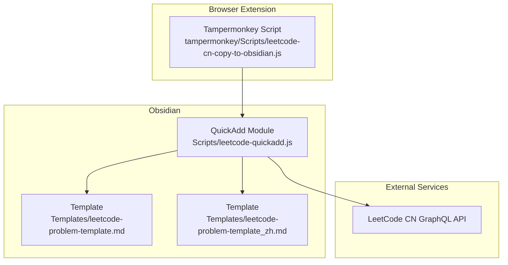
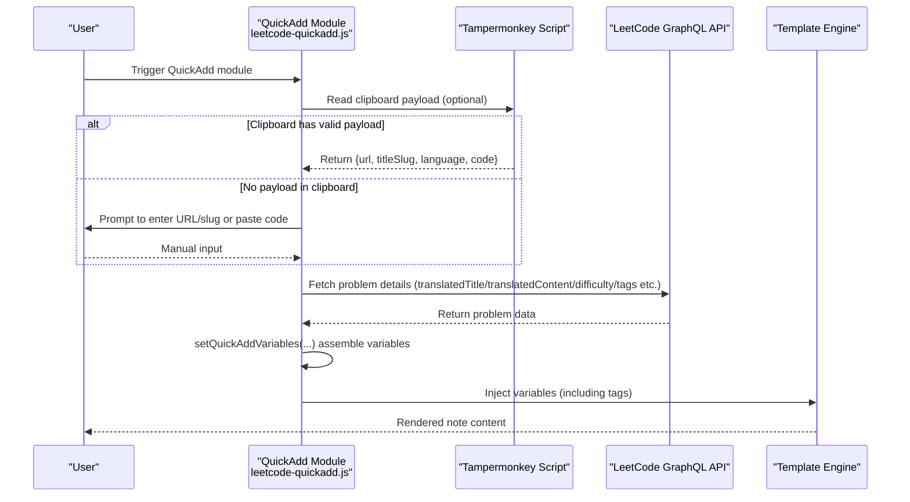
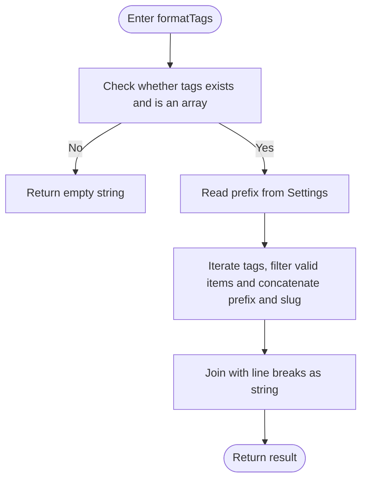
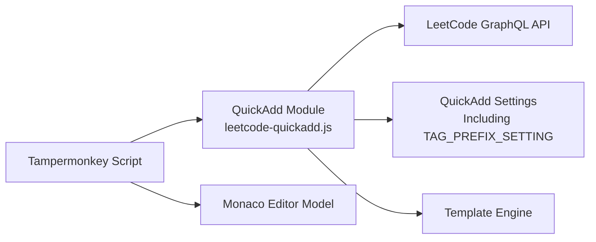

# Configuration Options and Customization

<cite>
**Referenced Files in This Document**
- [Scripts/leetcode-quickadd.js](file://Scripts/leetcode-quickadd.js)
- [Templates/leetcode-problem-template.md](file://Templates/leetcode-problem-template.md)
- [Templates/leetcode-problem-template_zh.md](file://Templates/leetcode-problem-template_zh.md)
- [tampermonkey/Scripts/leetcode-cn-copy-to-obsidian.js](file://tampermonkey/Scripts/leetcode-cn-copy-to-obsidian.js)
</cite>

## Table of Contents
1. [Introduction](#introduction)
2. [Project Structure](#project-structure)
3. [Core Components](#core-components)
4. [Architecture Overview](#architecture-overview)
5. [Detailed Component Analysis](#detailed-component-analysis)
6. [Dependency Analysis](#dependency-analysis)
7. [Performance Considerations](#performance-considerations)
8. [Troubleshooting Guide](#troubleshooting-guide)
9. [Conclusion](#conclusion)
10. [Appendix](#appendix)

## Introduction
This document is intended for Obsidian QuickAdd users and systematically explains the configuration options and customization capabilities, focusing on the following topics:
- The tag prefix configuration mechanism of the `TAG_PREFIX_SETTING` constant: setting definition, default value, user customization options, and how it is used in formatting tags.
- The `settings` configuration structure of the QuickAdd module: the roles and best practices for fields such as `name`, `author`, and `options`.
- How to configure data types, default values, and description information for configuration items.
- Best practices and considerations for modifying configurations.
- Complete configuration examples and common configuration scenarios.
- How Settings parameters are used in the `formatTags` function.
- Configuration troubleshooting guide and common problem solutions.

## Project Structure
This repository consists of three parts:
- Scripts/leetcode-quickadd.js: The Obsidian QuickAdd module entry point, responsible for obtaining problem context from clipboard or manual input, fetching LeetCode CN data, and rendering notes through QuickAdd variable templates.
- Templates/leetcode-problem-template.md and leetcode-problem-template_zh.md: Template files used to inject variables (such as tags, problemStatement, solutionCode, etc.) during the QuickAdd rendering phase.
- tampermonkey/Scripts/leetcode-cn-copy-to-obsidian.js: The Tampermonkey script, responsible for copying the current problem URL, language, and code to the clipboard, forming a payload recognizable by QuickAdd to achieve the "clipboard-first" automated workflow.

Diagram Sources
- [Scripts/leetcode-quickadd.js:1-104](file://Scripts/leetcode-quickadd.js#L1-L104)
- [Templates/leetcode-problem-template.md:1-35](file://Templates/leetcode-problem-template.md#L1-L35)
- [Templates/leetcode-problem-template_zh.md:1-41](file://Templates/leetcode-problem-template_zh.md#L1-L41)
- [tampermonkey/Scripts/leetcode-cn-copy-to-obsidian.js:305-363](file://tampermonkey/Scripts/leetcode-cn-copy-to-obsidian.js#L305-L363)

Section Sources
- [Scripts/leetcode-quickadd.js:1-104](file://Scripts/leetcode-quickadd.js#L1-L104)
- [Templates/leetcode-problem-template.md:1-35](file://Templates/leetcode-problem-template.md#L1-L35)
- [Templates/leetcode-problem-template_zh.md:1-41](file://Templates/leetcode-problem-template_zh.md#L1-L41)
- [tampermonkey/Scripts/leetcode-cn-copy-to-obsidian.js:1-536](file://tampermonkey/Scripts/leetcode-cn-copy-to-obsidian.js#L1-L536)

## Core Components
This section focuses on the configuration structure of the QuickAdd module and the tag prefix setting mechanism.

- QuickAdd Module Export Structure
  - `module.exports` contains two key fields: `entry` and `settings`. `entry` points to the main flow function; `settings` describes the module's configurable items.
  - Under `settings.options`, the configuration item corresponding to `TAG_PREFIX_SETTING` is defined, containing meta-information such as `type`, `defaultValue`, `placeholder`, and `description`.

- `TAG_PREFIX_SETTING` Constant and Tag Prefix
  - `TAG_PREFIX_SETTING` serves as the key name for reading the user-customized tag prefix from the QuickAdd Settings object.
  - In the `formatTags` function, `Settings[TAG_PREFIX_SETTING]` is read and concatenated before each tag's slug to form the final tag text.

- `settings` Fields of the QuickAdd Module
  - `name`: Module display name.
  - `author`: Author information.
  - `options`: A collection of configuration items containing the definition of `TAG_PREFIX_SETTING`, with type `text`, default value `leetcode/`, and placeholder and description for UI hints and explanations respectively.

Section Sources
- [Scripts/leetcode-quickadd.js:56-70](file://Scripts/leetcode-quickadd.js#L56-L70)
- [Scripts/leetcode-quickadd.js:789-799](file://Scripts/leetcode-quickadd.js#L789-L799)

## Architecture Overview
The diagram below shows the configuration and data flow relationships of the QuickAdd module, and how the template rendering phase consumes variables.

Diagram Sources
- [Scripts/leetcode-quickadd.js:83-104](file://Scripts/leetcode-quickadd.js#L83-L104)
- [Scripts/leetcode-quickadd.js:339-404](file://Scripts/leetcode-quickadd.js#L339-L404)
- [Scripts/leetcode-quickadd.js:410-430](file://Scripts/leetcode-quickadd.js#L410-L430)
- [tampermonkey/Scripts/leetcode-cn-copy-to-obsidian.js:316-363](file://tampermonkey/Scripts/leetcode-cn-copy-to-obsidian.js#L316-L363)

## Detailed Component Analysis

### Tag Prefix Configuration Mechanism (TAG_PREFIX_SETTING)
- Setting Definition
  - Key name: `TAG_PREFIX_SETTING` (string constant)
  - Type: `text`
  - Default value: `leetcode/`
  - Placeholder: `Enter tag prefix, e.g. leetcode/`
  - Description: `Prefix to be added to LeetCode tags.`
- Usage Location
  - In the `formatTags` function, `Settings[TAG_PREFIX_SETTING]` is used as a prefix concatenated before each tag slug to generate the tag list as expected by the user.
- Data Type and Default Value
  - Data type: String (`text`)
  - Default value: `leetcode/`
  - User customization: Modify the text box in the QuickAdd module settings interface; changes take effect after saving.
- Best Practices
  - Recommended to end with a slash (e.g., `leetcode/`) to keep tag hierarchy clear.
  - To differentiate by source or language, include an identifier in the prefix (e.g., `leetcode/c++/`).
  - Keep the prefix concise; avoid overly long prefixes that make tags difficult to manage.
- Common Scenarios
  - Group all LeetCode tags uniformly under the `leetcode/` namespace.
  - Combine with language prefix to form groups like `leetcode/cpp/`, `leetcode/python/`, etc.
  - Keep slug only (leave empty) to use English slugs directly as tags.

Section Sources
- [Scripts/leetcode-quickadd.js:50-70](file://Scripts/leetcode-quickadd.js#L50-L70)
- [Scripts/leetcode-quickadd.js:789-799](file://Scripts/leetcode-quickadd.js#L789-L799)

### QuickAdd Module settings Configuration Structure
- Field Descriptions
  - `name`: Module name, displayed in the QuickAdd list.
  - `author`: Author information for identification and maintenance.
  - `options`: Collection of configuration items containing the definition of `TAG_PREFIX_SETTING`, used to declare UI control type, default value, placeholder, and description.
- Data Type and Description Configuration Methods
  - `type`: `text` (text input)
  - `defaultValue`: Default value
  - `placeholder`: Input hint
  - `description`: Explanation of the configuration item's purpose
- Best Practices
  - Provide a clear `description` for each configuration item to help users understand its purpose.
  - `placeholder` should give example values to reduce user understanding cost.
  - Default values should balance versatility and safety (e.g., avoid empty strings that could cause rendering issues).
- Notes
  - After modifying `settings`, you need to reload the QuickAdd module or restart Obsidian for changes to take effect.
  - To add new configuration items, add them to `settings.options` and add robustness checks (e.g., default value fallback) at usage locations.

Section Sources
- [Scripts/leetcode-quickadd.js:56-70](file://Scripts/leetcode-quickadd.js#L56-L70)

### How Settings Parameters Are Used in the formatTags Function
- Read Method
  - Get the user-customized prefix via `Settings[TAG_PREFIX_SETTING]`.
- Processing Logic
  - Filter valid tag objects (containing slug), trim leading/trailing whitespace, concatenate prefix and slug, generate indented tag entries.
  - Finally returns a tag list string separated by line breaks.
- Robustness
  - When the key is not provided in Settings or is empty, it falls back to an empty string, ensuring the tag list is not contaminated.
- Output Format
  - Each tag starts with a fixed indent and hyphen, making it correctly recognized as a list item during template rendering.

Diagram Sources
- [Scripts/leetcode-quickadd.js:789-799](file://Scripts/leetcode-quickadd.js#L789-L799)

Section Sources
- [Scripts/leetcode-quickadd.js:789-799](file://Scripts/leetcode-quickadd.js#L789-L799)

### Template Variable and Configuration Linkage
- In the template, `{{VALUE:tags}}` is used to inject the tag list, which is provided by the `tags` field in `setQuickAddVariables`.
- The tag list is generated by `formatTags` and is affected by `TAG_PREFIX_SETTING`.
- The template also contains other variables (such as `id`, `title`, `problemStatement`, `solutionCode`, `language`, etc.), all uniformly injected by `setQuickAddVariables`.

Section Sources
- [Scripts/leetcode-quickadd.js:410-430](file://Scripts/leetcode-quickadd.js#L410-L430)
- [Templates/leetcode-problem-template.md:8-9](file://Templates/leetcode-problem-template.md#L8-L9)
- [Templates/leetcode-problem-template_zh.md:8-9](file://Templates/leetcode-problem-template_zh.md#L8-L9)

### Relationship Between Clipboard Payload and Configuration
- The Tampermonkey script encapsulates the problem URL, slug, language, and code as a payload of a specific type and writes it to the clipboard.
- QuickAdd reads this payload from the clipboard preferentially; if successful, no manual input is needed and it proceeds directly to data fetching and variable injection.
- This flow has no direct coupling with `TAG_PREFIX_SETTING`, but both together affect the generation quality and consistency of the final note.

Section Sources
- [tampermonkey/Scripts/leetcode-cn-copy-to-obsidian.js:336-344](file://tampermonkey/Scripts/leetcode-cn-copy-to-obsidian.js#L336-L344)
- [Scripts/leetcode-quickadd.js:238-271](file://Scripts/leetcode-quickadd.js#L238-L271)

## Dependency Analysis
- QuickAdd Module Dependencies
  - External API: LeetCode CN GraphQL API, for fetching problem details and tags.
  - Browser environment: `navigator.clipboard` for reading clipboard content.
  - Template system: Obsidian's QuickAdd variable injection and template rendering.
- Configuration Dependencies
  - `TAG_PREFIX_SETTING` depends on QuickAdd's Settings object, which is configured by the user in the module settings interface.
- External Script Dependencies
  - The Tampermonkey script depends on the Monaco editor models on the LeetCode page for extracting code and language.

Diagram Sources
- [Scripts/leetcode-quickadd.js:339-404](file://Scripts/leetcode-quickadd.js#L339-L404)
- [Scripts/leetcode-quickadd.js:238-271](file://Scripts/leetcode-quickadd.js#L238-L271)
- [tampermonkey/Scripts/leetcode-cn-copy-to-obsidian.js:147-303](file://tampermonkey/Scripts/leetcode-cn-copy-to-obsidian.js#L147-L303)

Section Sources
- [Scripts/leetcode-quickadd.js:339-404](file://Scripts/leetcode-quickadd.js#L339-L404)
- [Scripts/leetcode-quickadd.js:238-271](file://Scripts/leetcode-quickadd.js#L238-L271)
- [tampermonkey/Scripts/leetcode-cn-copy-to-obsidian.js:147-303](file://tampermonkey/Scripts/leetcode-cn-copy-to-obsidian.js#L147-L303)

## Performance Considerations
- API Requests
  - GraphQL queries request only necessary fields to reduce network and parsing overhead.
- Clipboard Reading
  - Clipboard reading is preferred to avoid repeated input and manual pasting, improving overall efficiency.
- Template Rendering
  - The tag list is generated in one pass by `formatTags`, avoiding complex calculations in the template.
- Code Normalization
  - `normalizeSolutionCode` pre-processes input to reduce uncertainty in subsequent rendering.

[This section is general advice; no specific file analysis involved]

## Troubleshooting Guide
- Clipboard read failure
  - Symptom: Cannot read payload from clipboard.
  - Diagnosis: Confirm browser supports `navigator.clipboard` and the page is in a secure context (HTTPS). Check whether the Tampermonkey script successfully wrote the payload to the clipboard.
  - Reference paths:
    - [Scripts/leetcode-quickadd.js:238-271](file://Scripts/leetcode-quickadd.js#L238-L271)
    - [tampermonkey/Scripts/leetcode-cn-copy-to-obsidian.js:305-314](file://tampermonkey/Scripts/leetcode-cn-copy-to-obsidian.js#L305-L314)
- API fetch failure
  - Symptom: Cannot fetch problem details.
  - Diagnosis: Check network connectivity and LeetCode GraphQL API availability; confirm request headers and referer are set correctly.
  - Reference path:
    - [Scripts/leetcode-quickadd.js:339-404](file://Scripts/leetcode-quickadd.js#L339-L404)
- Tags empty or anomalous
  - Symptom: `tags` is empty or has format anomalies in the template.
  - Diagnosis: Confirm whether the `TAG_PREFIX_SETTING` value is reasonable; check whether the `topicTags` data structure contains the `slug` field; verify `formatTags` filtering and concatenation logic.
  - Reference path:
    - [Scripts/leetcode-quickadd.js:789-799](file://Scripts/leetcode-quickadd.js#L789-L799)
- Template variables not effective
  - Symptom: Variables such as `{{VALUE:tags}}` in the template are not replaced.
  - Diagnosis: Confirm `setQuickAddVariables` correctly injected variables; check that variable names are consistent in the template.
  - Reference paths:
    - [Scripts/leetcode-quickadd.js:410-430](file://Scripts/leetcode-quickadd.js#L410-L430)
    - [Templates/leetcode-problem-template.md:8-9](file://Templates/leetcode-problem-template.md#L8-L9)
    - [Templates/leetcode-problem-template_zh.md:8-9](file://Templates/leetcode-problem-template_zh.md#L8-L9)

Section Sources
- [Scripts/leetcode-quickadd.js:238-271](file://Scripts/leetcode-quickadd.js#L238-L271)
- [Scripts/leetcode-quickadd.js:339-404](file://Scripts/leetcode-quickadd.js#L339-L404)
- [Scripts/leetcode-quickadd.js:789-799](file://Scripts/leetcode-quickadd.js#L789-L799)
- [Scripts/leetcode-quickadd.js:410-430](file://Scripts/leetcode-quickadd.js#L410-L430)
- [Templates/leetcode-problem-template.md:8-9](file://Templates/leetcode-problem-template.md#L8-L9)
- [Templates/leetcode-problem-template_zh.md:8-9](file://Templates/leetcode-problem-template_zh.md#L8-L9)

## Conclusion
By properly configuring the QuickAdd module's `settings` and `TAG_PREFIX_SETTING`, users can flexibly customize tag prefix strategies without modifying the source code, thereby improving the consistency and searchability of note organization. Combined with the Tampermonkey script's clipboard payload, the entire workflow achieves end-to-end automation from "copying problems and code" to "automatically generating notes," significantly improving efficiency.

[This section is summary content; no specific file analysis involved]

## Appendix

### Configuration Examples and Common Scenarios
- Scenario 1: Unified tag namespace
  - Setting: `TAG_PREFIX_SETTING = leetcode/`
  - Effect: Tags appear as `leetcode/xxx`, facilitating namespace filtering in Obsidian.
- Scenario 2: Group by language
  - Setting: `TAG_PREFIX_SETTING = leetcode/cpp/`
  - Effect: Tags appear as `leetcode/cpp/xxx`, further refining categorization.
- Scenario 3: Keep slug only
  - Setting: `TAG_PREFIX_SETTING = ` (leave empty)
  - Effect: Tags directly use English slugs, suitable for users with an existing tag system.

[This section is a conceptual example; no specific file analysis involved]

### Best Practices for Configuration Modification
- Define goals clearly: First determine the tag naming strategy (namespace, grouping dimension, whether to keep slugs).
- Validate incrementally: After modification, run QuickAdd once to check the rendering of `tags` in the template.
- Maintain consistency: Unify prefix style within a team to avoid difficulties in searching caused by mixing different prefixes.
- Backup and rollback: Back up existing notes before large-scale adjustments to enable quick rollback if issues arise.

[This section is general advice; no specific file analysis involved]
