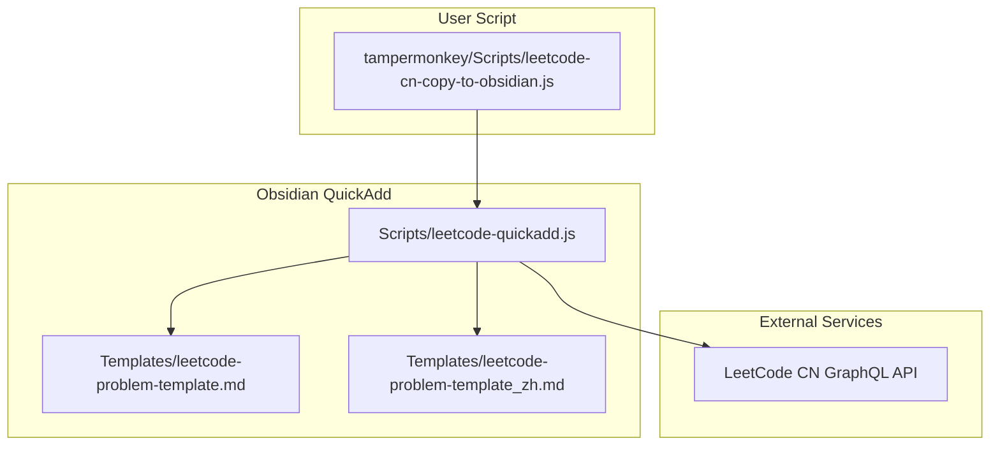
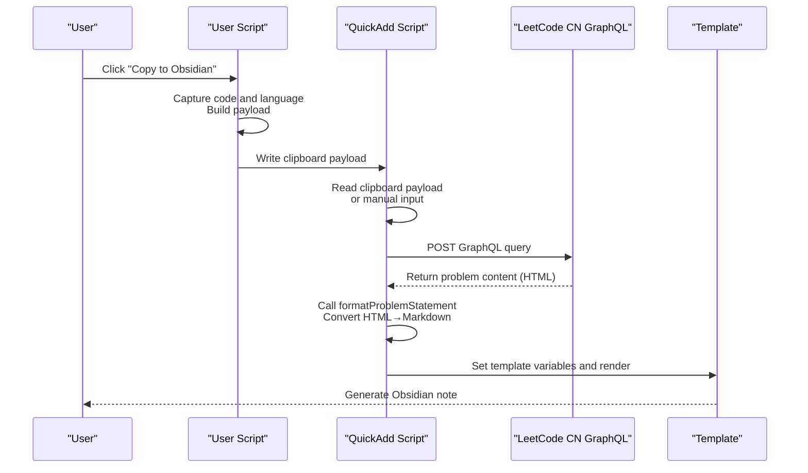
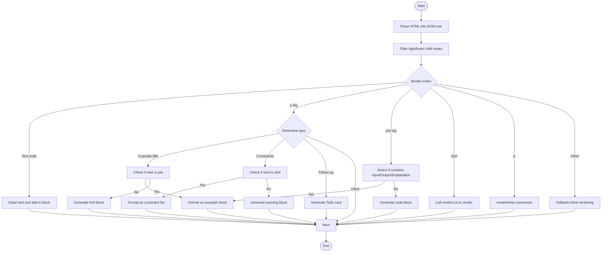
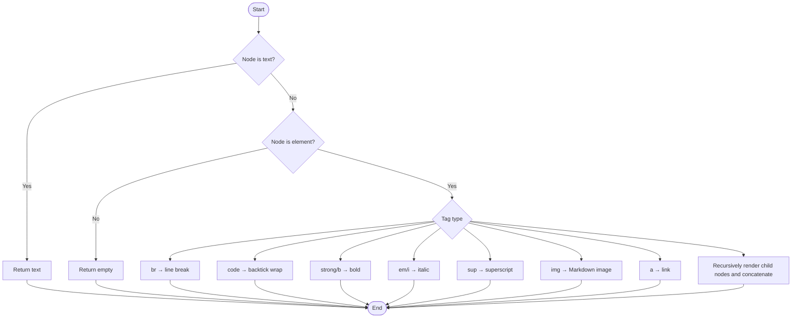
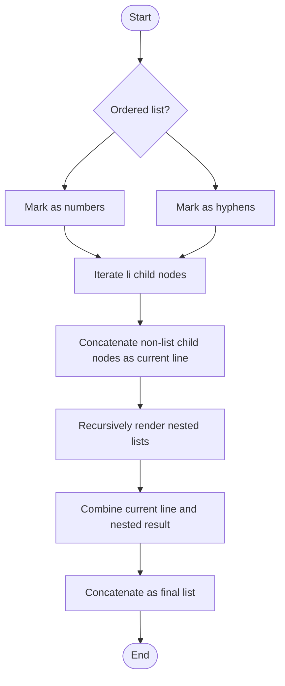
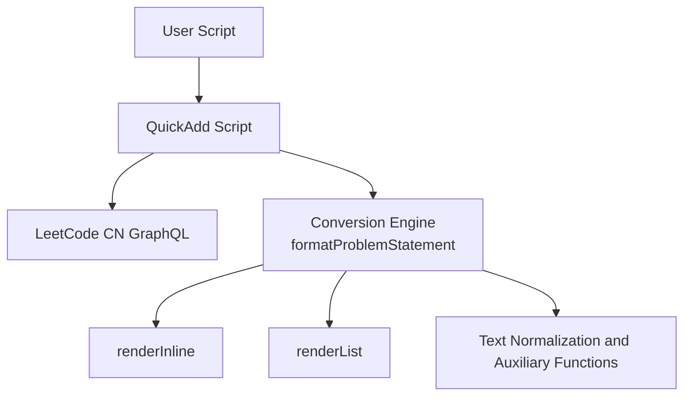

# Content Conversion and Formatting

<cite>
**Referenced Files in This Document**
- [Scripts/leetcode-quickadd.js](file://Scripts/leetcode-quickadd.js)
- [tampermonkey/Scripts/leetcode-cn-copy-to-obsidian.js](file://tampermonkey/Scripts/leetcode-cn-copy-to-obsidian.js)
- [Templates/leetcode-problem-template.md](file://Templates/leetcode-problem-template.md)
- [Templates/leetcode-problem-template_zh.md](file://Templates/leetcode-problem-template_zh.md)
</cite>

## Table of Contents
1. [Introduction](#introduction)
2. [Project Structure](#project-structure)
3. [Core Components](#core-components)
4. [Architecture Overview](#architecture-overview)
5. [Detailed Component Analysis](#detailed-component-analysis)
6. [Dependency Analysis](#dependency-analysis)
7. [Performance Considerations](#performance-considerations)
8. [Troubleshooting Guide](#troubleshooting-guide)
9. [Conclusion](#conclusion)
10. [Appendix](#appendix)

## Introduction
This technical document focuses on content conversion and formatting features, particularly the HTML-to-Markdown conversion engine, covering the following key functions:
- `formatProblemStatement`: Main engine for HTML content parsing and formatting
- `renderInline`: Inline element handling (strong, em, code, sup, a, etc.)
- `renderList`: Recursive list rendering
- Text normalization functions: `normalizePreText`, `normalizeMarkerText`, `normalizeExampleValue`, `cleanupInlineCode`, `cleanupBlockText`
- Auxiliary functions: `formatPreAsExample`, `extractLabeledSection`, `formatConstraintsList`, `getSignificantChildren`, `findNextSignificantIndex`

The document provides an in-depth explanation of DOM parsing, node traversal strategies, formatting rules, edge case handling, conversion examples, and best practice recommendations.

## Project Structure
The project consists of three main parts:
- QuickAdd Script: Responsible for obtaining problem context from clipboard or manual input, calling GraphQL to fetch problem content, and setting template variables.
- User Script: Injects a "Copy to Obsidian" button on the LeetCode page, automatically captures code and language, and writes a clipboard payload.
- Template: Defines the structural fields of Obsidian notes for the QuickAdd script to populate.

Diagram Sources
- [Scripts/leetcode-quickadd.js:339-404](file://Scripts/leetcode-quickadd.js#L339-L404)
- [tampermonkey/Scripts/leetcode-cn-copy-to-obsidian.js:316-363](file://tampermonkey/Scripts/leetcode-cn-copy-to-obsidian.js#L316-L363)

Section Sources
- [Scripts/leetcode-quickadd.js:1-104](file://Scripts/leetcode-quickadd.js#L1-L104)
- [tampermonkey/Scripts/leetcode-cn-copy-to-obsidian.js:12-536](file://tampermonkey/Scripts/leetcode-cn-copy-to-obsidian.js#L12-L536)
- [Templates/leetcode-problem-template.md:1-35](file://Templates/leetcode-problem-template.md#L1-L35)
- [Templates/leetcode-problem-template_zh.md:1-41](file://Templates/leetcode-problem-template_zh.md#L1-L41)

## Core Components
- HTML → Markdown Conversion Engine: `formatProblemStatement`
- Inline Element Handling: `renderInline`
- List Rendering: `renderList`
- Text Normalization: `normalizePreText`, `normalizeMarkerText`, `normalizeExampleValue`, `cleanupInlineCode`, `cleanupBlockText`
- Example and Constraints Handling: `formatPreAsExample`, `extractLabeledSection`, `formatConstraintsList`
- Context and Requests: `getProblemContext`, `getLeetCodeProblem`, `setQuickAddVariables`

Section Sources
- [Scripts/leetcode-quickadd.js:436-546](file://Scripts/leetcode-quickadd.js#L436-L546)
- [Scripts/leetcode-quickadd.js:576-628](file://Scripts/leetcode-quickadd.js#L576-L628)
- [Scripts/leetcode-quickadd.js:634-667](file://Scripts/leetcode-quickadd.js#L634-L667)
- [Scripts/leetcode-quickadd.js:740-783](file://Scripts/leetcode-quickadd.js#L740-L783)
- [Scripts/leetcode-quickadd.js:669-699](file://Scripts/leetcode-quickadd.js#L669-L699)
- [Scripts/leetcode-quickadd.js:701-738](file://Scripts/leetcode-quickadd.js#L701-L738)
- [Scripts/leetcode-quickadd.js:114-166](file://Scripts/leetcode-quickadd.js#L114-L166)
- [Scripts/leetcode-quickadd.js:339-404](file://Scripts/leetcode-quickadd.js#L339-L404)
- [Scripts/leetcode-quickadd.js:410-430](file://Scripts/leetcode-quickadd.js#L410-L430)

## Architecture Overview
The overall workflow is as follows:
- The user script injects a button on the LeetCode page, copying a payload containing the problem URL, slug, language, and code to the clipboard.
- The QuickAdd script reads the clipboard payload preferentially; otherwise enters manual mode (input URL/slug or paste code).
- Fetches problem content (including Chinese translation) via GraphQL, calls `formatProblemStatement` to convert HTML to Markdown.
- Sets template variables (id, title, link, difficulty, problemStatement, formattedHints, tags, fileName, language, solutionCode, sourceUrl, titleSlug).
- Generates an Obsidian note using the template.

Diagram Sources
- [tampermonkey/Scripts/leetcode-cn-copy-to-obsidian.js:316-363](file://tampermonkey/Scripts/leetcode-cn-copy-to-obsidian.js#L316-L363)
- [Scripts/leetcode-quickadd.js:83-104](file://Scripts/leetcode-quickadd.js#L83-L104)
- [Scripts/leetcode-quickadd.js:339-404](file://Scripts/leetcode-quickadd.js#L339-L404)
- [Scripts/leetcode-quickadd.js:410-430](file://Scripts/leetcode-quickadd.js#L410-L430)

## Detailed Component Analysis

### HTML → Markdown Conversion Engine: formatProblemStatement
This function parses the HTML content returned by LeetCode into Markdown, following these steps:
- Parse the HTML string using a temporary container node, filtering significant child nodes (non-empty text or img tags).
- Iterate through nodes, classifying them by type:
  - Text nodes: Clean and add directly to block.
  - p tags:
    - Example titles: Match "Example N" etc.; if followed by a pre, format as example block; otherwise as general hint block.
    - Constraints title: Match "Constraints"; if followed by ul/ol, convert to constraint list; otherwise as general hint block.
    - Follow-up title: Match "Follow-up", generate Todo card.
  - pre tags:
    - If containing "Input/Output/Explanation" labels, format as example;
    - Otherwise as plain text code block.
  - ul/ol: Call `renderList` to render the list.
  - p: Use `renderInline` internally to convert to inline Markdown.
  - Other elements: Fall back to inline rendering.
- Finally merge blocks, remove extra empty lines and trim.

Diagram Sources
- [Scripts/leetcode-quickadd.js:436-546](file://Scripts/leetcode-quickadd.js#L436-L546)

Section Sources
- [Scripts/leetcode-quickadd.js:436-546](file://Scripts/leetcode-quickadd.js#L436-L546)

### Inline Element Handling: renderInline
This function recursively handles nodes and their children, converting HTML inline elements to Markdown:
- Text node: Return as-is.
- br: Line break.
- code: Wrap with backticks, with inline code cleanup applied internally.
- strong/b: Bold.
- em/i: Italic.
- sup: Superscript.
- img: Markdown image syntax.
- a: Link; if no href, return text only.
- Other elements: Recursively render child nodes and concatenate.

Diagram Sources
- [Scripts/leetcode-quickadd.js:576-628](file://Scripts/leetcode-quickadd.js#L576-L628)

Section Sources
- [Scripts/leetcode-quickadd.js:576-628](file://Scripts/leetcode-quickadd.js#L576-L628)

### List Rendering: renderList
This function recursively handles ordered/unordered lists, supporting nesting:
- Determine whether it is an ordered list and generate marker (number or hyphen).
- Filter li child nodes and process each:
  - Extract inline text from non-list child nodes and concatenate as the current line.
  - Recursively render nested lists with aligned indentation.
  - Combine current line and nested result to form the final list.

Diagram Sources
- [Scripts/leetcode-quickadd.js:634-667](file://Scripts/leetcode-quickadd.js#L634-L667)

Section Sources
- [Scripts/leetcode-quickadd.js:634-667](file://Scripts/leetcode-quickadd.js#L634-L667)

### Text Normalization Functions
- `normalizePreText`: Removes carriage returns, replaces non-breaking spaces, cleans extra whitespace and line breaks to keep preformatted text clean.
- `normalizeMarkerText`: Removes carriage returns and non-breaking spaces, compresses multiple whitespace into a single space, for title/marker text.
- `normalizeExampleValue`: Removes backticks, line breaks, and extra whitespace for concise display of example values.
- `cleanupInlineCode`: Cleans backticks and line breaks in inline code to avoid breaking code blocks.
- `cleanupBlockText`: Cleans extra whitespace and line breaks in block-level text to unify paragraph formatting.

Section Sources
- [Scripts/leetcode-quickadd.js:740-783](file://Scripts/leetcode-quickadd.js#L740-L783)

### Example and Constraints Handling Auxiliary Functions
- `formatPreAsExample`: Extracts three sections ("Input/Output/Explanation") from pre text and formats each as a Markdown quote block; if unrecognized, converts each line to a quote block.
- `extractLabeledSection`: Uses regex to locate label positions and extract the range of a specified label paragraph.
- `formatConstraintsList`: Converts ul/ol constraint lists to a quote block list with a hint header.

Section Sources
- [Scripts/leetcode-quickadd.js:669-699](file://Scripts/leetcode-quickadd.js#L669-L699)
- [Scripts/leetcode-quickadd.js:701-738](file://Scripts/leetcode-quickadd.js#L701-L738)

### DOM Parsing and Node Traversal Auxiliary Functions
- `getSignificantChildren`: Filters out whitespace-only text or empty element nodes, keeping displayable elements such as img.
- `findNextSignificantIndex`: Skips whitespace text to find the next significant node index.

Section Sources
- [Scripts/leetcode-quickadd.js:548-574](file://Scripts/leetcode-quickadd.js#L548-L574)

### Context and Request Workflow
- `getProblemContext`: Reads payload from clipboard preferentially; otherwise enters manual mode (URL/slug or code).
- `getLeetCodeProblem`: Sends a GraphQL query, parses returned data, calls `formatProblemStatement` to convert the problem description.
- `setQuickAddVariables`: Assembles template variables including file name, difficulty link, tags, formatted hints, language, code, source link, and slug.

Section Sources
- [Scripts/leetcode-quickadd.js:114-166](file://Scripts/leetcode-quickadd.js#L114-L166)
- [Scripts/leetcode-quickadd.js:339-404](file://Scripts/leetcode-quickadd.js#L339-L404)
- [Scripts/leetcode-quickadd.js:410-430](file://Scripts/leetcode-quickadd.js#L410-L430)

## Dependency Analysis
- The QuickAdd script depends on the clipboard payload provided by the user script to minimize manual input.
- The QuickAdd script depends on the LeetCode CN GraphQL API to fetch problem content.
- The conversion engine internally depends on a set of text normalization and auxiliary functions to ensure output consistency and readability.

Diagram Sources
- [Scripts/leetcode-quickadd.js:83-104](file://Scripts/leetcode-quickadd.js#L83-L104)
- [Scripts/leetcode-quickadd.js:339-404](file://Scripts/leetcode-quickadd.js#L339-L404)
- [Scripts/leetcode-quickadd.js:436-546](file://Scripts/leetcode-quickadd.js#L436-L546)
- [Scripts/leetcode-quickadd.js:576-628](file://Scripts/leetcode-quickadd.js#L576-L628)
- [Scripts/leetcode-quickadd.js:634-667](file://Scripts/leetcode-quickadd.js#L634-L667)
- [Scripts/leetcode-quickadd.js:740-783](file://Scripts/leetcode-quickadd.js#L740-L783)

Section Sources
- [Scripts/leetcode-quickadd.js:83-104](file://Scripts/leetcode-quickadd.js#L83-L104)
- [Scripts/leetcode-quickadd.js:339-404](file://Scripts/leetcode-quickadd.js#L339-L404)
- [Scripts/leetcode-quickadd.js:436-546](file://Scripts/leetcode-quickadd.js#L436-L546)
- [Scripts/leetcode-quickadd.js:576-628](file://Scripts/leetcode-quickadd.js#L576-L628)
- [Scripts/leetcode-quickadd.js:634-667](file://Scripts/leetcode-quickadd.js#L634-L667)
- [Scripts/leetcode-quickadd.js:740-783](file://Scripts/leetcode-quickadd.js#L740-L783)

## Performance Considerations
- DOM parsing and node traversal: `formatProblemStatement` parses and traverses HTML once with approximate O(N) complexity where N is the number of nodes.
- Recursive list rendering: `renderList` recurses multiple times in nested list scenarios, but is usually not too deep given HTML structure constraints.
- Regex matching: Example title and label extraction use regex; avoid overly complex expressions that could cause backtracking.
- Text normalization: All normalization functions perform linear scans with low overhead.
- Recommendations:
  - Control input HTML volume; avoid excessively large node trees.
  - Reuse or cache frequently used regular expressions.
  - In extreme cases, consider segmented processing or deferred rendering.

[This section is general performance discussion; no specific file source needed]

## Troubleshooting Guide
- Invalid clipboard payload
  - Symptom: Cannot read valid payload from clipboard.
  - Diagnosis: Confirm the user script injected the button and successfully copied the payload; check clipboard permissions and browser compatibility.
  - Reference: [Scripts/leetcode-quickadd.js:238-271](file://Scripts/leetcode-quickadd.js#L238-L271)
- GraphQL query failure
  - Symptom: Cannot fetch problem content.
  - Diagnosis: Check network connection, Referer/Origin headers, API availability; view error logs.
  - Reference: [Scripts/leetcode-quickadd.js:339-404](file://Scripts/leetcode-quickadd.js#L339-L404)
- Example block not correctly recognized
  - Symptom: Example title not recognized or example content not formatted by Input/Output/Explanation.
  - Diagnosis: Confirm the structure of example titles and pre tags in HTML; check regex matching in `normalizeMarkerText` and `extractLabeledSection`.
  - Reference: [Scripts/leetcode-quickadd.js:461-475](file://Scripts/leetcode-quickadd.js#L461-L475), [Scripts/leetcode-quickadd.js:669-699](file://Scripts/leetcode-quickadd.js#L669-L699), [Scripts/leetcode-quickadd.js:701-723](file://Scripts/leetcode-quickadd.js#L701-L723)
- List rendering anomaly
  - Symptom: Nested list indentation or markers are incorrect.
  - Diagnosis: Confirm the ul/ol/li structure in HTML; check filtering and recursion logic in `renderList`.
  - Reference: [Scripts/leetcode-quickadd.js:634-667](file://Scripts/leetcode-quickadd.js#L634-L667)
- Inline code format issue
  - Symptom: Inline code misidentified or corrupted.
  - Diagnosis: Check backtick handling in `cleanupInlineCode` and `renderInline`.
  - Reference: [Scripts/leetcode-quickadd.js:767-773](file://Scripts/leetcode-quickadd.js#L767-L773), [Scripts/leetcode-quickadd.js:593-595](file://Scripts/leetcode-quickadd.js#L593-L595)

Section Sources
- [Scripts/leetcode-quickadd.js:238-271](file://Scripts/leetcode-quickadd.js#L238-L271)
- [Scripts/leetcode-quickadd.js:339-404](file://Scripts/leetcode-quickadd.js#L339-L404)
- [Scripts/leetcode-quickadd.js:461-475](file://Scripts/leetcode-quickadd.js#L461-L475)
- [Scripts/leetcode-quickadd.js:669-699](file://Scripts/leetcode-quickadd.js#L669-L699)
- [Scripts/leetcode-quickadd.js:701-723](file://Scripts/leetcode-quickadd.js#L701-L723)
- [Scripts/leetcode-quickadd.js:634-667](file://Scripts/leetcode-quickadd.js#L634-L667)
- [Scripts/leetcode-quickadd.js:767-773](file://Scripts/leetcode-quickadd.js#L767-L773)
- [Scripts/leetcode-quickadd.js:593-595](file://Scripts/leetcode-quickadd.js#L593-L595)

## Conclusion
This conversion engine takes clear node classification and recursive processing as its core, combined with multiple text normalization and auxiliary functions, achieving robust HTML-to-Markdown conversion. Through example title recognition, constraint handling, list rendering, and image handling rules, it covers most common structures in LeetCode problem descriptions. Combined with the user script and QuickAdd script, it efficiently imports problem content into the Obsidian note system.

[This section is summary content; no specific file source needed]

## Appendix

### Conversion Examples and Edge Cases
- Example title recognition
  - Matches "Example N" titles; if immediately followed by pre, formats by Input/Output/Explanation; otherwise as hint block.
  - Reference: [Scripts/leetcode-quickadd.js:461-475](file://Scripts/leetcode-quickadd.js#L461-L475), [Scripts/leetcode-quickadd.js:669-699](file://Scripts/leetcode-quickadd.js#L669-L699)
- Constraints handling
  - Matches "Constraints" title; if followed by ul/ol, converts to constraint list; otherwise as general hint block.
  - Reference: [Scripts/leetcode-quickadd.js:478-494](file://Scripts/leetcode-quickadd.js#L478-L494), [Scripts/leetcode-quickadd.js:725-738](file://Scripts/leetcode-quickadd.js#L725-L738)
- Follow-up content formatting
  - Matches "Follow-up" title and generates a Todo card.
  - Reference: [Scripts/leetcode-quickadd.js:497-507](file://Scripts/leetcode-quickadd.js#L497-L507)
- List rendering
  - Supports nesting with correct ordered/unordered list markers and indentation.
  - Reference: [Scripts/leetcode-quickadd.js:634-667](file://Scripts/leetcode-quickadd.js#L634-L667)
- Image handling
  - img tags are converted to Markdown image syntax.
  - Reference: [Scripts/leetcode-quickadd.js:611-614](file://Scripts/leetcode-quickadd.js#L611-L614)
- Text normalization
  - `normalizePreText`, `normalizeMarkerText`, `normalizeExampleValue`, `cleanupInlineCode`, `cleanupBlockText` ensure clean and consistent output.
  - Reference: [Scripts/leetcode-quickadd.js:740-783](file://Scripts/leetcode-quickadd.js#L740-L783)
