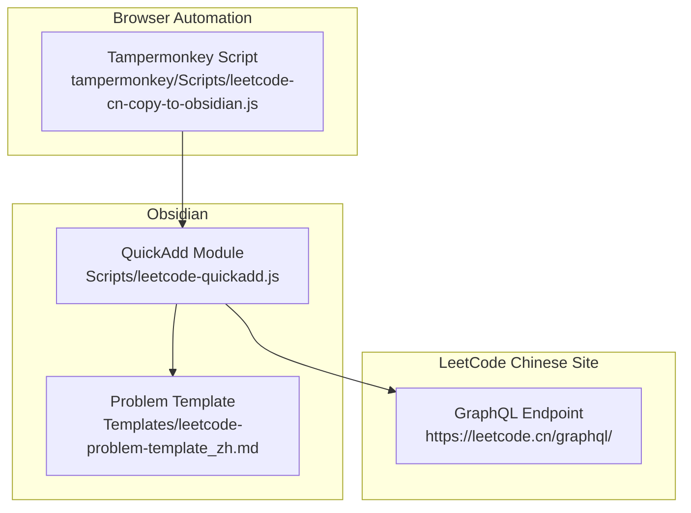
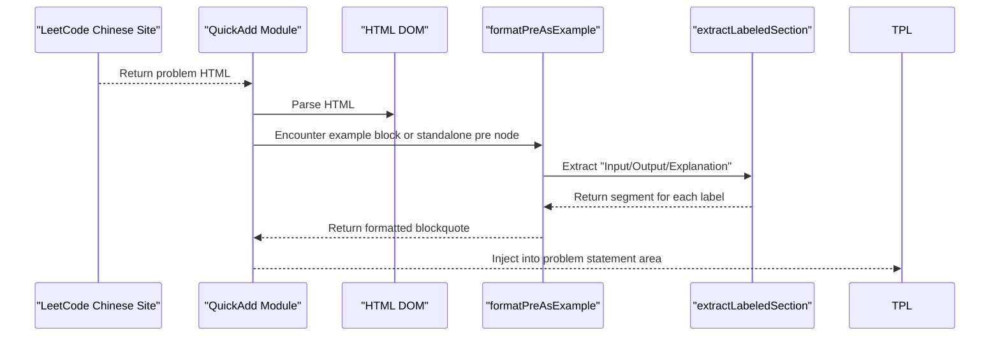
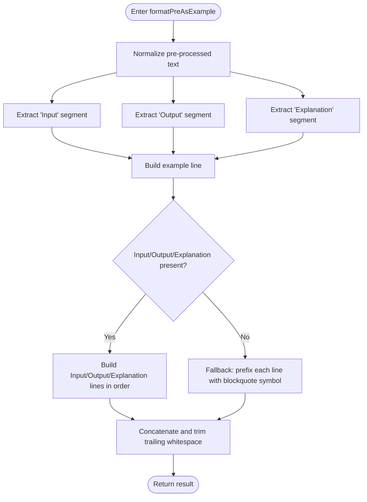
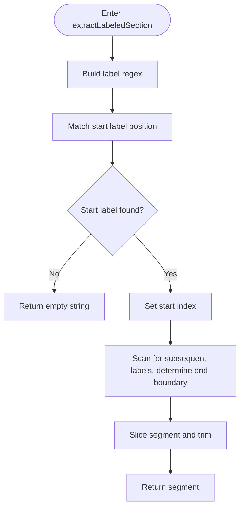
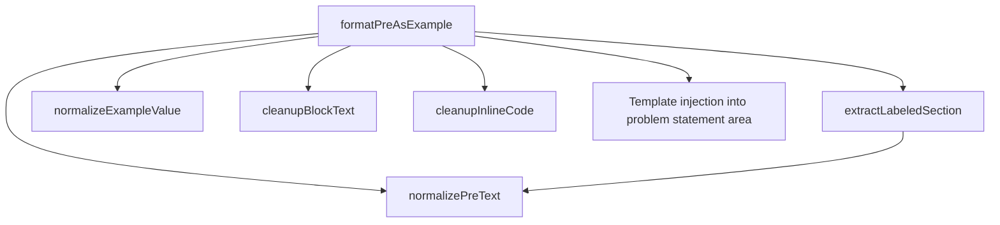

# Example Formatting

<cite>
**Files referenced in this document**
- [Scripts/leetcode-quickadd.js](file://Scripts/leetcode-quickadd.js)
- [Templates/leetcode-problem-template_zh.md](file://Templates/leetcode-problem-template_zh.md)
- [tampermonkey/Scripts/leetcode-cn-copy-to-obsidian.js](file://tampermonkey/Scripts/leetcode-cn-copy-to-obsidian.js)
</cite>

## Table of Contents
1. [Introduction](#introduction)
2. [Project Structure](#project-structure)
3. [Core Components](#core-components)
4. [Architecture Overview](#architecture-overview)
5. [Detailed Component Analysis](#detailed-component-analysis)
6. [Dependency Analysis](#dependency-analysis)
7. [Performance Considerations](#performance-considerations)
8. [Troubleshooting Guide](#troubleshooting-guide)
9. [Conclusion](#conclusion)

## Introduction

This document focuses on the example formatting functionality, providing a detailed explanation of the working mechanisms and formatting rules for the following two core functions:

- **`formatPreAsExample` function**: Converts code blocks containing "Input/Output/Explanation" labels into example entries formatted as Obsidian blockquotes.
- **`extractLabeledSection` function**: Extracts corresponding segments from raw text using regex matching on labels (Input, Output, Explanation) and their colon separators.

The document also describes example title formatting, input/output code block formatting, and explanation paragraph formatting, as well as the combined use of blockquotes, bold markers, and code markers in formatted output. Multiple examples of format processing and optimization recommendations are provided.

## Project Structure

This repository relies on the collaboration of Obsidian QuickAdd and Tampermonkey auto-copy functionality to scrape problem content from the LeetCode Chinese site and generate template-compliant notes. The files directly related to example formatting are:

- **Scripts/leetcode-quickadd.js**: Contains the HTML-to-Markdown conversion logic, example formatting functions, and label extraction functions.
- **Templates/leetcode-problem-template_zh.md**: Obsidian template that defines the problem statement area for holding formatted example content.
- **tampermonkey/Scripts/leetcode-cn-copy-to-obsidian.js**: Tampermonkey script responsible for copying problem URL, language, and code from the LeetCode page to the clipboard for use by QuickAdd.

Diagram Sources
- [Scripts/leetcode-quickadd.js:339-404](file://Scripts/leetcode-quickadd.js#L339-L404)
- [Templates/leetcode-problem-template_zh.md:14-41](file://Templates/leetcode-problem-template_zh.md#L14-L41)
- [tampermonkey/Scripts/leetcode-cn-copy-to-obsidian.js:316-363](file://tampermonkey/Scripts/leetcode-cn-copy-to-obsidian.js#L316-L363)

Section Sources
- [Scripts/leetcode-quickadd.js:339-404](file://Scripts/leetcode-quickadd.js#L339-L404)
- [Templates/leetcode-problem-template_zh.md:14-41](file://Templates/leetcode-problem-template_zh.md#L14-L41)
- [tampermonkey/Scripts/leetcode-cn-copy-to-obsidian.js:316-363](file://tampermonkey/Scripts/leetcode-cn-copy-to-obsidian.js#L316-L363)

## Core Components

This section focuses on the core functions and rules for example formatting processing, including:

- **`formatPreAsExample`**: The main function for example block processing, responsible for identifying the three parts — Input/Output/Explanation — and formatting them into an Obsidian blockquote.
- **`extractLabeledSection`**: The label extraction function that uses regex to match "Input/Output/Explanation" labels and their colon separators, extracting the corresponding segments.
- **Helper functions**: `normalizePreText`, `normalizeExampleValue`, `cleanupBlockText`, `cleanupInlineCode`, etc., used for text normalization and cleanup.

Section Sources
- [Scripts/leetcode-quickadd.js:669-699](file://Scripts/leetcode-quickadd.js#L669-L699)
- [Scripts/leetcode-quickadd.js:701-723](file://Scripts/leetcode-quickadd.js#L701-L723)
- [Scripts/leetcode-quickadd.js:740-783](file://Scripts/leetcode-quickadd.js#L740-L783)

## Architecture Overview

The position of example formatting processing in the overall flow is as follows:

1. Retrieve problem HTML content from the LeetCode Chinese site's GraphQL endpoint.
2. Convert HTML to Markdown; during this process, identify and handle paragraphs containing example headings.
3. For standalone `pre` nodes that contain "Input/Output/Explanation" labels, call `formatPreAsExample` for formatting.
4. If labels cannot be identified, fall back to preserving the original content and outputting it as a blockquote to avoid data loss.

Diagram Sources
- [Scripts/leetcode-quickadd.js:436-546](file://Scripts/leetcode-quickadd.js#L436-L546)
- [Scripts/leetcode-quickadd.js:669-699](file://Scripts/leetcode-quickadd.js#L669-L699)
- [Scripts/leetcode-quickadd.js:701-723](file://Scripts/leetcode-quickadd.js#L701-L723)

## Detailed Component Analysis

### formatPreAsExample Function

This function is responsible for converting code blocks containing "Input/Output/Explanation" labels into example entries in Obsidian blockquote format. Its processing logic is as follows:

- **Input**: The text content of a `pre` node (already normalized).
- **Output**: Example content presented as a blockquote, containing an example line, an input line, an output line, and an explanation line.
- **Processing steps**:
  1. Use `extractLabeledSection` to separately extract the "Input", "Output", and "Explanation" sections.
  2. Assemble the example line (example number).
  3. If "Input" exists, output it with a bold "Input" label and the value wrapped in code markers.
  4. If "Output" exists, output it with a bold "Output" label and the value wrapped in code markers.
  5. If "Explanation" exists, output it with a bold "Explanation" label followed by the paragraph text.
  6. If none of the three are recognized, fall back to prefixing each line of the raw text with a blockquote symbol to avoid data loss.

Diagram Sources
- [Scripts/leetcode-quickadd.js:669-699](file://Scripts/leetcode-quickadd.js#L669-L699)

Section Sources
- [Scripts/leetcode-quickadd.js:669-699](file://Scripts/leetcode-quickadd.js#L669-L699)

### extractLabeledSection Function

This function uses regular expressions to match labels and their colon separators, extracting the corresponding segment from the raw text. Its working mechanism is as follows:

- **Input label**: e.g., "Input", "Output", "Explanation".
- **Matching rules**:
  - The label name may be followed by a Chinese colon "：" or English colon ":", with spaces allowed before and after.
  - The label name is used as the starting position for a forward scan.
  - If a subsequent label exists (e.g., "Input" may be followed by "Output" or "Explanation"), the closest following label position is used as the end boundary.
- **Output**: Returns the text segment between labels, normalized by trimming.

Diagram Sources
- [Scripts/leetcode-quickadd.js:701-723](file://Scripts/leetcode-quickadd.js#L701-L723)

Section Sources
- [Scripts/leetcode-quickadd.js:701-723](file://Scripts/leetcode-quickadd.js#L701-L723)

### Example Formatting Rules

- **Example title format**: Presented as a blockquote heading, containing an "Example Number". For example: "> Example 1".
- **Input/Output format**: Uses bold labels "Input/Output" followed by the value wrapped in code markers, making it easy to highlight in Obsidian.
- **Explanation format**: Uses a bold "Explanation" label followed by paragraph text, supporting multi-line explanation content.
- **Fallback strategy**: When no labels can be identified, each line of the raw text is prefixed with a blockquote symbol to avoid data loss.

Section Sources
- [Scripts/leetcode-quickadd.js:669-699](file://Scripts/leetcode-quickadd.js#L669-L699)
- [Scripts/leetcode-quickadd.js:701-723](file://Scripts/leetcode-quickadd.js#L701-L723)

### Processing Examples and Optimization Recommendations

- **Complete example**: An example containing all three parts — "Input", "Output", "Explanation" — will be rendered as three blockquote lines, each annotated with bold labels and code markers respectively.
- **Missing parts**: An example containing only "Input/Output" or only "Explanation" will output only the parts that exist; the rest will be omitted.
- **Formatting optimizations**:
  - Newlines in Input/Output values are replaced with spaces to maintain single-line display.
  - Spaces are allowed between labels and colons to improve fault tolerance.
  - Explanation content preserves paragraph format, suitable for long explanation text.
  - Fallback mode ensures the original information is retained even when labels are missing.

Section Sources
- [Scripts/leetcode-quickadd.js:669-699](file://Scripts/leetcode-quickadd.js#L669-L699)
- [Scripts/leetcode-quickadd.js:701-723](file://Scripts/leetcode-quickadd.js#L701-L723)
- [Scripts/leetcode-quickadd.js:740-783](file://Scripts/leetcode-quickadd.js#L740-L783)

## Dependency Analysis

Example formatting processing depends on the following functions and data flows:

- `formatPreAsExample` depends on `extractLabeledSection` for label segment extraction.
- `extractLabeledSection` depends on regular expressions to match labels and colon separators.
- Text normalization functions (`normalizePreText`, `normalizeExampleValue`, `cleanupBlockText`, `cleanupInlineCode`) ensure the consistency and readability of input text.
- **Template injection**: Formatted example content is ultimately injected into the problem statement area of the template for Obsidian rendering.

Diagram Sources
- [Scripts/leetcode-quickadd.js:669-699](file://Scripts/leetcode-quickadd.js#L669-L699)
- [Scripts/leetcode-quickadd.js:701-723](file://Scripts/leetcode-quickadd.js#L701-L723)
- [Scripts/leetcode-quickadd.js:740-783](file://Scripts/leetcode-quickadd.js#L740-L783)

Section Sources
- [Scripts/leetcode-quickadd.js:669-699](file://Scripts/leetcode-quickadd.js#L669-L699)
- [Scripts/leetcode-quickadd.js:701-723](file://Scripts/leetcode-quickadd.js#L701-L723)
- [Scripts/leetcode-quickadd.js:740-783](file://Scripts/leetcode-quickadd.js#L740-L783)

## Performance Considerations

- **Regex matching**: `extractLabeledSection` uses a single regex match to locate the starting label, then compares the minimum index among multiple candidate labels in subsequent scanning to determine the end boundary. Time complexity is approximately linear.
- **Text normalization**: Multiple string replacements and trim operations, overall still linear complexity; be careful to avoid executing unnecessary normalizations repeatedly on large texts.
- **Fallback strategy**: When labels cannot be identified, the fallback logic of prefixing each line with a blockquote symbol avoids complex parsing costs while ensuring information completeness.

## Troubleshooting Guide

- **Labels not recognized**:
  - Check whether labels use a Chinese colon "：" or English colon ":", and whether there are too many leading/trailing spaces.
  - Confirm there are no extra characters between the "Input/Output/Explanation" label and the content that might interfere.
- **Abnormal Input/Output values**:
  - Newlines in Input/Output values are replaced with spaces. If newlines need to be preserved, adjust the format in the source text.
- **Explanation content format**:
  - Explanation content preserves paragraph format. If unexpected newlines appear, check the newlines and indentation in the source text.
- **Fallback mode**:
  - When all three are unrecognized, the system will prefix each line of the raw text with a blockquote symbol to ensure no information is lost.

Section Sources
- [Scripts/leetcode-quickadd.js:701-723](file://Scripts/leetcode-quickadd.js#L701-L723)
- [Scripts/leetcode-quickadd.js:740-783](file://Scripts/leetcode-quickadd.js#L740-L783)

## Conclusion

Example formatting processing achieves robust parsing and formatted output of LeetCode example blocks through the collaborative work of `formatPreAsExample` and `extractLabeledSection`. Its rules are clear and concise: example headings, Input/Output code blocks, and explanation paragraphs, combined with the use of blockquotes, bold markers, and code markers, ensure both readability and information completeness. For cases with missing labels, the fallback strategy guarantees that no original content is lost, making it suitable for widespread use across problem content in different formats.
