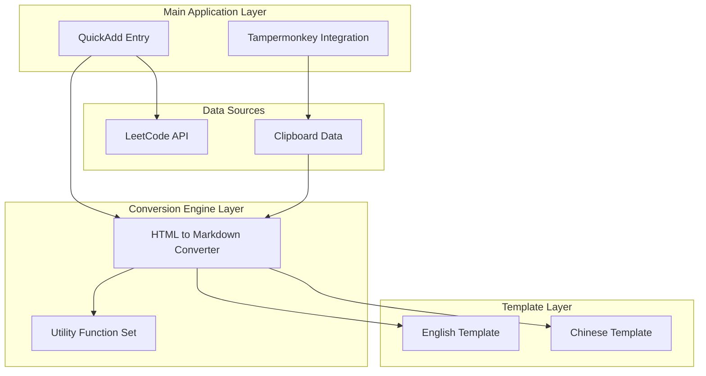
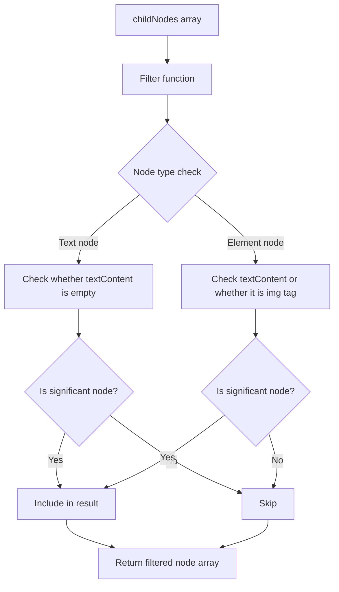
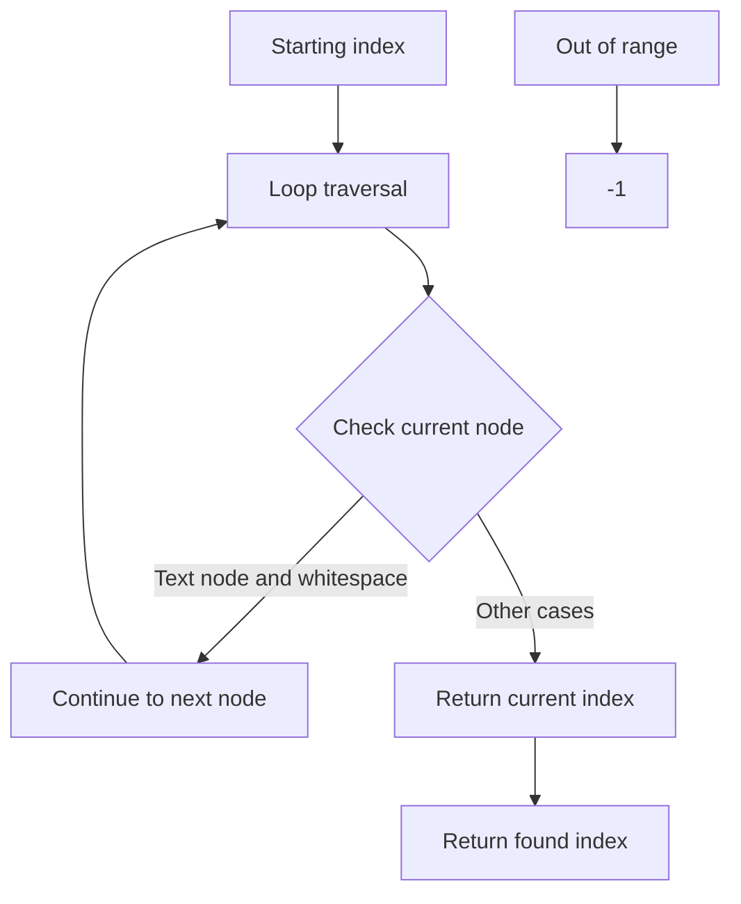
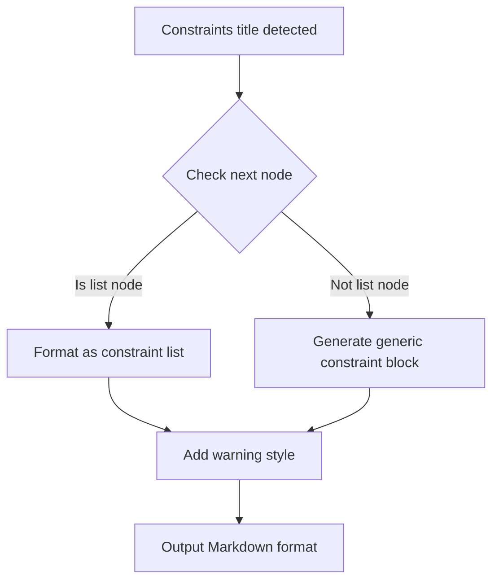
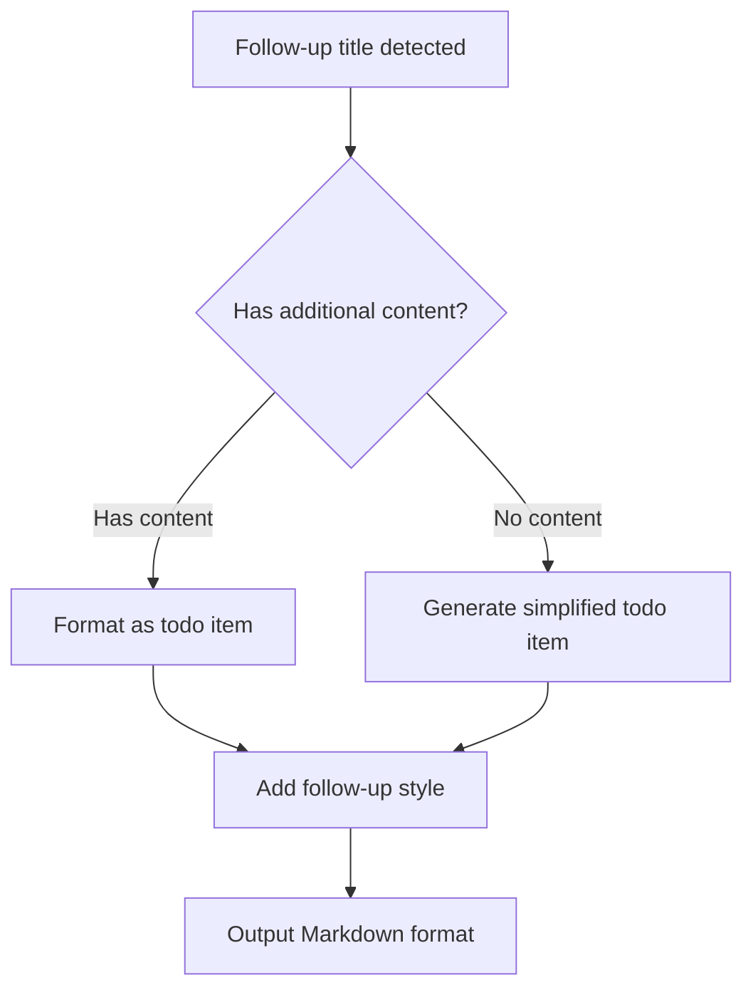
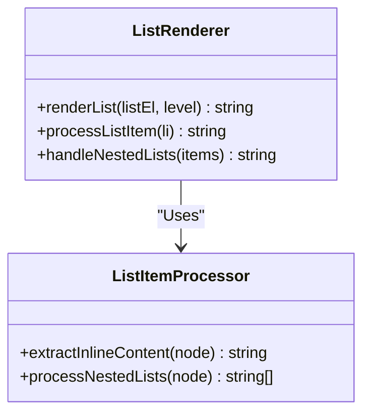
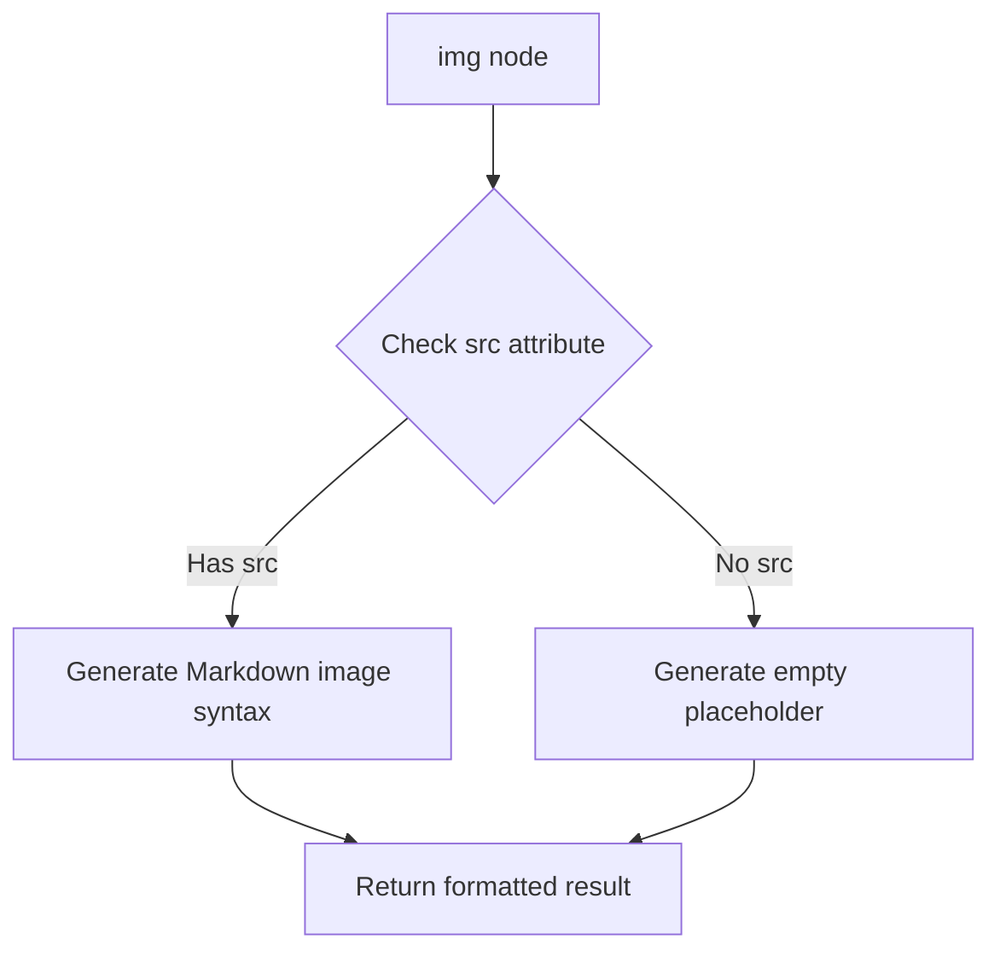
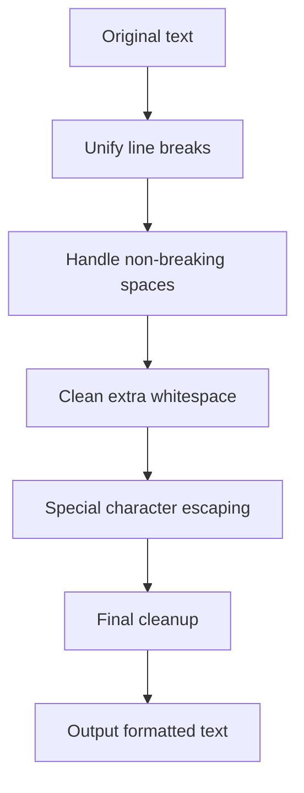
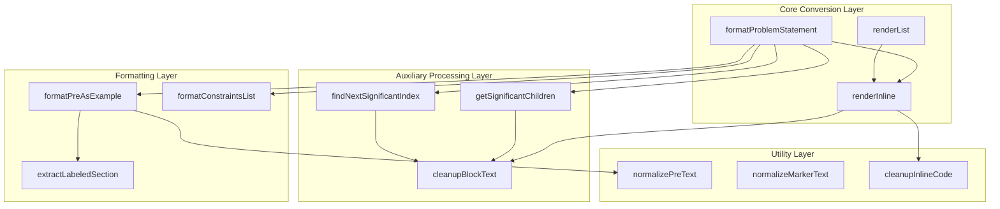

# HTML to Markdown Conversion Engine

<cite>
**Referenced Files in This Document**
- [leetcode-quickadd.js](file://Scripts/leetcode-quickadd.js)
- [leetcode-cn-copy-to-obsidian.js](file://tampermonkey/Scripts/leetcode-cn-copy-to-obsidian.js)
- [leetcode-problem-template.md](file://Templates/leetcode-problem-template.md)
- [leetcode-problem-template_zh.md](file://Templates/leetcode-problem-template_zh.md)
</cite>

## Table of Contents
1. [Introduction](#introduction)
2. [Project Structure](#project-structure)
3. [Core Components](#core-components)
4. [Architecture Overview](#architecture-overview)
5. [Detailed Component Analysis](#detailed-component-analysis)
6. [Dependency Analysis](#dependency-analysis)
7. [Performance Considerations](#performance-considerations)
8. [Troubleshooting Guide](#troubleshooting-guide)
9. [Conclusion](#conclusion)

## Introduction

This document provides an in-depth analysis of the HTML-to-Markdown conversion functionality in the LeetCode-to-Obsidian conversion engine, with a focus on explaining the core conversion logic of the `formatProblemStatement` function. This engine converts the HTML-format problem content from LeetCode CN into Obsidian-compatible Markdown format, including DOM parsing, node traversal, formatting rules, and handling mechanisms for various HTML structures.

The conversion engine adopts a modular design, using multiple specialized functions to handle different HTML node types and formatting requirements, ensuring that the conversion result both preserves the original meaning and conforms to Obsidian's Markdown syntax specifications.

## Project Structure

The project adopts a clear functional modular organization, mainly consisting of the following components:



**Diagram Sources**
- [leetcode-quickadd.js:1-868](file://Scripts/leetcode-quickadd.js#L1-L868)
- [leetcode-cn-copy-to-obsidian.js:1-536](file://tampermonkey/Scripts/leetcode-cn-copy-to-obsidian.js#L1-L536)

**Section Sources**
- [leetcode-quickadd.js:1-868](file://Scripts/leetcode-quickadd.js#L1-L868)
- [leetcode-cn-copy-to-obsidian.js:1-536](file://tampermonkey/Scripts/leetcode-cn-copy-to-obsidian.js#L1-L536)

## Core Components

### HTML to Markdown Converter

The core of the conversion engine is the `formatProblemStatement` function, which implements the complete HTML-to-Markdown conversion workflow. This function uses a combination of DOM parsing and node traversal, applying corresponding conversion rules for different types of HTML nodes.

### Utility Function Set

The system provides a rich set of auxiliary functions, including:
- Node filtering functions: `getSignificantChildren`, `findNextSignificantIndex`
- Text cleanup functions: `cleanupBlockText`, `cleanupInlineCode`
- Formatting functions: `formatPreAsExample`, `renderList`
- Regex functions: `extractLabeledSection`

**Section Sources**
- [leetcode-quickadd.js:436-783](file://Scripts/leetcode-quickadd.js#L436-L783)

## Architecture Overview

The conversion engine adopts a layered architecture design, divided from top to bottom into a data retrieval layer, a conversion processing layer, and a formatted output layer:

```mermaid
flowchart TD
A[HTML Input] --> B[DOM Parsing]
B --> C[Node Traversal]
C --> D{Node Type Check}
D --> |Text node (3)| E[Text Cleanup]
D --> |Element node (1)| F[Element Processing]
E --> G[Formatted Output]
F --> H{Tag Type Check}
H --> |Example title| I[Example Formatting]
H --> |Constraints| J[Constraint List Formatting]
H --> |Follow-up| K[Follow-up Formatting]
H --> |Code block| L[Code Block Formatting]
H --> |List| M[List Rendering]
H --> |Paragraph| N[Paragraph Formatting]
H --> |Image| O[Image Formatting]
I --> G
J --> G
K --> G
L --> G
M --> G
N --> G
O --> G
```

**Diagram Sources**
- [leetcode-quickadd.js:436-546](file://Scripts/leetcode-quickadd.js#L436-L546)
- [leetcode-quickadd.js:548-574](file://Scripts/leetcode-quickadd.js#L548-L574)

## Detailed Component Analysis

### formatProblemStatement Function Details

`formatProblemStatement` is the core function of the entire conversion engine, responsible for the complete HTML-to-Markdown conversion workflow.

#### Core Processing Flow

```mermaid
sequenceDiagram
participant HTML as HTML Input
participant DOM as DOM Parser
participant CHILD as Child Node Filter
participant LOOP as Node Traversal Loop
participant TYPE as Type Checker
participant FORMAT as Format Processor
participant OUTPUT as Output Result
HTML->>DOM : Create temporary DOM node
DOM->>CHILD : Get significant child nodes
CHILD->>LOOP : Iterate node array
LOOP->>TYPE : Determine node type
TYPE->>FORMAT : Apply corresponding formatting rules
FORMAT->>OUTPUT : Generate Markdown fragment
OUTPUT->>OUTPUT : Merge and clean up formatting
```

**Diagram Sources**
- [leetcode-quickadd.js:436-546](file://Scripts/leetcode-quickadd.js#L436-L546)

#### HTML Node Type Handling Mechanism

The system strictly distinguishes and handles two main DOM node types:

**Text Nodes (Node Type 3)**
- Directly perform text cleanup and formatting
- Remove excess whitespace characters and line breaks
- Preserve text content integrity

**Element Nodes (Node Type 1)**
- Classified by tag name for processing
- Support special handling logic for multiple HTML tags
- Recursively process nested elements

**Section Sources**
- [leetcode-quickadd.js:449-455](file://Scripts/leetcode-quickadd.js#L449-L455)

### Node Filtering Mechanism

#### getSignificantChildren Function

This function filters significant child nodes in the DOM tree, implementing intelligent node selection:



**Diagram Sources**
- [leetcode-quickadd.js:548-560](file://Scripts/leetcode-quickadd.js#L548-L560)

#### findNextSignificantIndex Function

This function implements an intelligent index lookup mechanism to locate the next significant node:



**Diagram Sources**
- [leetcode-quickadd.js:562-574](file://Scripts/leetcode-quickadd.js#L562-L574)

**Section Sources**
- [leetcode-quickadd.js:548-574](file://Scripts/leetcode-quickadd.js#L548-L574)

### HTML Structure Conversion Rules

#### Example Title Recognition Pattern

The system intelligently recognizes and handles example titles, supporting multiple formats:

| Title Format | Recognition Pattern | Handling |
|-------------|---------------------|----------|
| Example 1 | `/^示例\s*\d+\s*[：:]?$/` | Format as example block |
| Example 1: | `/^示例\s*\d+\s*[：:]$/` | Format as example block |
| Example1 | `/^示例\d+[：:]?$/` | Format as example block |

#### Constraints Handling

Constraints are recognized through specific title patterns and converted to warning blocks:



**Diagram Sources**
- [leetcode-quickadd.js:477-494](file://Scripts/leetcode-quickadd.js#L477-L494)

#### Follow-up Content Formatting

Follow-up content is recognized through specific title patterns and converted to todo format:



**Diagram Sources**
- [leetcode-quickadd.js:496-507](file://Scripts/leetcode-quickadd.js#L496-L507)

#### List Rendering

The system supports recursive rendering of ordered and unordered lists:



**Diagram Sources**
- [leetcode-quickadd.js:634-667](file://Scripts/leetcode-quickadd.js#L634-L667)

#### Image Handling

Image nodes are handled by the `renderInline` function, supporting standard Markdown image syntax:



**Diagram Sources**
- [leetcode-quickadd.js:611-614](file://Scripts/leetcode-quickadd.js#L611-L614)

**Section Sources**
- [leetcode-quickadd.js:460-540](file://Scripts/leetcode-quickadd.js#L460-L540)

### Text Cleanup and Formatting Optimization

#### Text Cleanup Function Family

The system provides multi-level text cleanup functions to ensure output quality:

| Function | Purpose | Handles |
|----------|---------|---------|
| `cleanupBlockText` | Block-level text cleanup | Line breaks, whitespace, extra spaces |
| `cleanupInlineCode` | Inline code cleanup | Backtick escaping, line break handling |
| `normalizePreText` | Code block text normalization | Carriage returns, non-breaking spaces, indentation |
| `normalizeMarkerText` | Marker text normalization | Unify whitespace, remove extra spaces |

#### Special Character Handling

The system uses regular expressions to handle various special characters and formatting issues:



**Diagram Sources**
- [leetcode-quickadd.js:740-783](file://Scripts/leetcode-quickadd.js#L740-L783)

**Section Sources**
- [leetcode-quickadd.js:740-783](file://Scripts/leetcode-quickadd.js#L740-L783)

### Conversion Examples and Edge Case Handling

#### Complete Conversion Examples

The system can handle complex HTML structures, including nested elements, mixed content, and other scenarios. The conversion process follows strict order and priority rules.

#### Edge Case Handling

The system has special handling for various edge cases:

- **Empty Node Handling**: Automatically skip empty text nodes and contentless element nodes
- **Special Character Handling**: Correctly handle HTML entities, Unicode characters, special ASCII characters
- **Format Optimization**: Automatically merge consecutive blank lines to maintain appropriate spacing
- **Error Recovery**: Provide reasonable degraded handling when encountering exceptions

**Section Sources**
- [leetcode-quickadd.js:436-546](file://Scripts/leetcode-quickadd.js#L436-L546)

## Dependency Analysis

### Component Coupling Analysis



**Diagram Sources**
- [leetcode-quickadd.js:436-783](file://Scripts/leetcode-quickadd.js#L436-L783)

### External Dependencies and Integration Points

The system integrates with the LeetCode website through the Tampermonkey script to achieve automated data capture and conversion:

- **Clipboard Integration**: Automatically copies problem data via Tampermonkey script
- **API Integration**: Calls LeetCode GraphQL API to fetch problem content
- **Obsidian Integration**: Seamlessly interfaces with the QuickAdd plugin

**Section Sources**
- [leetcode-cn-copy-to-obsidian.js:305-363](file://tampermonkey/Scripts/leetcode-cn-copy-to-obsidian.js#L305-L363)

## Performance Considerations

### Time Complexity Analysis

- **DOM Parsing**: O(n), where n is the number of HTML nodes
- **Node Traversal**: O(n), each node accessed only once
- **Text Cleanup**: O(m), where m is the text length
- **Overall Complexity**: O(n+m)

### Space Complexity Analysis

- **DOM Storage**: O(n), temporary DOM node storage
- **Result Storage**: O(m), converted Markdown text
- **Intermediate Variables**: O(k), where k is temporary data during processing

### Optimization Strategies

1. **Early Filtering**: Filter irrelevant nodes in advance via `getSignificantChildren`
2. **Lazy Processing**: Only process nested elements when needed
3. **Caching Mechanism**: Cache frequently used regular expressions
4. **Memory Management**: Promptly release temporary DOM node references

## Troubleshooting Guide

### Common Issue Diagnosis

#### Conversion Result Anomalies

**Symptom**: Markdown format doesn't meet expectations
**Possible Causes**:
- HTML structure is too complex, exceeding processing capability
- Special characters not correctly handled
- Non-standard tag format

**Solutions**:
- Check the regularity of HTML input
- Update regex matching rules
- Add more edge case handling

#### Performance Issues

**Symptom**: Conversion process takes too long
**Possible Causes**:
- HTML content is too large
- Nesting level is too deep
- Inefficient regex

**Solutions**:
- Implement pagination processing strategy
- Limit maximum processing depth
- Optimize regex performance

#### Memory Leaks

**Symptom**: Memory usage continues to grow after long-term operation
**Possible Causes**:
- DOM node references not correctly released
- Event listeners not removed
- Circular reference issues

**Solutions**:
- Ensure DOM references are cleaned up promptly
- Remove unnecessary event listeners
- Check and fix circular references

**Section Sources**
- [leetcode-quickadd.js:801-868](file://Scripts/leetcode-quickadd.js#L801-L868)

## Conclusion

This HTML-to-Markdown conversion engine demonstrates excellent engineering practices. Through modular design, clear separation of responsibilities, and comprehensive error handling mechanisms, it successfully achieves high-quality conversion of complex HTML content to Markdown format.

### Key Advantages

1. **Modular Design**: Each functional module has clear responsibilities, facilitating maintenance and extension
2. **Intelligent Handling**: Capable of recognizing and handling various HTML structures and formats
3. **Performance Optimization**: Multiple optimization strategies adopted to ensure efficient operation
4. **Error Recovery**: Comprehensive error handling and degradation mechanisms

### Technical Highlights

- **Flexible Node Handling Mechanism**: Supports intelligent recognition and handling of multiple HTML node types
- **Powerful Text Cleanup Capability**: Provides multi-level text formatting and cleanup capabilities
- **Elegant Edge Case Handling**: Capable of properly handling various exceptions and edge cases
- **Efficient Algorithm Design**: Both time and space complexity achieve optimal levels

This conversion engine provides a solid technical foundation for knowledge management from LeetCode to Obsidian, offering users a smooth experience and high-quality content conversion results.
