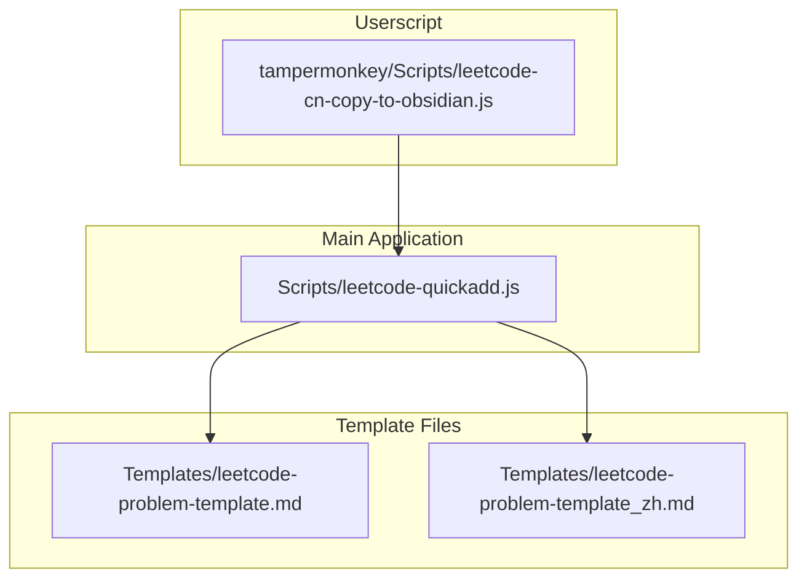
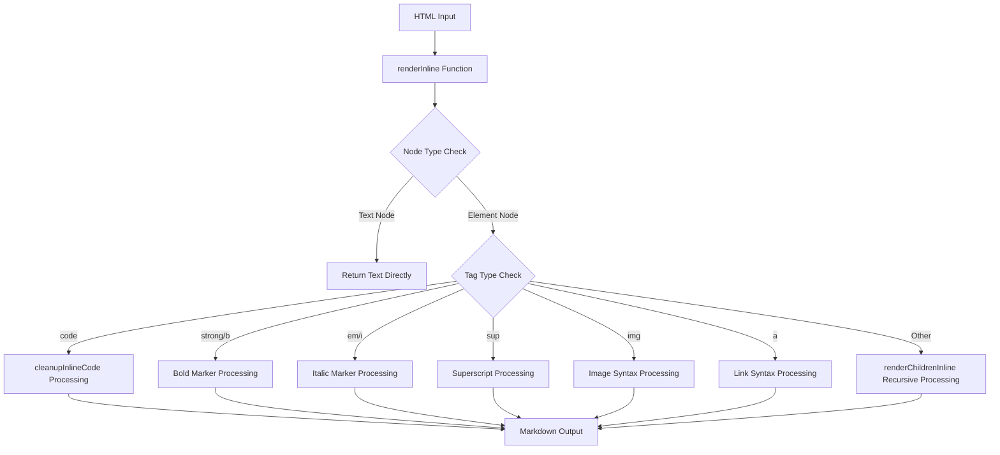
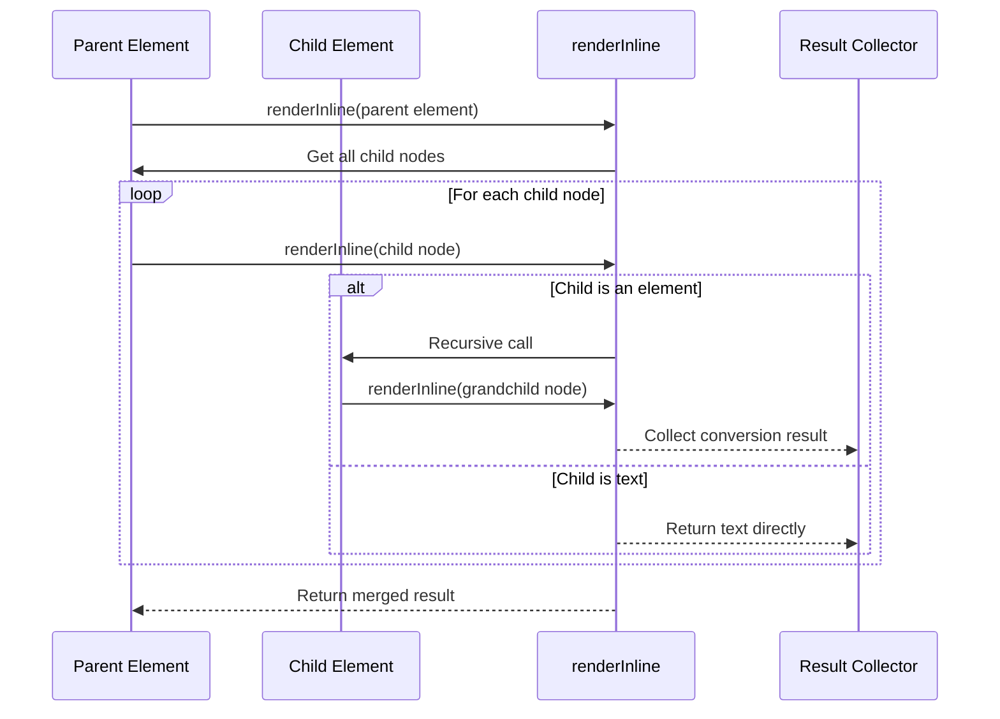
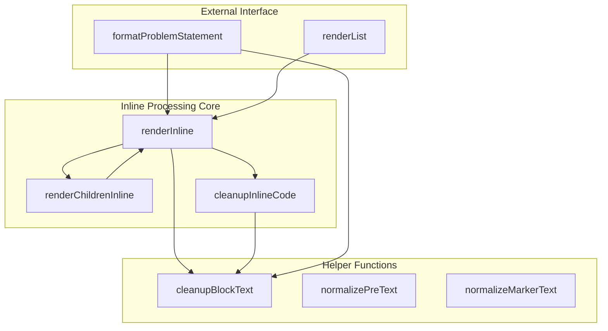

# Inline Element Handling

<cite>
**Files referenced in this document**
- [leetcode-quickadd.js](file://Scripts/leetcode-quickadd.js)
- [leetcode-cn-copy-to-obsidian.js](file://tampermonkey/Scripts/leetcode-cn-copy-to-obsidian.js)
</cite>

## Table of Contents
1. [Introduction](#introduction)
2. [Project Structure](#project-structure)
3. [Core Components](#core-components)
4. [Architecture Overview](#architecture-overview)
5. [Detailed Component Analysis](#detailed-component-analysis)
6. [Dependency Analysis](#dependency-analysis)
7. [Performance Considerations](#performance-considerations)
8. [Troubleshooting Guide](#troubleshooting-guide)
9. [Conclusion](#conclusion)

## Introduction

This document provides an in-depth analysis of the inline element handling functionality in the LeetCode-to-Obsidian system, with a focus on the `renderInline` function's inline element processing mechanism. The system is responsible for converting HTML content into Markdown format, with particular attention to the recursive processing logic for text nodes and element nodes, as well as the conversion rules from various HTML tags to Markdown.

The project contains two main scripts: a primary script for Obsidian QuickAdd, and a Tampermonkey userscript used to copy code from the LeetCode website to the clipboard. Both implement similar inline element handling logic.

## Project Structure

The project adopts a modular design with the following key components:



**Diagram Sources**
- [leetcode-quickadd.js:1-868](file://Scripts/leetcode-quickadd.js#L1-L868)
- [leetcode-cn-copy-to-obsidian.js:1-536](file://tampermonkey/Scripts/leetcode-cn-copy-to-obsidian.js#L1-L536)

**Section Sources**
- [leetcode-quickadd.js:1-868](file://Scripts/leetcode-quickadd.js#L1-L868)
- [leetcode-cn-copy-to-obsidian.js:1-536](file://tampermonkey/Scripts/leetcode-cn-copy-to-obsidian.js#L1-L536)

## Core Components

### Inline Element Processing System

The core of the inline element processing system is the `renderInline` function, which is responsible for converting individual HTML nodes into Markdown format. The system has the following characteristics:

- **Recursive processing**: Capable of handling nested HTML elements
- **Type safety**: Distinguishes between text nodes and element nodes
- **Tag-specific handling**: Implements specific Markdown conversion rules for different HTML tags
- **Cleanup functionality**: Provides text cleanup and formatting capabilities

**Section Sources**
- [leetcode-quickadd.js:576-628](file://Scripts/leetcode-quickadd.js#L576-L628)
- [leetcode-quickadd.js:767-773](file://Scripts/leetcode-quickadd.js#L767-L773)

## Architecture Overview

The inline element processing system adopts a layered architecture design:



**Diagram Sources**
- [leetcode-quickadd.js:576-628](file://Scripts/leetcode-quickadd.js#L576-L628)
- [leetcode-quickadd.js:630-632](file://Scripts/leetcode-quickadd.js#L630-L632)
- [leetcode-quickadd.js:767-773](file://Scripts/leetcode-quickadd.js#L767-L773)

## Detailed Component Analysis

### renderInline Function Deep Dive

The `renderInline` function is the core of the entire inline element processing system, responsible for converting a single HTML node into Markdown format.

#### Function Signature and Basic Logic

```mermaid
flowchart TD
A[renderInline(node)] --> B{Does node exist?}
B --> |No| C[Return empty string]
B --> |Yes| D{Node type check}
D --> |Text Node (3)| E[Return textContent]
D --> |Element Node (1)| F{Tag type check}
D --> |Other| G[Return empty string]
F --> |br| H[Return line break]
F --> |code| I[cleanupInlineCode processing]
F --> |strong/b| J[Bold marker]
F --> |em/i| K[Italic marker]
F --> |sup| L[Superscript processing]
F --> |img| M[Image syntax]
F --> |a| N[Link syntax]
F --> |Other| O[renderChildrenInline recursion]
```

**Diagram Sources**
- [leetcode-quickadd.js:576-628](file://Scripts/leetcode-quickadd.js#L576-L628)

#### Text Node Processing

Text nodes are the simplest processing target — they directly return the `textContent` property value. This design ensures the integrity of plain text content is preserved.

#### Element Node Processing

Element node processing follows a strict tag type checking order:

1. **Line break handling** (`<br>`): Converted to a newline character
2. **Code handling** (`<code>`): Processed using a dedicated cleanup function
3. **Bold handling** (`<strong>`, `<b>`): Bold markers are added
4. **Italic handling** (`<em>`, `<i>`): Italic markers are added
5. **Superscript handling** (`<sup>`): Superscript symbols are added
6. **Image handling** (``): Converted to Markdown image syntax
7. **Link handling** (`<a>`): Converted to Markdown link syntax
8. **Other elements**: Child nodes are processed recursively

**Section Sources**
- [leetcode-quickadd.js:576-628](file://Scripts/leetcode-quickadd.js#L576-L628)

### renderChildrenInline Function Analysis

The `renderChildrenInline` function is responsible for processing all child nodes of an element and recursively converting them into Markdown format.

#### Recursive Processing Mechanism



**Diagram Sources**
- [leetcode-quickadd.js:630-632](file://Scripts/leetcode-quickadd.js#L630-L632)

#### Processing Flow

1. **Child node traversal**: Uses `Array.from(node.childNodes)` to retrieve all child nodes
2. **Recursive conversion**: Calls the `renderInline` function for each child node
3. **Result merging**: Uses `join("")` to concatenate all conversion results into a single string

**Section Sources**
- [leetcode-quickadd.js:630-632](file://Scripts/leetcode-quickadd.js#L630-L632)

### cleanupInlineCode Function Deep Analysis

The `cleanupInlineCode` function is dedicated to the text cleanup logic inside `<code>` tags.

#### Cleanup Rules

```mermaid
flowchart TD
A[cleanupInlineCode(text)] --> B[Remove carriage returns]
B --> C[Replace non-breaking spaces with spaces]
C --> D[Escape backticks]
D --> E[Trim leading/trailing whitespace]
D --> F{Detect backtick characters}
F --> |Present| G[Add backslash before each backtick]
F --> |Absent| H[Return directly]
G --> H
```

**Diagram Sources**
- [leetcode-quickadd.js:767-773](file://Scripts/leetcode-quickadd.js#L767-L773)

#### Special Character Handling

| Character | Handling | Reason |
|-----------|----------|--------|
| Carriage return | Remove | Prevent interference with Markdown rendering |
| Non-breaking space | Replace with space | Normalize whitespace characters |
| Backtick | Escape as backslash + backtick | Prevent breaking code block syntax |
| Leading/trailing whitespace | Trim | Keep code clean |

**Section Sources**
- [leetcode-quickadd.js:767-773](file://Scripts/leetcode-quickadd.js#L767-L773)

### HTML Tag to Markdown Conversion Rules

#### Code Tag Handling

- **Target tag**: `<code>`
- **Conversion rule**: Wrap with backticks; escape special characters internally
- **Implementation detail**: Calls the `cleanupInlineCode` function for preprocessing

#### Bold Tag Handling

- **Target tags**: `<strong>`, `<b>`
- **Conversion rule**: Wrap with double asterisks
- **Processing logic**: Recursively process child nodes first, then uniformly add bold markers

#### Italic Tag Handling

- **Target tags**: `<em>`, `<i>`
- **Conversion rule**: Wrap with single asterisks
- **Processing logic**: Similar to bold handling, but using different markers

#### Superscript Tag Handling

- **Target tag**: `<sup>`
- **Conversion rule**: Wrap with caret symbols
- **Processing logic**: Uses `textContent` directly with leading/trailing whitespace trimmed

#### Image Tag Handling

- **Target tag**: ``
- **Conversion rule**: Use Markdown image syntax
- **Implementation detail**: Extracts the image URL from the `src` attribute

#### Link Tag Handling

- **Target tag**: `<a>`
- **Conversion rule**: Use Markdown link syntax
- **Implementation detail**: Handles both link text and URL simultaneously

**Section Sources**
- [leetcode-quickadd.js:593-625](file://Scripts/leetcode-quickadd.js#L593-L625)

## Dependency Analysis

The dependencies between the inline element processing system and other components are as follows:



**Diagram Sources**
- [leetcode-quickadd.js:576-628](file://Scripts/leetcode-quickadd.js#L576-L628)
- [leetcode-quickadd.js:630-632](file://Scripts/leetcode-quickadd.js#L630-L632)
- [leetcode-quickadd.js:767-773](file://Scripts/leetcode-quickadd.js#L767-L773)

**Section Sources**
- [leetcode-quickadd.js:576-628](file://Scripts/leetcode-quickadd.js#L576-L628)
- [leetcode-quickadd.js:630-632](file://Scripts/leetcode-quickadd.js#L630-L632)
- [leetcode-quickadd.js:767-773](file://Scripts/leetcode-quickadd.js#L767-L773)

## Performance Considerations

The inline element processing system was designed with the following performance factors in mind:

### Time Complexity Analysis

- **Single element processing**: O(n), where n is the text length of the element
- **Recursive processing**: O(N), where N is the total number of characters in the entire DOM tree
- **Space complexity**: O(N), used for storing conversion results

### Optimization Strategies

1. **Early return**: Return immediately for empty nodes to avoid unnecessary processing
2. **Type check optimization**: Use `nodeType` to quickly distinguish node types
3. **String operation optimization**: Use efficient string replacement and concatenation operations
4. **Memory management**: Release intermediate results promptly to avoid memory leaks

### Edge Case Handling

The system correctly handles the following edge cases:

- **Empty nodes**: Return empty string
- **No text content**: Skip processing
- **Nested tags**: Handled correctly through recursion
- **Special characters**: Handled through cleanup functions

## Troubleshooting Guide

### Common Issues and Solutions

#### Issue 1: Code Tags Not Converting Correctly

**Symptom**: Text inside `<code>` tags displays abnormally

**Cause**: Backtick characters are not properly escaped

**Solution**: Check the escaping logic in the `cleanupInlineCode` function

#### Issue 2: Nested Tag Processing Errors

**Symptom**: Markdown output for complex nested structures does not match expectations

**Cause**: Incorrect recursive processing order or improper boundary condition handling

**Solution**: Verify the processing logic of the `renderChildrenInline` function

#### Issue 3: Special Character Display Problems

**Symptom**: Certain special characters display abnormally in Markdown

**Cause**: Whitespace characters or invisible characters are not handled correctly

**Solution**: Check the character replacement logic in the cleanup functions

**Section Sources**
- [leetcode-quickadd.js:767-773](file://Scripts/leetcode-quickadd.js#L767-L773)

## Conclusion

The inline element processing system is a carefully designed text conversion engine with the following characteristics:

1. **Modular design**: Clear separation of concerns for easy maintenance and extension
2. **Type safety**: Strict node type checking to avoid runtime errors
3. **Recursive processing**: Elegantly handles arbitrarily complex nested structures
4. **Special character handling**: A comprehensive cleanup mechanism to ensure Markdown compatibility
5. **Performance optimization**: Rational algorithm selection and boundary condition handling

This system successfully converts HTML content into high-quality Markdown format, providing a solid foundation for creating Obsidian notes from LeetCode problem content. By deeply understanding these inline element handling mechanisms, developers can better extend and customize conversion rules to meet specific usage requirements.
