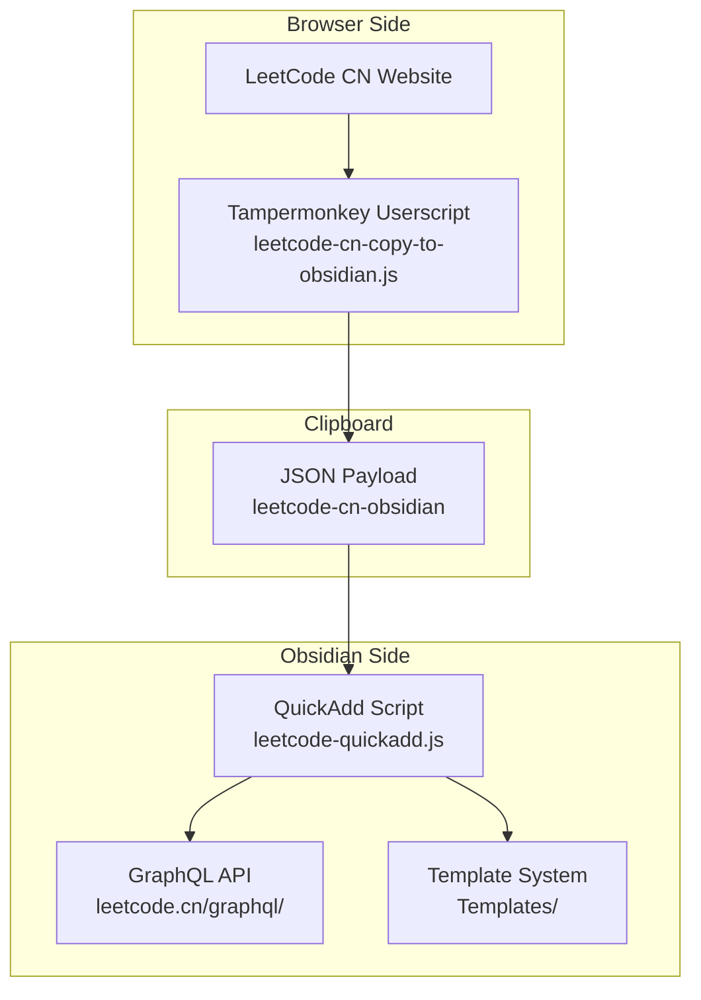
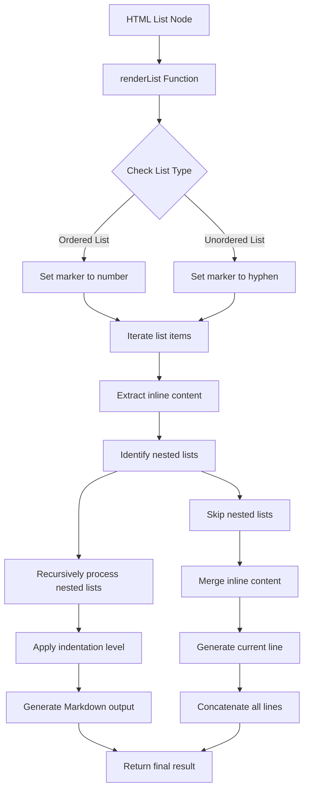
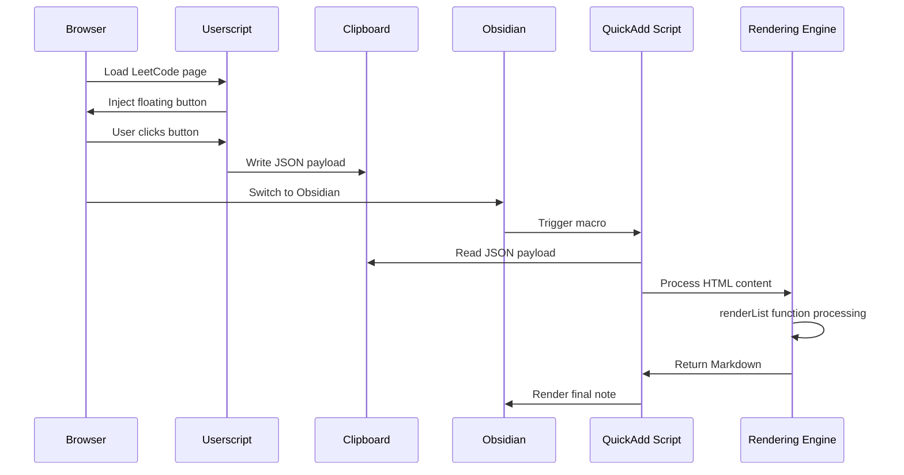
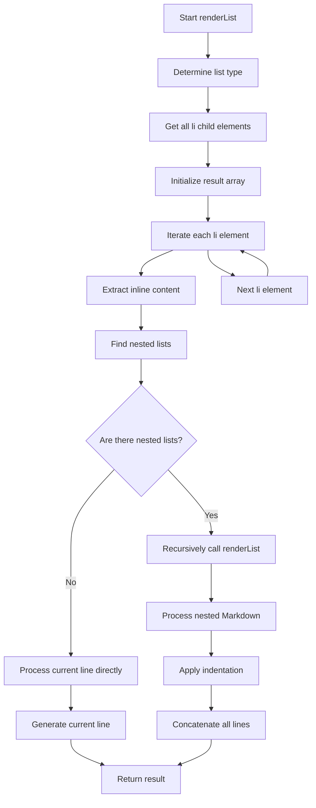
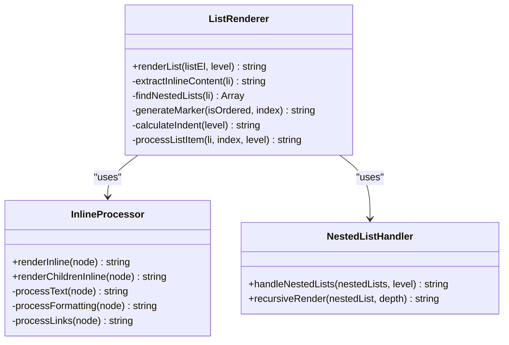
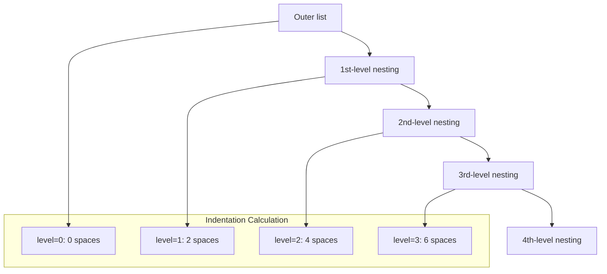
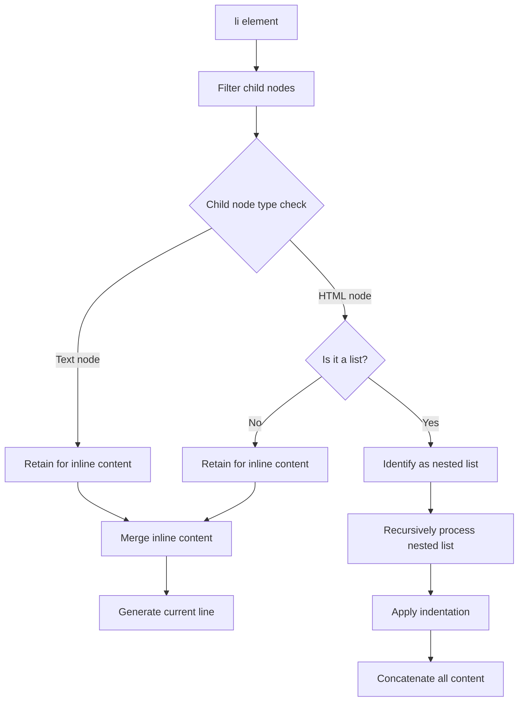
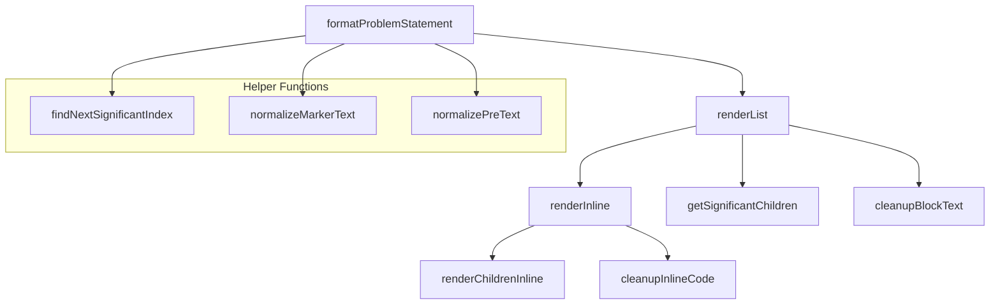

# List Rendering Engine

<cite>
**Files referenced in this document**
- [Scripts/leetcode-quickadd.js](file://Scripts/leetcode-quickadd.js)
- [README.md](file://README.md)
</cite>

## Table of Contents
1. [Introduction](#introduction)
2. [Project Structure](#project-structure)
3. [Core Components](#core-components)
4. [Architecture Overview](#architecture-overview)
5. [Detailed Component Analysis](#detailed-component-analysis)
6. [Dependency Analysis](#dependency-analysis)
7. [Performance Considerations](#performance-considerations)
8. [Troubleshooting Guide](#troubleshooting-guide)
9. [Conclusion](#conclusion)

## Introduction

This document provides an in-depth analysis of the list rendering engine in the LeetCode-to-Obsidian conversion tool, with a focus on explaining the recursive list rendering mechanism of the `renderList` function. This engine is responsible for converting HTML-formatted problem descriptions into Obsidian-native Markdown format, with particular attention to the processing logic for ordered lists (ol) and unordered lists (ul).

The system captures code and problem information from the LeetCode CN website via a Tampermonkey userscript, then processes and renders it through an Obsidian QuickAdd script. List rendering is a critical step in the entire conversion process because it directly affects the readability and structural integrity of the final note.

## Project Structure

The project adopts a modular design with three main components:

**Diagram Sources**
- [README.md:27-41](file://README.md#L27-L41)
- [Scripts/leetcode-quickadd.js:1-104](file://Scripts/leetcode-quickadd.js#L1-L104)

**Section Sources**
- [README.md:122-133](file://README.md#L122-L133)

## Core Components

### List Rendering Engine Overview

The core functionality of the list rendering engine is implemented by the `renderList` function, which specifically handles ordered and unordered lists in HTML and converts them into Obsidian-compatible Markdown format. The engine has the following key characteristics:

- **Recursive processing**: Capable of handling nested lists of arbitrary depth
- **Type differentiation**: Correctly identifies and handles ordered lists (ol) and unordered lists (ul)
- **Indentation management**: Dynamically calculates indentation based on nesting level
- **Marker selection**: Generates numeric markers for ordered lists and hyphen markers for unordered lists

### Data Flow Processing

**Diagram Sources**
- [Scripts/leetcode-quickadd.js:634-667](file://Scripts/leetcode-quickadd.js#L634-L667)

**Section Sources**
- [Scripts/leetcode-quickadd.js:634-667](file://Scripts/leetcode-quickadd.js#L634-L667)

## Architecture Overview

### Overall Rendering Flow

**Diagram Sources**
- [README.md:27-41](file://README.md#L27-L41)
- [Scripts/leetcode-quickadd.js:83-104](file://Scripts/leetcode-quickadd.js#L83-L104)

### List Rendering Core Algorithm

**Diagram Sources**
- [Scripts/leetcode-quickadd.js:634-667](file://Scripts/leetcode-quickadd.js#L634-L667)

## Detailed Component Analysis

### renderList Function Deep Dive

#### Function Signature and Parameters

The `renderList` function accepts two parameters:
- `listEl`: HTML list element (ol or ul)
- `level`: Current nesting level, defaulting to 0

#### Core Processing Logic

**Diagram Sources**
- [Scripts/leetcode-quickadd.js:634-667](file://Scripts/leetcode-quickadd.js#L634-L667)
- [Scripts/leetcode-quickadd.js:576-628](file://Scripts/leetcode-quickadd.js#L576-L628)

#### Ordered List Processing Mechanism

For ordered lists (ol), the `renderList` function uses numbers as markers:
- The first list item marker is "1."
- The second list item marker is "2."
- And so on...

This design preserves the importance of the original order, allowing readers to clearly understand the sequence of steps.

#### Unordered List Processing Mechanism

For unordered lists (ul), the `renderList` function uses hyphens as markers:
- All list items use "-"
- This uniform marker is suitable for bullet point lists and item lists

#### Nested List Recursive Processing

The processing of nested lists is one of the core features of the `renderList` function:

**Diagram Sources**
- [Scripts/leetcode-quickadd.js:634-667](file://Scripts/leetcode-quickadd.js#L634-L667)

#### Indentation Calculation Algorithm

Indentation calculation follows a simple linear rule:
- Each additional level of nesting adds 2 spaces of indentation
- The `level` parameter determines the indentation amount for the current level
- The indentation string is generated via `"  ".repeat(level)`

#### List Item Filtering and Processing

The `renderList` function performs precise filtering and processing of list items:

**Diagram Sources**
- [Scripts/leetcode-quickadd.js:634-667](file://Scripts/leetcode-quickadd.js#L634-L667)

**Section Sources**
- [Scripts/leetcode-quickadd.js:634-667](file://Scripts/leetcode-quickadd.js#L634-L667)

### Inline Content Extraction Mechanism

Inline content extraction is an important step in the list rendering process, ensuring that text content within list items is correctly preserved:

#### Text Node Processing

Text nodes are directly extracted and cleaned, removing excess whitespace characters and special characters.

#### HTML Node Processing

HTML nodes are handled differently depending on their type:
- **Code tags**: Converted to inline code wrapped in backticks
- **Emphasis tags**: Converted to Markdown emphasis format
- **Link tags**: Converted to Markdown link format
- **Line break tags**: Converted to newline characters

#### Nested List Identification

Nested lists are identified by checking the tag names of child nodes:
- Only "ul" and "ol" tags are recognized
- Other HTML elements are ignored
- Preparation is made for subsequent recursive processing

**Section Sources**
- [Scripts/leetcode-quickadd.js:576-628](file://Scripts/leetcode-quickadd.js#L576-L628)
- [Scripts/leetcode-quickadd.js:649-655](file://Scripts/leetcode-quickadd.js#L649-L655)

### Output Format Specification

#### Marker Format

The marker format for list items strictly follows Markdown specifications:
- **Ordered list**: Number followed by a period, e.g., "1.", "2.", "3."
- **Unordered list**: Hyphen followed by a space, e.g., "- "
- A space always follows the marker

#### Indentation Levels

The calculation of indentation levels ensures visual hierarchy for nested lists:
- Each level of nesting adds 2 spaces
- The indentation string is implemented by repeating spaces
- Good readability is maintained

#### Nested Markdown Concatenation

The Markdown content of nested lists is joined with newline characters:
- Each nested list occupies its own line
- Aligned with the parent list item at the same indentation level
- A clear hierarchical structure is maintained

**Section Sources**
- [Scripts/leetcode-quickadd.js:642-666](file://Scripts/leetcode-quickadd.js#L642-L666)

## Dependency Analysis

### Inter-Component Dependencies

**Diagram Sources**
- [Scripts/leetcode-quickadd.js:436-546](file://Scripts/leetcode-quickadd.js#L436-L546)
- [Scripts/leetcode-quickadd.js:634-667](file://Scripts/leetcode-quickadd.js#L634-L667)

### External Dependencies

This system primarily depends on the browser's DOM API and Obsidian's Markdown rendering capabilities:

- **DOM API**: Used for parsing and manipulating HTML content
- **Browser Clipboard API**: Used for data transfer
- **Obsidian Markdown rendering**: Used for final display effects

**Section Sources**
- [Scripts/leetcode-quickadd.js:238-271](file://Scripts/leetcode-quickadd.js#L238-L271)

## Performance Considerations

### Time Complexity Analysis

The time complexity of the `renderList` function is O(n), where n is the total number of all nodes in the list. This is because:
- Each node is visited only once
- The depth of recursive calls equals the maximum nesting level
- Each recursive call is linear

### Space Complexity Analysis

Space complexity is primarily determined by the recursive call stack:
- In the worst case it is O(d), where d is the maximum nesting depth
- Each level of recursion requires a constant amount of additional space
- The storage space for result strings is proportional to the output size

### Optimization Strategies

1. **Early termination**: Return immediately for empty lists
2. **Caching mechanism**: Cache results of repeated processing
3. **Batch processing**: Batch-process large numbers of list items
4. **Memory management**: Release intermediate results no longer in use in a timely manner

## Troubleshooting Guide

### Common Issues and Solutions

#### List Rendering Anomalies

**Problem**: List item content is lost or incorrectly formatted
**Cause**: HTML structure does not match expectations
**Solution**:
- Check the validity of the HTML structure
- Ensure each list item has appropriate text content
- Verify the correctness of nested lists

#### Incorrect Nesting Levels

**Problem**: Incorrect indentation for nested lists
**Cause**: The `level` parameter is passed incorrectly
**Solution**:
- Ensure the `level` parameter is correctly incremented in recursive calls
- Check the identification logic for nested lists
- Verify the accuracy of indentation calculations

#### Incorrect Markers

**Problem**: Ordered list uses hyphen markers
**Cause**: List type identification error
**Solution**:
- Check the `tagName` attribute of list elements
- Ensure consistency of case conversion
- Verify the list type determination logic

**Section Sources**
- [Scripts/leetcode-quickadd.js:634-667](file://Scripts/leetcode-quickadd.js#L634-L667)

## Conclusion

The list rendering engine implements efficient HTML-to-Markdown conversion through the `renderList` function, with special optimization for ordered and unordered lists. The main advantages of this engine include:

1. **Recursive processing capability**: Capable of handling nested lists of arbitrary depth
2. **Type differentiation**: Correctly identifies and handles different types of lists
3. **Indentation management**: Precisely controls indentation levels through the `level` parameter
4. **Format consistency**: Generates Markdown format compliant with Obsidian standards

This system provides a solid foundation for the LeetCode-to-Obsidian conversion, ensuring accurate rendering of complex list structures and a good user experience. Through rational architectural design and performance optimization, this engine can provide efficient processing while maintaining high accuracy.
