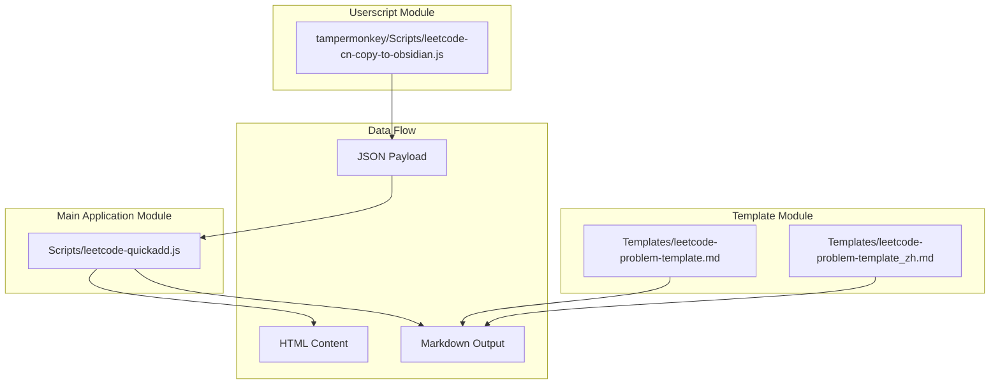
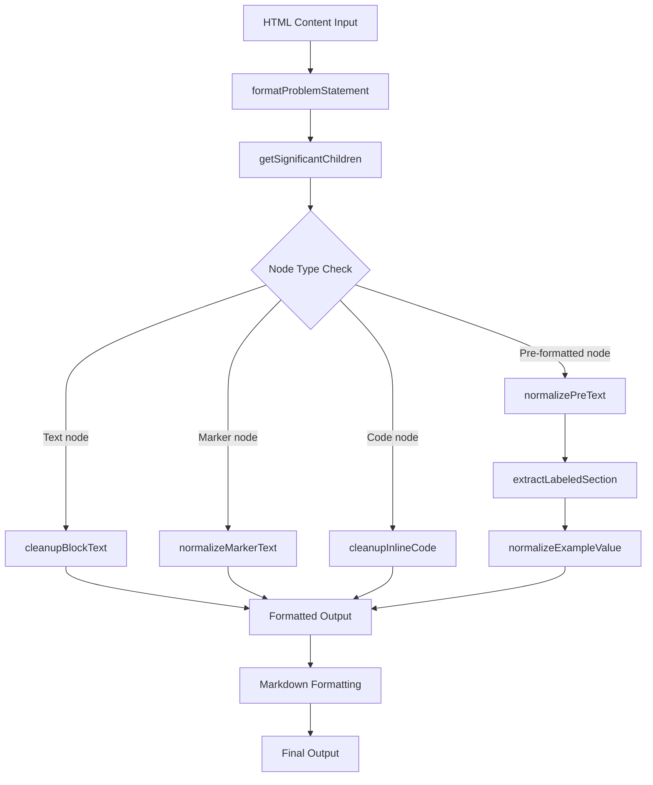
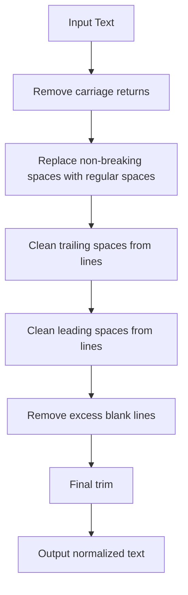
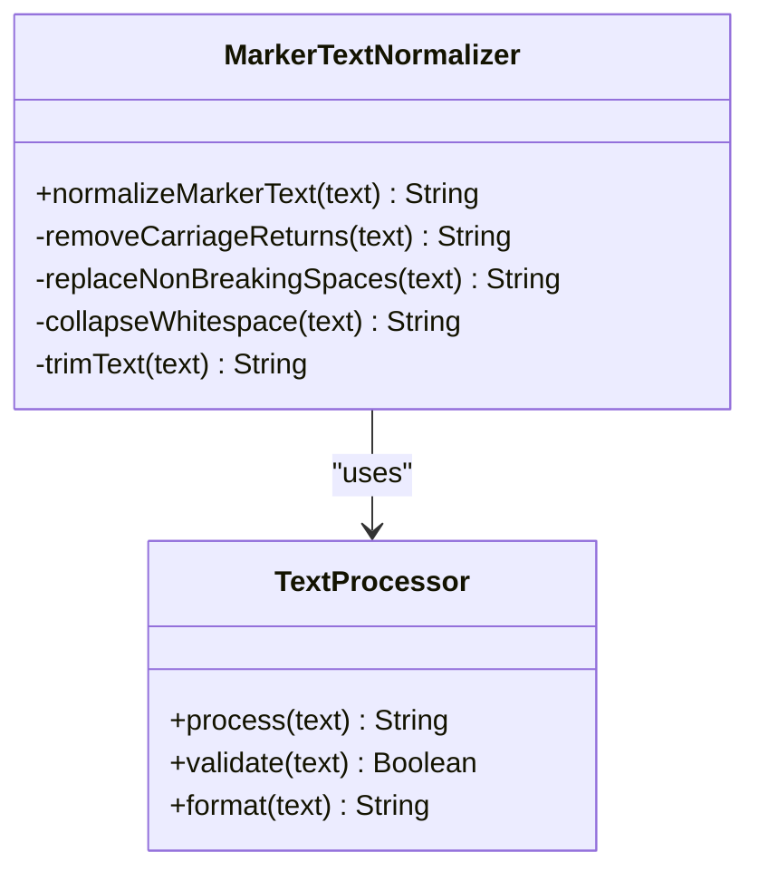
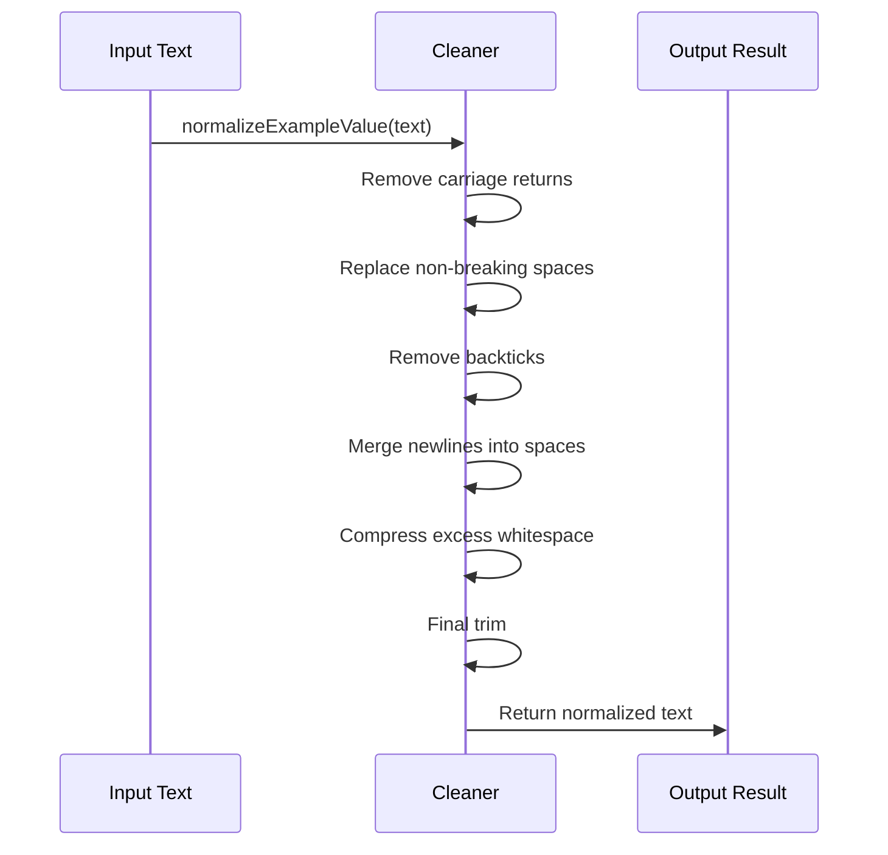
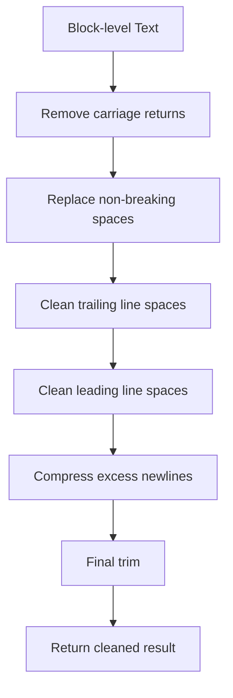
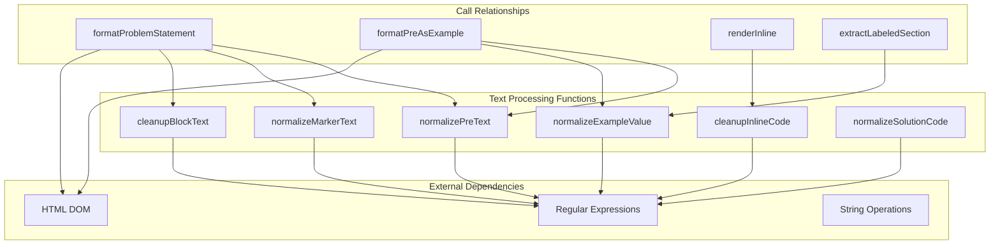

# Text Normalization

<cite>
**Files referenced in this document**
- [Scripts/leetcode-quickadd.js](file://Scripts/leetcode-quickadd.js)
- [tampermonkey/Scripts/leetcode-cn-copy-to-obsidian.js](file://tampermonkey/Scripts/leetcode-cn-copy-to-obsidian.js)
- [Templates/leetcode-problem-template.md](file://Templates/leetcode-problem-template.md)
- [Templates/leetcode-problem-template_zh.md](file://Templates/leetcode-problem-template_zh.md)
</cite>

## Table of Contents
1. [Introduction](#introduction)
2. [Project Structure](#project-structure)
3. [Core Components](#core-components)
4. [Architecture Overview](#architecture-overview)
5. [Detailed Component Analysis](#detailed-component-analysis)
6. [Dependency Analysis](#dependency-analysis)
7. [Performance Considerations](#performance-considerations)
8. [Troubleshooting Guide](#troubleshooting-guide)
9. [Conclusion](#conclusion)

## Introduction

This document provides an in-depth analysis of the text normalization processing functionality in the LeetCode-to-Obsidian note system. Through a series of carefully designed text processing functions, the system converts HTML content scraped from the LeetCode website into high-quality Markdown format, ensuring the best display results in Obsidian.

The core features of the system include:
- Pre-formatted text processing (`normalizePreText`)
- Marker text standardization (`normalizeMarkerText`)
- Example value cleanup (`normalizeExampleValue`)
- Special character handling (carriage returns, non-breaking spaces, tabs)
- Code cleanup (`cleanupInlineCode`, `cleanupBlockText`)

## Project Structure

The project adopts a modular architecture, primarily containing the following components:



**Diagram Sources**
- [Scripts/leetcode-quickadd.js:1-868](file://Scripts/leetcode-quickadd.js#L1-L868)
- [tampermonkey/Scripts/leetcode-cn-copy-to-obsidian.js:1-536](file://tampermonkey/Scripts/leetcode-cn-copy-to-obsidian.js#L1-L536)

**Section Sources**
- [Scripts/leetcode-quickadd.js:1-868](file://Scripts/leetcode-quickadd.js#L1-L868)
- [tampermonkey/Scripts/leetcode-cn-copy-to-obsidian.js:1-536](file://tampermonkey/Scripts/leetcode-cn-copy-to-obsidian.js#L1-L536)

## Core Components

### Text Normalization Function Family

The system implements four core text normalization functions, each with a specific processing target:

1. **normalizePreText**: Pre-formatted text processing
2. **normalizeMarkerText**: Marker text standardization
3. **normalizeExampleValue**: Example value cleanup
4. **normalizeSolutionCode**: Solution code normalization

### Special Character Handling Mechanism

The system specifically handles the following special characters:
- Carriage return (`\r`) replaced with empty string
- Non-breaking space (`\u00a0`) replaced with a regular space
- Cleanup of tabs and excess spaces
- Handling of backtick characters

**Section Sources**
- [Scripts/leetcode-quickadd.js:740-783](file://Scripts/leetcode-quickadd.js#L740-L783)

## Architecture Overview



**Diagram Sources**
- [Scripts/leetcode-quickadd.js:436-546](file://Scripts/leetcode-quickadd.js#L436-L546)
- [Scripts/leetcode-quickadd.js:669-699](file://Scripts/leetcode-quickadd.js#L669-L699)

## Detailed Component Analysis

### normalizePreText Function Analysis

The `normalizePreText` function is dedicated to processing pre-formatted text content, ensuring the correct format for code blocks and example text.



**Diagram Sources**
- [Scripts/leetcode-quickadd.js:740-747](file://Scripts/leetcode-quickadd.js#L740-L747)

**Processing Logic Details**:
1. **Carriage return handling**: Uses global replacement to remove all `\r` characters
2. **Non-breaking space handling**: Replaces `\u00a0` with standard space characters
3. **Inline space cleanup**: Removes excess spaces and tabs at the end of lines
4. **Leading space cleanup**: Cleans excess whitespace at the beginning of lines
5. **Blank line optimization**: Compresses multiple consecutive newlines into double newlines

**Section Sources**
- [Scripts/leetcode-quickadd.js:740-747](file://Scripts/leetcode-quickadd.js#L740-L747)

### normalizeMarkerText Function Analysis

The `normalizeMarkerText` function is used to standardize marker text, especially for processing headings and label text.



**Diagram Sources**
- [Scripts/leetcode-quickadd.js:749-755](file://Scripts/leetcode-quickadd.js#L749-L755)

**Processing Characteristics**:
- Maintains a single space between words
- Removes excess whitespace characters
- Unifies text format

**Section Sources**
- [Scripts/leetcode-quickadd.js:749-755](file://Scripts/leetcode-quickadd.js#L749-L755)

### normalizeExampleValue Function Analysis

The `normalizeExampleValue` function is dedicated to cleaning up example values, ensuring the correct format for example data.



**Diagram Sources**
- [Scripts/leetcode-quickadd.js:757-765](file://Scripts/leetcode-quickadd.js#L757-L765)

**Processing Flow**:
1. **Character cleanup**: Remove all newlines and backticks
2. **Space unification**: Replace newlines with spaces
3. **Whitespace compression**: Compress multiple consecutive whitespace characters into a single space
4. **Final formatting**: Trim leading/trailing whitespace

**Section Sources**
- [Scripts/leetcode-quickadd.js:757-765](file://Scripts/leetcode-quickadd.js#L757-L765)

### cleanupInlineCode Function Analysis

The `cleanupInlineCode` function handles cleanup of inline code.


**Diagram Sources**
- [Scripts/leetcode-quickadd.js:767-773](file://Scripts/leetcode-quickadd.js#L767-L773)

**Special Handling**:
- Backtick characters are escaped to avoid breaking Markdown code formatting
- Code readability is maintained while ensuring correct Markdown syntax

**Section Sources**
- [Scripts/leetcode-quickadd.js:767-773](file://Scripts/leetcode-quickadd.js#L767-L773)

### cleanupBlockText Function Analysis

The `cleanupBlockText` function handles cleanup of block-level text; it is the most complex text cleanup function.



**Diagram Sources**
- [Scripts/leetcode-quickadd.js:775-783](file://Scripts/leetcode-quickadd.js#L775-L783)

**Processing Strategy**:
- Maintains paragraph structure while cleaning up formatting issues
- Keeps appropriate whitespace spacing
- Ensures correct separation between text blocks

**Section Sources**
- [Scripts/leetcode-quickadd.js:775-783](file://Scripts/leetcode-quickadd.js#L775-L783)

### normalizeSolutionCode Function Analysis

The `normalizeSolutionCode` function handles normalization of solution code; it is the core function for code processing.

```mermaid
flowchart TD
A[Solution Code] --> B{Requires JSON parsing?}
B --> |Yes| C[Attempt JSON.parse]
B --> |No| D[Process directly]
C --> E[Success?]
E --> |Yes| F[Use parsed result]
E --> |No| G[Continue manual processing]
F --> H[Execute escape sequence replacement]
G --> H
H --> I[Replace \\r\\n with \\n]
I --> J[Replace \\n with newline]
J --> K[Replace \\t with tab]
K --> L[Replace \\" with "]
L --> M[Replace \\\\ with \\]
M --> N[Final trim]
N --> O[Return normalized code]
```

**Diagram Sources**
- [Scripts/leetcode-quickadd.js:836-868](file://Scripts/leetcode-quickadd.js#L836-L868)

**Intelligent Detection Mechanism**:
- Automatically detects strings that have been `JSON.stringify`-ed
- Handles various escape sequences
- Supports multiple encoding formats

**Section Sources**
- [Scripts/leetcode-quickadd.js:836-868](file://Scripts/leetcode-quickadd.js#L836-L868)

## Dependency Analysis



**Diagram Sources**
- [Scripts/leetcode-quickadd.js:436-546](file://Scripts/leetcode-quickadd.js#L436-L546)
- [Scripts/leetcode-quickadd.js:669-699](file://Scripts/leetcode-quickadd.js#L669-L699)

**Key Dependency Relationships**:
- `formatProblemStatement` depends on all text cleanup functions
- `formatPreAsExample` depends on `normalizePreText` and `normalizeExampleValue`
- `renderInline` depends on `cleanupInlineCode`
- `extractLabeledSection` depends on `normalizeExampleValue`

**Section Sources**
- [Scripts/leetcode-quickadd.js:436-546](file://Scripts/leetcode-quickadd.js#L436-L546)
- [Scripts/leetcode-quickadd.js:669-699](file://Scripts/leetcode-quickadd.js#L669-L699)

## Performance Considerations

### Regular Expression Optimization

The system uses efficient regular expression patterns:

1. **Global replacement mode**: Uses the `/g` flag to ensure all matches are processed in one pass
2. **Character class optimization**: Uses `[...]` character classes to reduce matching complexity
3. **Zero-width assertions**: Uses zero-width assertions when necessary to avoid the overhead of capture groups

### Memory Usage Optimization

- All functions adopt a chained call pattern to reduce the creation of intermediate variables
- In-place string replacement is used to avoid creating large numbers of temporary string objects
- Rational string trimming timing prevents unnecessary memory allocation

### Processing Order Optimization

Functions are processed in order from simple to complex, ensuring:
- Quick handling of common formatting issues
- Avoiding reprocessing already-cleaned text
- Minimizing the number of string operations

## Troubleshooting Guide

### Common Issues and Solutions

#### 1. Text Format Anomalies
**Symptom**: Unexpected whitespace characters or newlines appear in text
**Cause**: Special characters not handled correctly
**Solution**: Check the calls to `normalizePreText` and `cleanupBlockText`

#### 2. Code Display Errors
**Symptom**: Backticks in code blocks cause formatting errors
**Cause**: Inline code not properly escaped
**Solution**: Ensure `cleanupInlineCode` is executing correctly

#### 3. Example Data Format Problems
**Symptom**: Example input/output displays incorrectly
**Cause**: Improper handling by `normalizeExampleValue`
**Solution**: Verify the label matching in `extractLabeledSection`

#### 4. Performance Issues
**Symptom**: Slow response when processing large amounts of text
**Cause**: Regular expressions are too complex
**Solution**: Optimize regex patterns; consider using more efficient algorithms

**Section Sources**
- [Scripts/leetcode-quickadd.js:740-783](file://Scripts/leetcode-quickadd.js#L740-L783)
- [Scripts/leetcode-quickadd.js:836-868](file://Scripts/leetcode-quickadd.js#L836-L868)

## Conclusion

This text normalization processing system, through its carefully designed function family, effectively resolves various formatting issues that arise during the conversion from HTML to Markdown. The main advantages of the system include:

1. **Modular design**: Each function has a clear responsibility and a well-defined interface
2. **Efficient processing**: Uses optimized regular expressions and string operations
3. **Robustness**: Contains comprehensive error handling and boundary condition checks
4. **Maintainability**: Clear code structure and detailed commentary

Through these text normalization functions, the system can reliably handle various content formats from LeetCode, ensuring high-quality note content is generated in Obsidian. The system's design fully considers performance and extensibility, laying a solid foundation for future feature enhancements.
