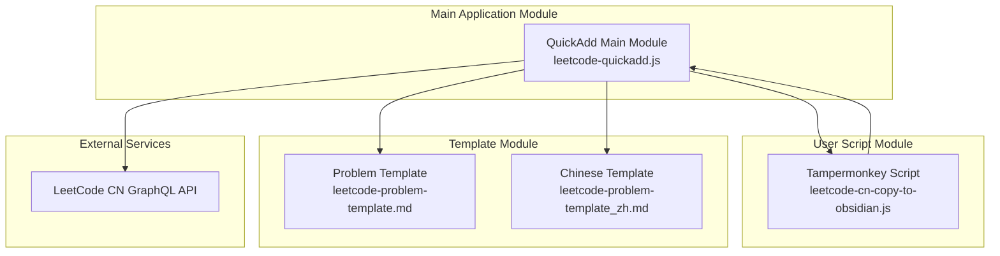
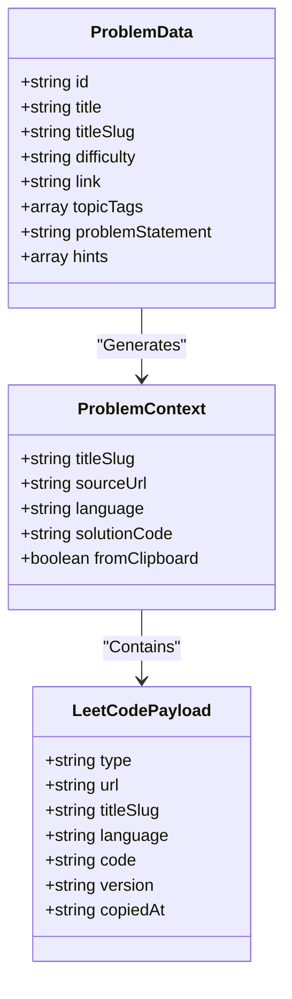
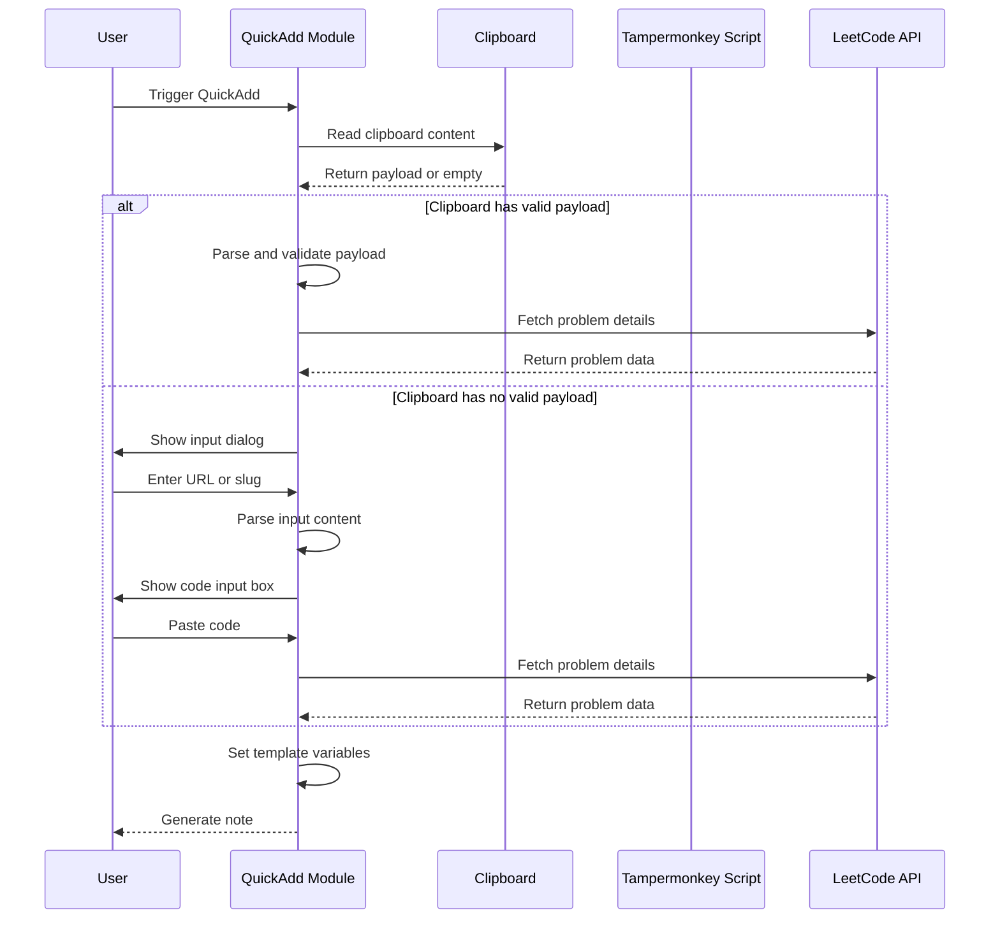
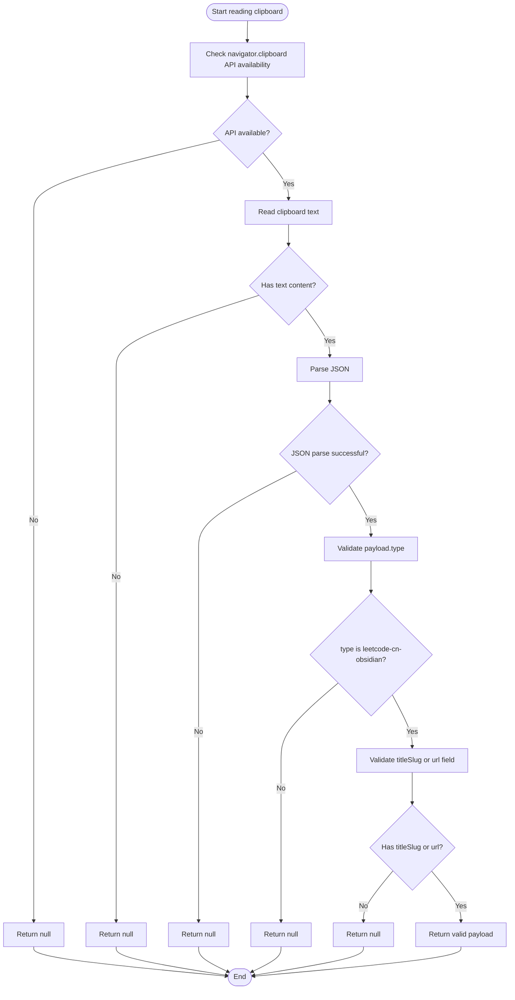
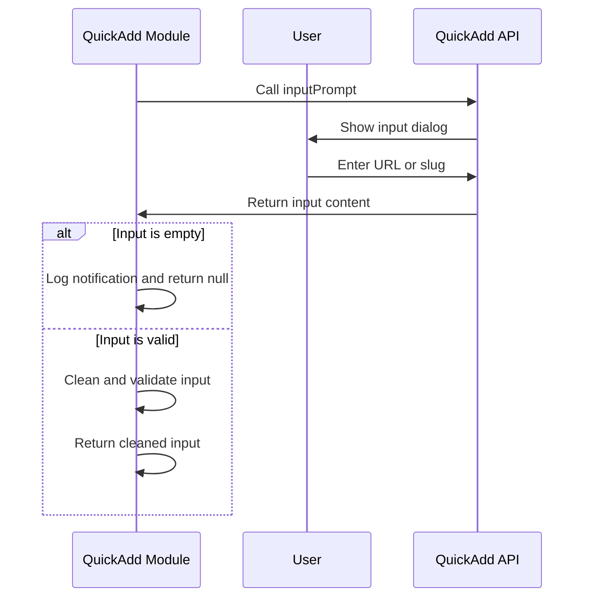
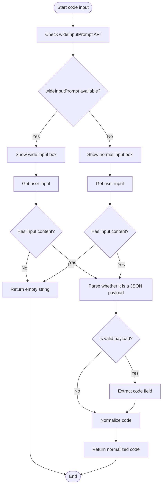
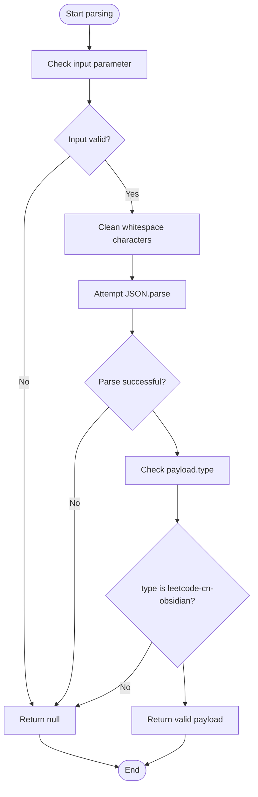
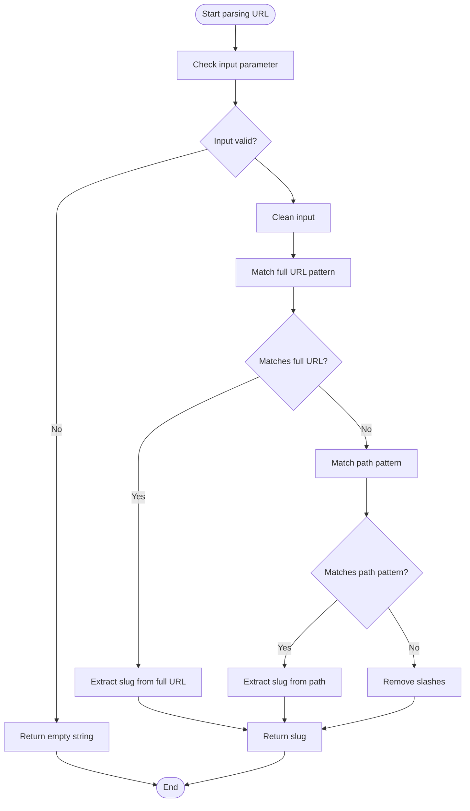
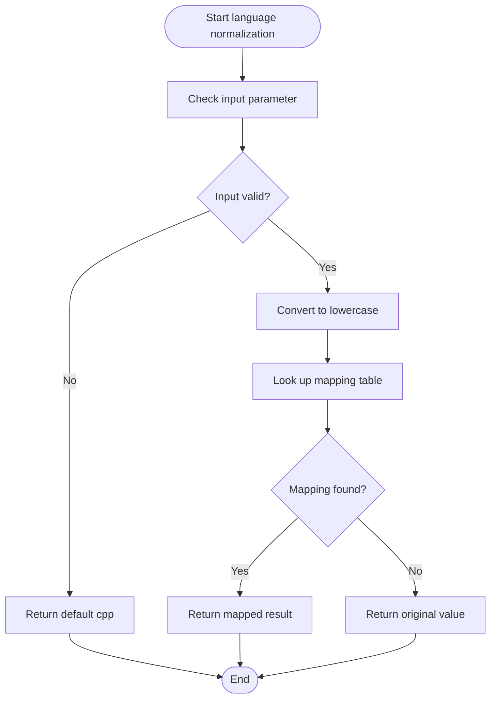
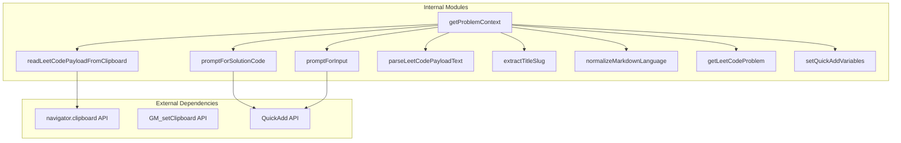

# Input Handling Mechanism

<cite>
**Referenced Files in This Document**
- [Scripts/leetcode-quickadd.js](file://Scripts/leetcode-quickadd.js)
- [tampermonkey/Scripts/leetcode-cn-copy-to-obsidian.js](file://tampermonkey/Scripts/leetcode-cn-copy-to-obsidian.js)
- [Templates/leetcode-problem-template.md](file://Templates/leetcode-problem-template.md)
- [Templates/leetcode-problem-template_zh.md](file://Templates/leetcode-problem-template_zh.md)
</cite>

## Table of Contents
1. [Introduction](#introduction)
2. [Project Structure](#project-structure)
3. [Core Components](#core-components)
4. [Architecture Overview](#architecture-overview)
5. [Detailed Component Analysis](#detailed-component-analysis)
6. [Dependency Analysis](#dependency-analysis)
7. [Performance Considerations](#performance-considerations)
8. [Troubleshooting Guide](#troubleshooting-guide)
9. [Conclusion](#conclusion)

## Introduction

This document provides a detailed explanation of the input handling mechanism for LeetCode-to-Obsidian, focusing on the implementation principles of three input methods: clipboard payload reading, manual URL/slug input, and manual code paste. The system uses the Tampermonkey script to automatically capture LeetCode problem information and code, which is then processed and rendered by the Obsidian QuickAdd plugin.

The core advantage of this system lies in its seamless multi-step input workflow, from automatic clipboard reading to a complete fallback mechanism for manual input, ensuring users can efficiently create LeetCode problem notes in various scenarios.

## Project Structure

The project adopts a modular design with the following components:

**Diagram Sources**
- [Scripts/leetcode-quickadd.js:1-868](file://Scripts/leetcode-quickadd.js#L1-L868)
- [tampermonkey/Scripts/leetcode-cn-copy-to-obsidian.js:1-536](file://tampermonkey/Scripts/leetcode-cn-copy-to-obsidian.js#L1-L536)

**Section Sources**
- [Scripts/leetcode-quickadd.js:1-868](file://Scripts/leetcode-quickadd.js#L1-L868)
- [tampermonkey/Scripts/leetcode-cn-copy-to-obsidian.js:1-536](file://tampermonkey/Scripts/leetcode-cn-copy-to-obsidian.js#L1-L536)

## Core Components

### Main Input Handling Workflow

The system implements a three-layer input handling mechanism, executed in priority order:

1. **Clipboard Priority Reading**: Automatically detects and parses the payload copied by Tampermonkey
2. **Manual URL Input**: User directly enters the LeetCode problem URL or slug
3. **Manual Code Paste**: User pastes code or a JSON-format payload

### Key Data Structures

**Diagram Sources**
- [Scripts/leetcode-quickadd.js:114-166](file://Scripts/leetcode-quickadd.js#L114-L166)
- [Scripts/leetcode-quickadd.js:339-404](file://Scripts/leetcode-quickadd.js#L339-L404)

**Section Sources**
- [Scripts/leetcode-quickadd.js:114-166](file://Scripts/leetcode-quickadd.js#L114-L166)
- [Scripts/leetcode-quickadd.js:339-404](file://Scripts/leetcode-quickadd.js#L339-L404)

## Architecture Overview

The system uses a layered architecture design, with each layer having clear responsibility assignments:

**Diagram Sources**
- [Scripts/leetcode-quickadd.js:83-104](file://Scripts/leetcode-quickadd.js#L83-L104)
- [Scripts/leetcode-quickadd.js:114-166](file://Scripts/leetcode-quickadd.js#L114-L166)

## Detailed Component Analysis

### Clipboard Payload Reading Mechanism

#### readLeetCodePayloadFromClipboard Function Workflow

This function implements the complete clipboard reading and validation workflow:

**Diagram Sources**
- [Scripts/leetcode-quickadd.js:238-271](file://Scripts/leetcode-quickadd.js#L238-L271)

**Section Sources**
- [Scripts/leetcode-quickadd.js:238-271](file://Scripts/leetcode-quickadd.js#L238-L271)

#### navigator.clipboard API Usage Strategy

The system adopts a progressively enhanced API usage strategy:

1. **API Availability Detection**: First check whether the `navigator.clipboard` object and `readText` method exist
2. **Graceful Degradation**: When the API is unavailable, log a warning and degrade gracefully
3. **Error Handling**: Wrap asynchronous operations with try-catch to ensure exceptions don't interrupt the entire workflow

### Manual Input Handling Mechanism

#### promptForInput Function User Interaction Logic

This function handles URL or slug input from the user:

**Diagram Sources**
- [Scripts/leetcode-quickadd.js:172-184](file://Scripts/leetcode-quickadd.js#L172-L184)

**Section Sources**
- [Scripts/leetcode-quickadd.js:172-184](file://Scripts/leetcode-quickadd.js#L172-L184)

#### promptForSolutionCode Function Code Input Logic

This function implements intelligent code input handling:

**Diagram Sources**
- [Scripts/leetcode-quickadd.js:186-214](file://Scripts/leetcode-quickadd.js#L186-L214)

**Section Sources**
- [Scripts/leetcode-quickadd.js:186-214](file://Scripts/leetcode-quickadd.js#L186-L214)

### JSON Parsing and Validation Mechanism

#### parseLeetCodePayloadText Function Implementation

This function is specifically for parsing the JSON-format payload pasted by the user:

**Diagram Sources**
- [Scripts/leetcode-quickadd.js:216-232](file://Scripts/leetcode-quickadd.js#L216-L232)

**Section Sources**
- [Scripts/leetcode-quickadd.js:216-232](file://Scripts/leetcode-quickadd.js#L216-L232)

### URL Parsing Algorithm

#### extractTitleSlug Function Implementation

This function implements a flexible URL parsing algorithm:

**Diagram Sources**
- [Scripts/leetcode-quickadd.js:277-293](file://Scripts/leetcode-quickadd.js#L277-L293)

**Section Sources**
- [Scripts/leetcode-quickadd.js:277-293](file://Scripts/leetcode-quickadd.js#L277-L293)

### Language Normalization Rules

#### normalizeMarkdownLanguage Function Implementation

This function provides complete programming language name normalization:

**Diagram Sources**
- [Scripts/leetcode-quickadd.js:295-323](file://Scripts/leetcode-quickadd.js#L295-L323)

**Section Sources**
- [Scripts/leetcode-quickadd.js:295-323](file://Scripts/leetcode-quickadd.js#L295-L323)

## Dependency Analysis

The main dependency relationships of the system:

**Diagram Sources**
- [Scripts/leetcode-quickadd.js:83-104](file://Scripts/leetcode-quickadd.js#L83-L104)
- [Scripts/leetcode-quickadd.js:238-271](file://Scripts/leetcode-quickadd.js#L238-L271)

**Section Sources**
- [Scripts/leetcode-quickadd.js:83-104](file://Scripts/leetcode-quickadd.js#L83-L104)
- [Scripts/leetcode-quickadd.js:238-271](file://Scripts/leetcode-quickadd.js#L238-L271)

## Performance Considerations

### Asynchronous Operation Optimization

The system makes extensive use of Promise and async/await patterns to ensure UI responsiveness:

1. **Non-blocking I/O**: Clipboard reading and network requests are both asynchronous operations
2. **Timeout Handling**: GraphQL API requests have reasonable timeouts configured
3. **Cache Strategy**: Using `cache: "no-cache"` ensures data freshness

### Error Handling Strategy

The system implements a multi-layered error handling mechanism:

1. **API Degradation**: When navigator.clipboard is unavailable, gracefully degrade to other input methods
2. **Input Validation**: Strictly validate and clean all user input
3. **Fallback Mechanism**: Complete fallback process from clipboard to manual input

## Troubleshooting Guide

### Common Issues and Solutions

#### Clipboard Read Failure

**Symptom**: System cannot read LeetCode payload from clipboard

**Possible Causes**:
1. Browser does not support navigator.clipboard API
2. User denied clipboard access permission
3. No valid JSON payload in clipboard

**Resolution Steps**:
1. Check browser compatibility
2. Confirm the clipboard contains a correctly formatted payload
3. Try manually entering the URL or slug

#### URL Parsing Failure

**Symptom**: System cannot extract the correct titleSlug from user input

**Possible Causes**:
1. Entered URL format is incorrect
2. Non-standard slug format was used

**Resolution Steps**:
1. Ensure a complete LeetCode URL is entered
2. Enter the problem slug directly (e.g., "two-sum")
3. Check for special characters in the URL

#### Code Normalization Issues

**Symptom**: Pasted code format is incorrect

**Possible Causes**:
1. Code contains escape characters
2. JSON string format is incorrect

**Resolution Steps**:
1. Ensure the code has no extra escape characters
2. Check JSON format correctness
3. Use a simple code format

**Section Sources**
- [Scripts/leetcode-quickadd.js:267-271](file://Scripts/leetcode-quickadd.js#L267-L271)
- [Scripts/leetcode-quickadd.js:216-232](file://Scripts/leetcode-quickadd.js#L216-L232)

## Conclusion

This input handling mechanism demonstrates excellent software engineering practices:

1. **Multi-layer Fallback Design**: The complete flow from automatic clipboard reading to manual input ensures a high success rate
2. **Robust Error Handling**: Comprehensive exception handling and degradation mechanisms improve user experience
3. **Flexible Data Processing**: Supports multiple input formats and normalization handling
4. **Clear Architecture Design**: Modular design facilitates maintenance and extension

Through the collaboration of the Tampermonkey script and QuickAdd plugin, the system provides users with a seamless LeetCode problem processing experience. Whether professional developers or general users, everyone can easily create high-quality study notes.
