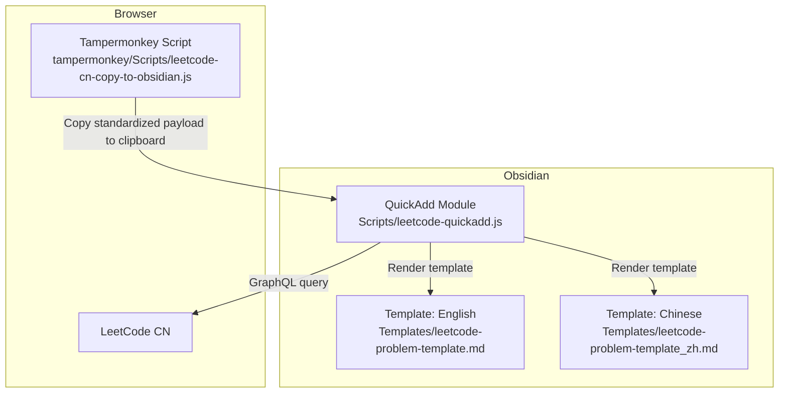
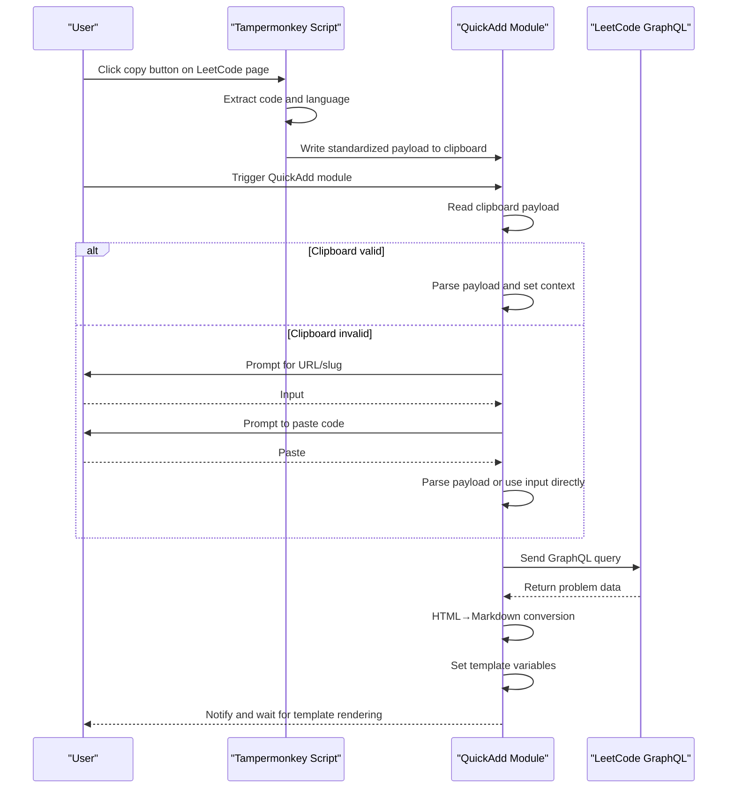
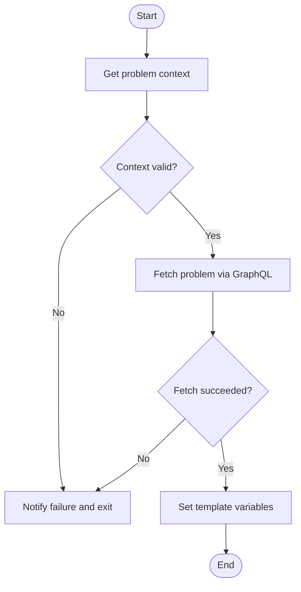
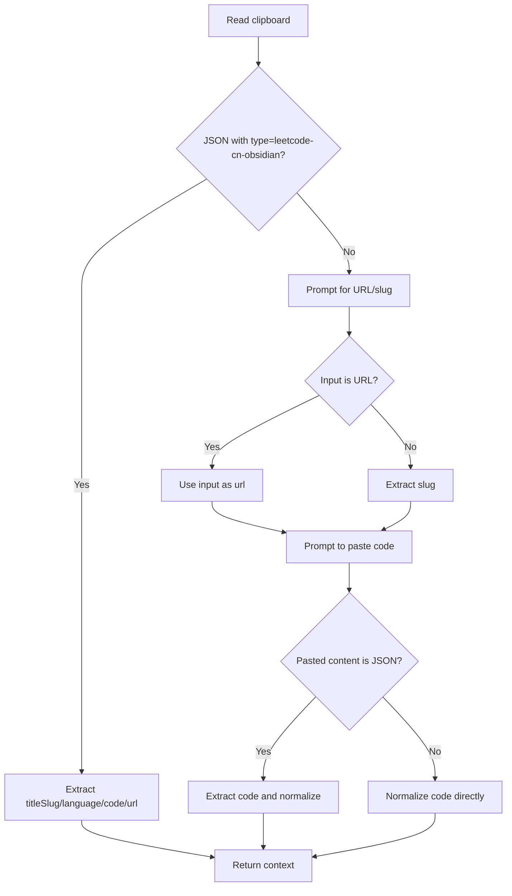
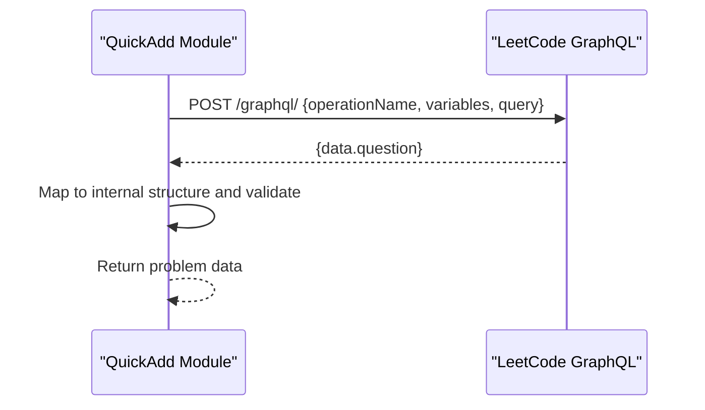
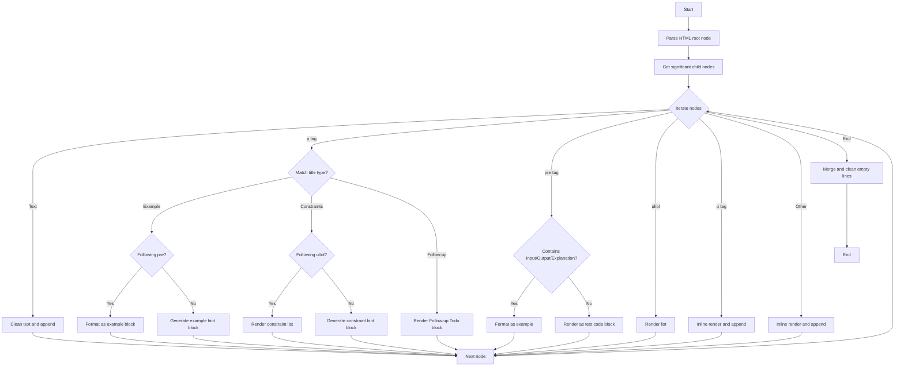
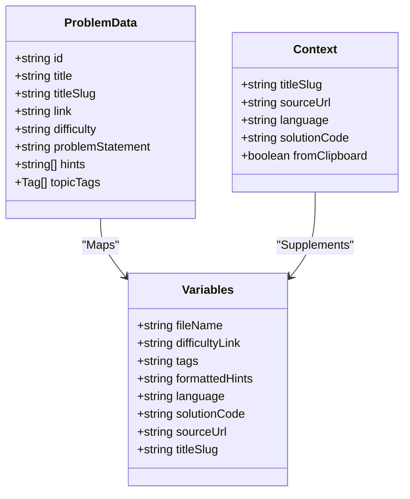
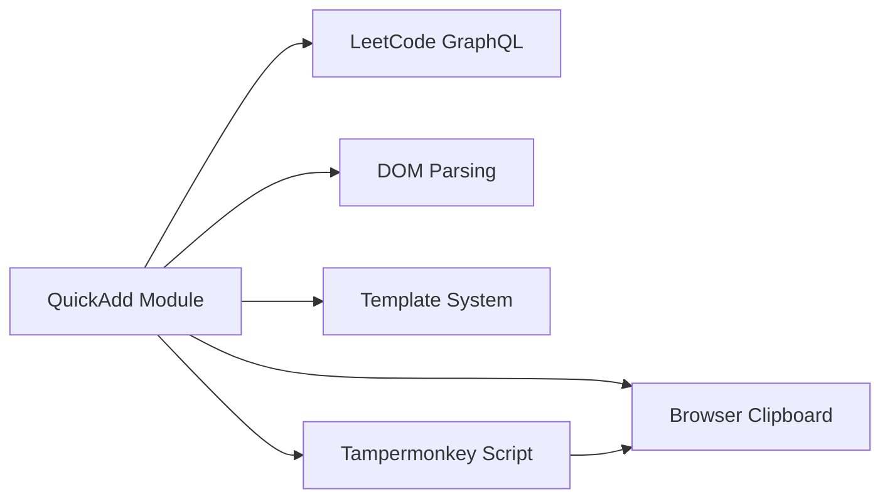

# Obsidian Plugin Features

<cite>
**Referenced Files in This Document**
- [Scripts/leetcode-quickadd.js](file://Scripts/leetcode-quickadd.js)
- [Templates/leetcode-problem-template.md](file://Templates/leetcode-problem-template.md)
- [Templates/leetcode-problem-template_zh.md](file://Templates/leetcode-problem-template_zh.md)
- [tampermonkey/Scripts/leetcode-cn-copy-to-obsidian.js](file://tampermonkey/Scripts/leetcode-cn-copy-to-obsidian.js)
</cite>

## Table of Contents
1. [Introduction](#introduction)
2. [Project Structure](#project-structure)
3. [Core Components](#core-components)
4. [Architecture Overview](#architecture-overview)
5. [Detailed Component Analysis](#detailed-component-analysis)
6. [Dependency Analysis](#dependency-analysis)
7. [Performance Considerations](#performance-considerations)
8. [Troubleshooting Guide](#troubleshooting-guide)
9. [Conclusion](#conclusion)
10. [Appendix](#appendix)

## Introduction
This project provides an automated workflow paired with the Obsidian plugin, with the goal of quickly importing problem information and code from LeetCode CN into Obsidian notes. Its core capabilities include:
- Reading the problem payload copied by the Tampermonkey script via the clipboard, and automatically extracting problem slug, language, code, and source URL
- Falling back to manual URL/slug input and code paste when the clipboard is unavailable or contains no valid payload
- Fetching CN problem content, difficulty, tags, and hints via GraphQL queries
- Converting HTML problem content into Obsidian-friendly Markdown
- Setting QuickAdd template variables for template rendering
- Supporting tag prefix settings and bilingual (Chinese/English) templates

This document is intended for users with different technical backgrounds, providing both high-level architectural explanations and code-level details with visual diagrams to help readers understand implementation principles and usage methods.

## Project Structure
- Scripts/leetcode-quickadd.js: The Obsidian QuickAdd module entry point, responsible for input collection, GraphQL queries, HTML→Markdown conversion, variable setting, and notifications
- tampermonkey/Scripts/leetcode-cn-copy-to-obsidian.js: The Tampermonkey script, responsible for automatically extracting code and language on LeetCode pages and writing the standardized payload to the clipboard
- Templates/leetcode-problem-template.md: English template
- Templates/leetcode-problem-template_zh.md: Chinese template

Diagram Sources
- [Scripts/leetcode-quickadd.js:1-104](file://Scripts/leetcode-quickadd.js#L1-L104)
- [tampermonkey/Scripts/leetcode-cn-copy-to-obsidian.js:305-363](file://tampermonkey/Scripts/leetcode-cn-copy-to-obsidian.js#L305-L363)
- [Templates/leetcode-problem-template.md:1-35](file://Templates/leetcode-problem-template.md#L1-L35)
- [Templates/leetcode-problem-template_zh.md:1-41](file://Templates/leetcode-problem-template_zh.md#L1-L41)

Section Sources
- [Scripts/leetcode-quickadd.js:1-104](file://Scripts/leetcode-quickadd.js#L1-L104)
- [tampermonkey/Scripts/leetcode-cn-copy-to-obsidian.js:12-536](file://tampermonkey/Scripts/leetcode-cn-copy-to-obsidian.js#L12-L536)
- [Templates/leetcode-problem-template.md:1-35](file://Templates/leetcode-problem-template.md#L1-L35)
- [Templates/leetcode-problem-template_zh.md:1-41](file://Templates/leetcode-problem-template_zh.md#L1-L41)

## Core Components
- QuickAdd Module Entry and Configuration
  - Module export entry, name, author, and settings (tag prefix)
  - Main flow: Get context → Fetch problem → Set variables → Notify
- Input and Clipboard Handling
  - Read standardized payload from clipboard preferentially; otherwise enter manual mode (URL/slug + code)
  - Support wide input box and fallback input box, automatically parsing the code field from the JSON payload
- GraphQL Query and Data Processing
  - Build query body, send POST request, parse response data, and map to internal structure
- HTML→Markdown Conversion Engine
  - Parse HTML structure, recognize examples, constraints, lists, images, links, etc., and convert by rules to Obsidian blocks/lists/quote blocks
- Template Variables and Rendering
  - Set variables such as filename, difficulty link, tags, formatted hints, language, code, source URL, slug, etc.
  - Chinese and English templates render separately; the Chinese template includes a code block language placeholder

Section Sources
- [Scripts/leetcode-quickadd.js:56-104](file://Scripts/leetcode-quickadd.js#L56-L104)
- [Scripts/leetcode-quickadd.js:114-166](file://Scripts/leetcode-quickadd.js#L114-L166)
- [Scripts/leetcode-quickadd.js:238-271](file://Scripts/leetcode-quickadd.js#L238-L271)
- [Scripts/leetcode-quickadd.js:339-404](file://Scripts/leetcode-quickadd.js#L339-L404)
- [Scripts/leetcode-quickadd.js:436-546](file://Scripts/leetcode-quickadd.js#L436-L546)
- [Scripts/leetcode-quickadd.js:410-430](file://Scripts/leetcode-quickadd.js#L410-L430)
- [Templates/leetcode-problem-template.md:1-35](file://Templates/leetcode-problem-template.md#L1-L35)
- [Templates/leetcode-problem-template_zh.md:1-41](file://Templates/leetcode-problem-template_zh.md#L1-L41)

## Architecture Overview
The overall workflow is divided into two parts: "browser-side payload collection" and "Obsidian-side processing and rendering":
- Browser side: The Tampermonkey script automatically extracts code and language on the LeetCode page, builds a standardized payload, and writes it to the clipboard
- Obsidian side: QuickAdd reads the clipboard preferentially, otherwise prompts manual input; then fetches problem details via GraphQL; converts HTML content to Markdown; sets template variables and triggers template rendering

Diagram Sources
- [tampermonkey/Scripts/leetcode-cn-copy-to-obsidian.js:316-363](file://tampermonkey/Scripts/leetcode-cn-copy-to-obsidian.js#L316-L363)
- [Scripts/leetcode-quickadd.js:83-104](file://Scripts/leetcode-quickadd.js#L83-L104)
- [Scripts/leetcode-quickadd.js:339-404](file://Scripts/leetcode-quickadd.js#L339-L404)

## Detailed Component Analysis

### QuickAdd Module and Main Workflow
- Module exports: entry, settings (including tag prefix setting)
- Main flow: Get context → Fetch problem → Set variables → Notify
- Error handling: Prompt and short-circuit return on empty slug, request failure, or parse failure

Diagram Sources
- [Scripts/leetcode-quickadd.js:83-104](file://Scripts/leetcode-quickadd.js#L83-L104)
- [Scripts/leetcode-quickadd.js:94-99](file://Scripts/leetcode-quickadd.js#L94-L99)

Section Sources
- [Scripts/leetcode-quickadd.js:56-104](file://Scripts/leetcode-quickadd.js#L56-L104)

### Input and Clipboard Handling
- Read standardized payload (type: leetcode-cn-obsidian) from the clipboard preferentially, automatically extracting titleSlug, language, code, url
- If clipboard is invalid or non-standard payload, enter manual mode: input URL/slug, then paste code via prompt
- Automatically detect whether the pasted content is a JSON payload; if so, extract the code field; otherwise treat as plain code
- URL/slug extraction supports multiple path forms, compatible with relative paths and full URLs

Diagram Sources
- [Scripts/leetcode-quickadd.js:238-271](file://Scripts/leetcode-quickadd.js#L238-L271)
- [Scripts/leetcode-quickadd.js:172-214](file://Scripts/leetcode-quickadd.js#L172-L214)
- [Scripts/leetcode-quickadd.js:216-232](file://Scripts/leetcode-quickadd.js#L216-L232)
- [Scripts/leetcode-quickadd.js:277-293](file://Scripts/leetcode-quickadd.js#L277-L293)

Section Sources
- [Scripts/leetcode-quickadd.js:114-166](file://Scripts/leetcode-quickadd.js#L114-L166)
- [Scripts/leetcode-quickadd.js:238-271](file://Scripts/leetcode-quickadd.js#L238-L271)
- [Scripts/leetcode-quickadd.js:277-293](file://Scripts/leetcode-quickadd.js#L277-L293)

### GraphQL Query and Data Retrieval
- Query name and variables: questionData(titleSlug)
- Query fields: Problem ID, frontend ID, title, slug, translated title, content, difficulty, hints, tags
- Request headers: Content-Type, Referer, Origin
- Data mapping: id, title, titleSlug, difficulty, link, topicTags, problemStatement, hints

Diagram Sources
- [Scripts/leetcode-quickadd.js:339-404](file://Scripts/leetcode-quickadd.js#L339-L404)

Section Sources
- [Scripts/leetcode-quickadd.js:339-404](file://Scripts/leetcode-quickadd.js#L339-L404)

### HTML→Markdown Conversion Engine
- Core Strategy
  - Iterate child nodes, filter whitespace text and meaningless nodes
  - Recognize Example titles (containing "Example") → Try to match the immediately following code block; if matched, format as Obsidian example block; otherwise generate hint-style example block
  - Recognize Constraints titles (containing "Constraints") → If followed by ordered/unordered list, render as quoted constraint block; otherwise generate hint-style constraint block
  - Recognize "Follow-up" titles → Render as Todo block
  - Standalone pre nodes: If contains "Input/Output/Explanation" labels, format as example; otherwise output as text code block
  - Lists: Recursively render nested lists, supporting ordered/unordered
  - Paragraphs: Convert inline elements to Markdown, with paragraph merging and deduplication
  - Images and links: Inline rendering
- Text Normalization
  - Remove invisible characters, excessive whitespace, unify line breaks
  - Indent line-start quote blocks and compress empty lines
- Tags and Hints
  - Tags: Concatenate slugs with the prefix from settings
  - Hints: Strip HTML tags, render each as a quote block

Diagram Sources
- [Scripts/leetcode-quickadd.js:436-546](file://Scripts/leetcode-quickadd.js#L436-L546)
- [Scripts/leetcode-quickadd.js:669-699](file://Scripts/leetcode-quickadd.js#L669-L699)
- [Scripts/leetcode-quickadd.js:725-738](file://Scripts/leetcode-quickadd.js#L725-L738)
- [Scripts/leetcode-quickadd.js:740-783](file://Scripts/leetcode-quickadd.js#L740-L783)

Section Sources
- [Scripts/leetcode-quickadd.js:436-546](file://Scripts/leetcode-quickadd.js#L436-L546)
- [Scripts/leetcode-quickadd.js:789-800](file://Scripts/leetcode-quickadd.js#L789-L800)
- [Scripts/leetcode-quickadd.js:801-812](file://Scripts/leetcode-quickadd.js#L801-L812)

### Template Variable Setting and Rendering Mechanism
- Variable List
  - id, title, link, difficulty, problemStatement, hints, topicTags, titleSlug
  - fileName: Composed of id and cleaned title
  - difficultyLink: Difficulty value wrapped in link style
  - tags: Slug list concatenated with the prefix from settings
  - formattedHints: Hints list rendered as quote blocks
  - language: Language from context
  - solutionCode: Normalized code
  - sourceUrl: Source URL
- Rendering Logic
  - Chinese template: Contains code block language placeholder for subsequent replacement
  - English template: Basic fields and structure

Diagram Sources
- [Scripts/leetcode-quickadd.js:409-430](file://Scripts/leetcode-quickadd.js#L409-L430)
- [Scripts/leetcode-quickadd.js:832-834](file://Scripts/leetcode-quickadd.js#L832-L834)
- [Templates/leetcode-problem-template_zh.md:30-32](file://Templates/leetcode-problem-template_zh.md#L30-L32)

Section Sources
- [Scripts/leetcode-quickadd.js:410-430](file://Scripts/leetcode-quickadd.js#L410-L430)
- [Templates/leetcode-problem-template.md:1-35](file://Templates/leetcode-problem-template.md#L1-L35)
- [Templates/leetcode-problem-template_zh.md:1-41](file://Templates/leetcode-problem-template_zh.md#L1-L41)

### Configuration Options and Internationalization Support
- Tag Prefix Setting
  - Name: LeetCode Tag Prefix
  - Type: Text
  - Default: leetcode/
  - Effect: Adds a unified prefix to each tag for categorization and search
- Internationalization Support
  - Provides bilingual (Chinese/English) templates; the Chinese template uses Chinese titles and a code language placeholder
  - Difficulty value localization mapping (e.g., Easy→简单)

Section Sources
- [Scripts/leetcode-quickadd.js:58-70](file://Scripts/leetcode-quickadd.js#L58-L70)
- [Scripts/leetcode-quickadd.js:325-333](file://Scripts/leetcode-quickadd.js#L325-L333)
- [Templates/leetcode-problem-template_zh.md:14-41](file://Templates/leetcode-problem-template_zh.md#L14-L41)

### API Interface and Parameters
- GraphQL Query
  - Endpoint: https://leetcode.cn/graphql/
  - Method: POST
  - Request headers: Content-Type, Referer, Origin
  - Query body:
    - operationName: questionData
    - variables: titleSlug
    - query: Query containing problem fields
  - Returns: data.question object containing problem metadata and content
- Clipboard Payload
  - type: leetcode-cn-obsidian
  - url: Problem link
  - titleSlug: Problem slug
  - language: Programming language
  - code: Code content
  - copiedAt: Copy timestamp (optional)

Section Sources
- [Scripts/leetcode-quickadd.js:49-50](file://Scripts/leetcode-quickadd.js#L49-L50)
- [Scripts/leetcode-quickadd.js:341-378](file://Scripts/leetcode-quickadd.js#L341-L378)
- [Scripts/leetcode-quickadd.js:339-404](file://Scripts/leetcode-quickadd.js#L339-L404)
- [Scripts/leetcode-quickadd.js:336-344](file://Scripts/leetcode-quickadd.js#L336-L344)

## Dependency Analysis
- QuickAdd Module Dependencies
  - QuickAdd API: Input prompt, wide input prompt, variable setting
  - Browser clipboard: Read JSON payload
  - GraphQL API: Fetch problem data
  - DOM parsing: HTML→Markdown conversion
- External Dependencies
  - Tampermonkey script: Provides standardized payload
  - Obsidian template system: Renders variables

Diagram Sources
- [Scripts/leetcode-quickadd.js:83-104](file://Scripts/leetcode-quickadd.js#L83-L104)
- [tampermonkey/Scripts/leetcode-cn-copy-to-obsidian.js:316-363](file://tampermonkey/Scripts/leetcode-cn-copy-to-obsidian.js#L316-L363)

Section Sources
- [Scripts/leetcode-quickadd.js:83-104](file://Scripts/leetcode-quickadd.js#L83-L104)
- [tampermonkey/Scripts/leetcode-cn-copy-to-obsidian.js:12-536](file://tampermonkey/Scripts/leetcode-cn-copy-to-obsidian.js#L12-L536)

## Performance Considerations
- Clipboard reading: Read only once at module startup, avoiding repeated I/O
- GraphQL request: Single query with concise fields, reducing network and parsing overhead
- HTML→Markdown: Linear DOM child node traversal, O(N) complexity, avoiding deep recursion
- Text normalization: Regex replacement and string concatenation; pay attention to memory usage with large text
- Template rendering: Handled by the Obsidian engine; this module only sets variables

## Troubleshooting Guide
- Clipboard unavailable
  - Symptom: Cannot read standardized payload, automatically falls back to manual mode
  - Resolution: Confirm browser allows clipboard access; check whether Tampermonkey script is running normally
- Problem slug not recognized
  - Symptom: Failure prompt persists after entering URL/slug
  - Resolution: Confirm URL is correct and contains slug; or directly enter slug
- GraphQL request failure
  - Symptom: Cannot fetch problem information
  - Resolution: Check network connectivity; confirm endpoint is reachable; check console for errors
- HTML→Markdown conversion anomalies
  - Symptom: Problem content not rendered as expected
  - Resolution: Check HTML structure; confirm Example/Constraints title text; adjust template
- Tag prefix not effective
  - Symptom: Tags lack prefix
  - Resolution: Check whether the setting is saved correctly; confirm {{VALUE:tags}} exists in the template
- Code not rendered correctly
  - Symptom: Code block is empty or has format anomalies
  - Resolution: Confirm the code field in clipboard payload; check normalization logic; the Chinese template's language placeholder needs subsequent replacement

Section Sources
- [Scripts/leetcode-quickadd.js:89-92](file://Scripts/leetcode-quickadd.js#L89-L92)
- [Scripts/leetcode-quickadd.js:96-99](file://Scripts/leetcode-quickadd.js#L96-L99)
- [Scripts/leetcode-quickadd.js:382-385](file://Scripts/leetcode-quickadd.js#L382-L385)
- [Scripts/leetcode-quickadd.js:792-793](file://Scripts/leetcode-quickadd.js#L792-L793)

## Conclusion
This project achieves efficient knowledge migration from LeetCode CN to Obsidian through the collaboration of browser scripts and the Obsidian plugin. Key design points include:
- A standardized payload at the core to simplify cross-end data transfer
- Template variables at the center to decouple data from display
- HTML→Markdown conversion as a bridge to ensure content quality
- Settings and multiple templates as extension points to meet different user needs

In actual use, we recommend:
- Use the Tampermonkey script for automatic copying preferentially to reduce manual input
- Regularly check GraphQL endpoint and template variables to ensure stability
- Adjust conversion rules or templates appropriately for special HTML structures

## Appendix
- Quick Reference
  - Module entry: entry function
  - Settings: LeetCode Tag Prefix (default: leetcode/)
  - Template variables: id, title, link, difficulty, problemStatement, hints, topicTags, fileName, difficultyLink, tags, formattedHints, language, solutionCode, sourceUrl, titleSlug
  - GraphQL endpoint: https://leetcode.cn/graphql/
