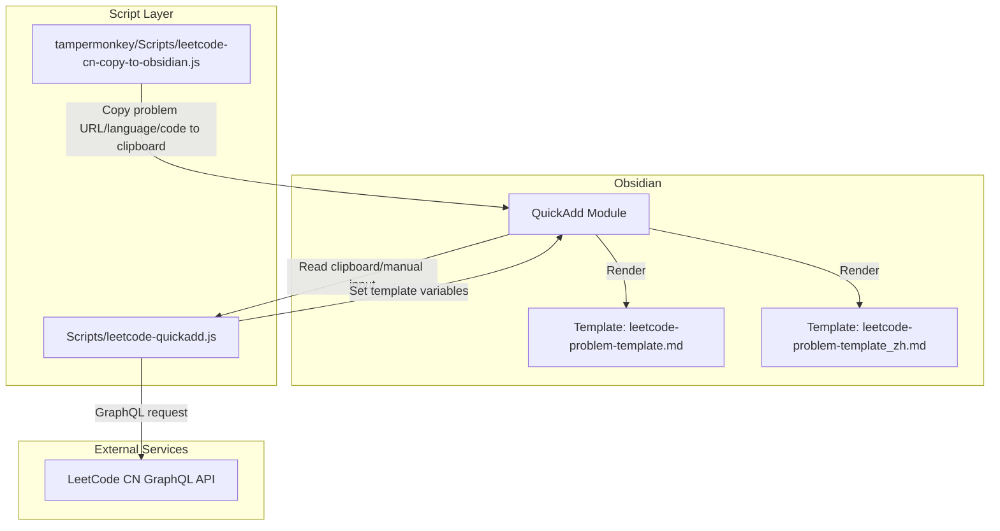
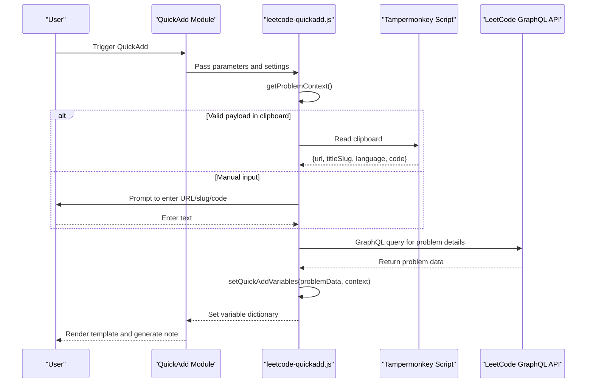
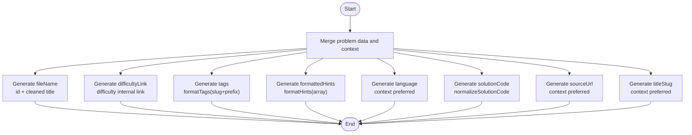
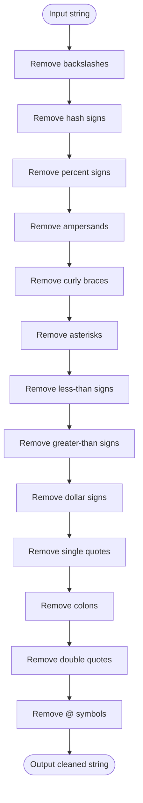
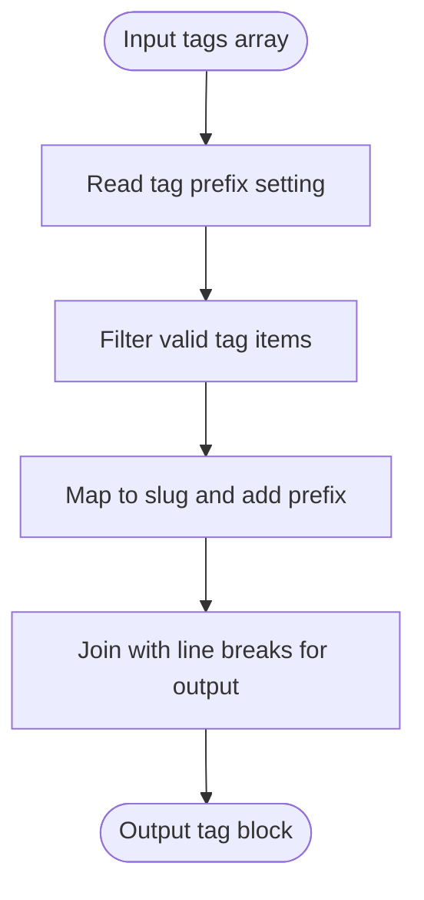
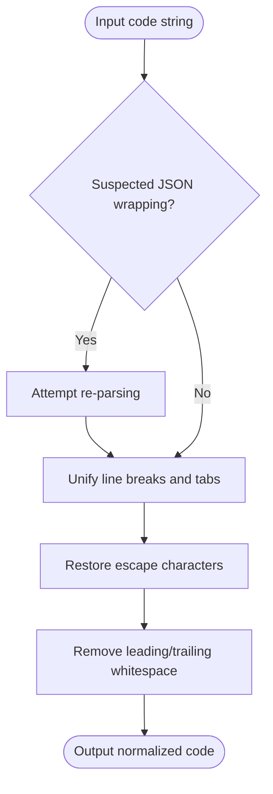
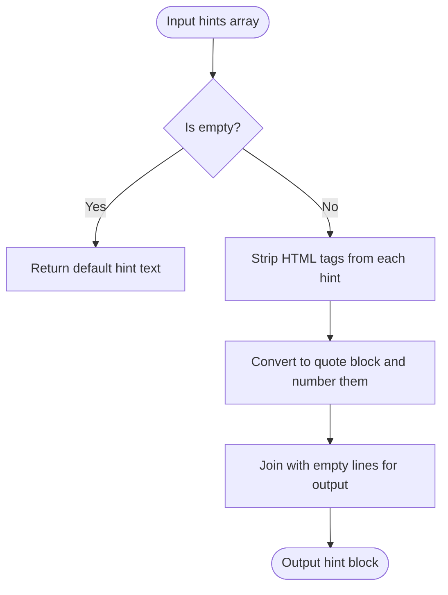
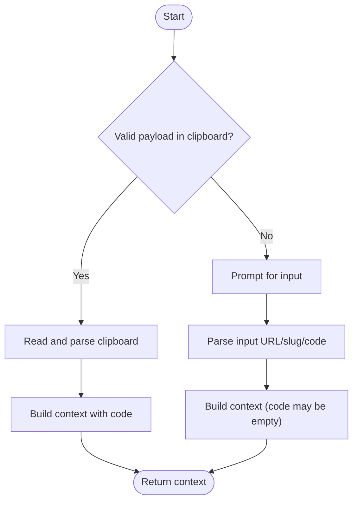
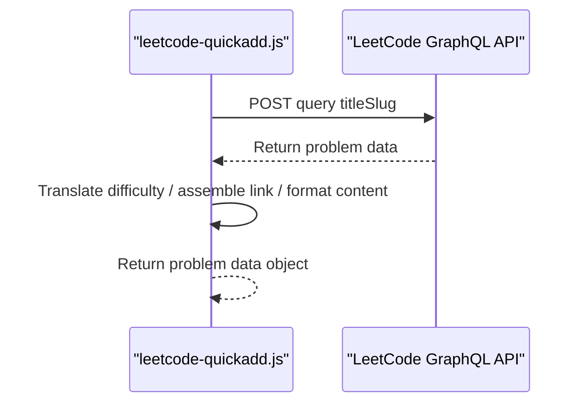
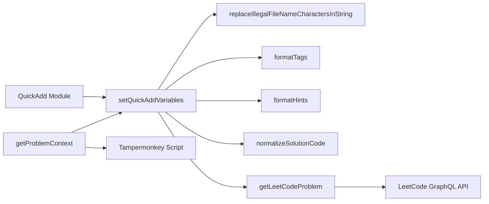

# Template Variable Setup and Rendering

<cite>
**Referenced Files in This Document**
- [Scripts/leetcode-quickadd.js](file://Scripts/leetcode-quickadd.js)
- [Templates/leetcode-problem-template.md](file://Templates/leetcode-problem-template.md)
- [Templates/leetcode-problem-template_zh.md](file://Templates/leetcode-problem-template_zh.md)
- [tampermonkey/Scripts/leetcode-cn-copy-to-obsidian.js](file://tampermonkey/Scripts/leetcode-cn-copy-to-obsidian.js)
</cite>

## Table of Contents
1. [Introduction](#introduction)
2. [Project Structure](#project-structure)
3. [Core Components](#core-components)
4. [Architecture Overview](#architecture-overview)
5. [Detailed Component Analysis](#detailed-component-analysis)
6. [Dependency Analysis](#dependency-analysis)
7. [Performance Considerations](#performance-considerations)
8. [Troubleshooting Guide](#troubleshooting-guide)
9. [Conclusion](#conclusion)
10. [Appendix](#appendix)

## Introduction
This document is intended for the LeetCode QuickAdd feature in Obsidian and systematically explains the template variable setup and rendering mechanism. It covers the following areas:
- How the `setQuickAddVariables` function merges problem data and context data to generate template variables
- Generation rules for various template variables: `fileName`, `difficultyLink`, `tags`, `formattedHints`, `solutionCode`
- `replaceIllegalFileNameCharactersInString` file name character cleanup logic
- `formatTags` tag prefix settings and slug normalization handling
- `normalizeSolutionCode` code formatting and cleanup mechanism
- Complete variable mapping table and usage examples
- Configuration options description and custom variable addition guide

## Project Structure
This repository is built around Obsidian's QuickAdd plugin, consisting of three core parts:
- Script Layer: Responsible for obtaining context from clipboard/manual input, calling GraphQL to fetch problem details, and setting template variables
- Template Layer: Provides bilingual (Chinese/English) Markdown templates for rendering the final notes
- User Script Layer: The Tampermonkey script copies the problem URL, language, and code from LeetCode CN to the clipboard for QuickAdd consumption

Diagram Sources
- [Scripts/leetcode-quickadd.js:83-104](file://Scripts/leetcode-quickadd.js#L83-L104)
- [Templates/leetcode-problem-template.md:1-35](file://Templates/leetcode-problem-template.md#L1-L35)
- [Templates/leetcode-problem-template_zh.md:1-41](file://Templates/leetcode-problem-template_zh.md#L1-L41)
- [tampermonkey/Scripts/leetcode-cn-copy-to-obsidian.js:316-363](file://tampermonkey/Scripts/leetcode-cn-copy-to-obsidian.js#L316-L363)

Section Sources
- [Scripts/leetcode-quickadd.js:1-104](file://Scripts/leetcode-quickadd.js#L1-L104)
- [Templates/leetcode-problem-template.md:1-35](file://Templates/leetcode-problem-template.md#L1-L35)
- [Templates/leetcode-problem-template_zh.md:1-41](file://Templates/leetcode-problem-template_zh.md#L1-L41)
- [tampermonkey/Scripts/leetcode-cn-copy-to-obsidian.js:1-536](file://tampermonkey/Scripts/leetcode-cn-copy-to-obsidian.js#L1-L536)

## Core Components
- `setQuickAddVariables`: Merges problem data and context data to generate all template variable key-value pairs
- `replaceIllegalFileNameCharactersInString`: Removes illegal characters from file names
- `formatTags`: Adds prefix to tags and normalizes slugs based on configuration
- `normalizeSolutionCode`: Unifies code line breaks, escaping, and whitespace
- `formatHints`: Converts the hints array into Markdown quote blocks
- `getProblemContext`: Reads the Tampermonkey payload from the clipboard preferentially; otherwise enters manual mode
- `getLeetCodeProblem`: Fetches problem details via GraphQL

Section Sources
- [Scripts/leetcode-quickadd.js:410-430](file://Scripts/leetcode-quickadd.js#L410-L430)
- [Scripts/leetcode-quickadd.js:832-834](file://Scripts/leetcode-quickadd.js#L832-L834)
- [Scripts/leetcode-quickadd.js:789-799](file://Scripts/leetcode-quickadd.js#L789-L799)
- [Scripts/leetcode-quickadd.js:836-868](file://Scripts/leetcode-quickadd.js#L836-L868)
- [Scripts/leetcode-quickadd.js:801-812](file://Scripts/leetcode-quickadd.js#L801-L812)
- [Scripts/leetcode-quickadd.js:114-166](file://Scripts/leetcode-quickadd.js#L114-L166)
- [Scripts/leetcode-quickadd.js:339-404](file://Scripts/leetcode-quickadd.js#L339-L404)

## Architecture Overview
The diagram below shows the key flow from user trigger to template rendering, and the path for variable generation and usage.

Diagram Sources
- [Scripts/leetcode-quickadd.js:83-104](file://Scripts/leetcode-quickadd.js#L83-L104)
- [Scripts/leetcode-quickadd.js:114-166](file://Scripts/leetcode-quickadd.js#L114-L166)
- [Scripts/leetcode-quickadd.js:339-404](file://Scripts/leetcode-quickadd.js#L339-L404)
- [Scripts/leetcode-quickadd.js:410-430](file://Scripts/leetcode-quickadd.js#L410-L430)
- [tampermonkey/Scripts/leetcode-cn-copy-to-obsidian.js:316-363](file://tampermonkey/Scripts/leetcode-cn-copy-to-obsidian.js#L316-L363)

## Detailed Component Analysis

### setQuickAddVariables: Variable Setting and Merging Logic
This function merges problem data and context data to generate the template variable dictionary. The merging strategy is as follows:
- Use problem data as the base object, injecting problem fields directly via the spread operator
- Post-process key fields to form template variables
- Prefer language, code, URL, and slug from context; fall back to problem data if missing

Key Points of Variable Generation
- `fileName`: Composed by concatenating the problem id with the cleaned title, avoiding illegal file name characters
- `difficultyLink`: Wraps the difficulty in Obsidian internal link format
- `tags`: Calls `formatTags`, outputting with configured prefix and normalized slug
- `formattedHints`: Calls `formatHints`, converting the hints array to Markdown with quote blocks
- `language`: Uses context language preferentially; defaults to C++ otherwise
- `solutionCode`: Calls `normalizeSolutionCode`, unifying line breaks and escaping
- `sourceUrl`: Uses context URL preferentially; falls back to the standard link
- `titleSlug`: Uses context slug preferentially; falls back to problem slug

Diagram Sources
- [Scripts/leetcode-quickadd.js:410-430](file://Scripts/leetcode-quickadd.js#L410-L430)

Section Sources
- [Scripts/leetcode-quickadd.js:410-430](file://Scripts/leetcode-quickadd.js#L410-L430)

### replaceIllegalFileNameCharactersInString: File Name Character Cleanup
- Goal: Ensure generated file names can be safely used in operating systems and Obsidian
- Processing Rules: Remove backslashes, hash signs, percent signs, ampersands, curly braces, asterisks, less-than signs, greater-than signs, dollar signs, single quotes, colons, double quotes, and @ symbols
- Applicable Scope: Title portion of the `fileName` variable

Diagram Sources
- [Scripts/leetcode-quickadd.js:832-834](file://Scripts/leetcode-quickadd.js#L832-L834)

Section Sources
- [Scripts/leetcode-quickadd.js:832-834](file://Scripts/leetcode-quickadd.js#L832-L834)

### formatTags: Tag Prefix and Slug Normalization
- Prefix Setting: Read the "Tag Prefix" from plugin settings; default value is `leetcode/`
- Normalization: Use slug preferentially (stable English identifier) and trim leading/trailing whitespace
- Output Format: One tag per line, indented with hyphens, convenient for use with Obsidian and Dataview

Diagram Sources
- [Scripts/leetcode-quickadd.js:789-799](file://Scripts/leetcode-quickadd.js#L789-L799)

Section Sources
- [Scripts/leetcode-quickadd.js:789-799](file://Scripts/leetcode-quickadd.js#L789-L799)

### normalizeSolutionCode: Code Formatting and Cleanup
- Goal: Unify code formats from different sources (clipboard, manual input, Tampermonkey JSON)
- Processing Steps:
  - Attempt to re-parse strings that may have been wrapped by `JSON.stringify`
  - Unify line breaks (Windows, Unix)
  - Restore escape characters (quotes, backslashes, tab characters)
  - Remove leading/trailing whitespace
- Applicable Scope: `solutionCode` variable

Diagram Sources
- [Scripts/leetcode-quickadd.js:836-868](file://Scripts/leetcode-quickadd.js#L836-L868)

Section Sources
- [Scripts/leetcode-quickadd.js:836-868](file://Scripts/leetcode-quickadd.js#L836-L868)

### formatHints: Hints Formatting
- Input: Hints array (HTML text)
- Processing: Strip HTML tags, convert each to an Obsidian quote block, numbered hints
- Output: Markdown quote block list; returns "No hints available" if empty

Diagram Sources
- [Scripts/leetcode-quickadd.js:801-812](file://Scripts/leetcode-quickadd.js#L801-L812)

Section Sources
- [Scripts/leetcode-quickadd.js:801-812](file://Scripts/leetcode-quickadd.js#L801-L812)

### getProblemContext: Context Retrieval and Priority
- Priority:
  1. Read Tampermonkey payload from clipboard (containing URL, slug, language, code)
  2. Manually enter URL/slug
  3. Manually paste code (optional)
- Output: Object containing `titleSlug`, `sourceUrl`, `language`, `solutionCode`, and `fromClipboard` flag

Diagram Sources
- [Scripts/leetcode-quickadd.js:114-166](file://Scripts/leetcode-quickadd.js#L114-L166)

Section Sources
- [Scripts/leetcode-quickadd.js:114-166](file://Scripts/leetcode-quickadd.js#L114-L166)

### getLeetCodeProblem: GraphQL Data Retrieval
- Request: Send a query to LeetCode CN's GraphQL to fetch problem details (title, difficulty, tags, hints, content, etc.)
- Processing: Translate difficulty, assemble link, format problem content
- Output: Problem data object (containing id, title, titleSlug, difficulty, link, topicTags, problemStatement, hints)

Diagram Sources
- [Scripts/leetcode-quickadd.js:339-404](file://Scripts/leetcode-quickadd.js#L339-L404)

Section Sources
- [Scripts/leetcode-quickadd.js:339-404](file://Scripts/leetcode-quickadd.js#L339-L404)

## Dependency Analysis
- QuickAdd module depends on `setQuickAddVariables` to generate the variable dictionary
- `setQuickAddVariables` depends on multiple utility functions: file name cleanup, tag formatting, code normalization, hints formatting
- `getProblemContext` depends on the clipboard payload provided by the Tampermonkey script
- `getLeetCodeProblem` depends on the LeetCode GraphQL API

Diagram Sources
- [Scripts/leetcode-quickadd.js:410-430](file://Scripts/leetcode-quickadd.js#L410-L430)
- [Scripts/leetcode-quickadd.js:832-834](file://Scripts/leetcode-quickadd.js#L832-L834)
- [Scripts/leetcode-quickadd.js:789-799](file://Scripts/leetcode-quickadd.js#L789-L799)
- [Scripts/leetcode-quickadd.js:801-812](file://Scripts/leetcode-quickadd.js#L801-L812)
- [Scripts/leetcode-quickadd.js:836-868](file://Scripts/leetcode-quickadd.js#L836-L868)
- [Scripts/leetcode-quickadd.js:114-166](file://Scripts/leetcode-quickadd.js#L114-L166)
- [Scripts/leetcode-quickadd.js:339-404](file://Scripts/leetcode-quickadd.js#L339-L404)
- [tampermonkey/Scripts/leetcode-cn-copy-to-obsidian.js:316-363](file://tampermonkey/Scripts/leetcode-cn-copy-to-obsidian.js#L316-L363)

Section Sources
- [Scripts/leetcode-quickadd.js:410-430](file://Scripts/leetcode-quickadd.js#L410-L430)
- [Scripts/leetcode-quickadd.js:114-166](file://Scripts/leetcode-quickadd.js#L114-L166)
- [Scripts/leetcode-quickadd.js:339-404](file://Scripts/leetcode-quickadd.js#L339-L404)

## Performance Considerations
- GraphQL queries are only initiated when needed, reducing network overhead
- HTML-to-Markdown conversion uses DOM parsing and traversal; avoid repeated calls on very large content
- Tag and hints processing are linear scans with O(n) complexity; overhead is negligible given a limited number of tags
- Code normalization includes one optional JSON parse attempt; falls back to regular replacement on failure; overall O(n) complexity

## Troubleshooting Guide
- Clipboard read failure
  - Symptom: Cannot read payload from clipboard
  - Diagnosis: Confirm browser supports Clipboard API; check whether Tampermonkey script successfully copied payload
  - Reference: [Scripts/leetcode-quickadd.js:238-271](file://Scripts/leetcode-quickadd.js#L238-L271)
- GraphQL request failure
  - Symptom: Cannot fetch problem details
  - Diagnosis: Check network connectivity; confirm titleSlug is correct; inspect returned data structure
  - Reference: [Scripts/leetcode-quickadd.js:339-404](file://Scripts/leetcode-quickadd.js#L339-L404)
- Tags not displayed or format anomaly
  - Symptom: Tags not appearing in note or format is incorrect
  - Diagnosis: Confirm tags array is non-empty and contains slugs; check tag prefix setting
  - Reference: [Scripts/leetcode-quickadd.js:789-799](file://Scripts/leetcode-quickadd.js#L789-L799)
- File name contains illegal characters
  - Symptom: Generated file name cannot be saved
  - Diagnosis: Confirm title contains no illegal characters; check fileName generation logic
  - Reference: [Scripts/leetcode-quickadd.js:832-834](file://Scripts/leetcode-quickadd.js#L832-L834)
- Code format corruption
  - Symptom: Code line breaks, indentation, or escaping anomalies
  - Diagnosis: Confirm code source (clipboard/Tampermonkey/manual input); check `normalizeSolutionCode` processing
  - Reference: [Scripts/leetcode-quickadd.js:836-868](file://Scripts/leetcode-quickadd.js#L836-L868)

Section Sources
- [Scripts/leetcode-quickadd.js:238-271](file://Scripts/leetcode-quickadd.js#L238-L271)
- [Scripts/leetcode-quickadd.js:339-404](file://Scripts/leetcode-quickadd.js#L339-L404)
- [Scripts/leetcode-quickadd.js:789-799](file://Scripts/leetcode-quickadd.js#L789-L799)
- [Scripts/leetcode-quickadd.js:832-834](file://Scripts/leetcode-quickadd.js#L832-L834)
- [Scripts/leetcode-quickadd.js:836-868](file://Scripts/leetcode-quickadd.js#L836-L868)

## Conclusion
This system achieves high-quality note generation from LeetCode CN to Obsidian through a clear variable generation workflow and robust cleanup/normalization mechanisms. `setQuickAddVariables` acts as the central hub, organically merging problem data and context data, and working in conjunction with specialized utility functions to ensure consistency and reliability of template rendering. Through reasonable tag prefix configuration and the use of built-in cleanup functions, users can stably reuse templates across different environments.

## Appendix

### Template Variable Mapping Table
- `id`: Problem frontend ID
- `title`: Problem title (Chinese)
- `titleSlug`: Problem slug
- `difficulty`: Difficulty (Chinese)
- `difficultyLink`: Difficulty in internal link format
- `link`: Problem link
- `sourceUrl`: Source URL (context preferred)
- `problemStatement`: Formatted problem description
- `formattedHints`: Formatted hints block
- `tags`: Formatted tags block
- `language`: Programming language (Markdown syntax highlighting)
- `solutionCode`: Normalized code
- `fileName`: File name (id + cleaned title)

Section Sources
- [Scripts/leetcode-quickadd.js:410-430](file://Scripts/leetcode-quickadd.js#L410-L430)
- [Templates/leetcode-problem-template.md:1-35](file://Templates/leetcode-problem-template.md#L1-L35)
- [Templates/leetcode-problem-template_zh.md:1-41](file://Templates/leetcode-problem-template_zh.md#L1-L41)

### Usage Examples
- Clipboard Mode
  - Open a problem on LeetCode CN and click the Tampermonkey button to copy the payload
  - Trigger QuickAdd in Obsidian; the script automatically reads from clipboard and generates the note
  - Reference: [tampermonkey/Scripts/leetcode-cn-copy-to-obsidian.js:316-363](file://tampermonkey/Scripts/leetcode-cn-copy-to-obsidian.js#L316-L363)
- Manual Mode
  - If no payload is in the clipboard, the script prompts to enter URL/slug or paste code directly
  - Reference: [Scripts/leetcode-quickadd.js:114-166](file://Scripts/leetcode-quickadd.js#L114-L166)

### Configuration Options
- Tag Prefix (LeetCode Tag Prefix)
  - Type: Text
  - Default: `leetcode/`
  - Effect: Adds a unified prefix to tags for categorization and search
  - Reference: [Scripts/leetcode-quickadd.js:50-69](file://Scripts/leetcode-quickadd.js#L50-L69)

### Custom Variable Addition Guide
- Adding New Variables
  - Add new key-value pairs in `setQuickAddVariables`
  - To include additional data, extend the GraphQL query fields in `getLeetCodeProblem`
  - Reference: [Scripts/leetcode-quickadd.js:410-430](file://Scripts/leetcode-quickadd.js#L410-L430)
- Using in Templates
  - Use `{{VALUE:variableName}}` in template files to render
  - Reference: [Templates/leetcode-problem-template.md:1-35](file://Templates/leetcode-problem-template.md#L1-L35)
  - Reference: [Templates/leetcode-problem-template_zh.md:1-41](file://Templates/leetcode-problem-template_zh.md#L1-L41)
