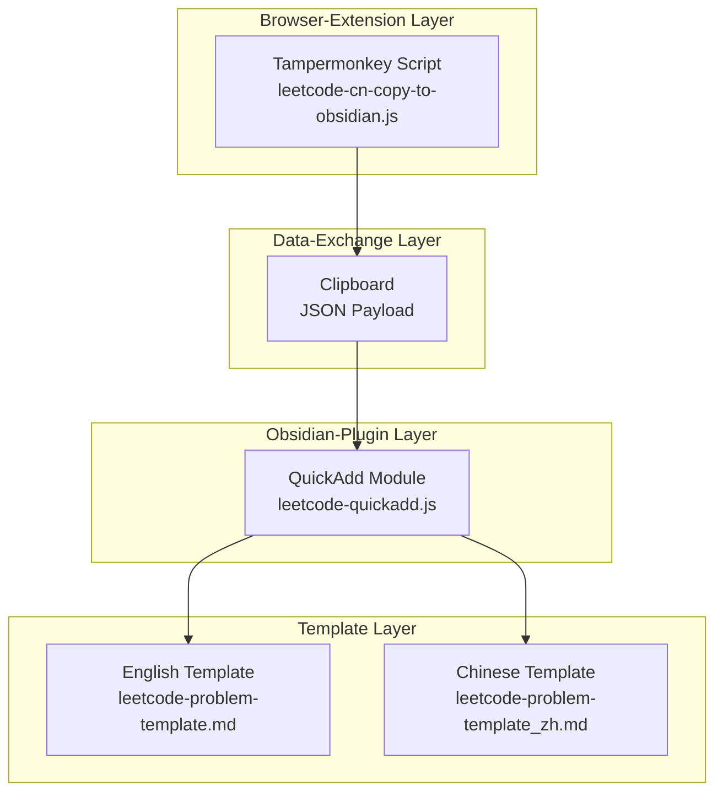
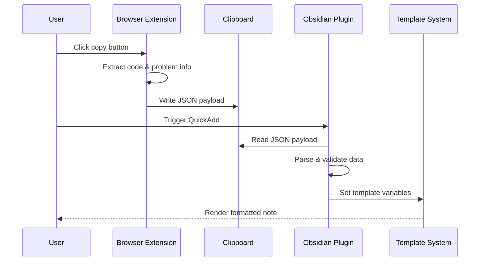
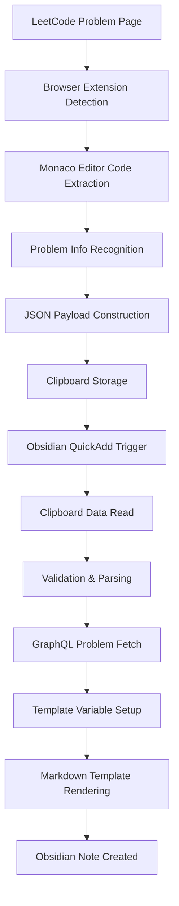
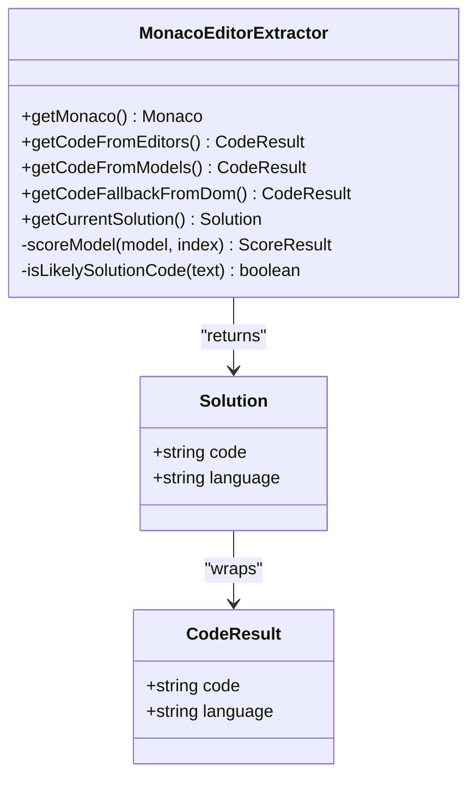
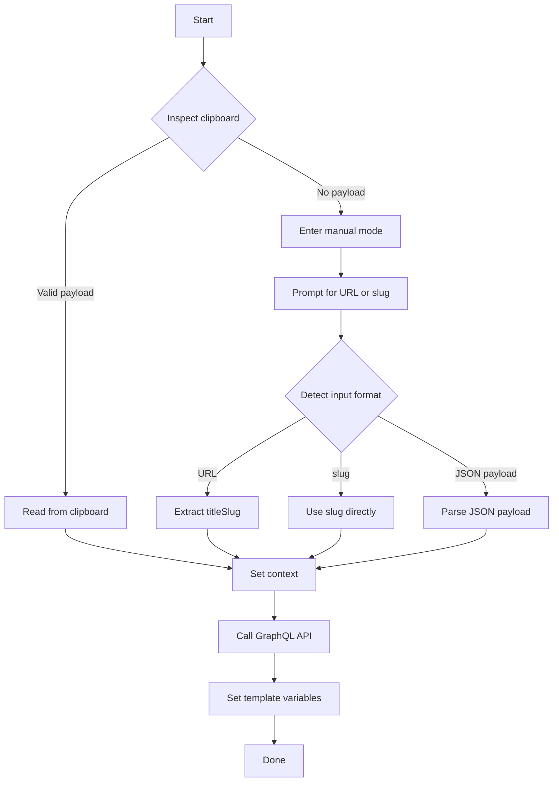
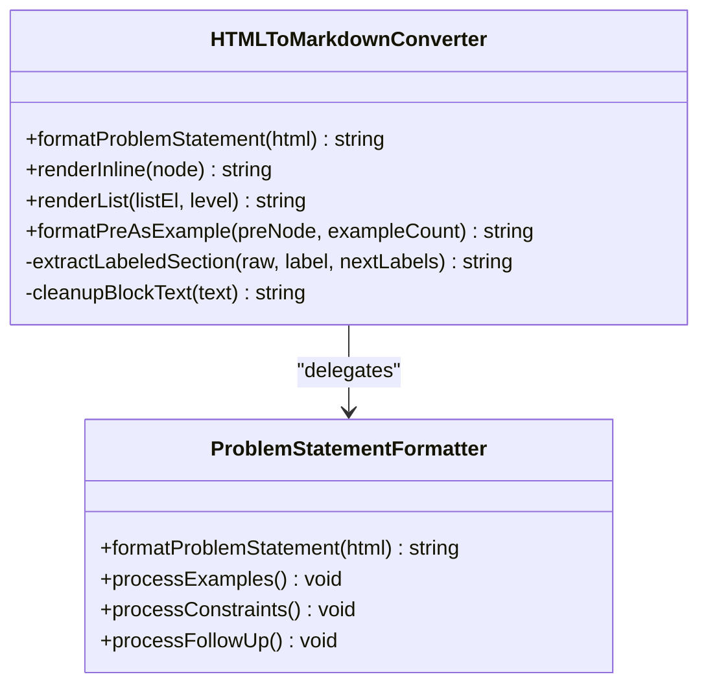
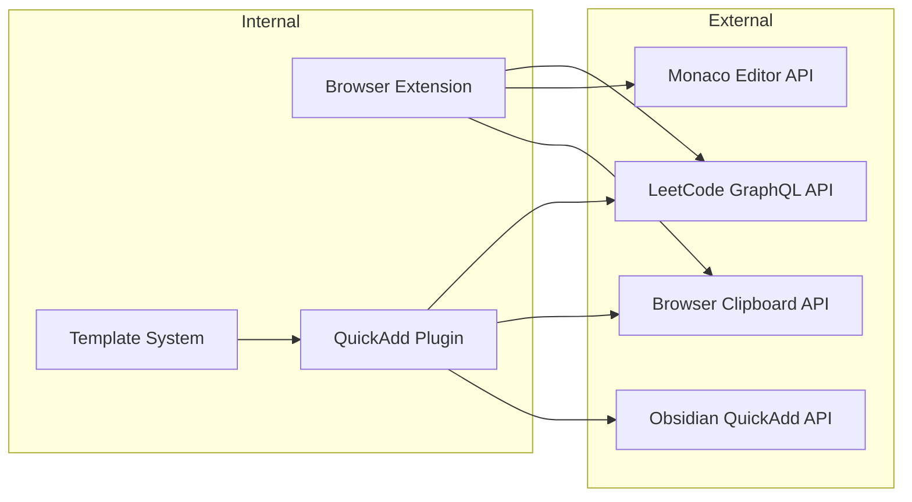

# Project Overview

<cite>
**Files referenced in this document**
- [Scripts/leetcode-quickadd.js](file://Scripts/leetcode-quickadd.js)
- [Templates/leetcode-problem-template.md](file://Templates/leetcode-problem-template.md)
- [Templates/leetcode-problem-template_zh.md](file://Templates/leetcode-problem-template_zh.md)
- [tampermonkey/Scripts/leetcode-cn-copy-to-obsidian.js](file://tampermonkey/Scripts/leetcode-cn-copy-to-obsidian.js)
</cite>

## Table of Contents
1. [Introduction](#introduction)
2. [Project Structure](#project-structure)
3. [Core Components](#core-components)
4. [Architecture Overview](#architecture-overview)
5. [Detailed Component Analysis](#detailed-component-analysis)
6. [Dependency Analysis](#dependency-analysis)
7. [Performance Considerations](#performance-considerations)
8. [Troubleshooting Guide](#troubleshooting-guide)
9. [Conclusion](#conclusion)

## Introduction

The LeetCode-to-Obsidian automation integration project is an innovative developer toolchain that radically simplifies the workflow of creating programming-study notes. Through the seamless cooperation of three key components, the project automates the data flow from the LeetCode online programming platform to the Obsidian knowledge-management system:

- **Browser extension**: A Tampermonkey userscript captures code and problem information from the LeetCode UI.
- **Obsidian plugin**: A QuickAdd module provides intelligent note generation and template variable injection.
- **Template system**: Predefined Markdown templates ensure that notes are consistent and professional.

The core value of the solution lies in eliminating tedious copy-paste steps. What used to take several minutes is now reduced to a few seconds, dramatically improving the efficiency and experience of programming-study note-taking.

## Project Structure

The project follows a modular design where each component has a clear responsibility:

**Diagram sources**
- [Scripts/leetcode-quickadd.js:1-868](file://Scripts/leetcode-quickadd.js#L1-L868)
- [tampermonkey/Scripts/leetcode-cn-copy-to-obsidian.js:1-536](file://tampermonkey/Scripts/leetcode-cn-copy-to-obsidian.js#L1-L536)

**Section sources**
- [Scripts/leetcode-quickadd.js:1-868](file://Scripts/leetcode-quickadd.js#L1-L868)
- [Templates/leetcode-problem-template.md:1-35](file://Templates/leetcode-problem-template.md#L1-L35)
- [Templates/leetcode-problem-template_zh.md:1-41](file://Templates/leetcode-problem-template_zh.md#L1-L41)
- [tampermonkey/Scripts/leetcode-cn-copy-to-obsidian.js:1-536](file://tampermonkey/Scripts/leetcode-cn-copy-to-obsidian.js#L1-L536)

## Core Components

### Browser-Extension Component

**Component name**: LeetCode CN Copy to Obsidian
**Tech stack**: Tampermonkey + Monaco Editor API + JavaScript

Main responsibilities:
- Extract the user's full solution code from the Monaco editor on the LeetCode page.
- Identify the `titleSlug` from the problem URL.
- Wrap the captured data into a standardized JSON payload.
- Hand the data over to Obsidian via the clipboard.

**Section sources**
- [tampermonkey/Scripts/leetcode-cn-copy-to-obsidian.js:1-536](file://tampermonkey/Scripts/leetcode-cn-copy-to-obsidian.js#L1-L536)

### Obsidian-Plugin Component

**Component name**: LeetCode Puller CN
**Tech stack**: JavaScript + Obsidian QuickAdd API + GraphQL

Core capabilities:
- Read and parse the LeetCode payload from the clipboard.
- Fall back to manual input mode for offline scenarios.
- Fetch full problem details through the GraphQL API.
- Set QuickAdd template variables for downstream rendering.

**Section sources**
- [Scripts/leetcode-quickadd.js:1-868](file://Scripts/leetcode-quickadd.js#L1-L868)

### Template-System Component

**Component name**: LeetCode Problem Templates
**Tech stack**: Markdown + Obsidian template syntax

Two template flavors are shipped:
- English template: suitable for international users and multilingual environments.
- Chinese template: localized version optimized for Chinese users.

**Section sources**
- [Templates/leetcode-problem-template.md:1-35](file://Templates/leetcode-problem-template.md#L1-L35)
- [Templates/leetcode-problem-template_zh.md:1-41](file://Templates/leetcode-problem-template_zh.md#L1-L41)

## Architecture Overview

The project uses a layered design that ensures loose coupling and high cohesion across components:

**Diagram sources**
- [Scripts/leetcode-quickadd.js:83-104](file://Scripts/leetcode-quickadd.js#L83-L104)
- [tampermonkey/Scripts/leetcode-cn-copy-to-obsidian.js:316-363](file://tampermonkey/Scripts/leetcode-cn-copy-to-obsidian.js#L316-L363)

### Data-Flow Architecture

**Diagram sources**
- [Scripts/leetcode-quickadd.js:114-166](file://Scripts/leetcode-quickadd.js#L114-L166)
- [tampermonkey/Scripts/leetcode-cn-copy-to-obsidian.js:280-303](file://tampermonkey/Scripts/leetcode-cn-copy-to-obsidian.js#L280-L303)

## Detailed Component Analysis

### Deep Dive: Browser Extension

#### Monaco Editor Integration

The browser extension extracts code by directly accessing the Monaco editor instance on the LeetCode page:

**Diagram sources**
- [tampermonkey/Scripts/leetcode-cn-copy-to-obsidian.js:29-303](file://tampermonkey/Scripts/leetcode-cn-copy-to-obsidian.js#L29-L303)

#### Code-Quality Scoring Algorithm

The extension uses a layered scoring algorithm to pick the best code source:

| Scoring factor | Weight | Description |
|---|---|---|
| Language detection accuracy | 100 | Regex matching against language signatures |
| Code-structure completeness | 100 | Detects class/function declarations |
| Code-length weight | 0–500 | Prefers longer, more complete snippets |
| Keyword matches | 0–100 | Matches language-specific keywords |
| URI path hints | 0–40 | Inspects the model URI for clues |

**Section sources**
- [tampermonkey/Scripts/leetcode-cn-copy-to-obsidian.js:101-145](file://tampermonkey/Scripts/leetcode-cn-copy-to-obsidian.js#L101-L145)

### Deep Dive: Obsidian Plugin

#### Multi-Mode Input Strategy

QuickAdd implements an intelligent input-handling pipeline:

**Diagram sources**
- [Scripts/leetcode-quickadd.js:114-166](file://Scripts/leetcode-quickadd.js#L114-L166)

#### HTML-to-Markdown Conversion Engine

The plugin embeds a powerful HTML→Markdown converter that handles LeetCode's complex content structures:

**Diagram sources**
- [Scripts/leetcode-quickadd.js:436-546](file://Scripts/leetcode-quickadd.js#L436-L546)

**Section sources**
- [Scripts/leetcode-quickadd.js:339-404](file://Scripts/leetcode-quickadd.js#L339-L404)
- [Scripts/leetcode-quickadd.js:436-783](file://Scripts/leetcode-quickadd.js#L436-L783)

### Deep Dive: Template System

#### Template Variable Catalog

The template system exposes a rich set of variables:

| Variable | Type | Description | Example |
|---|---|---|---|
| `{{VALUE:id}}` | text | Problem id | 1 |
| `{{VALUE:title}}` | text | Problem title | Two Sum |
| `{{VALUE:link}}` | link | Problem URL | https://leetcode.cn/problems/two-sum/ |
| `{{VALUE:difficulty}}` | text | Difficulty | 简单 |
| `{{VALUE:problemStatement}}` | HTML | Problem statement | Full HTML content |
| `{{VALUE:formattedHints}}` | HTML | Formatted hints | Markdown form |
| `{{VALUE:tags}}` | list | Tags | leetcode/array |
| `{{VALUE:fileName}}` | text | File name | 1. Two Sum |
| `{{VALUE:language}}` | text | Programming language | python |
| `{{VALUE:solutionCode}}` | code | Solution code | Full code block |
| `{{VALUE:sourceUrl}}` | link | Source URL | same as above |
| `{{VALUE:titleSlug}}` | text | URL slug | two-sum |

**Section sources**
- [Scripts/leetcode-quickadd.js:410-430](file://Scripts/leetcode-quickadd.js#L410-L430)
- [Templates/leetcode-problem-template_zh.md:30-32](file://Templates/leetcode-problem-template_zh.md#L30-L32)

## Dependency Analysis

The dependencies between components are clear and well defined:

**Diagram sources**
- [Scripts/leetcode-quickadd.js:49](file://Scripts/leetcode-quickadd.js#L49)
- [Scripts/leetcode-quickadd.js:368-378](file://Scripts/leetcode-quickadd.js#L368-L378)
- [tampermonkey/Scripts/leetcode-cn-copy-to-obsidian.js:29](file://tampermonkey/Scripts/leetcode-cn-copy-to-obsidian.js#L29)

### Tech-Stack Summary

| Component | Tech | Version | Purpose |
|---|---|---|---|
| Browser extension | Tampermonkey | 4.0+ | Userscript runtime |
| Monaco editor | Monaco Editor API | latest | Editor access |
| Obsidian plugin | QuickAdd | 0.5+ | Note generation |
| Templates | Markdown | standard | Note formatting |
| Data exchange | JSON | standard | Cross-component messaging |

**Section sources**
- [Scripts/leetcode-quickadd.js:56-70](file://Scripts/leetcode-quickadd.js#L56-L70)
- [tampermonkey/Scripts/leetcode-cn-copy-to-obsidian.js:1-10](file://tampermonkey/Scripts/leetcode-cn-copy-to-obsidian.js#L1-L10)

## Performance Considerations

### Code-Extraction Optimization

The browser extension uses multi-tier extraction to keep code capture reliable:

- **Editor first**: prefers reading from the active editor instance for freshness.
- **Model fallback**: falls back to the model collection when editors are unavailable.
- **DOM degradation**: as a last resort, queries the DOM for `<textarea>` content.
- **Smart scoring**: a scoring algorithm picks the best candidate.

### Network-Request Optimization

QuickAdd issues efficient GraphQL queries:

- **Single round trip**: fetches all required fields at once.
- **Cache-friendly**: sets reasonable request headers.
- **Robust error handling**: comprehensive failure reporting.

## Troubleshooting Guide

### Common Issues and Fixes

| Symptom | Possible cause | Fix |
|---|---|---|
| Code not copied | Click does nothing | Monaco editor not loaded | Refresh and wait |
| Clipboard permission | Copy fails | Browser security policy | Grant clipboard access |
| Missing problem info | Difficulty/tags empty | GraphQL failure | Check network and retry |
| Variables not replaced | Raw `{{VALUE:...}}` placeholders shown | QuickAdd misconfigured | Verify QuickAdd setup and template syntax |

### Debug Mode

The project provides dedicated debugging affordances:

1. **Browser-extension debug**: call `__LC_OBSIDIAN_DEBUG_MODELS__()` to inspect all editor models.
2. **Logging**: detailed console logs.
3. **Status feedback**: button color changes for success/failure.

**Section sources**
- [tampermonkey/Scripts/leetcode-cn-copy-to-obsidian.js:498-525](file://tampermonkey/Scripts/leetcode-cn-copy-to-obsidian.js#L498-L525)
- [Scripts/leetcode-quickadd.js:42-43](file://Scripts/leetcode-quickadd.js#L42-L43)

## Conclusion

The LeetCode-to-Obsidian automation project is an exemplary modern developer-tool integration. Its three-layer architecture solves the core pain points of programming-study note-taking:

**Technical advantages**:
- **High automation**: end-to-end flow from code capture to note creation.
- **Strong compatibility**: supports many languages and editor states.
- **Extensible**: modular design simplifies future enhancement.

**User-experience advantages**:
- **Easy operation**: a single click triggers complex note creation.
- **Consistent format**: standardized templates keep notes professional.
- **Higher learning efficiency**: less time formatting, more time learning.

**Use cases**:
- Daily LeetCode practice notes
- Interview preparation knowledge base
- Skill review and personal knowledge management
- Online programming-course note-taking

The project is more than a useful tool—it demonstrates how thoughtful tooling can elevate learning and productivity, and it has the potential to become a standard tool in the programming-study community.
