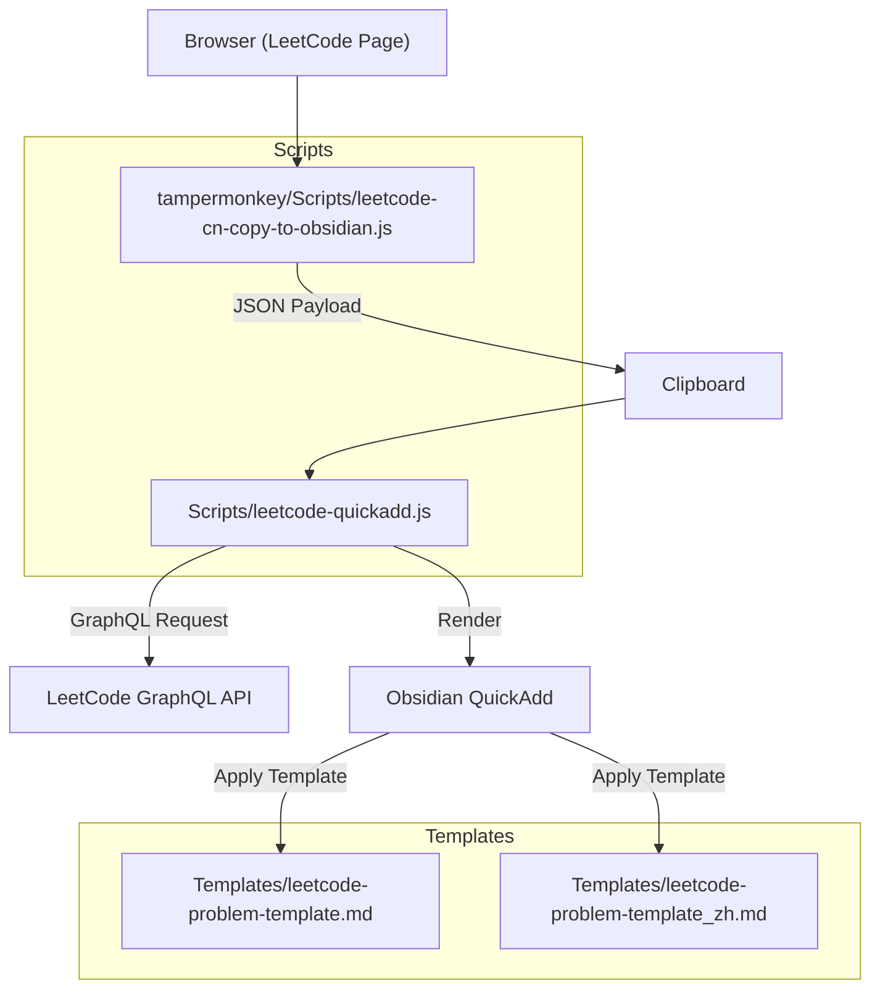
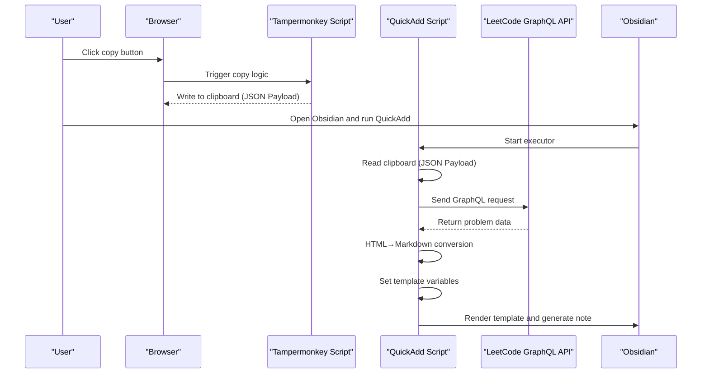
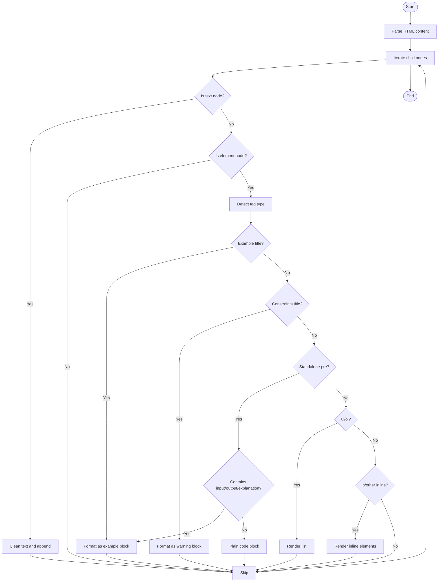
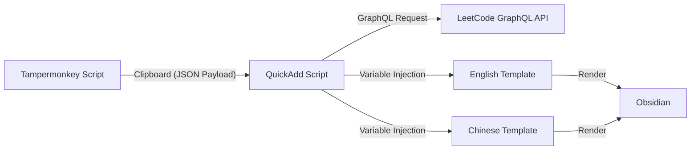

# Template System Design

<cite>
**Referenced Files in This Document**
- [Templates/leetcode-problem-template.md](file://Templates/leetcode-problem-template.md)
- [Templates/leetcode-problem-template_zh.md](file://Templates/leetcode-problem-template_zh.md)
- [Scripts/leetcode-quickadd.js](file://Scripts/leetcode-quickadd.js)
- [tampermonkey/Scripts/leetcode-cn-copy-to-obsidian.js](file://tampermonkey/Scripts/leetcode-cn-copy-to-obsidian.js)
</cite>

## Table of Contents
1. [Introduction](#introduction)
2. [Project Structure](#project-structure)
3. [Core Components](#core-components)
4. [Architecture Overview](#architecture-overview)
5. [Detailed Component Analysis](#detailed-component-analysis)
6. [Dependency Analysis](#dependency-analysis)
7. [Performance Considerations](#performance-considerations)
8. [Troubleshooting Guide](#troubleshooting-guide)
9. [Conclusion](#conclusion)
10. [Appendix](#appendix)

## Introduction
This template system is designed to build structured notes for LeetCode problems in Obsidian, supporting bilingual (Chinese/English) templates and automated data population. The system uses a Tampermonkey script to copy problem content and code from LeetCode CN to the clipboard, and then the QuickAdd executor in Obsidian reads the clipboard content and fetches problem details. Finally, standardized note content is generated through a template-variable-driven approach. The templates use YAML Front Matter to define metadata, and the body uses placeholders to inject dynamic data, achieving a "what-you-see-is-what-you-get" high-quality note experience.

## Project Structure
- Templates: Stores template files, including English and Chinese templates for note generation in different language environments.
- Scripts: Contains the Obsidian QuickAdd executor script, responsible for reading clipboard data, calling GraphQL to fetch problem information, setting template variables, and triggering template rendering.
- tampermonkey/Scripts: Contains the user script, which copies the current problem URL, language, and code to the clipboard from the LeetCode page for QuickAdd consumption.

Diagram Sources
- [Templates/leetcode-problem-template.md:1-35](file://Templates/leetcode-problem-template.md#L1-L35)
- [Templates/leetcode-problem-template_zh.md:1-41](file://Templates/leetcode-problem-template_zh.md#L1-L41)
- [Scripts/leetcode-quickadd.js:1-104](file://Scripts/leetcode-quickadd.js#L1-L104)
- [tampermonkey/Scripts/leetcode-cn-copy-to-obsidian.js:1-536](file://tampermonkey/Scripts/leetcode-cn-copy-to-obsidian.js#L1-L536)

Section Sources
- [Templates/leetcode-problem-template.md:1-35](file://Templates/leetcode-problem-template.md#L1-L35)
- [Templates/leetcode-problem-template_zh.md:1-41](file://Templates/leetcode-problem-template_zh.md#L1-L41)
- [Scripts/leetcode-quickadd.js:1-104](file://Scripts/leetcode-quickadd.js#L1-L104)
- [tampermonkey/Scripts/leetcode-cn-copy-to-obsidian.js:1-536](file://tampermonkey/Scripts/leetcode-cn-copy-to-obsidian.js#L1-L536)

## Core Components
- Template Engine and Variable System
  - Templates use a YAML Front Matter + Markdown body structure. Front Matter stores metadata while the body uses placeholders to inject dynamic content.
  - Placeholder syntax:
    - {{DATE}}: Date placeholder, injected by Obsidian QuickAdd at render time with the current time.
    - {{VALUE:xxx}}: Template variable placeholder, injected by the script at runtime with specific values.
- Data Source and Fetching Workflow
  - Clipboard Data: The Tampermonkey script wraps the problem URL, language, and code into a JSON payload and writes it to the clipboard.
  - GraphQL Fetching: QuickAdd pulls problem title, content, difficulty, tags, and hints from the LeetCode GraphQL API.
- Formatting and Adaptation
  - HTML to Markdown Conversion: Converts the rich-text content returned by LeetCode into Obsidian-friendly Markdown.
  - Internationalization Adaptation: English and Chinese templates differ in titles, section names, and default hint text, but share the same variable system.

Section Sources
- [Templates/leetcode-problem-template.md:1-35](file://Templates/leetcode-problem-template.md#L1-L35)
- [Templates/leetcode-problem-template_zh.md:1-41](file://Templates/leetcode-problem-template_zh.md#L1-L41)
- [Scripts/leetcode-quickadd.js:1-104](file://Scripts/leetcode-quickadd.js#L1-L104)
- [Scripts/leetcode-quickadd.js:409-430](file://Scripts/leetcode-quickadd.js#L409-L430)
- [Scripts/leetcode-quickadd.js:436-546](file://Scripts/leetcode-quickadd.js#L436-L546)
- [Scripts/leetcode-quickadd.js:801-812](file://Scripts/leetcode-quickadd.js#L801-L812)

## Architecture Overview
The overall workflow is as follows:
- The user clicks the Tampermonkey button on the LeetCode page, writing the problem URL, language, and code to the clipboard.
- The Obsidian QuickAdd executor starts, first reading the JSON payload from the clipboard. If unavailable, it enters manual mode (input URL/slug and optionally paste code).
- QuickAdd calls GraphQL to fetch problem details (title, content, difficulty, tags, hints, etc.) and converts the content from HTML to Markdown.
- The processed data is injected as template variables, and the template is rendered to generate notes.

Diagram Sources
- [Scripts/leetcode-quickadd.js:83-104](file://Scripts/leetcode-quickadd.js#L83-L104)
- [Scripts/leetcode-quickadd.js:339-404](file://Scripts/leetcode-quickadd.js#L339-L404)
- [Scripts/leetcode-quickadd.js:409-430](file://Scripts/leetcode-quickadd.js#L409-L430)
- [tampermonkey/Scripts/leetcode-cn-copy-to-obsidian.js:316-363](file://tampermonkey/Scripts/leetcode-cn-copy-to-obsidian.js#L316-L363)

## Detailed Component Analysis

### Template Variable System
Template variables are injected at runtime by the QuickAdd script, using the unified `{{VALUE:xxx}}` placeholder syntax. The following is an overview of all available variables, their purposes, and formatting rules (variable names and meanings come from the script implementation):

- Basic Metadata
  - {{VALUE:id}}: Problem number (frontend ID or backend ID)
  - {{VALUE:title}}: Problem title (translated title is used preferentially)
  - {{VALUE:link}}: LeetCode problem link
  - {{VALUE:difficulty}}: Difficulty (English: Easy/Medium/Hard; Chinese template translates to "简单/中等/困难")
  - {{VALUE:difficultyLink}}: Internal link form of difficulty (e.g., [[Difficulty]])
  - {{VALUE:titleSlug}}: Problem slug
  - {{VALUE:sourceUrl}}: Source URL (uses URL from clipboard preferentially, otherwise falls back to link)

- Content and Structure
  - {{VALUE:problemStatement}}: Problem description after HTML→Markdown conversion
  - {{VALUE:formattedHints}}: Formatted hints list, each presented as an Obsidian callout block
  - {{VALUE:tags}}: Formatted tag list, with tag prefix determined by settings (default: leetcode/)

- File and Code
  - {{VALUE:fileName}}: Normalized file name (illegal characters removed)
  - {{VALUE:language}}: Code language (after normalization)
  - {{VALUE:solutionCode}}: Solution code (after escaping and cleanup)

- Date Placeholder
  - {{DATE}}: Injected at render time by Obsidian QuickAdd with the current time

Section Sources
- [Scripts/leetcode-quickadd.js:409-430](file://Scripts/leetcode-quickadd.js#L409-L430)
- [Scripts/leetcode-quickadd.js:789-804](file://Scripts/leetcode-quickadd.js#L789-L804)
- [Scripts/leetcode-quickadd.js:832-834](file://Scripts/leetcode-quickadd.js#L832-L834)
- [Scripts/leetcode-quickadd.js:836-868](file://Scripts/leetcode-quickadd.js#L836-L868)

### Template Structure and Section Design
- English Template (Templates/leetcode-problem-template.md)
  - Front Matter: Contains metadata fields such as creation time, completion status, LeetCode number, link, difficulty, and tags.
  - Body: Includes sections such as "Problem Statement", "Hints", "Approach", "Solution", "Complexity Analysis", and "Reflections".
  - Code Block: Hardcoded to Python for unified style.
- Chinese Template (Templates/leetcode-problem-template_zh.md)
  - Front Matter: Identical to the English template, but section titles and default hint text are in Chinese.
  - Body: Includes sections such as "题目描述" (Problem Statement), "提示" (Hints), "解题思路" (Approach), "代码实现" (Solution), "复杂度分析" (Complexity Analysis), and "复盘总结" (Reflections).
  - Code Block: Language placeholder is injected via {{VALUE:language}}, supporting different languages.

Section Sources
- [Templates/leetcode-problem-template.md:1-35](file://Templates/leetcode-problem-template.md#L1-L35)
- [Templates/leetcode-problem-template_zh.md:1-41](file://Templates/leetcode-problem-template_zh.md#L1-L41)

### Internationalization Implementation
- Template Layer
  - English and Chinese templates coexist, each designed with section titles and default hint text tailored to user habits in different language environments.
- Data Layer
  - Difficulty fields are mapped between Chinese and English in the script (e.g., Easy→简单), ensuring consistent display in Front Matter and the body.
- Code Highlighting
  - The Chinese template's code block language is injected via {{VALUE:language}}, avoiding language mismatches caused by hardcoding.

Section Sources
- [Scripts/leetcode-quickadd.js:325-333](file://Scripts/leetcode-quickadd.js#L325-L333)
- [Templates/leetcode-problem-template_zh.md:29-32](file://Templates/leetcode-problem-template_zh.md#L29-L32)

### HTML to Markdown Conversion Mechanism
- Conversion Goals
  - Convert HTML content returned by LeetCode into Obsidian-friendly Markdown while preserving examples, lists, emphasis, images, and other structures.
- Key Processing
  - Example Detection: Recognizes "Example N" titles and subsequent code blocks to identify problem examples and converts them into Obsidian callout blocks.
  - Constraints: Recognizes the "Constraints" title and converts it into a warning callout.
  - Lists and Paragraphs: Recursively renders ul/ol/li structures, preserving nesting levels.
  - Inline Elements: Handles strong/em/code/sup/a/img and other tags, generating corresponding Markdown syntax.
  - Text Cleanup: Normalizes whitespace and removes excessive line breaks to ensure rendering consistency.

Diagram Sources
- [Scripts/leetcode-quickadd.js:436-546](file://Scripts/leetcode-quickadd.js#L436-L546)
- [Scripts/leetcode-quickadd.js:548-574](file://Scripts/leetcode-quickadd.js#L548-L574)
- [Scripts/leetcode-quickadd.js:576-628](file://Scripts/leetcode-quickadd.js#L576-L628)
- [Scripts/leetcode-quickadd.js:634-667](file://Scripts/leetcode-quickadd.js#L634-L667)
- [Scripts/leetcode-quickadd.js:669-723](file://Scripts/leetcode-quickadd.js#L669-L723)
- [Scripts/leetcode-quickadd.js:725-738](file://Scripts/leetcode-quickadd.js#L725-L738)
- [Scripts/leetcode-quickadd.js:740-783](file://Scripts/leetcode-quickadd.js#L740-L783)

Section Sources
- [Scripts/leetcode-quickadd.js:436-546](file://Scripts/leetcode-quickadd.js#L436-L546)

### Template Adaptation and Differences
- Section Titles and Default Text
  - English Template: Problem Statement, Hints, Approach, Complexity Analysis, Reflections
  - Chinese Template: 题目描述 (Problem Statement), 提示 (Hints), 解题思路 (Approach), 复杂度分析 (Complexity Analysis), 复盘总结 (Reflections)
- Code Block Language
  - English Template: Hardcoded to Python
  - Chinese Template: Injected via {{VALUE:language}}
- Default Tags
  - Templates contain fixed tag entries to facilitate unified categorization and search.

Section Sources
- [Templates/leetcode-problem-template.md:14-35](file://Templates/leetcode-problem-template.md#L14-L35)
- [Templates/leetcode-problem-template_zh.md:14-41](file://Templates/leetcode-problem-template_zh.md#L14-L41)

### Template Customization Guide
- Modifying Template Structure
  - Adjust section order and titles in the template files, ensuring one-to-one mapping with body placeholders.
  - Pay attention to the mapping between Front Matter fields and template variables to avoid omissions or conflicts.
- Adding Custom Variables
  - Extend the variable set in the QuickAdd script's `setQuickAddVariables` function, ensuring variable names match template placeholders.
  - Apply necessary formatting to new variables (e.g., HTML→Markdown, tag prefixing, difficulty translation).
- Adjusting Formatting Rules
  - To change rendering styles for callouts, example blocks, or lists, modify the corresponding formatting functions.
  - For general rules like file naming and language normalization, modify the corresponding utility functions.
- Language Adaptation
  - Create independent template files for new languages, keeping the variable system consistent and only adjusting section titles and default text.
  - Add language mapping or translation logic in the script to ensure consistency between Front Matter and the body.

Section Sources
- [Scripts/leetcode-quickadd.js:409-430](file://Scripts/leetcode-quickadd.js#L409-L430)
- [Scripts/leetcode-quickadd.js:789-804](file://Scripts/leetcode-quickadd.js#L789-L804)
- [Scripts/leetcode-quickadd.js:832-834](file://Scripts/leetcode-quickadd.js#L832-L834)
- [Scripts/leetcode-quickadd.js:836-868](file://Scripts/leetcode-quickadd.js#L836-L868)

### Practical Effects and Best Practices
- Automation First: Prefer the Tampermonkey script for copying to reduce manual input errors.
- Template Selection: Choose the appropriate template based on language preference; the Chinese template is better suited for Chinese users to read and search.
- Tag Management: Use the tag prefix setting to unify tag style, facilitating cross-tool sync and queries.
- Code Highlighting: The Chinese template's code block language is injected via variable to ensure correct highlighting.
- Content Quality: HTML→Markdown conversion preserves original meaning as much as possible; manual fine-tuning may be required for complex content.

Section Sources
- [Scripts/leetcode-quickadd.js:1-104](file://Scripts/leetcode-quickadd.js#L1-L104)
- [Scripts/leetcode-quickadd.js:789-804](file://Scripts/leetcode-quickadd.js#L789-L804)

### Maintenance and Update Guidance
- Version Compatibility: Pay attention to QuickAdd and Obsidian version updates, ensuring template variable syntax and rendering behavior remain unaffected.
- Template Evolution: When the template structure changes, synchronously update the variable injection and formatting logic in the script.
- Language Expansion: When adding new language templates, keep the variable system consistent and improve translation and default text.
- Error Handling: Add robustness checks to network requests, clipboard reading, and HTML parsing processes to improve stability.

Section Sources
- [Scripts/leetcode-quickadd.js:1-104](file://Scripts/leetcode-quickadd.js#L1-L104)
- [Scripts/leetcode-quickadd.js:339-404](file://Scripts/leetcode-quickadd.js#L339-L404)
- [Scripts/leetcode-quickadd.js:238-271](file://Scripts/leetcode-quickadd.js#L238-L271)

## Dependency Analysis
- Template Dependencies
  - The English template depends on {{VALUE:xxx}} and {{DATE}} placeholders; Front Matter depends on metadata fields.
  - The Chinese template depends on {{VALUE:xxx}} and {{DATE}} placeholders, and the code block language is injected via {{VALUE:language}}.
- Script Dependencies
  - The QuickAdd script depends on clipboard data provided by the Tampermonkey script and problem data from the LeetCode GraphQL API.
  - HTML→Markdown conversion depends on DOM parsing and regex matching to ensure clear content structure.
- External Dependencies
  - Browser Clipboard API and Tampermonkey GM_setClipboard.
  - Obsidian QuickAdd's variable injection and template rendering capabilities.

Diagram Sources
- [Scripts/leetcode-quickadd.js:1-104](file://Scripts/leetcode-quickadd.js#L1-L104)
- [Scripts/leetcode-quickadd.js:339-404](file://Scripts/leetcode-quickadd.js#L339-L404)
- [Scripts/leetcode-quickadd.js:409-430](file://Scripts/leetcode-quickadd.js#L409-L430)
- [Templates/leetcode-problem-template.md:1-35](file://Templates/leetcode-problem-template.md#L1-L35)
- [Templates/leetcode-problem-template_zh.md:1-41](file://Templates/leetcode-problem-template_zh.md#L1-L41)

Section Sources
- [Scripts/leetcode-quickadd.js:1-104](file://Scripts/leetcode-quickadd.js#L1-L104)
- [Scripts/leetcode-quickadd.js:339-404](file://Scripts/leetcode-quickadd.js#L339-L404)
- [Scripts/leetcode-quickadd.js:409-430](file://Scripts/leetcode-quickadd.js#L409-L430)
- [Templates/leetcode-problem-template.md:1-35](file://Templates/leetcode-problem-template.md#L1-L35)
- [Templates/leetcode-problem-template_zh.md:1-41](file://Templates/leetcode-problem-template_zh.md#L1-L41)

## Performance Considerations
- Network Requests
  - GraphQL requests are made once; consider caching necessary fields before template generation to reduce repeated requests.
- Clipboard Reading
  - Clipboard reading is asynchronous; set timeouts and fallback strategies to avoid blocking the main flow.
- HTML Parsing
  - Parsing and rendering large HTML segments may cause performance pressure; consider segmenting long content or deferring rendering.
- Template Rendering
  - The number and complexity of template variables directly affect rendering time; simplify variables and formatting logic where possible.

## Troubleshooting Guide
- No Clipboard Data
  - Verify the Tampermonkey button successfully wrote the JSON payload, and confirm browser clipboard permissions and GM_setClipboard availability.
  - If no clipboard data is found, QuickAdd enters manual mode, requiring manual URL/slug input and code paste.
- GraphQL Request Failure
  - Check network connectivity and API address; confirm request headers and Referer/Origin are correctly set.
  - If the response is empty, check whether the problem slug is correct.
- HTML→Markdown Conversion Anomalies
  - Check HTML content structure, confirming tag closure and text cleanup logic are effective.
  - For special formats (like complex tables), consider manual supplementation in the template or adjusting formatting rules.
- Template Variables Not Effective
  - Confirm variable names match template placeholders and check assignment logic in `setQuickAddVariables`.
  - For the date placeholder {{DATE}}, confirm QuickAdd's render timing and variable injection order.

Section Sources
- [Scripts/leetcode-quickadd.js:238-271](file://Scripts/leetcode-quickadd.js#L238-L271)
- [Scripts/leetcode-quickadd.js:339-404](file://Scripts/leetcode-quickadd.js#L339-L404)
- [Scripts/leetcode-quickadd.js:436-546](file://Scripts/leetcode-quickadd.js#L436-L546)
- [Scripts/leetcode-quickadd.js:409-430](file://Scripts/leetcode-quickadd.js#L409-L430)

## Conclusion
This template system combines "clipboard data + GraphQL fetching + template variable injection" to achieve efficient note generation from LeetCode to Obsidian. The English and Chinese templates demonstrate differentiated adaptation in section design and default text while sharing a unified variable system and formatting rules. By customizing variables appropriately, optimizing formatting logic, and enhancing error handling, users can enjoy a stable, consistent, and high-quality study note experience.

## Appendix
- Quick Reference
  - Template Variables: id, title, link, difficulty, difficultyLink, titleSlug, sourceUrl, problemStatement, formattedHints, tags, fileName, language, solutionCode, {{DATE}}
  - Template Files: Templates/leetcode-problem-template.md (English), Templates/leetcode-problem-template_zh.md (Chinese)
  - Executor Script: Scripts/leetcode-quickadd.js
  - User Script: tampermonkey/Scripts/leetcode-cn-copy-to-obsidian.js
