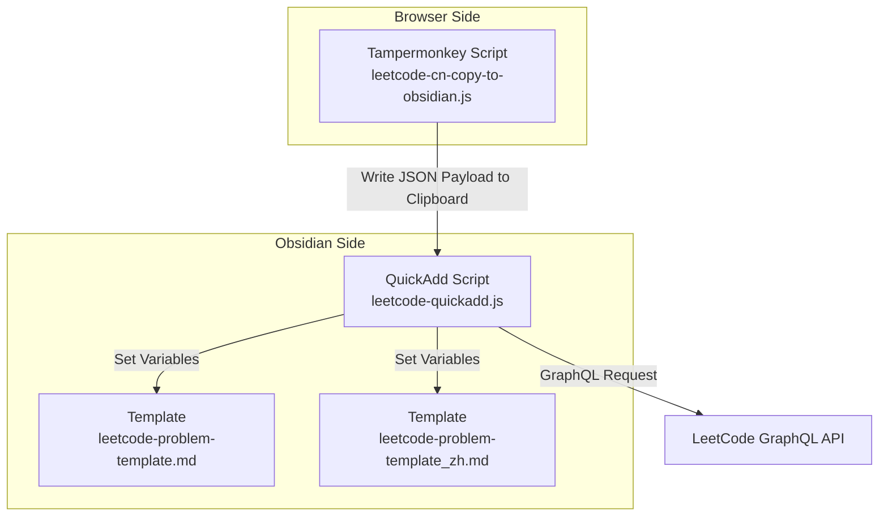
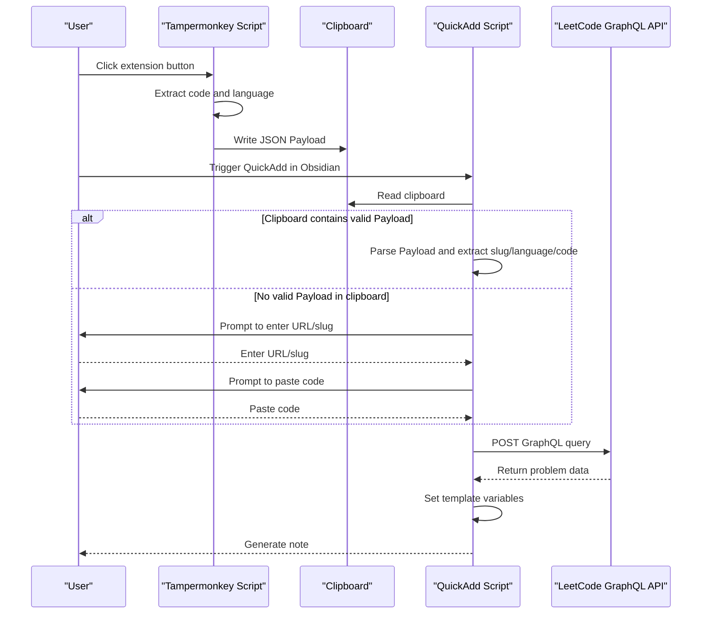
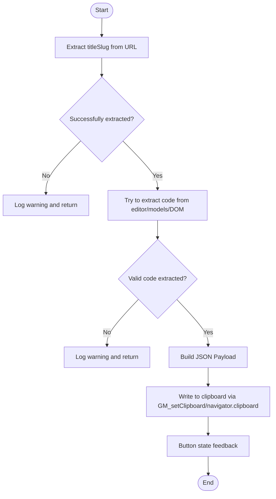
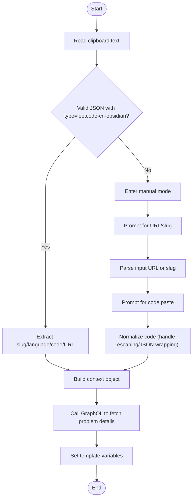
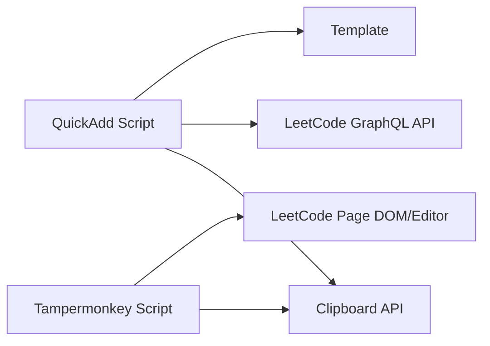

# Troubleshooting and FAQ

<cite>
**Referenced Files in This Document**
- [Scripts/leetcode-quickadd.js](file://Scripts/leetcode-quickadd.js)
- [tampermonkey/Scripts/leetcode-cn-copy-to-obsidian.js](file://tampermonkey/Scripts/leetcode-cn-copy-to-obsidian.js)
- [Templates/leetcode-problem-template.md](file://Templates/leetcode-problem-template.md)
- [Templates/leetcode-problem-template_zh.md](file://Templates/leetcode-problem-template_zh.md)
</cite>

## Table of Contents
1. [Introduction](#introduction)
2. [Project Structure](#project-structure)
3. [Core Components](#core-components)
4. [Architecture Overview](#architecture-overview)
5. [Detailed Component Analysis](#detailed-component-analysis)
6. [Dependency Analysis](#dependency-analysis)
7. [Performance Considerations](#performance-considerations)
8. [Troubleshooting Guide](#troubleshooting-guide)
9. [Frequently Asked Questions (FAQ)](#frequently-asked-questions-faq)
10. [Conclusion](#conclusion)
11. [Appendix](#appendix)

## Introduction
This guide is intended for users of the LeetCode to Obsidian workflow, focusing on the systematic diagnosis and resolution of the following typical issues:
- Browser extension not working (Tampermonkey script)
- Clipboard access permission issues
- API call failures (LeetCode GraphQL)
- Template rendering anomalies (variables not filled, format issues)
- QuickAdd workflow interruptions
- Logging and debugging tips
- Performance optimization and best practices
- Standard issue report format and channels

The goal is to help you quickly identify the root cause and provide actionable fix steps.

## Project Structure
This repository consists of three parts:
- Tampermonkey extension script: Responsible for fetching code from the LeetCode page and writing it to the clipboard for use by Obsidian.
- Obsidian QuickAdd script: Responsible for reading problem information from clipboard or manual input, fetching LeetCode data, and setting template variables.
- Template files: Define the YAML header, sections, and placeholders of the notes, used to render the final note.

Diagram Sources
- [Scripts/leetcode-quickadd.js:1-104](file://Scripts/leetcode-quickadd.js#L1-L104)
- [tampermonkey/Scripts/leetcode-cn-copy-to-obsidian.js:305-363](file://tampermonkey/Scripts/leetcode-cn-copy-to-obsidian.js#L305-L363)
- [Templates/leetcode-problem-template.md:1-35](file://Templates/leetcode-problem-template.md#L1-L35)
- [Templates/leetcode-problem-template_zh.md:1-41](file://Templates/leetcode-problem-template_zh.md#L1-L41)

Section Sources
- [Scripts/leetcode-quickadd.js:1-104](file://Scripts/leetcode-quickadd.js#L1-L104)
- [tampermonkey/Scripts/leetcode-cn-copy-to-obsidian.js:1-536](file://tampermonkey/Scripts/leetcode-cn-copy-to-obsidian.js#L1-L536)
- [Templates/leetcode-problem-template.md:1-35](file://Templates/leetcode-problem-template.md#L1-L35)
- [Templates/leetcode-problem-template_zh.md:1-41](file://Templates/leetcode-problem-template_zh.md#L1-L41)

## Core Components
- Tampermonkey Script: Extracts the current problem code and language from the LeetCode page, builds a standardized JSON payload, and writes it to the clipboard.
- QuickAdd Script: Reads the payload from the clipboard preferentially; otherwise enters manual mode. It then calls the LeetCode GraphQL to fetch problem details and sets template variables.
- Template: Provides Chinese and English templates with placeholders (such as {{VALUE:id}}, {{VALUE:title}}, etc.) for rendering notes.

Section Sources
- [Scripts/leetcode-quickadd.js:56-70](file://Scripts/leetcode-quickadd.js#L56-L70)
- [Scripts/leetcode-quickadd.js:83-104](file://Scripts/leetcode-quickadd.js#L83-L104)
- [tampermonkey/Scripts/leetcode-cn-copy-to-obsidian.js:316-363](file://tampermonkey/Scripts/leetcode-cn-copy-to-obsidian.js#L316-L363)

## Architecture Overview
The overall workflow is as follows:
- The user clicks the extension button on the LeetCode page; the script extracts code and language and writes a JSON payload to the clipboard.
- In Obsidian, QuickAdd is triggered. The script first attempts to read the clipboard. On failure, it enters manual mode (input URL/slug and code).
- The script calls LeetCode GraphQL to fetch problem details (title, content, difficulty, tags, hints, etc.).
- The result is injected into template variables to generate the note.

Diagram Sources
- [tampermonkey/Scripts/leetcode-cn-copy-to-obsidian.js:316-363](file://tampermonkey/Scripts/leetcode-cn-copy-to-obsidian.js#L316-L363)
- [Scripts/leetcode-quickadd.js:114-166](file://Scripts/leetcode-quickadd.js#L114-L166)
- [Scripts/leetcode-quickadd.js:339-404](file://Scripts/leetcode-quickadd.js#L339-L404)

## Detailed Component Analysis

### Component 1: Tampermonkey Script (Copy to Clipboard)
Responsibilities and Key Points:
- Extracts current problem code and language from the LeetCode page and builds a standardized JSON payload.
- Supports multiple editor model selection strategies with fallback options.
- Writes to the clipboard via GM_setClipboard or navigator.clipboard.
- Provides debugging helper functions to list and score all models.

Diagram Sources
- [tampermonkey/Scripts/leetcode-cn-copy-to-obsidian.js:316-363](file://tampermonkey/Scripts/leetcode-cn-copy-to-obsidian.js#L316-L363)
- [tampermonkey/Scripts/leetcode-cn-copy-to-obsidian.js:280-303](file://tampermonkey/Scripts/leetcode-cn-copy-to-obsidian.js#L280-L303)

Section Sources
- [tampermonkey/Scripts/leetcode-cn-copy-to-obsidian.js:280-303](file://tampermonkey/Scripts/leetcode-cn-copy-to-obsidian.js#L280-L303)
- [tampermonkey/Scripts/leetcode-cn-copy-to-obsidian.js:305-363](file://tampermonkey/Scripts/leetcode-cn-copy-to-obsidian.js#L305-L363)
- [tampermonkey/Scripts/leetcode-cn-copy-to-obsidian.js:498-536](file://tampermonkey/Scripts/leetcode-cn-copy-to-obsidian.js#L498-L536)

### Component 2: QuickAdd Script (Get Problem Info from Clipboard / Manual Input)
Responsibilities and Key Points:
- Reads the JSON payload from the clipboard preferentially, parsing slug, language, code, and URL.
- If no valid payload is in the clipboard, enters manual mode: input URL/slug and paste code.
- Calls LeetCode GraphQL to fetch problem details (title, content, difficulty, tags, hints).
- Sets template variables (id, title, link, difficulty, problemStatement, formattedHints, tags, fileName, language, solutionCode, sourceUrl, titleSlug).

Diagram Sources
- [Scripts/leetcode-quickadd.js:114-166](file://Scripts/leetcode-quickadd.js#L114-L166)
- [Scripts/leetcode-quickadd.js:339-404](file://Scripts/leetcode-quickadd.js#L339-L404)
- [Scripts/leetcode-quickadd.js:410-430](file://Scripts/leetcode-quickadd.js#L410-L430)

Section Sources
- [Scripts/leetcode-quickadd.js:114-166](file://Scripts/leetcode-quickadd.js#L114-L166)
- [Scripts/leetcode-quickadd.js:238-271](file://Scripts/leetcode-quickadd.js#L238-L271)
- [Scripts/leetcode-quickadd.js:339-404](file://Scripts/leetcode-quickadd.js#L339-L404)
- [Scripts/leetcode-quickadd.js:410-430](file://Scripts/leetcode-quickadd.js#L410-L430)

### Component 3: Template (Markdown Rendering)
Responsibilities and Key Points:
- Defines YAML header fields (such as leetcode-index, link, difficulty, tags, etc.).
- Defines sections (Problem Statement, Hints, Approach, Solution, Complexity Analysis, Reflections).
- Templates use {{VALUE:...}} placeholders, with values injected by QuickAdd.
- The Chinese template supports dynamic insertion of code blocks based on language.

Section Sources
- [Templates/leetcode-problem-template.md:1-35](file://Templates/leetcode-problem-template.md#L1-L35)
- [Templates/leetcode-problem-template_zh.md:1-41](file://Templates/leetcode-problem-template_zh.md#L1-L41)

## Dependency Analysis
- The QuickAdd script depends on the browser Clipboard API (navigator.clipboard) or Tampermonkey's GM_setClipboard.
- The QuickAdd script depends on the LeetCode GraphQL API (https://leetcode.cn/graphql/).
- The templates depend on variables ({{VALUE:...}}) injected by QuickAdd.
- The Tampermonkey script depends on the Monaco editor models and DOM structure of the LeetCode page.

Diagram Sources
- [Scripts/leetcode-quickadd.js:238-271](file://Scripts/leetcode-quickadd.js#L238-L271)
- [Scripts/leetcode-quickadd.js:339-404](file://Scripts/leetcode-quickadd.js#L339-L404)
- [tampermonkey/Scripts/leetcode-cn-copy-to-obsidian.js:305-363](file://tampermonkey/Scripts/leetcode-cn-copy-to-obsidian.js#L305-L363)

## Performance Considerations
- Reduce unnecessary DOM parsing and regex matching, only doing them when necessary.
- GraphQL queries should request only required fields, avoiding over-fetching.
- Code normalization and HTML rendering logic should avoid redundant computations.
- Before template rendering, perform necessary cleanup and trimming of large text segments to reduce Markdown rendering pressure.

[This section is general advice; no specific file source needed]

## Troubleshooting Guide

### 1. Browser Extension Not Working (Tampermonkey Script)
Common Symptoms
- Clicking the extension button has no effect.
- Button color does not change or errors occur.
- Console shows warnings such as "monaco.editor does not exist".

Investigation Steps
- Confirm the current page is a LeetCode problem page (matching rule: https://leetcode.cn/problems/*).
- Check whether Tampermonkey is enabled in the browser.
- Open DevTools and check the console for errors.
- Use the debugging helper function to list all models and confirm whether a valid code model exists.
- If automatic model selection is inaccurate, set MODEL_INDEX_OVERRIDE in the script to specify the index.

Diagnosis and Fix
- Page Matching and Injection: Confirm the page URL matches the @match rule.
- Editor Model Reading: Check whether monaco.editor is available and the editor is initialized.
- Clipboard Writing: Prefer GM_setClipboard; if unavailable, fall back to navigator.clipboard.

Section Sources
- [tampermonkey/Scripts/leetcode-cn-copy-to-obsidian.js:6-10](file://tampermonkey/Scripts/leetcode-cn-copy-to-obsidian.js#L6-L10)
- [tampermonkey/Scripts/leetcode-cn-copy-to-obsidian.js:280-303](file://tampermonkey/Scripts/leetcode-cn-copy-to-obsidian.js#L280-L303)
- [tampermonkey/Scripts/leetcode-cn-copy-to-obsidian.js:305-363](file://tampermonkey/Scripts/leetcode-cn-copy-to-obsidian.js#L305-L363)
- [tampermonkey/Scripts/leetcode-cn-copy-to-obsidian.js:498-536](file://tampermonkey/Scripts/leetcode-cn-copy-to-obsidian.js#L498-L536)

### 2. Clipboard Access Permission Issues
Common Symptoms
- QuickAdd cannot read the JSON payload from the clipboard.
- Console reports the Clipboard API is unavailable or read failure.

Investigation Steps
- Ensure the browser supports navigator.clipboard.readText.
- Run in HTTPS environment (modern browsers require a secure context).
- Check whether browser privacy settings block clipboard access.
- Try manually copying JSON to the clipboard, then trigger QuickAdd in Obsidian.

Diagnosis and Fix
- API Availability Check: When readText is unavailable, the script logs and falls back to manual mode.
- Permissions and Environment: Ensure use in a supported secure context.

Section Sources
- [Scripts/leetcode-quickadd.js:238-271](file://Scripts/leetcode-quickadd.js#L238-L271)

### 3. API Call Failure (LeetCode GraphQL)
Common Symptoms
- "No problem information retrieved from LeetCode CN."
- Console shows network errors or parse failures.

Investigation Steps
- Check network connectivity and proxy settings.
- Confirm the GraphQL address and Referer/Origin headers are correct.
- Check whether the returned JSON contains data.question.
- If the response is empty, the problem slug may be incorrect, or there may be network restrictions.

Diagnosis and Fix
- Request Headers and Cache: Set Content-Type, Referer, Origin, and disable caching.
- Error Handling: Catch exceptions and prompt the user to retry.

Section Sources
- [Scripts/leetcode-quickadd.js:339-404](file://Scripts/leetcode-quickadd.js#L339-L404)

### 4. Template Rendering Anomalies (Variables Not Filled, Format Issues)
Common Symptoms
- {{VALUE:...}} in the template is not replaced.
- Title, difficulty, tags, or code block format is abnormal.

Investigation Steps
- Confirm QuickAdd successfully set variables (fileName, difficultyLink, tags, formattedHints, language, solutionCode, sourceUrl, titleSlug).
- Check that placeholder spelling in the template is consistent.
- For the Chinese template, confirm the language variable is correctly set so the code block language is dynamically inserted.

Diagnosis and Fix
- Variable Setting: Check the assignment logic in setQuickAddVariables.
- Tags and Hints: Confirm the output format of formatTags and formatHints.
- Code Block Language: The Chinese template uses {{VALUE:language}}; ensure language is correct.

Section Sources
- [Scripts/leetcode-quickadd.js:410-430](file://Scripts/leetcode-quickadd.js#L410-L430)
- [Scripts/leetcode-quickadd.js:789-800](file://Scripts/leetcode-quickadd.js#L789-L800)
- [Scripts/leetcode-quickadd.js:801-812](file://Scripts/leetcode-quickadd.js#L801-L812)
- [Templates/leetcode-problem-template_zh.md:30-32](file://Templates/leetcode-problem-template_zh.md#L30-L32)

### 5. QuickAdd Workflow Interruption
Common Symptoms
- Manual mode cannot continue (no response after entering URL/slug).
- Code paste is not normalized, causing rendering anomalies.

Investigation Steps
- Confirm QuickAdd's inputPrompt/wideInputPrompt is available.
- Check whether parseLeetCodePayloadText correctly parses JSON.
- Verify that normalizeSolutionCode correctly handles escape characters.

Diagnosis and Fix
- Input Prompt: Choose wideInputPrompt or inputPrompt based on the QuickAdd version.
- JSON Parsing: Strictly validate the type field and required fields.
- Code Normalization: Handle escape characters and JSON wrapping.

Section Sources
- [Scripts/leetcode-quickadd.js:172-214](file://Scripts/leetcode-quickadd.js#L172-L214)
- [Scripts/leetcode-quickadd.js:216-232](file://Scripts/leetcode-quickadd.js#L216-L232)
- [Scripts/leetcode-quickadd.js:836-868](file://Scripts/leetcode-quickadd.js#L836-L868)

### 6. Logging and Debugging Tips
- Enable the Tampermonkey script's debugging helper functions to view model scores and previews.
- In the QuickAdd script, pay attention to log and warning output in the console.
- Check the browser DevTools Network panel to confirm GraphQL requests and responses.
- Test the Clipboard API in HTTPS environment.

Section Sources
- [tampermonkey/Scripts/leetcode-cn-copy-to-obsidian.js:498-536](file://tampermonkey/Scripts/leetcode-cn-copy-to-obsidian.js#L498-L536)
- [Scripts/leetcode-quickadd.js:42-43](file://Scripts/leetcode-quickadd.js#L42-L43)

## Frequently Asked Questions (FAQ)

Q1: Why does clicking the extension button have no effect?
- Check that the page is https://leetcode.cn/problems/*.
- Confirm Tampermonkey is enabled.
- Check the console for warnings such as "monaco.editor does not exist".

Q2: What if clipboard reading always fails?
- Ensure use in HTTPS environment.
- Check whether browser privacy settings allow clipboard access.
- Try manually copying JSON to the clipboard.

Q3: How to handle GraphQL request errors?
- Check network connectivity and proxy.
- Confirm Referer/Origin headers are set correctly.
- Verify the problem slug is correct.

Q4: {{VALUE:...}} in the template is not replaced?
- Confirm QuickAdd successfully set variables.
- Check placeholder spelling in the template.
- For the Chinese template, ensure the language variable is correct.

Q5: How to improve copy success rate?
- Use the debugging helper function to list models and choose the best index.
- When automatic selection is inaccurate, manually specify MODEL_INDEX_OVERRIDE.

Section Sources
- [tampermonkey/Scripts/leetcode-cn-copy-to-obsidian.js:6-10](file://tampermonkey/Scripts/leetcode-cn-copy-to-obsidian.js#L6-L10)
- [Scripts/leetcode-quickadd.js:238-271](file://Scripts/leetcode-quickadd.js#L238-L271)
- [Scripts/leetcode-quickadd.js:339-404](file://Scripts/leetcode-quickadd.js#L339-L404)
- [Templates/leetcode-problem-template_zh.md:30-32](file://Templates/leetcode-problem-template_zh.md#L30-L32)

## Conclusion
Through the layered analysis and systematic investigation above, you can quickly locate and resolve common issues in the LeetCode-to-Obsidian workflow. In daily use, we recommend:
- Maintain HTTPS environment and the latest browser version.
- Regularly check clipboard permissions and network connectivity.
- Use debugging tools and logs to assist with issue diagnosis.
- Follow template specifications to ensure correct variable injection.

[This section is summary content; no specific file source needed]

## Appendix

### A. Debugging Tools and Log Analysis
- Tampermonkey Debugging: Use __LC_OBSIDIAN_DEBUG_MODELS__ to view model scores and previews.
- Obsidian Logs: Pay attention to "[LeetCode QuickAdd]" and "[LeetCode Copy to Obsidian]" logs in the console.
- Network Panel: Check GraphQL requests and response bodies; confirm whether data.question exists.

Section Sources
- [tampermonkey/Scripts/leetcode-cn-copy-to-obsidian.js:498-536](file://tampermonkey/Scripts/leetcode-cn-copy-to-obsidian.js#L498-L536)
- [Scripts/leetcode-quickadd.js:42-43](file://Scripts/leetcode-quickadd.js#L42-L43)

### B. Performance Optimization Suggestions
- Parse HTML only when necessary; avoid full DOM traversal.
- Cache or deduplicate regex and string processing.
- Control text length before template rendering to reduce Markdown rendering load.
- Use wide input prompts judiciously; avoid processing too much data at once.

[This section is general advice; no specific file source needed]

### C. Issue Report Standard Format
When reporting an issue to the community or maintainers, please include the following information:
- Environment Info: Browser name and version, OS, Obsidian version, Tampermonkey version.
- Reproduction Steps: Specific operation flow with screenshots/recordings.
- Logs and Errors: Console output, Network panel screenshots.
- Templates and Settings: Template files used, QuickAdd settings.
- Expected vs. Actual Behavior: Clear comparison.

[This section is general advice; no specific file source needed]
