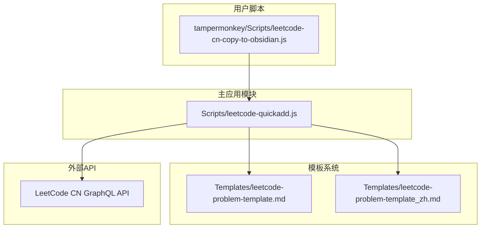
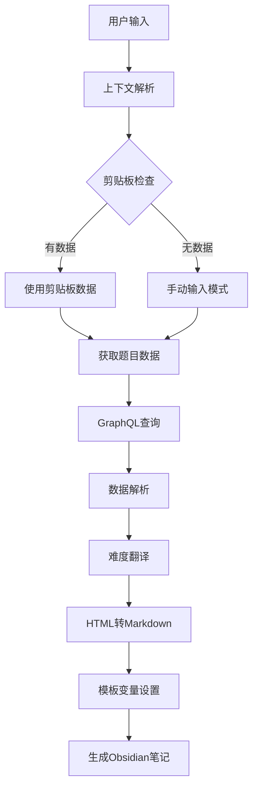
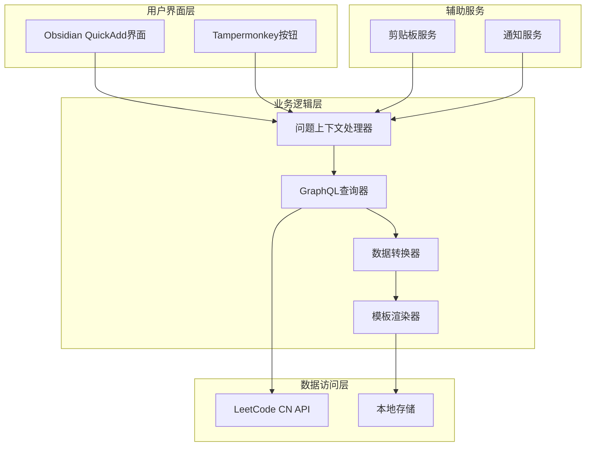
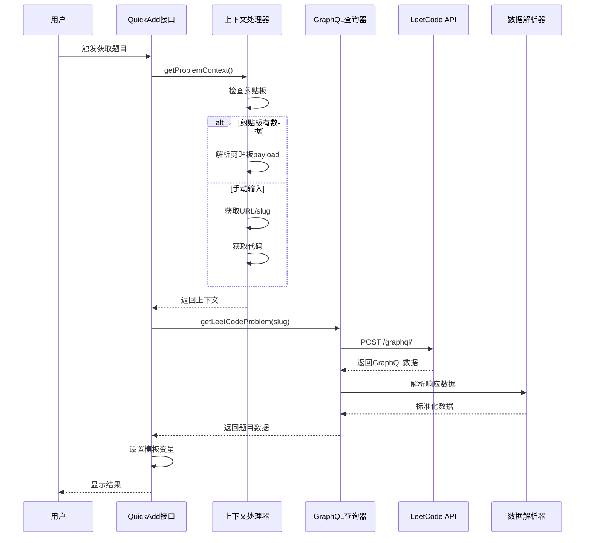
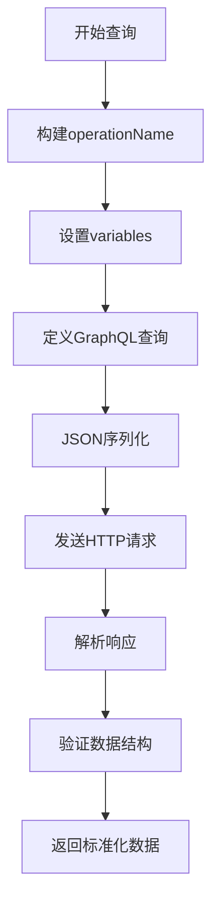
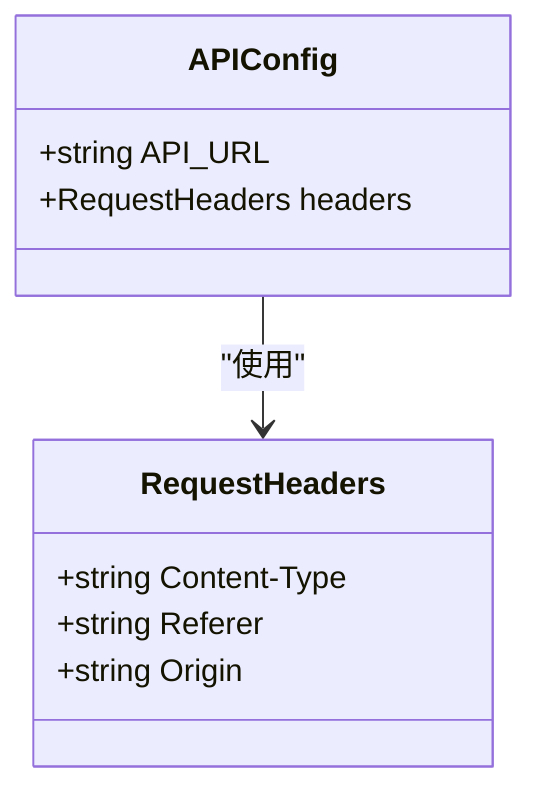
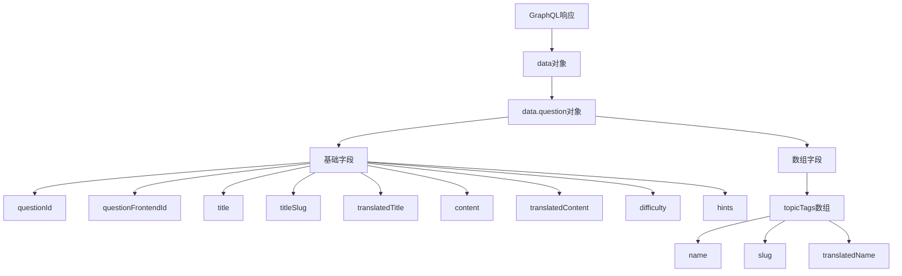
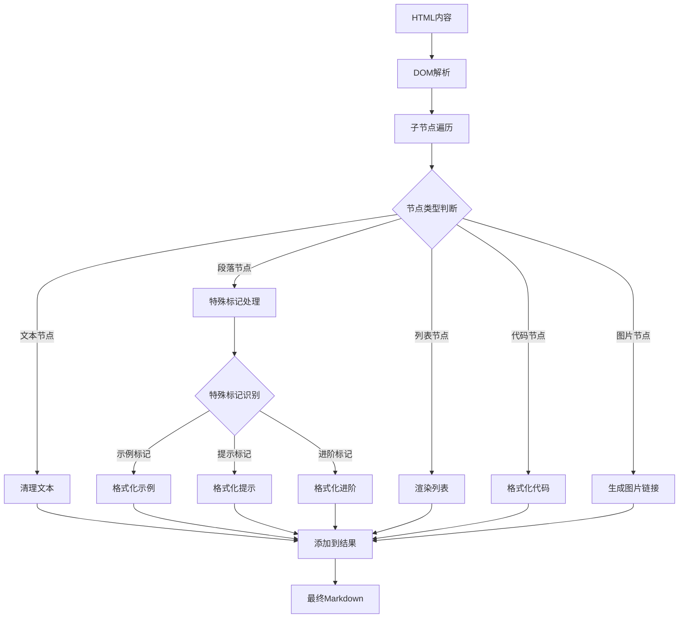
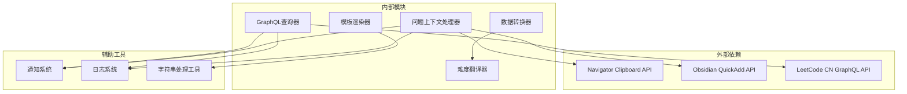
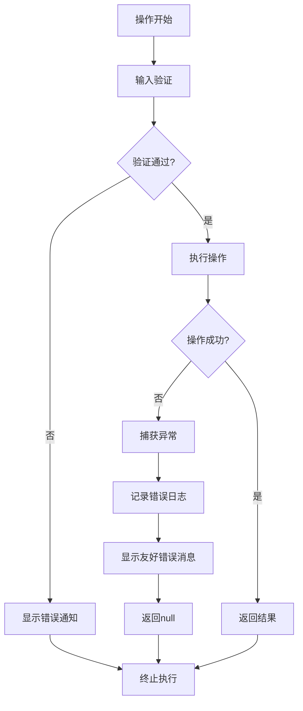

# API集成与数据获取

<cite>
**本文档引用的文件**
- [Scripts/leetcode-quickadd.js](file://Scripts/leetcode-quickadd.js)
- [Templates/leetcode-problem-template.md](file://Templates/leetcode-problem-template.md)
- [Templates/leetcode-problem-template_zh.md](file://Templates/leetcode-problem-template_zh.md)
- [tampermonkey/Scripts/leetcode-cn-copy-to-obsidian.js](file://tampermonkey/Scripts/leetcode-cn-copy-to-obsidian.js)
</cite>

## 目录
1. [简介](#简介)
2. [项目结构](#项目结构)
3. [核心组件](#核心组件)
4. [架构概览](#架构概览)
5. [详细组件分析](#详细组件分析)
6. [依赖关系分析](#依赖关系分析)
7. [性能考虑](#性能考虑)
8. [故障排除指南](#故障排除指南)
9. [结论](#结论)

## 简介

本文档详细介绍了LeetCode到Obsidian集成系统中的API集成与数据获取功能。该系统通过GraphQL查询从LeetCode中国站获取题目数据，支持多种输入方式（剪贴板、手动输入），并提供完整的数据转换和模板渲染功能。

系统的核心功能包括：
- GraphQL查询实现和请求发送机制
- 题目数据的解析和标准化
- 难度级别的翻译逻辑
- HTML到Markdown的格式转换
- 与Tampermonkey脚本的协作机制

## 项目结构

该项目采用模块化设计，主要包含以下组件：



**图表来源**
- [Scripts/leetcode-quickadd.js:1-50](file://Scripts/leetcode-quickadd.js#L1-L50)
- [Templates/leetcode-problem-template.md:1-35](file://Templates/leetcode-problem-template.md#L1-L35)
- [tampermonkey/Scripts/leetcode-cn-copy-to-obsidian.js:1-50](file://tampermonkey/Scripts/leetcode-cn-copy-to-obsidian.js#L1-L50)

**章节来源**
- [Scripts/leetcode-quickadd.js:1-100](file://Scripts/leetcode-quickadd.js#L1-L100)
- [Templates/leetcode-problem-template.md:1-35](file://Templates/leetcode-problem-template.md#L1-L35)
- [Templates/leetcode-problem-template_zh.md:1-41](file://Templates/leetcode-problem-template_zh.md#L1-L41)
- [tampermonkey/Scripts/leetcode-cn-copy-to-obsidian.js:1-100](file://tampermonkey/Scripts/leetcode-cn-copy-to-obsidian.js#L1-L100)

## 核心组件

### 主要功能模块

系统的核心功能由以下几个主要模块组成：

1. **问题获取模块** (`getLeetCodeProblem`函数)
2. **上下文处理模块** (`getProblemContext`函数)
3. **数据转换模块** (HTML到Markdown转换)
4. **模板渲染模块** (QuickAdd变量设置)
5. **难度翻译模块** (`translateDifficulty`函数)

### 数据流架构



**图表来源**
- [Scripts/leetcode-quickadd.js:83-166](file://Scripts/leetcode-quickadd.js#L83-L166)
- [Scripts/leetcode-quickadd.js:339-404](file://Scripts/leetcode-quickadd.js#L339-L404)

**章节来源**
- [Scripts/leetcode-quickadd.js:83-166](file://Scripts/leetcode-quickadd.js#L83-L166)
- [Scripts/leetcode-quickadd.js:339-404](file://Scripts/leetcode-quickadd.js#L339-L404)

## 架构概览

### 系统架构图



**图表来源**
- [Scripts/leetcode-quickadd.js:56-104](file://Scripts/leetcode-quickadd.js#L56-L104)
- [Scripts/leetcode-quickadd.js:339-404](file://Scripts/leetcode-quickadd.js#L339-L404)

### API调用序列图



**图表来源**
- [Scripts/leetcode-quickadd.js:83-104](file://Scripts/leetcode-quickadd.js#L83-L104)
- [Scripts/leetcode-quickadd.js:339-404](file://Scripts/leetcode-quickadd.js#L339-L404)

## 详细组件分析

### GraphQL查询实现

#### 查询构建

`getLeetCodeProblem`函数实现了完整的GraphQL查询构建过程：



**图表来源**
- [Scripts/leetcode-quickadd.js:339-404](file://Scripts/leetcode-quickadd.js#L339-L404)

#### GraphQL查询语法详解

查询使用了标准的GraphQL语法，包含以下关键元素：

**操作名称**: `questionData`
- 定义了GraphQL查询的名称，便于客户端识别和缓存

**变量定义**: `$titleSlug: String!`
- 使用非空字符串类型，确保必须提供有效的题目slug

**查询字段**: `question(titleSlug: $titleSlug)`
- 查询根字段，接受titleSlug参数

**返回字段映射**:
- `questionId`: 题目标识符
- `questionFrontendId`: 前端显示ID
- `title`: 英文标题
- `titleSlug`: URL友好的标题标识
- `translatedTitle`: 中文标题
- `content`: 英文内容
- `translatedContent`: 中文内容
- `difficulty`: 难度级别
- `hints`: 解题提示
- `topicTags`: 专题标签数组

**章节来源**
- [Scripts/leetcode-quickadd.js:339-404](file://Scripts/leetcode-quickadd.js#L339-L404)

### 请求头配置

请求头配置确保了与LeetCode服务器的正确通信：



**图表来源**
- [Scripts/leetcode-quickadd.js:49](file://Scripts/leetcode-quickadd.js#L49)
- [Scripts/leetcode-quickadd.js:368-378](file://Scripts/leetcode-quickadd.js#L368-L378)

**请求头字段说明**:

1. **Content-Type**: `application/json`
   - 指定请求体为JSON格式

2. **Referer**: `https://leetcode.cn/problems/${titleSlug}/`
   - 设置来源页面，模拟浏览器行为

3. **Origin**: `https://leetcode.cn`
   - 指定来源域名，满足CORS要求

**章节来源**
- [Scripts/leetcode-quickadd.js:368-378](file://Scripts/leetcode-quickadd.js#L368-L378)

### 响应数据解析

#### 数据结构分析

响应数据采用标准的GraphQL响应格式：



**图表来源**
- [Scripts/leetcode-quickadd.js:382-398](file://Scripts/leetcode-quickadd.js#L382-L398)

#### 字段提取和标准化

数据解析过程包括多个步骤：

1. **数据验证**: 检查`data.data.question`是否存在
2. **字段映射**: 将GraphQL字段映射到内部数据结构
3. **默认值处理**: 为缺失字段提供默认值
4. **格式标准化**: 统一数据格式和编码

**章节来源**
- [Scripts/leetcode-quickadd.js:382-398](file://Scripts/leetcode-quickadd.js#L382-L398)

### 难度级别翻译

#### 翻译逻辑实现

`translateDifficulty`函数实现了难度级别的中文翻译：

```mermaid
flowchart TD
A[输入难度级别] --> B{检查映射表}
B --> |Easy| C[返回"简单"]
B --> |Medium| D[返回"中等"]
B --> |Hard| E[返回"困难"]
B --> |其他| F[返回原值]
G[映射表] --> C
G --> D
G --> E
G --> F
```

**图表来源**
- [Scripts/leetcode-quickadd.js:325-333](file://Scripts/leetcode-quickadd.js#L325-L333)

**翻译规则**:
- Easy → 简单
- Medium → 中等  
- Hard → 困难
- 其他 → 保持原值

**章节来源**
- [Scripts/leetcode-quickadd.js:325-333](file://Scripts/leetcode-quickadd.js#L325-L333)

### HTML到Markdown转换

#### 转换算法流程

系统实现了复杂的HTML到Markdown转换逻辑：



**图表来源**
- [Scripts/leetcode-quickadd.js:436-546](file://Scripts/leetcode-quickadd.js#L436-L546)

**转换规则**:

1. **示例处理**: 识别"示例"标记，转换为引用块格式
2. **约束条件**: 识别"提示"标记，转换为警告样式
3. **进阶内容**: 识别"进阶"标记，转换为待办样式
4. **列表处理**: 支持有序和无序列表
5. **内联格式**: 支持粗体、斜体、上标等格式

**章节来源**
- [Scripts/leetcode-quickadd.js:436-546](file://Scripts/leetcode-quickadd.js#L436-L546)

## 依赖关系分析

### 组件依赖图



**图表来源**
- [Scripts/leetcode-quickadd.js:42-43](file://Scripts/leetcode-quickadd.js#L42-L43)
- [Scripts/leetcode-quickadd.js:49](file://Scripts/leetcode-quickadd.js#L49)

### 错误处理策略

系统采用了多层次的错误处理机制：



**错误处理层次**:

1. **输入验证**: 检查剪贴板数据和用户输入
2. **网络请求**: 处理API调用异常
3. **数据解析**: 处理JSON解析和数据结构验证
4. **格式转换**: 处理HTML到Markdown转换异常
5. **用户反馈**: 提供清晰的错误信息

**章节来源**
- [Scripts/leetcode-quickadd.js:238-271](file://Scripts/leetcode-quickadd.js#L238-L271)
- [Scripts/leetcode-quickadd.js:399-403](file://Scripts/leetcode-quickadd.js#L399-L403)

## 性能考虑

### 优化策略

1. **异步处理**: 所有网络请求和文件操作都使用Promise和async/await
2. **数据缓存**: 利用浏览器缓存机制减少重复请求
3. **内存管理**: 及时释放DOM节点和中间变量
4. **错误恢复**: 实现快速失败和优雅降级

### 性能监控

系统内置了基本的性能监控能力：
- 日志记录关键操作耗时
- 异常处理确保程序稳定性
- 资源清理防止内存泄漏

## 故障排除指南

### 常见问题及解决方案

#### 1. 剪贴板读取失败

**症状**: 无法从剪贴板读取LeetCode数据
**原因**: 浏览器安全限制或权限不足
**解决方案**: 
- 确保HTTPS环境
- 检查浏览器剪贴板API支持
- 手动输入题目URL或slug

#### 2. GraphQL查询失败

**症状**: 无法获取题目数据
**原因**: 网络连接问题或API变更
**解决方案**:
- 检查网络连接状态
- 验证API端点可用性
- 查看浏览器开发者工具中的错误信息

#### 3. HTML转换异常

**症状**: 题目内容格式不正确
**原因**: HTML结构变化或特殊字符处理
**解决方案**:
- 更新转换规则以适应新的HTML结构
- 检查特殊字符的编码处理
- 验证Markdown渲染效果

#### 4. 模板变量设置失败

**症状**: Obsidian笔记生成异常
**原因**: 变量名不匹配或数据格式错误
**解决方案**:
- 检查模板文件中的变量占位符
- 验证数据类型和格式
- 确认QuickAdd变量设置正确

**章节来源**
- [Scripts/leetcode-quickadd.js:267-271](file://Scripts/leetcode-quickadd.js#L267-L271)
- [Scripts/leetcode-quickadd.js:399-403](file://Scripts/leetcode-quickadd.js#L399-L403)

## 结论

该LeetCode到Obsidian集成系统通过精心设计的GraphQL查询和数据处理机制，实现了高效、可靠的API集成功能。系统的主要优势包括：

1. **模块化设计**: 清晰的功能分离和职责划分
2. **错误处理**: 完善的异常处理和用户反馈机制
3. **数据转换**: 强大的HTML到Markdown转换能力
4. **用户体验**: 简洁直观的操作流程和界面

系统为Obsidian用户提供了无缝的LeetCode题目管理和学习体验，通过自动化数据获取和模板渲染，大大提高了知识整理的效率。未来可以考虑增加更多自定义选项和扩展功能，以满足不同用户的需求。