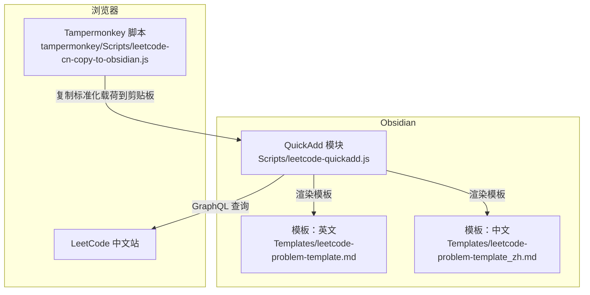
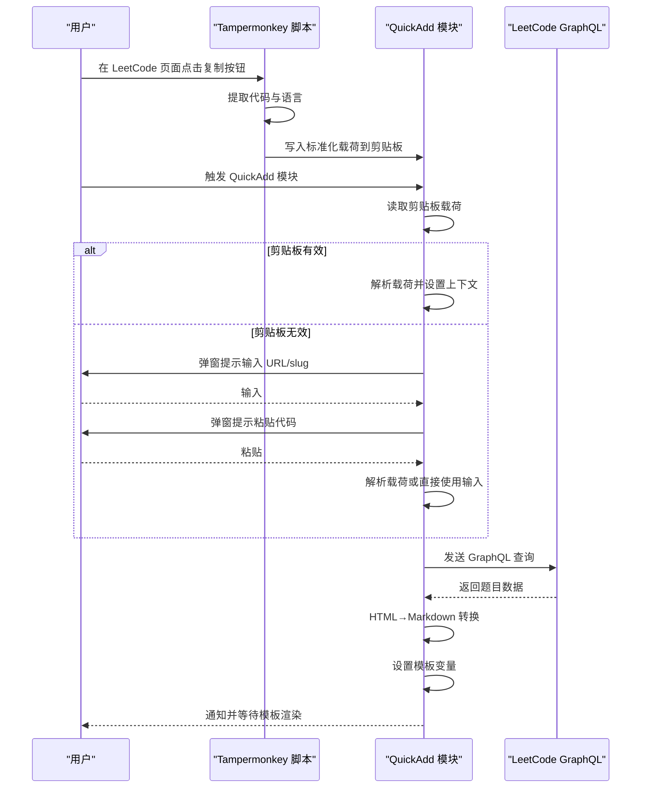
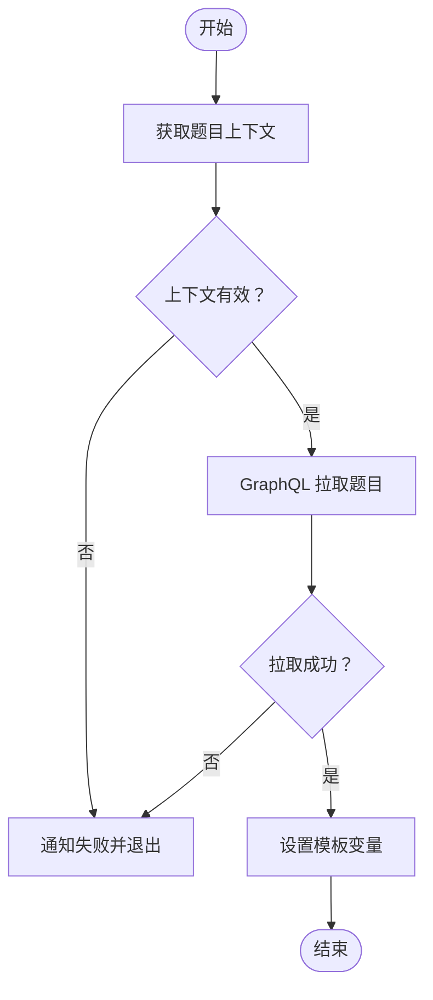
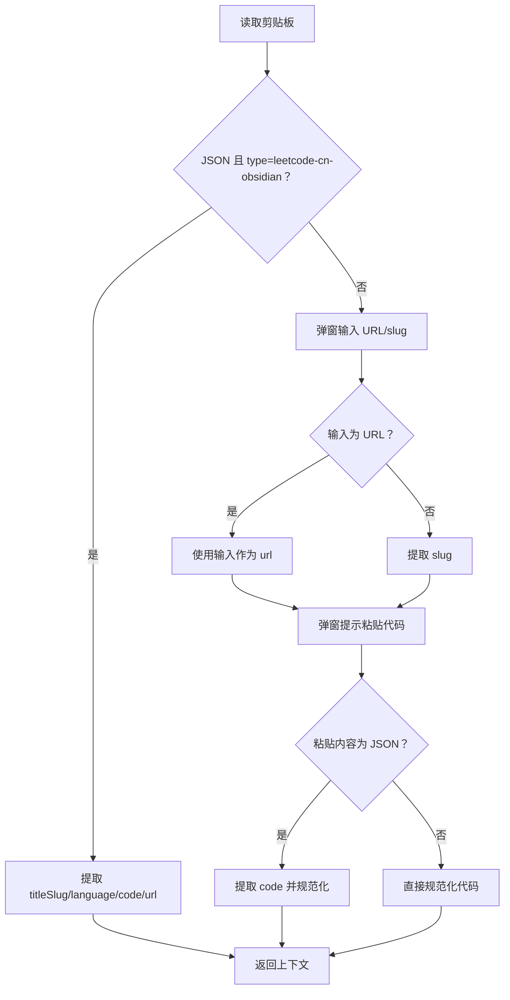
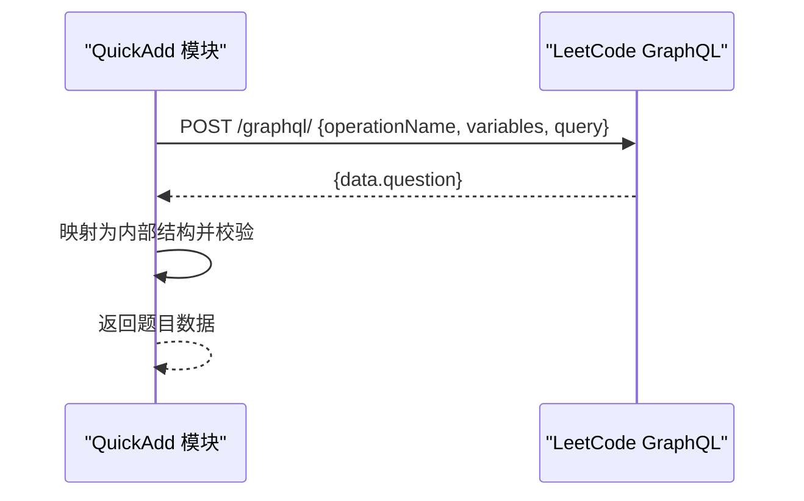
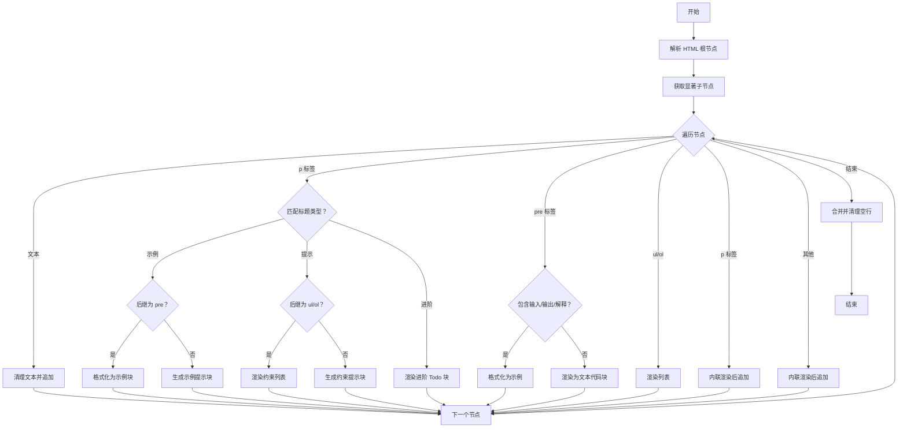
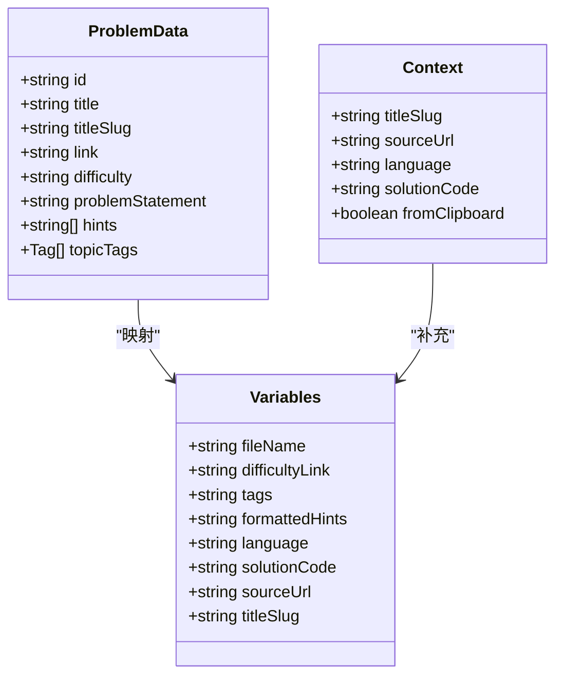
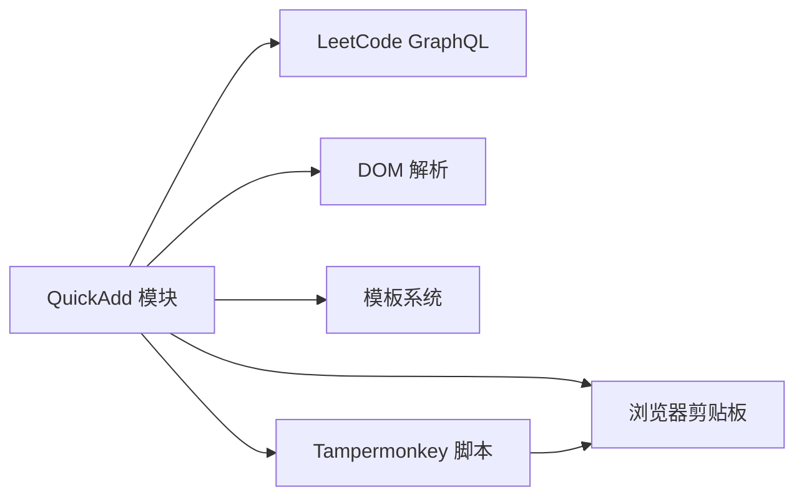

# Obsidian插件功能

<cite>
**本文引用的文件**
- [Scripts/leetcode-quickadd.js](file://Scripts/leetcode-quickadd.js)
- [Templates/leetcode-problem-template.md](file://Templates/leetcode-problem-template.md)
- [Templates/leetcode-problem-template_zh.md](file://Templates/leetcode-problem-template_zh.md)
- [tampermonkey/Scripts/leetcode-cn-copy-to-obsidian.js](file://tampermonkey/Scripts/leetcode-cn-copy-to-obsidian.js)
</cite>

## 目录
1. [简介](#简介)
2. [项目结构](#项目结构)
3. [核心组件](#核心组件)
4. [架构总览](#架构总览)
5. [详细组件分析](#详细组件分析)
6. [依赖关系分析](#依赖关系分析)
7. [性能考量](#性能考量)
8. [故障排除指南](#故障排除指南)
9. [结论](#结论)
10. [附录](#附录)

## 简介
本项目为 Obsidian 插件配套的自动化工作流，目标是将 LeetCode 中文站的题目信息与代码快速导入到 Obsidian 笔记中。其核心能力包括：
- 通过剪贴板读取 Tampermonkey 脚本复制的题目载荷，自动完成题目 slug、语言、代码与来源 URL 的提取
- 若剪贴板不可用或无有效载荷，回退到手动输入 URL/slug 与粘贴代码
- 通过 GraphQL 查询拉取中文站题目内容、难度、标签与提示
- 将 HTML 题目内容转换为 Obsidian 友好的 Markdown
- 设置 QuickAdd 模板变量，供模板渲染使用
- 支持标签前缀设置与中英双模板

该文档面向不同技术背景的用户，既提供高层架构说明，也包含代码级细节与可视化图示，帮助读者理解实现原理与使用方法。

## 项目结构
- Scripts/leetcode-quickadd.js：Obsidian QuickAdd 模块入口，负责输入收集、GraphQL 查询、HTML→Markdown 转换、变量设置与通知
- tampermonkey/Scripts/leetcode-cn-copy-to-obsidian.js：Tampermonkey 脚本，负责在 LeetCode 页面上自动提取代码与语言，并将标准化载荷写入剪贴板
- Templates/leetcode-problem-template.md：英文模板
- Templates/leetcode-problem-template_zh.md：中文模板

图表来源
- [Scripts/leetcode-quickadd.js:1-104](file://Scripts/leetcode-quickadd.js#L1-L104)
- [tampermonkey/Scripts/leetcode-cn-copy-to-obsidian.js:305-363](file://tampermonkey/Scripts/leetcode-cn-copy-to-obsidian.js#L305-L363)
- [Templates/leetcode-problem-template.md:1-35](file://Templates/leetcode-problem-template.md#L1-L35)
- [Templates/leetcode-problem-template_zh.md:1-41](file://Templates/leetcode-problem-template_zh.md#L1-L41)

章节来源
- [Scripts/leetcode-quickadd.js:1-104](file://Scripts/leetcode-quickadd.js#L1-L104)
- [tampermonkey/Scripts/leetcode-cn-copy-to-obsidian.js:12-536](file://tampermonkey/Scripts/leetcode-cn-copy-to-obsidian.js#L12-L536)
- [Templates/leetcode-problem-template.md:1-35](file://Templates/leetcode-problem-template.md#L1-L35)
- [Templates/leetcode-problem-template_zh.md:1-41](file://Templates/leetcode-problem-template_zh.md#L1-L41)

## 核心组件
- QuickAdd 模块入口与配置
  - 模块导出入口、名称、作者与设置项（标签前缀）
  - 主流程：获取上下文 → 拉取题目 → 设置变量 → 通知
- 输入与剪贴板处理
  - 优先从剪贴板读取标准化载荷；否则进入手动模式（URL/slug + 代码）
  - 支持宽输入框与降级输入框，自动解析 JSON 载荷中的 code 字段
- GraphQL 查询与数据处理
  - 构建查询体，发送 POST 请求，解析返回数据，映射为内部结构
- HTML→Markdown 转换引擎
  - 解析 HTML 结构，识别示例、约束、列表、图片、链接等，按规则转为 Obsidian 块/列表/引用块
- 模板变量与渲染
  - 设置文件名、难度链接、标签、格式化提示、语言、代码、来源 URL、slug 等变量
  - 中英模板分别渲染，中文模板包含代码块语言占位符

章节来源
- [Scripts/leetcode-quickadd.js:56-104](file://Scripts/leetcode-quickadd.js#L56-L104)
- [Scripts/leetcode-quickadd.js:114-166](file://Scripts/leetcode-quickadd.js#L114-L166)
- [Scripts/leetcode-quickadd.js:238-271](file://Scripts/leetcode-quickadd.js#L238-L271)
- [Scripts/leetcode-quickadd.js:339-404](file://Scripts/leetcode-quickadd.js#L339-L404)
- [Scripts/leetcode-quickadd.js:436-546](file://Scripts/leetcode-quickadd.js#L436-L546)
- [Scripts/leetcode-quickadd.js:410-430](file://Scripts/leetcode-quickadd.js#L410-L430)
- [Templates/leetcode-problem-template.md:1-35](file://Templates/leetcode-problem-template.md#L1-L35)
- [Templates/leetcode-problem-template_zh.md:1-41](file://Templates/leetcode-problem-template_zh.md#L1-L41)

## 架构总览
整体流程分为“浏览器侧载荷采集”和“Obsidian 侧处理与渲染”两部分：
- 浏览器侧：Tampermonkey 脚本在 LeetCode 页面自动提取代码与语言，构造标准化载荷并写入剪贴板
- Obsidian 侧：QuickAdd 优先读取剪贴板，若无则手动输入；随后通过 GraphQL 获取题目详情；将 HTML 内容转换为 Markdown；设置模板变量并触发模板渲染

图表来源
- [tampermonkey/Scripts/leetcode-cn-copy-to-obsidian.js:316-363](file://tampermonkey/Scripts/leetcode-cn-copy-to-obsidian.js#L316-L363)
- [Scripts/leetcode-quickadd.js:83-104](file://Scripts/leetcode-quickadd.js#L83-L104)
- [Scripts/leetcode-quickadd.js:339-404](file://Scripts/leetcode-quickadd.js#L339-L404)

## 详细组件分析

### QuickAdd 模块与主流程
- 模块导出：entry、settings（含标签前缀设置）
- 主流程：获取上下文 → 拉取题目 → 设置变量 → 通知
- 错误处理：对空 slug、请求失败、解析失败进行提示与短路返回

图表来源
- [Scripts/leetcode-quickadd.js:83-104](file://Scripts/leetcode-quickadd.js#L83-L104)
- [Scripts/leetcode-quickadd.js:94-99](file://Scripts/leetcode-quickadd.js#L94-L99)

章节来源
- [Scripts/leetcode-quickadd.js:56-104](file://Scripts/leetcode-quickadd.js#L56-L104)

### 输入与剪贴板处理
- 优先从剪贴板读取标准化载荷（type: leetcode-cn-obsidian），自动提取 titleSlug、language、code、url
- 若剪贴板无效或非标准载荷，进入手动模式：输入 URL/slug，再弹窗粘贴代码
- 自动解析粘贴内容是否为 JSON 载荷，若是则提取 code 字段；否则作为纯代码处理
- URL/slug 提取支持多种路径形式，兼容相对路径与完整 URL

图表来源
- [Scripts/leetcode-quickadd.js:238-271](file://Scripts/leetcode-quickadd.js#L238-L271)
- [Scripts/leetcode-quickadd.js:172-214](file://Scripts/leetcode-quickadd.js#L172-L214)
- [Scripts/leetcode-quickadd.js:216-232](file://Scripts/leetcode-quickadd.js#L216-L232)
- [Scripts/leetcode-quickadd.js:277-293](file://Scripts/leetcode-quickadd.js#L277-L293)

章节来源
- [Scripts/leetcode-quickadd.js:114-166](file://Scripts/leetcode-quickadd.js#L114-L166)
- [Scripts/leetcode-quickadd.js:238-271](file://Scripts/leetcode-quickadd.js#L238-L271)
- [Scripts/leetcode-quickadd.js:277-293](file://Scripts/leetcode-quickadd.js#L277-L293)

### GraphQL 查询与数据获取
- 查询名称与变量：questionData(titleSlug)
- 查询字段：题目 ID、前端 ID、标题、slug、翻译标题、内容、难度、提示、标签
- 请求头：Content-Type、Referer、Origin
- 数据映射：id、title、titleSlug、difficulty、link、topicTags、problemStatement、hints

图表来源
- [Scripts/leetcode-quickadd.js:339-404](file://Scripts/leetcode-quickadd.js#L339-L404)

章节来源
- [Scripts/leetcode-quickadd.js:339-404](file://Scripts/leetcode-quickadd.js#L339-L404)

### HTML→Markdown 转换引擎
- 核心策略
  - 遍历子节点，过滤空白文本与无意义节点
  - 识别示例标题（含“示例”字样）→ 尝试匹配紧随其后的代码块，若匹配则格式化为 Obsidian 示例块；否则生成提示性示例块
  - 识别提示标题（含“提示”字样）→ 若后继为有序/无序列表，则渲染为带引用的约束块；否则生成提示性约束块
  - 识别“进阶”标题→ 渲染为 Todo 块
  - 独立 pre 节点：若包含“输入/输出/解释”标签则按示例格式化，否则以文本代码块输出
  - 列表：递归渲染嵌套列表，支持有序/无序
  - 段落：内联元素转 Markdown，段落合并与去重
  - 图片与链接：内联渲染
- 文本规范化
  - 去除不可见字符、多余空白、统一换行
  - 行首引用块缩进与空行压缩
- 标签与提示
  - 标签：根据设置前缀拼接 slug
  - 提示：去除 HTML 标签，逐条渲染为引用块

图表来源
- [Scripts/leetcode-quickadd.js:436-546](file://Scripts/leetcode-quickadd.js#L436-L546)
- [Scripts/leetcode-quickadd.js:669-699](file://Scripts/leetcode-quickadd.js#L669-L699)
- [Scripts/leetcode-quickadd.js:725-738](file://Scripts/leetcode-quickadd.js#L725-L738)
- [Scripts/leetcode-quickadd.js:740-783](file://Scripts/leetcode-quickadd.js#L740-L783)

章节来源
- [Scripts/leetcode-quickadd.js:436-546](file://Scripts/leetcode-quickadd.js#L436-L546)
- [Scripts/leetcode-quickadd.js:789-800](file://Scripts/leetcode-quickadd.js#L789-L800)
- [Scripts/leetcode-quickadd.js:801-812](file://Scripts/leetcode-quickadd.js#L801-L812)

### 模板变量设置与渲染机制
- 变量清单
  - id、title、link、difficulty、problemStatement、hints、topicTags、titleSlug
  - fileName：由 id 与清洗后的标题组成
  - difficultyLink：难度值包裹为链接样式
  - tags：按设置前缀拼接 slug 列表
  - formattedHints：提示列表渲染为引用块
  - language：来自上下文的语言
  - solutionCode：规范化后的代码
  - sourceUrl：来源 URL
- 渲染逻辑
  - 中文模板：包含代码块语言占位符，便于后续替换
  - 英文模板：基础字段与结构

图表来源
- [Scripts/leetcode-quickadd.js:409-430](file://Scripts/leetcode-quickadd.js#L409-L430)
- [Scripts/leetcode-quickadd.js:832-834](file://Scripts/leetcode-quickadd.js#L832-L834)
- [Templates/leetcode-problem-template_zh.md:30-32](file://Templates/leetcode-problem-template_zh.md#L30-L32)

章节来源
- [Scripts/leetcode-quickadd.js:410-430](file://Scripts/leetcode-quickadd.js#L410-L430)
- [Templates/leetcode-problem-template.md:1-35](file://Templates/leetcode-problem-template.md#L1-L35)
- [Templates/leetcode-problem-template_zh.md:1-41](file://Templates/leetcode-problem-template_zh.md#L1-L41)

### 配置选项与国际化支持
- 标签前缀设置
  - 名称：LeetCode Tag Prefix
  - 类型：文本
  - 默认值：leetcode/
  - 作用：为每个标签添加统一前缀，便于分类与检索
- 国际化支持
  - 提供中英双模板，中文模板使用中文标题与代码语言占位符
  - 难度值本地化映射（如 Easy→简单）

章节来源
- [Scripts/leetcode-quickadd.js:58-70](file://Scripts/leetcode-quickadd.js#L58-L70)
- [Scripts/leetcode-quickadd.js:325-333](file://Scripts/leetcode-quickadd.js#L325-L333)
- [Templates/leetcode-problem-template_zh.md:14-41](file://Templates/leetcode-problem-template_zh.md#L14-L41)

### API 接口与参数说明
- GraphQL 查询
  - 端点：https://leetcode.cn/graphql/
  - 方法：POST
  - 请求头：Content-Type、Referer、Origin
  - 查询体：
    - operationName：questionData
    - variables：titleSlug
    - query：包含题目字段的查询
  - 返回：data.question 对象，包含题目元数据与内容
- 剪贴板载荷
  - type：leetcode-cn-obsidian
  - url：题目链接
  - titleSlug：题目 slug
  - language：编程语言
  - code：代码内容
  - copiedAt：复制时间戳（可选）

章节来源
- [Scripts/leetcode-quickadd.js:49-50](file://Scripts/leetcode-quickadd.js#L49-L50)
- [Scripts/leetcode-quickadd.js:341-378](file://Scripts/leetcode-quickadd.js#L341-L378)
- [Scripts/leetcode-quickadd.js:339-404](file://Scripts/leetcode-quickadd.js#L339-L404)
- [Scripts/leetcode-quickadd.js:336-344](file://Scripts/leetcode-quickadd.js#L336-L344)

## 依赖关系分析
- QuickAdd 模块依赖
  - QuickAdd API：输入提示、宽输入提示、变量设置
  - 浏览器剪贴板：读取 JSON 载荷
  - GraphQL API：拉取题目数据
  - DOM 解析：HTML→Markdown 转换
- 外部依赖
  - Tampermonkey 脚本：提供标准化载荷
  - Obsidian 模板系统：渲染变量

图表来源
- [Scripts/leetcode-quickadd.js:83-104](file://Scripts/leetcode-quickadd.js#L83-L104)
- [tampermonkey/Scripts/leetcode-cn-copy-to-obsidian.js:316-363](file://tampermonkey/Scripts/leetcode-cn-copy-to-obsidian.js#L316-L363)

章节来源
- [Scripts/leetcode-quickadd.js:83-104](file://Scripts/leetcode-quickadd.js#L83-L104)
- [tampermonkey/Scripts/leetcode-cn-copy-to-obsidian.js:12-536](file://tampermonkey/Scripts/leetcode-cn-copy-to-obsidian.js#L12-L536)

## 性能考量
- 剪贴板读取：仅在模块启动时进行一次读取，避免重复 IO
- GraphQL 请求：单次查询，字段精简，减少网络与解析开销
- HTML→Markdown：线性遍历 DOM 子节点，复杂度 O(N)，尽量避免深层递归
- 文本规范化：正则替换与字符串拼接，注意大文本时的内存占用
- 模板渲染：由 Obsidian 引擎负责，此处仅设置变量

## 故障排除指南
- 剪贴板不可用
  - 现象：无法读取标准化载荷，自动回退到手动模式
  - 处理：确认浏览器允许剪贴板访问；检查 Tampermonkey 脚本是否正常运行
- 未识别到题目 slug
  - 现象：输入 URL/slug 后仍提示失败
  - 处理：确认 URL 正确且包含 slug；或直接输入 slug
- GraphQL 请求失败
  - 现象：无法获取题目信息
  - 处理：检查网络连通性；确认端点可达；查看控制台错误
- HTML→Markdown 转换异常
  - 现象：题目内容渲染不符合预期
  - 处理：检查 HTML 结构；确认示例/提示标题文本；调整模板
- 标签前缀不生效
  - 现象：标签未带前缀
  - 处理：检查设置项是否正确保存；确认模板中 {{VALUE:tags}} 是否存在
- 代码未正确渲染
  - 现象：代码块为空或格式异常
  - 处理：确认剪贴板载荷中的 code 字段；检查规范化逻辑；中文模板语言占位符需后续替换

章节来源
- [Scripts/leetcode-quickadd.js:89-92](file://Scripts/leetcode-quickadd.js#L89-L92)
- [Scripts/leetcode-quickadd.js:96-99](file://Scripts/leetcode-quickadd.js#L96-L99)
- [Scripts/leetcode-quickadd.js:382-385](file://Scripts/leetcode-quickadd.js#L382-L385)
- [Scripts/leetcode-quickadd.js:792-793](file://Scripts/leetcode-quickadd.js#L792-L793)

## 结论
本项目通过浏览器脚本与 Obsidian 插件的协同，实现了从 LeetCode 中文站到 Obsidian 的高效知识迁移。其设计要点在于：
- 以标准化载荷为核心，简化跨端数据传递
- 以模板变量为中心，解耦数据与展示
- 以 HTML→Markdown 转换为桥梁，保证内容质量
- 以设置项与多模板为扩展点，满足不同用户需求

建议在实际使用中：
- 优先使用 Tampermonkey 脚本自动复制，减少手工输入
- 定期检查 GraphQL 端点与模板变量，确保稳定性
- 针对特殊 HTML 结构，适当调整转换规则或模板

## 附录
- 快速参考
  - 模块入口：entry 函数
  - 设置项：LeetCode Tag Prefix（默认 leetcode/）
  - 模板变量：id、title、link、difficulty、problemStatement、hints、topicTags、fileName、difficultyLink、tags、formattedHints、language、solutionCode、sourceUrl、titleSlug
  - GraphQL 端点：https://leetcode.cn/graphql/