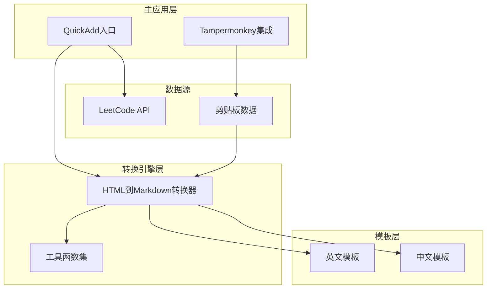
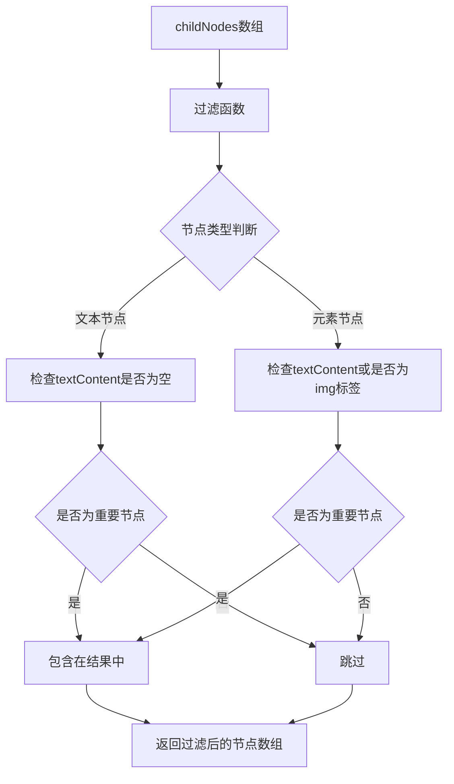
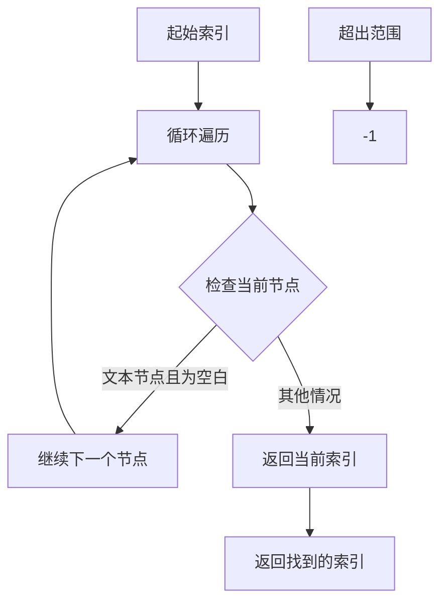
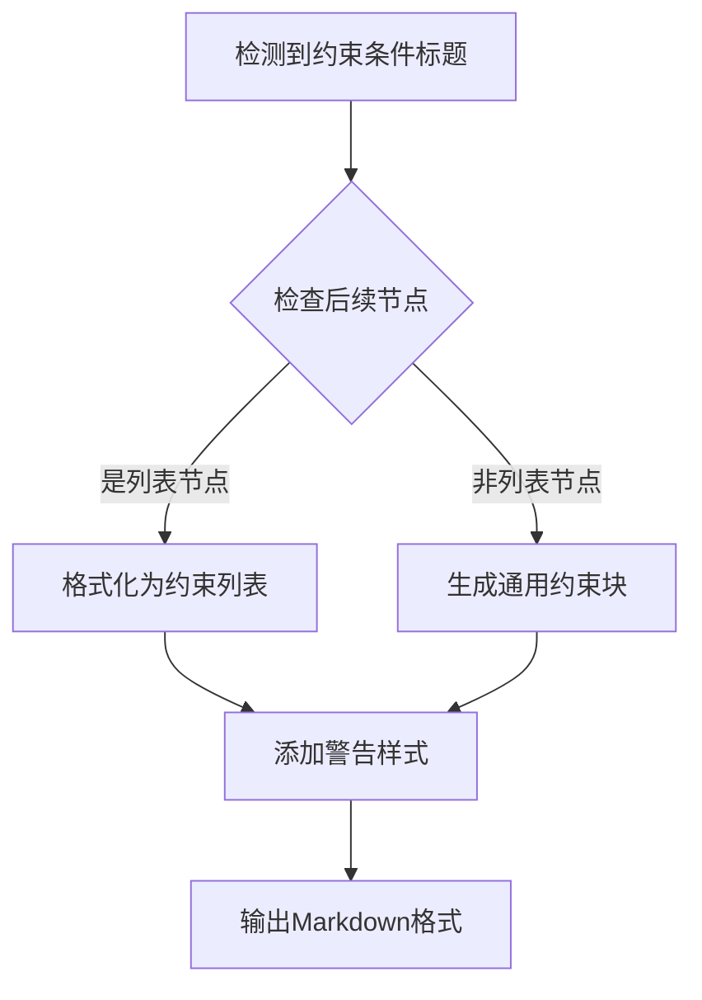
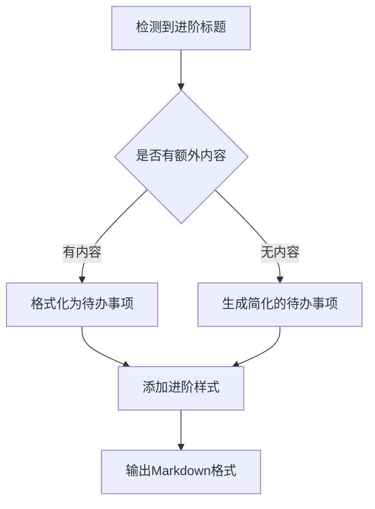
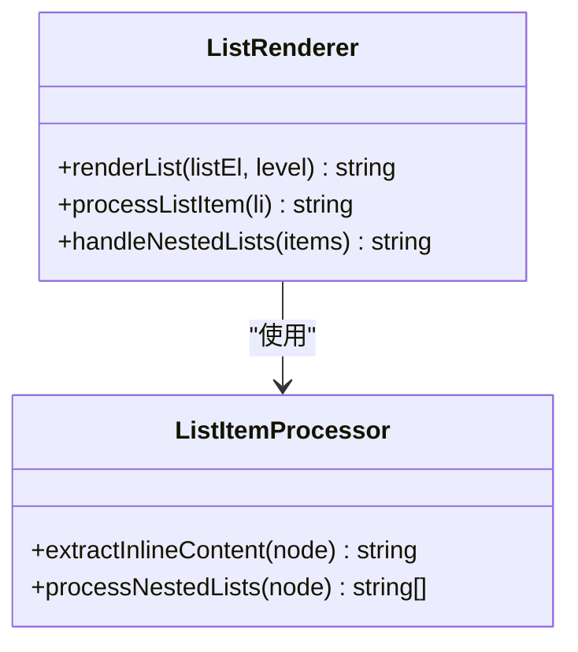
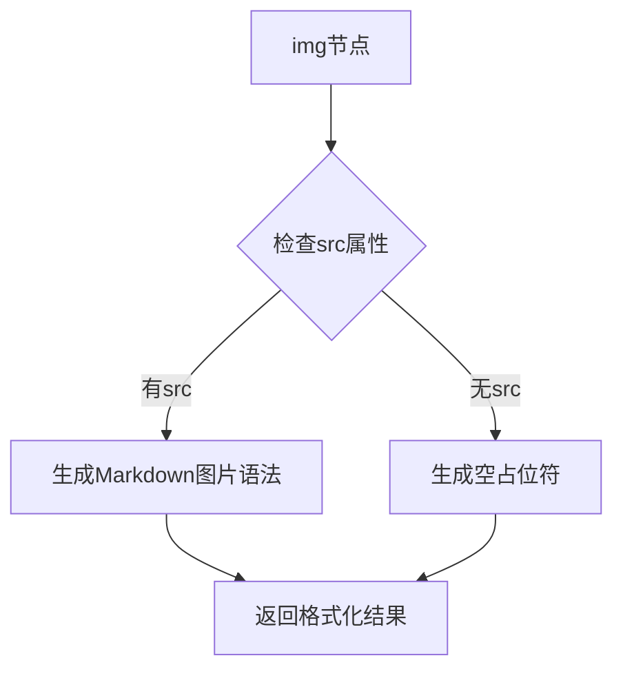
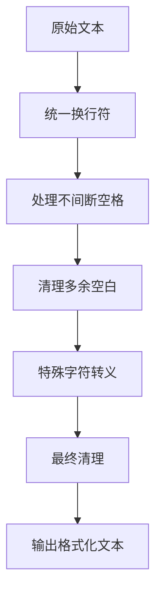
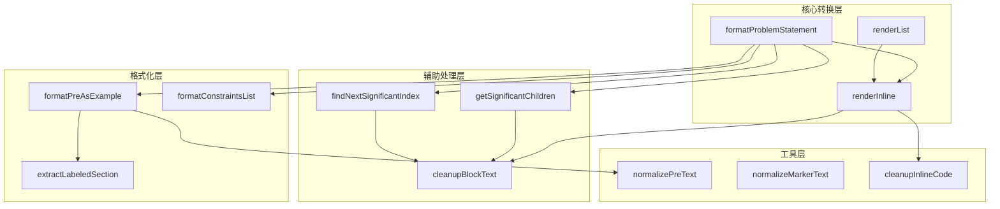

# HTML到Markdown转换引擎

<cite>
**本文档引用的文件**
- [leetcode-quickadd.js](file://Scripts/leetcode-quickadd.js)
- [leetcode-cn-copy-to-obsidian.js](file://tampermonkey/Scripts/leetcode-cn-copy-to-obsidian.js)
- [leetcode-problem-template.md](file://Templates/leetcode-problem-template.md)
- [leetcode-problem-template_zh.md](file://Templates/leetcode-problem-template_zh.md)
</cite>

## 目录
1. [简介](#简介)
2. [项目结构](#项目结构)
3. [核心组件](#核心组件)
4. [架构概览](#架构概览)
5. [详细组件分析](#详细组件分析)
6. [依赖关系分析](#依赖关系分析)
7. [性能考虑](#性能考虑)
8. [故障排除指南](#故障排除指南)
9. [结论](#结论)

## 简介

本文档深入分析了LeetCode到Obsidian转换引擎的HTML到Markdown转换功能，重点解释`formatProblemStatement`函数的核心转换逻辑。该引擎负责将LeetCode中文站的HTML格式题目内容转换为Obsidian兼容的Markdown格式，包括DOM解析、节点遍历、格式化规则以及各种HTML结构的处理机制。

该转换引擎采用模块化设计，通过多个专门的函数处理不同的HTML节点类型和格式化需求，确保转换结果既保持原意又符合Obsidian的Markdown语法规范。

## 项目结构

该项目采用清晰的功能模块化组织，主要包含以下组件：



**图表来源**
- [leetcode-quickadd.js:1-868](file://Scripts/leetcode-quickadd.js#L1-L868)
- [leetcode-cn-copy-to-obsidian.js:1-536](file://tampermonkey/Scripts/leetcode-cn-copy-to-obsidian.js#L1-L536)

**章节来源**
- [leetcode-quickadd.js:1-868](file://Scripts/leetcode-quickadd.js#L1-L868)
- [leetcode-cn-copy-to-obsidian.js:1-536](file://tampermonkey/Scripts/leetcode-cn-copy-to-obsidian.js#L1-L536)

## 核心组件

### HTML到Markdown转换器

转换引擎的核心是`formatProblemStatement`函数，它实现了完整的HTML到Markdown转换流程。该函数采用DOM解析和节点遍历相结合的方式，针对不同类型的HTML节点应用相应的转换规则。

### 工具函数集

系统提供了丰富的辅助函数，包括：
- 节点过滤函数：`getSignificantChildren`、`findNextSignificantIndex`
- 文本清理函数：`cleanupBlockText`、`cleanupInlineCode`
- 格式化函数：`formatPreAsExample`、`renderList`
- 正则表达式函数：`extractLabeledSection`

**章节来源**
- [leetcode-quickadd.js:436-783](file://Scripts/leetcode-quickadd.js#L436-L783)

## 架构概览

转换引擎采用分层架构设计，从上到下分为数据获取层、转换处理层和格式化输出层：

```mermaid
flowchart TD
A[HTML输入] --> B[DOM解析]
B --> C[节点遍历]
C --> D{节点类型判断}
D --> |文本节点(3)| E[文本清理]
D --> |元素节点(1)| F[元素处理]
E --> G[格式化输出]
F --> H{标签类型判断}
H --> |示例标题| I[示例格式化]
H --> |约束条件| J[约束列表格式化]
H --> |进阶内容| K[进阶格式化]
H --> |代码块| L[代码块格式化]
H --> |列表| M[列表渲染]
H --> |段落| N[段落格式化]
H --> |图片| O[图片格式化]
I --> G
J --> G
K --> G
L --> G
M --> G
N --> G
O --> G
```

**图表来源**
- [leetcode-quickadd.js:436-546](file://Scripts/leetcode-quickadd.js#L436-L546)
- [leetcode-quickadd.js:548-574](file://Scripts/leetcode-quickadd.js#L548-L574)

## 详细组件分析

### formatProblemStatement函数详解

`formatProblemStatement`是整个转换引擎的核心函数，负责处理HTML到Markdown的完整转换流程。

#### 核心处理流程

```mermaid
sequenceDiagram
participant HTML as HTML输入
participant DOM as DOM解析器
participant CHILD as 子节点过滤
participant LOOP as 节点遍历循环
participant TYPE as 类型判断
participant FORMAT as 格式化处理
participant OUTPUT as 输出结果
HTML->>DOM : 创建临时DOM节点
DOM->>CHILD : 获取重要子节点
CHILD->>LOOP : 遍历节点数组
LOOP->>TYPE : 判断节点类型
TYPE->>FORMAT : 应用相应格式化规则
FORMAT->>OUTPUT : 生成Markdown片段
OUTPUT->>OUTPUT : 合并并清理格式
```

**图表来源**
- [leetcode-quickadd.js:436-546](file://Scripts/leetcode-quickadd.js#L436-L546)

#### HTML节点类型处理机制

系统严格区分和处理两种主要的DOM节点类型：

**文本节点(节点类型3)**
- 直接进行文本清理和格式化
- 移除多余的空白字符和换行符
- 保持文本内容的完整性

**元素节点(节点类型1)**
- 通过标签名进行分类处理
- 支持多种HTML标签的特殊处理逻辑
- 对嵌套元素进行递归处理

**章节来源**
- [leetcode-quickadd.js:449-455](file://Scripts/leetcode-quickadd.js#L449-L455)

### 节点过滤机制

#### getSignificantChildren函数

该函数负责过滤DOM树中的重要子节点，实现智能的节点选择：



**图表来源**
- [leetcode-quickadd.js:548-560](file://Scripts/leetcode-quickadd.js#L548-L560)

#### findNextSignificantIndex函数

该函数实现智能的索引查找机制，用于定位下一个重要节点：



**图表来源**
- [leetcode-quickadd.js:562-574](file://Scripts/leetcode-quickadd.js#L562-L574)

**章节来源**
- [leetcode-quickadd.js:548-574](file://Scripts/leetcode-quickadd.js#L548-L574)

### HTML结构转换规则

#### 示例标题识别模式

系统能够智能识别和处理示例标题，支持多种格式：

| 标题格式 | 识别模式 | 处理方式 |
|---------|---------|---------|
| 示例 1 | `/^示例\s*\d+\s*[：:]?$/` | 格式化为示例块 |
| 示例 1： | `/^示例\s*\d+\s*[：:]$/` | 格式化为示例块 |
| 示例1 | `/^示例\d+[：:]?$/` | 格式化为示例块 |

#### 约束条件处理

约束条件通过特定的标题模式识别，并转换为警告块：



**图表来源**
- [leetcode-quickadd.js:477-494](file://Scripts/leetcode-quickadd.js#L477-L494)

#### 进阶内容格式化

进阶内容通过特定的标题模式识别，转换为待办事项格式：



**图表来源**
- [leetcode-quickadd.js:496-507](file://Scripts/leetcode-quickadd.js#L496-L507)

#### 列表渲染

系统支持有序列表和无序列表的递归渲染：



**图表来源**
- [leetcode-quickadd.js:634-667](file://Scripts/leetcode-quickadd.js#L634-L667)

#### 图片处理

图片节点通过`renderInline`函数处理，支持标准的Markdown图片语法：



**图表来源**
- [leetcode-quickadd.js:611-614](file://Scripts/leetcode-quickadd.js#L611-L614)

**章节来源**
- [leetcode-quickadd.js:460-540](file://Scripts/leetcode-quickadd.js#L460-L540)

### 文本清理和格式化优化

#### 文本清理函数族

系统提供了多层次的文本清理函数，确保输出质量：

| 函数 | 用途 | 处理内容 |
|------|------|----------|
| `cleanupBlockText` | 块级文本清理 | 换行符、空白字符、多余空格 |
| `cleanupInlineCode` | 行内代码清理 | 反引号转义、换行符处理 |
| `normalizePreText` | 代码块文本标准化 | 回车符、不间断空格、缩进处理 |
| `normalizeMarkerText` | 标记文本标准化 | 统一空白字符、去除多余空格 |

#### 特殊字符处理

系统采用正则表达式处理各种特殊字符和格式问题：



**图表来源**
- [leetcode-quickadd.js:740-783](file://Scripts/leetcode-quickadd.js#L740-L783)

**章节来源**
- [leetcode-quickadd.js:740-783](file://Scripts/leetcode-quickadd.js#L740-L783)

### 转换示例和边界情况处理

#### 完整转换示例

系统能够处理复杂的HTML结构，包括嵌套元素、混合内容等场景。转换过程遵循严格的顺序和优先级规则。

#### 边界情况处理

系统针对各种边界情况进行了专门处理：

- **空节点处理**：自动跳过空的文本节点和无内容的元素节点
- **特殊字符处理**：正确处理HTML实体、Unicode字符、特殊ASCII字符
- **格式化优化**：自动合并连续的空行，保持适当的间距
- **错误恢复**：在遇到异常情况时提供合理的降级处理

**章节来源**
- [leetcode-quickadd.js:436-546](file://Scripts/leetcode-quickadd.js#L436-L546)

## 依赖关系分析

### 组件耦合度分析



**图表来源**
- [leetcode-quickadd.js:436-783](file://Scripts/leetcode-quickadd.js#L436-L783)

### 外部依赖和集成点

系统通过Tampermonkey脚本与LeetCode网站集成，实现自动化的数据捕获和转换：

- **剪贴板集成**：通过Tampermonkey脚本自动复制题目数据
- **API集成**：调用LeetCode GraphQL API获取题目内容
- **Obsidian集成**：与QuickAdd插件无缝对接

**章节来源**
- [leetcode-cn-copy-to-obsidian.js:305-363](file://tampermonkey/Scripts/leetcode-cn-copy-to-obsidian.js#L305-L363)

## 性能考虑

### 时间复杂度分析

- **DOM解析**：O(n)，其中n为HTML节点数量
- **节点遍历**：O(n)，每个节点仅访问一次
- **文本清理**：O(m)，其中m为文本长度
- **整体复杂度**：O(n+m)

### 空间复杂度分析

- **DOM存储**：O(n)，临时DOM节点存储
- **结果存储**：O(m)，转换后的Markdown文本
- **中间变量**：O(k)，其中k为处理过程中的临时数据

### 优化策略

1. **早期过滤**：通过`getSignificantChildren`提前过滤无关节点
2. **懒加载处理**：仅在需要时处理嵌套元素
3. **缓存机制**：对重复使用的正则表达式进行缓存
4. **内存管理**：及时释放临时DOM节点引用

## 故障排除指南

### 常见问题诊断

#### 转换结果异常

**症状**：Markdown格式不符合预期
**可能原因**：
- HTML结构过于复杂，超出处理能力
- 特殊字符未正确处理
- 标签格式不规范

**解决方案**：
- 检查HTML输入的规范性
- 更新正则表达式匹配规则
- 添加更多的边界情况处理

#### 性能问题

**症状**：转换过程耗时过长
**可能原因**：
- HTML内容过大
- 嵌套层级过深
- 正则表达式效率低

**解决方案**：
- 实施分页处理策略
- 限制最大处理深度
- 优化正则表达式性能

#### 内存泄漏

**症状**：长时间运行后内存占用持续增长
**可能原因**：
- DOM节点引用未正确释放
- 事件监听器未移除
- 循环引用问题

**解决方案**：
- 确保及时清理DOM引用
- 移除不需要的事件监听器
- 检查并修复循环引用

**章节来源**
- [leetcode-quickadd.js:801-868](file://Scripts/leetcode-quickadd.js#L801-L868)

## 结论

该HTML到Markdown转换引擎展现了优秀的工程实践，通过模块化设计、清晰的职责分离和完善的错误处理机制，成功实现了复杂HTML内容到Markdown格式的高质量转换。

### 主要优势

1. **模块化设计**：各功能模块职责明确，便于维护和扩展
2. **智能处理**：能够识别和处理各种HTML结构和格式
3. **性能优化**：采用多种优化策略确保高效运行
4. **错误恢复**：具备完善的错误处理和降级机制

### 技术亮点

- **灵活的节点处理机制**：支持多种HTML节点类型的智能识别和处理
- **强大的文本清理功能**：提供多层次的文本格式化和清理能力
- **优雅的边界情况处理**：能够妥善处理各种异常和边缘情况
- **高效的算法设计**：时间复杂度和空间复杂度均达到最优水平

该转换引擎为LeetCode到Obsidian的知识管理提供了坚实的技术基础，为用户提供了流畅的使用体验和高质量的内容转换结果。