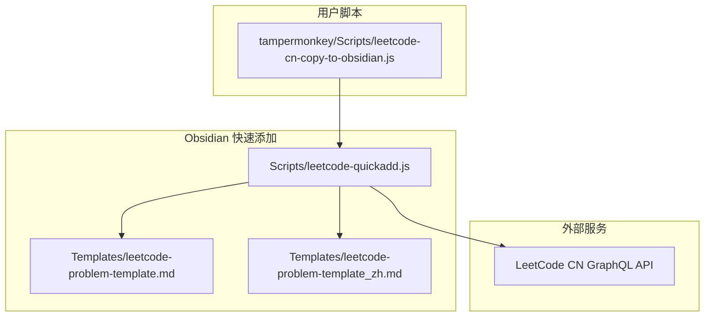
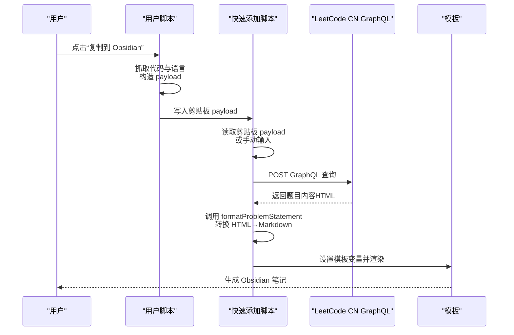
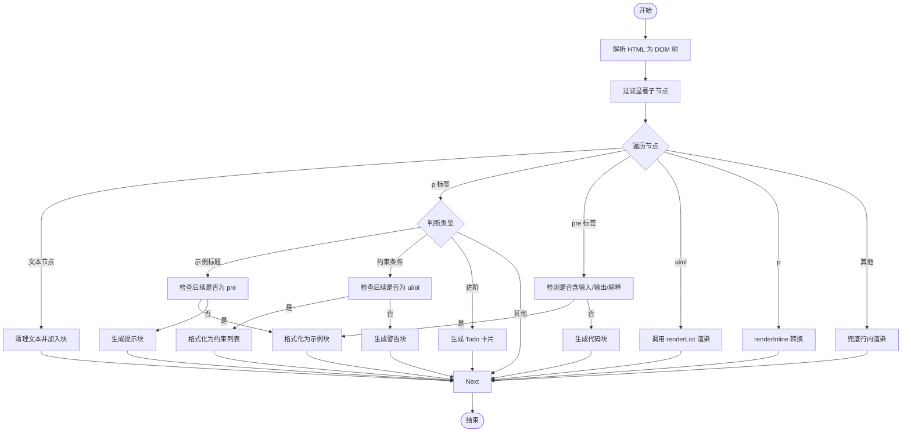
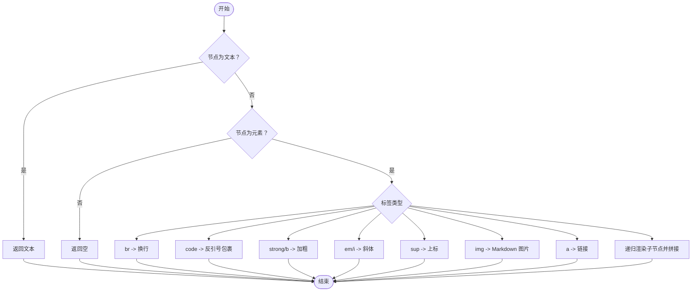
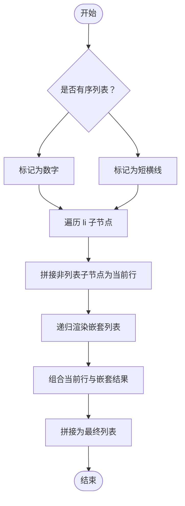
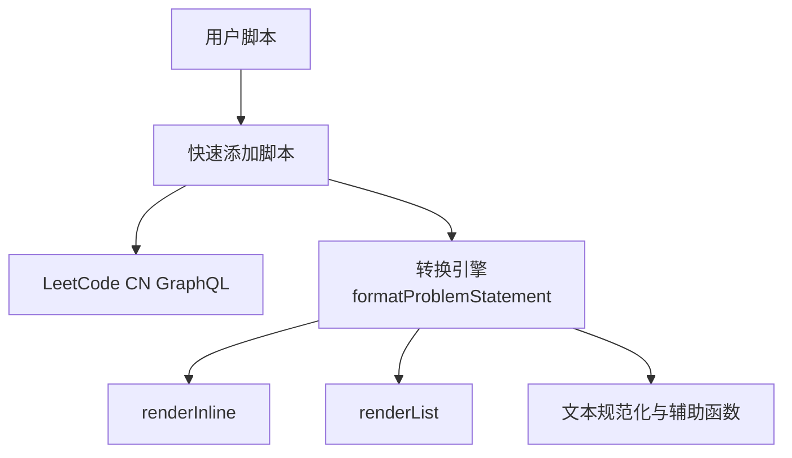

# 内容转换与格式化

<cite>
**本文引用的文件**
- [Scripts/leetcode-quickadd.js](file://Scripts/leetcode-quickadd.js)
- [tampermonkey/Scripts/leetcode-cn-copy-to-obsidian.js](file://tampermonkey/Scripts/leetcode-cn-copy-to-obsidian.js)
- [Templates/leetcode-problem-template.md](file://Templates/leetcode-problem-template.md)
- [Templates/leetcode-problem-template_zh.md](file://Templates/leetcode-problem-template_zh.md)
</cite>

## 目录
1. [简介](#简介)
2. [项目结构](#项目结构)
3. [核心组件](#核心组件)
4. [架构总览](#架构总览)
5. [详细组件分析](#详细组件分析)
6. [依赖关系分析](#依赖关系分析)
7. [性能考虑](#性能考虑)
8. [故障排除指南](#故障排除指南)
9. [结论](#结论)
10. [附录](#附录)

## 简介
本技术文档聚焦于内容转换与格式化功能，特别是 HTML 到 Markdown 的转换引擎，围绕以下关键函数展开：
- formatProblemStatement：HTML 内容解析与格式化主引擎
- renderInline：内联元素处理（strong、em、code、sup、a 等）
- renderList：递归列表渲染
- 文本规范化函数：normalizePreText、normalizeMarkerText、normalizeExampleValue、cleanupInlineCode、cleanupBlockText
- 辅助函数：formatPreAsExample、extractLabeledSection、formatConstraintsList、getSignificantChildren、findNextSignificantIndex

文档将深入解释 DOM 解析、节点遍历策略、格式化规则以及边界情况处理，并提供转换示例与最佳实践建议。

## 项目结构
该项目由三个主要部分组成：
- 快速添加脚本：负责从剪贴板或手动输入获取题目上下文，调用 GraphQL 拉取题目内容，并设置模板变量。
- 用户脚本：在 LeetCode 页面注入“复制到 Obsidian”按钮，自动抓取代码与语言，写入剪贴板 payload。
- 模板：定义 Obsidian 笔记的结构字段，供快速添加脚本填充。

图表来源
- [Scripts/leetcode-quickadd.js:339-404](file://Scripts/leetcode-quickadd.js#L339-L404)
- [tampermonkey/Scripts/leetcode-cn-copy-to-obsidian.js:316-363](file://tampermonkey/Scripts/leetcode-cn-copy-to-obsidian.js#L316-L363)

章节来源
- [Scripts/leetcode-quickadd.js:1-104](file://Scripts/leetcode-quickadd.js#L1-L104)
- [tampermonkey/Scripts/leetcode-cn-copy-to-obsidian.js:12-536](file://tampermonkey/Scripts/leetcode-cn-copy-to-obsidian.js#L12-L536)
- [Templates/leetcode-problem-template.md:1-35](file://Templates/leetcode-problem-template.md#L1-L35)
- [Templates/leetcode-problem-template_zh.md:1-41](file://Templates/leetcode-problem-template_zh.md#L1-L41)

## 核心组件
- HTML → Markdown 转换引擎：formatProblemStatement
- 内联元素处理：renderInline
- 列表渲染：renderList
- 文本规范化：normalizePreText、normalizeMarkerText、normalizeExampleValue、cleanupInlineCode、cleanupBlockText
- 示例与约束处理：formatPreAsExample、extractLabeledSection、formatConstraintsList
- 上下文与请求：getProblemContext、getLeetCodeProblem、setQuickAddVariables

章节来源
- [Scripts/leetcode-quickadd.js:436-546](file://Scripts/leetcode-quickadd.js#L436-L546)
- [Scripts/leetcode-quickadd.js:576-628](file://Scripts/leetcode-quickadd.js#L576-L628)
- [Scripts/leetcode-quickadd.js:634-667](file://Scripts/leetcode-quickadd.js#L634-L667)
- [Scripts/leetcode-quickadd.js:740-783](file://Scripts/leetcode-quickadd.js#L740-L783)
- [Scripts/leetcode-quickadd.js:669-699](file://Scripts/leetcode-quickadd.js#L669-L699)
- [Scripts/leetcode-quickadd.js:701-738](file://Scripts/leetcode-quickadd.js#L701-L738)
- [Scripts/leetcode-quickadd.js:114-166](file://Scripts/leetcode-quickadd.js#L114-L166)
- [Scripts/leetcode-quickadd.js:339-404](file://Scripts/leetcode-quickadd.js#L339-L404)
- [Scripts/leetcode-quickadd.js:410-430](file://Scripts/leetcode-quickadd.js#L410-L430)

## 架构总览
整体流程如下：
- 用户脚本在 LeetCode 页面注入按钮，复制包含题目 URL、slug、语言、代码的 payload 到剪贴板。
- 快速添加脚本优先从剪贴板读取 payload，否则进入手动模式（输入 URL/slug 或粘贴代码）。
- 通过 GraphQL 拉取题目内容（含中文翻译），调用 formatProblemStatement 将 HTML 转换为 Markdown。
- 设置模板变量（id、title、link、difficulty、problemStatement、formattedHints、tags、fileName、language、solutionCode、sourceUrl、titleSlug）。
- 使用模板生成 Obsidian 笔记。

图表来源
- [tampermonkey/Scripts/leetcode-cn-copy-to-obsidian.js:316-363](file://tampermonkey/Scripts/leetcode-cn-copy-to-obsidian.js#L316-L363)
- [Scripts/leetcode-quickadd.js:83-104](file://Scripts/leetcode-quickadd.js#L83-L104)
- [Scripts/leetcode-quickadd.js:339-404](file://Scripts/leetcode-quickadd.js#L339-L404)
- [Scripts/leetcode-quickadd.js:410-430](file://Scripts/leetcode-quickadd.js#L410-L430)

## 详细组件分析

### HTML → Markdown 转换引擎：formatProblemStatement
该函数负责将 LeetCode 返回的 HTML 内容解析为 Markdown，遵循以下步骤：
- 使用临时容器节点解析 HTML 字符串，过滤显著子节点（非空文本或 img 标签）。
- 遍历节点，按类型进行分类处理：
  - 文本节点：清理后直接加入块。
  - p 标签：
    - 示例标题：匹配“示例 数字”等，若其后紧跟 pre，则作为示例块；否则作为普通提示块。
    - 约束条件标题：匹配“提示”，若其后为 ul/ol，则转为约束列表；否则作为普通提示块。
    - 进阶标题：匹配“进阶”，生成 Todo 卡片。
  - pre 标签：
    - 若包含“输入/输出/解释”标签，按示例格式化；
    - 否则作为纯文本代码块。
  - ul/ol：调用 renderList 渲染列表。
  - p：内部使用 renderInline 转换为行内 Markdown。
  - 其他元素：兜底为行内渲染。
- 最终合并块，去除多余空行并修剪。

图表来源
- [Scripts/leetcode-quickadd.js:436-546](file://Scripts/leetcode-quickadd.js#L436-L546)

章节来源
- [Scripts/leetcode-quickadd.js:436-546](file://Scripts/leetcode-quickadd.js#L436-L546)

### 内联元素处理：renderInline
该函数递归处理节点及其子节点，将 HTML 内联元素转换为 Markdown：
- 文本节点：原样返回。
- br：换行。
- code：包裹反引号，内部进行内联代码清理。
- strong/b：加粗。
- em/i：斜体。
- sup：上标。
- img：Markdown 图片语法。
- a：链接，若无 href 则仅返回文本。
- 其他元素：递归渲染子节点并拼接。

图表来源
- [Scripts/leetcode-quickadd.js:576-628](file://Scripts/leetcode-quickadd.js#L576-L628)

章节来源
- [Scripts/leetcode-quickadd.js:576-628](file://Scripts/leetcode-quickadd.js#L576-L628)

### 列表渲染：renderList
该函数递归处理有序/无序列表，支持嵌套：
- 判断是否为有序列表，生成标记（数字或短横线）。
- 过滤 li 子节点，逐项处理：
  - 提取非列表子节点的行内文本，拼接为当前行。
  - 递归渲染嵌套列表，缩进对齐。
  - 组合当前行与嵌套结果，形成最终列表。

图表来源
- [Scripts/leetcode-quickadd.js:634-667](file://Scripts/leetcode-quickadd.js#L634-L667)

章节来源
- [Scripts/leetcode-quickadd.js:634-667](file://Scripts/leetcode-quickadd.js#L634-L667)

### 文本规范化函数
- normalizePreText：移除回车、替换不间断空格、清理多余空白与换行，保持预格式化文本整洁。
- normalizeMarkerText：移除回车与不间断空格，将多个空白压缩为单个空格，用于标题/标记文本。
- normalizeExampleValue：移除反引号、换行与多余空白，用于示例值的简洁展示。
- cleanupInlineCode：清理内联代码中的反引号与换行，避免破坏代码块。
- cleanupBlockText：清理块级文本的多余空白与换行，统一段落格式。

章节来源
- [Scripts/leetcode-quickadd.js:740-783](file://Scripts/leetcode-quickadd.js#L740-L783)

### 示例与约束处理辅助函数
- formatPreAsExample：从 pre 文本中抽取“输入/输出/解释”三段，分别格式化为 Markdown 引用块；若未识别则按行转为引用块。
- extractLabeledSection：基于正则定位标签位置，提取指定标签段落范围。
- formatConstraintsList：将 ul/ol 约束列表转为带提示头的引用块列表。

章节来源
- [Scripts/leetcode-quickadd.js:669-699](file://Scripts/leetcode-quickadd.js#L669-L699)
- [Scripts/leetcode-quickadd.js:701-738](file://Scripts/leetcode-quickadd.js#L701-L738)

### DOM 解析与节点遍历辅助函数
- getSignificantChildren：过滤掉仅有空白文本或无内容的元素节点，保留 img 等可显示元素。
- findNextSignificantIndex：跳过空白文本，找到下一个有意义节点索引。

章节来源
- [Scripts/leetcode-quickadd.js:548-574](file://Scripts/leetcode-quickadd.js#L548-L574)

### 上下文与请求流程
- getProblemContext：优先从剪贴板读取 payload，否则进入手动模式（URL/slug 或代码）。
- getLeetCodeProblem：向 GraphQL 发起查询，解析返回数据，调用 formatProblemStatement 转换问题描述。
- setQuickAddVariables：组装模板变量，包括文件名、难度链接、标签、格式化提示、语言、代码、源链接与 slug。

章节来源
- [Scripts/leetcode-quickadd.js:114-166](file://Scripts/leetcode-quickadd.js#L114-L166)
- [Scripts/leetcode-quickadd.js:339-404](file://Scripts/leetcode-quickadd.js#L339-L404)
- [Scripts/leetcode-quickadd.js:410-430](file://Scripts/leetcode-quickadd.js#L410-L430)

## 依赖关系分析
- 快速添加脚本依赖用户脚本提供的剪贴板 payload，以减少手动输入。
- 快速添加脚本依赖 LeetCode CN GraphQL API 获取题目内容。
- 转换引擎内部依赖一组文本规范化与辅助函数，保证输出一致性与可读性。

图表来源
- [Scripts/leetcode-quickadd.js:83-104](file://Scripts/leetcode-quickadd.js#L83-L104)
- [Scripts/leetcode-quickadd.js:339-404](file://Scripts/leetcode-quickadd.js#L339-L404)
- [Scripts/leetcode-quickadd.js:436-546](file://Scripts/leetcode-quickadd.js#L436-L546)
- [Scripts/leetcode-quickadd.js:576-628](file://Scripts/leetcode-quickadd.js#L576-L628)
- [Scripts/leetcode-quickadd.js:634-667](file://Scripts/leetcode-quickadd.js#L634-L667)
- [Scripts/leetcode-quickadd.js:740-783](file://Scripts/leetcode-quickadd.js#L740-L783)

章节来源
- [Scripts/leetcode-quickadd.js:83-104](file://Scripts/leetcode-quickadd.js#L83-L104)
- [Scripts/leetcode-quickadd.js:339-404](file://Scripts/leetcode-quickadd.js#L339-L404)
- [Scripts/leetcode-quickadd.js:436-546](file://Scripts/leetcode-quickadd.js#L436-L546)
- [Scripts/leetcode-quickadd.js:576-628](file://Scripts/leetcode-quickadd.js#L576-L628)
- [Scripts/leetcode-quickadd.js:634-667](file://Scripts/leetcode-quickadd.js#L634-L667)
- [Scripts/leetcode-quickadd.js:740-783](file://Scripts/leetcode-quickadd.js#L740-L783)

## 性能考虑
- DOM 解析与节点遍历：formatProblemStatement 对 HTML 进行一次性解析并遍历，时间复杂度近似 O(N)，N 为节点数。
- 递归列表渲染：renderList 在嵌套列表场景下会多次递归，但受 HTML 结构限制，通常不会过深。
- 正则匹配：示例标题与标签提取使用正则，注意避免过于复杂的表达式导致回溯。
- 文本规范化：各规范化函数均为线性扫描，开销较小。
- 建议：
  - 控制输入 HTML 的体量，避免超大节点树。
  - 对重复使用的正则表达式进行复用或缓存。
  - 在极端情况下，可考虑分段处理或延迟渲染。

[本节为通用性能讨论，无需特定文件来源]

## 故障排除指南
- 剪贴板 payload 无效
  - 现象：无法从剪贴板读取有效 payload。
  - 排查：确认用户脚本已注入按钮并成功复制 payload；检查剪贴板权限与浏览器兼容性。
  - 参考路径：[Scripts/leetcode-quickadd.js:238-271](file://Scripts/leetcode-quickadd.js#L238-L271)
- GraphQL 查询失败
  - 现象：无法获取题目内容。
  - 排查：检查网络连接、Referer/Origin 头、API 可用性；查看错误日志。
  - 参考路径：[Scripts/leetcode-quickadd.js:339-404](file://Scripts/leetcode-quickadd.js#L339-L404)
- 示例块未正确识别
  - 现象：示例标题未被识别或示例内容未按输入/输出/解释格式化。
  - 排查：确认 HTML 中示例标题与 pre 标签结构；检查 normalizeMarkerText 与 extractLabeledSection 的正则匹配。
  - 参考路径：[Scripts/leetcode-quickadd.js:461-475](file://Scripts/leetcode-quickadd.js#L461-L475), [Scripts/leetcode-quickadd.js:669-699](file://Scripts/leetcode-quickadd.js#L669-L699), [Scripts/leetcode-quickadd.js:701-723](file://Scripts/leetcode-quickadd.js#L701-L723)
- 列表渲染异常
  - 现象：嵌套列表缩进或标记不正确。
  - 排查：确认 HTML 中 ul/ol/li 结构；检查 renderList 的过滤与递归逻辑。
  - 参考路径：[Scripts/leetcode-quickadd.js:634-667](file://Scripts/leetcode-quickadd.js#L634-L667)
- 内联代码格式问题
  - 现象：内联代码被误判或破坏。
  - 排查：检查 cleanupInlineCode 与 renderInline 中的反引号处理。
  - 参考路径：[Scripts/leetcode-quickadd.js:767-773](file://Scripts/leetcode-quickadd.js#L767-L773), [Scripts/leetcode-quickadd.js:593-595](file://Scripts/leetcode-quickadd.js#L593-L595)

章节来源
- [Scripts/leetcode-quickadd.js:238-271](file://Scripts/leetcode-quickadd.js#L238-L271)
- [Scripts/leetcode-quickadd.js:339-404](file://Scripts/leetcode-quickadd.js#L339-L404)
- [Scripts/leetcode-quickadd.js:461-475](file://Scripts/leetcode-quickadd.js#L461-L475)
- [Scripts/leetcode-quickadd.js:669-699](file://Scripts/leetcode-quickadd.js#L669-L699)
- [Scripts/leetcode-quickadd.js:701-723](file://Scripts/leetcode-quickadd.js#L701-L723)
- [Scripts/leetcode-quickadd.js:634-667](file://Scripts/leetcode-quickadd.js#L634-L667)
- [Scripts/leetcode-quickadd.js:767-773](file://Scripts/leetcode-quickadd.js#L767-L773)
- [Scripts/leetcode-quickadd.js:593-595](file://Scripts/leetcode-quickadd.js#L593-L595)

## 结论
该转换引擎以清晰的节点分类与递归处理为核心，结合多种文本规范化与辅助函数，实现了从 HTML 到 Markdown 的稳健转换。通过示例标题识别、约束条件处理、列表渲染与图片处理等规则，能够覆盖大多数 LeetCode 题目描述的常见结构。配合用户脚本与快速添加脚本，可高效地将题目内容导入 Obsidian 笔记系统。

[本节为总结性内容，无需特定文件来源]

## 附录

### 转换示例与边界情况
- 示例标题识别
  - 匹配“示例 数字”等标题，若其后紧接 pre，则按输入/输出/解释格式化；否则作为提示块。
  - 参考路径：[Scripts/leetcode-quickadd.js:461-475](file://Scripts/leetcode-quickadd.js#L461-L475), [Scripts/leetcode-quickadd.js:669-699](file://Scripts/leetcode-quickadd.js#L669-L699)
- 约束条件处理
  - 匹配“提示”标题，若其后为 ul/ol，则转为约束列表；否则作为普通提示块。
  - 参考路径：[Scripts/leetcode-quickadd.js:478-494](file://Scripts/leetcode-quickadd.js#L478-L494), [Scripts/leetcode-quickadd.js:725-738](file://Scripts/leetcode-quickadd.js#L725-L738)
- 进阶内容格式化
  - 匹配“进阶”标题，生成 Todo 卡片。
  - 参考路径：[Scripts/leetcode-quickadd.js:497-507](file://Scripts/leetcode-quickadd.js#L497-L507)
- 列表渲染
  - 支持嵌套，有序/无序列表标记与缩进正确。
  - 参考路径：[Scripts/leetcode-quickadd.js:634-667](file://Scripts/leetcode-quickadd.js#L634-L667)
- 图片处理
  - img 标签转换为 Markdown 图片语法。
  - 参考路径：[Scripts/leetcode-quickadd.js:611-614](file://Scripts/leetcode-quickadd.js#L611-L614)
- 文本规范化
  - normalizePreText、normalizeMarkerText、normalizeExampleValue、cleanupInlineCode、cleanupBlockText 保证输出整洁一致。
  - 参考路径：[Scripts/leetcode-quickadd.js:740-783](file://Scripts/leetcode-quickadd.js#L740-L783)