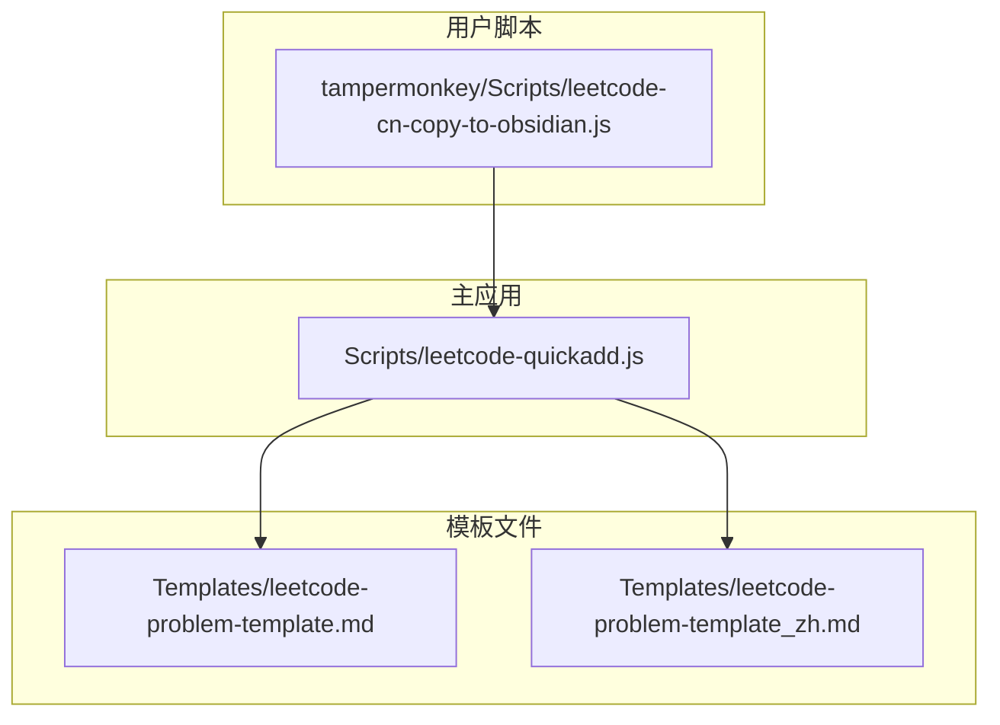
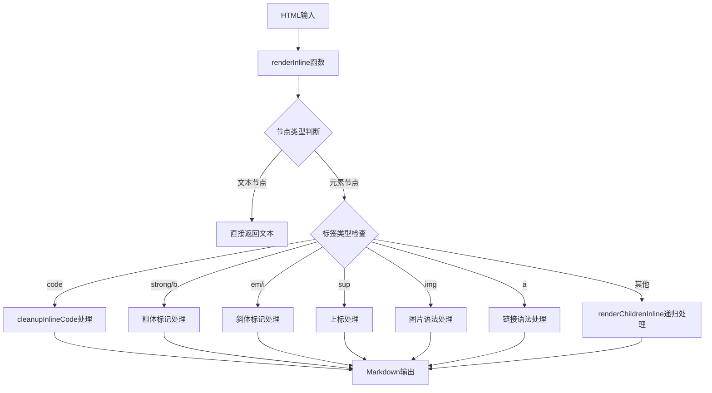
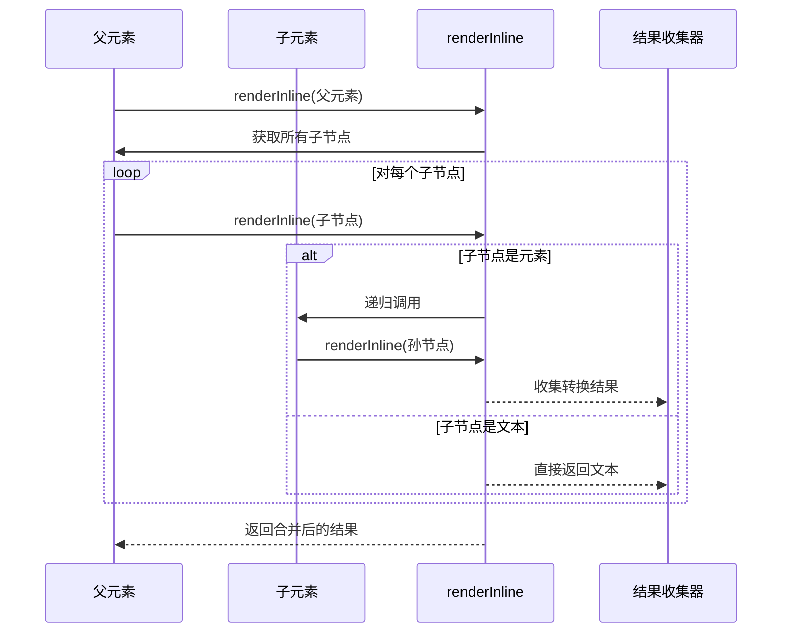
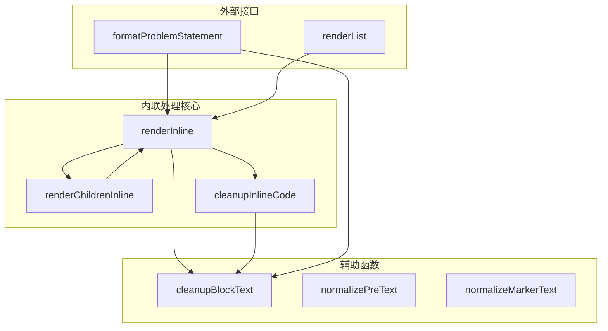

# 内联元素处理

<cite>
**本文档引用的文件**
- [leetcode-quickadd.js](file://Scripts/leetcode-quickadd.js)
- [leetcode-cn-copy-to-obsidian.js](file://tampermonkey/Scripts/leetcode-cn-copy-to-obsidian.js)
</cite>

## 目录
1. [简介](#简介)
2. [项目结构](#项目结构)
3. [核心组件](#核心组件)
4. [架构概览](#架构概览)
5. [详细组件分析](#详细组件分析)
6. [依赖关系分析](#依赖关系分析)
7. [性能考虑](#性能考虑)
8. [故障排除指南](#故障排除指南)
9. [结论](#结论)

## 简介

本文档深入分析了LeetCode到Obsidian的内联元素处理功能，重点解释了`renderInline`函数的内联元素处理机制。该系统负责将HTML内容转换为Markdown格式，特别关注于文本节点和元素节点的递归处理逻辑，以及各种HTML标签到Markdown的转换规则。

该项目包含两个主要脚本：一个用于Obsidian QuickAdd的主脚本，另一个是Tampermonkey用户脚本，用于从LeetCode网站复制代码到剪贴板。两者都实现了相似的内联元素处理逻辑。

## 项目结构

项目采用模块化设计，包含以下关键组件：



**图表来源**
- [leetcode-quickadd.js:1-868](file://Scripts/leetcode-quickadd.js#L1-L868)
- [leetcode-cn-copy-to-obsidian.js:1-536](file://tampermonkey/Scripts/leetcode-cn-copy-to-obsidian.js#L1-L536)

**章节来源**
- [leetcode-quickadd.js:1-868](file://Scripts/leetcode-quickadd.js#L1-L868)
- [leetcode-cn-copy-to-obsidian.js:1-536](file://tampermonkey/Scripts/leetcode-cn-copy-to-obsidian.js#L1-L536)

## 核心组件

### 内联元素处理系统

内联元素处理系统的核心是`renderInline`函数，它负责将HTML节点转换为Markdown格式。该系统具有以下特点：

- **递归处理**：能够处理嵌套的HTML元素
- **类型安全**：区分文本节点和元素节点
- **标签特定处理**：针对不同HTML标签实现特定的Markdown转换规则
- **清理功能**：提供文本清理和格式化功能

**章节来源**
- [leetcode-quickadd.js:576-628](file://Scripts/leetcode-quickadd.js#L576-L628)
- [leetcode-quickadd.js:767-773](file://Scripts/leetcode-quickadd.js#L767-L773)

## 架构概览

内联元素处理系统采用分层架构设计：



**图表来源**
- [leetcode-quickadd.js:576-628](file://Scripts/leetcode-quickadd.js#L576-L628)
- [leetcode-quickadd.js:630-632](file://Scripts/leetcode-quickadd.js#L630-L632)
- [leetcode-quickadd.js:767-773](file://Scripts/leetcode-quickadd.js#L767-L773)

## 详细组件分析

### renderInline函数详解

`renderInline`函数是整个内联元素处理系统的核心，负责将单个HTML节点转换为Markdown格式。

#### 函数签名和基本逻辑

```mermaid
flowchart TD
A[renderInline(node)] --> B{node是否存在?}
B --> |否| C[返回空字符串]
B --> |是| D{节点类型判断}
D --> |文本节点(3)| E[返回textContent]
D --> |元素节点(1)| F{标签类型检查}
D --> |其他| G[返回空字符串]
F --> |br| H[返回换行符]
F --> |code| I[cleanupInlineCode处理]
F --> |strong/b| J[粗体标记]
F --> |em/i| K[斜体标记]
F --> |sup| L[上标处理]
F --> |img| M[图片语法]
F --> |a| N[链接语法]
F --> |其他| O[renderChildrenInline递归]
```

**图表来源**
- [leetcode-quickadd.js:576-628](file://Scripts/leetcode-quickadd.js#L576-L628)

#### 文本节点处理

文本节点是最简单的处理对象，直接返回其`textContent`属性值。这种设计确保了纯文本内容的完整性保持。

#### 元素节点处理

元素节点的处理遵循严格的标签类型检查顺序：

1. **换行处理** (`<br>`)：转换为换行符
2. **代码处理** (`<code>`)：使用专门的清理函数处理
3. **粗体处理** (`<strong>`, `<b>`)：添加粗体标记
4. **斜体处理** (`<em>`, `<i>`)：添加斜体标记
5. **上标处理** (`<sup>`)：添加上标符号
6. **图片处理** (``)：转换为Markdown图片语法
7. **链接处理** (`<a>`)：转换为Markdown链接语法
8. **其他元素**：递归处理子节点

**章节来源**
- [leetcode-quickadd.js:576-628](file://Scripts/leetcode-quickadd.js#L576-L628)

### renderChildrenInline函数分析

`renderChildrenInline`函数负责处理元素的所有子节点，并将它们递归转换为Markdown格式。

#### 递归处理机制



**图表来源**
- [leetcode-quickadd.js:630-632](file://Scripts/leetcode-quickadd.js#L630-L632)

#### 处理流程

1. **子节点遍历**：使用`Array.from(node.childNodes)`获取所有子节点
2. **递归转换**：对每个子节点调用`renderInline`函数
3. **结果合并**：使用`join("")`将所有转换结果连接成单一字符串

**章节来源**
- [leetcode-quickadd.js:630-632](file://Scripts/leetcode-quickadd.js#L630-L632)

### cleanupInlineCode函数深度解析

`cleanupInlineCode`函数专门处理`<code>`标签内的文本清理逻辑。

#### 清理规则

```mermaid
flowchart TD
A[cleanupInlineCode(text)] --> B[移除回车符]
B --> C[替换不间断空格为空格]
C --> D[转义反引号]
D --> E[去除首尾空白]
D --> F{检测反引号字符}
F --> |存在| G[在每个反引号前添加反斜杠]
F --> |不存在| H[直接返回]
G --> H
```

**图表来源**
- [leetcode-quickadd.js:767-773](file://Scripts/leetcode-quickadd.js#L767-L773)

#### 特殊字符处理

| 字符 | 处理方式 | 原因 |
|------|----------|------|
| 回车符 | 移除 | 避免影响Markdown渲染 |
| 不间断空格 | 替换为空格 | 统一空白字符格式 |
| 反引号 | 转义为反斜杠+反引号 | 防止破坏代码块语法 |
| 首尾空白 | 去除 | 保持代码整洁 |

**章节来源**
- [leetcode-quickadd.js:767-773](file://Scripts/leetcode-quickadd.js#L767-L773)

### HTML标签到Markdown转换规则

#### 代码标签处理

- **目标标签**：`<code>`
- **转换规则**：使用反引号包围，内部进行特殊字符转义
- **实现细节**：调用`cleanupInlineCode`函数进行预处理

#### 粗体标签处理

- **目标标签**：`<strong>`, `<b>`
- **转换规则**：添加双星号包围
- **处理逻辑**：先递归处理子节点，再统一添加粗体标记

#### 斜体标签处理

- **目标标签**：`<em>`, `<i>`
- **转换规则**：添加单星号包围
- **处理逻辑**：与粗体处理类似，但使用不同的标记

#### 上标标签处理

- **目标标签**：`<sup>`
- **转换规则**：添加插入符号包围
- **处理逻辑**：直接使用`textContent`，去除首尾空白

#### 图片标签处理

- **目标标签**：``
- **转换规则**：使用Markdown图片语法
- **实现细节**：从`src`属性提取图片地址

#### 链接标签处理

- **目标标签**：`<a>`
- **转换规则**：使用Markdown链接语法
- **实现细节**：同时处理链接文本和URL

**章节来源**
- [leetcode-quickadd.js:593-625](file://Scripts/leetcode-quickadd.js#L593-L625)

## 依赖关系分析

内联元素处理系统与其他组件的依赖关系如下：



**图表来源**
- [leetcode-quickadd.js:576-628](file://Scripts/leetcode-quickadd.js#L576-L628)
- [leetcode-quickadd.js:630-632](file://Scripts/leetcode-quickadd.js#L630-L632)
- [leetcode-quickadd.js:767-773](file://Scripts/leetcode-quickadd.js#L767-L773)

**章节来源**
- [leetcode-quickadd.js:576-628](file://Scripts/leetcode-quickadd.js#L576-L628)
- [leetcode-quickadd.js:630-632](file://Scripts/leetcode-quickadd.js#L630-L632)
- [leetcode-quickadd.js:767-773](file://Scripts/leetcode-quickadd.js#L767-L773)

## 性能考虑

内联元素处理系统在设计时考虑了以下性能因素：

### 时间复杂度分析

- **单个元素处理**：O(n)，其中n是元素的文本长度
- **递归处理**：O(N)，其中N是整个DOM树中的字符总数
- **空间复杂度**：O(N)，用于存储转换结果

### 优化策略

1. **早期返回**：对于空节点直接返回，避免不必要的处理
2. **类型检查优化**：使用`nodeType`快速区分节点类型
3. **字符串操作优化**：使用高效的字符串替换和连接操作
4. **内存管理**：及时释放中间结果，避免内存泄漏

### 边界情况处理

系统正确处理了以下边界情况：

- **空节点**：返回空字符串
- **无文本内容**：跳过处理
- **嵌套标签**：通过递归正确处理
- **特殊字符**：通过清理函数处理

## 故障排除指南

### 常见问题及解决方案

#### 问题1：代码标签未正确转换

**症状**：`<code>`标签内的文本显示异常

**原因**：反引号字符未正确转义

**解决方案**：检查`cleanupInlineCode`函数的转义逻辑

#### 问题2：嵌套标签处理错误

**症状**：复杂嵌套结构的Markdown输出不符合预期

**原因**：递归处理顺序或边界条件处理不当

**解决方案**：验证`renderChildrenInline`函数的处理逻辑

#### 问题3：特殊字符显示问题

**症状**：某些特殊字符在Markdown中显示异常

**原因**：空白字符或不可见字符未正确处理

**解决方案**：检查清理函数的字符替换逻辑

**章节来源**
- [leetcode-quickadd.js:767-773](file://Scripts/leetcode-quickadd.js#L767-L773)

## 结论

内联元素处理系统是一个精心设计的文本转换引擎，具有以下特点：

1. **模块化设计**：清晰的功能分离，便于维护和扩展
2. **类型安全**：严格的节点类型检查，避免运行时错误
3. **递归处理**：优雅地处理任意复杂的嵌套结构
4. **特殊字符处理**：完善的清理机制，确保Markdown兼容性
5. **性能优化**：合理的算法选择和边界条件处理

该系统成功地将HTML内容转换为高质量的Markdown格式，为LeetCode题目内容的Obsidian笔记创建提供了坚实的基础。通过深入理解这些内联元素处理机制，开发者可以更好地扩展和定制转换规则，以满足特定的使用需求。