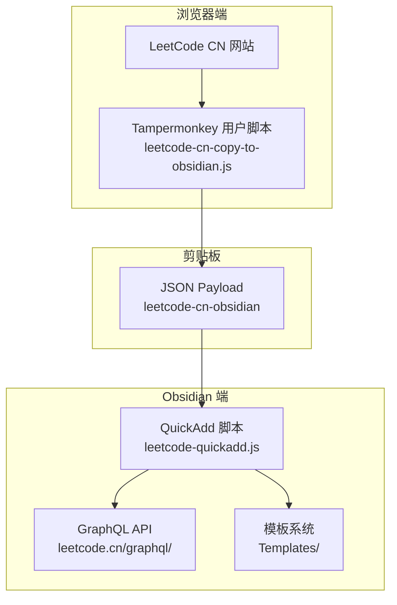
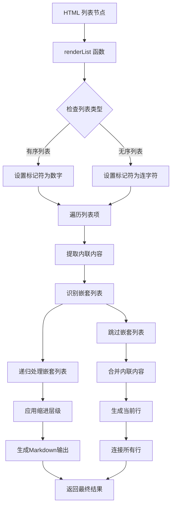
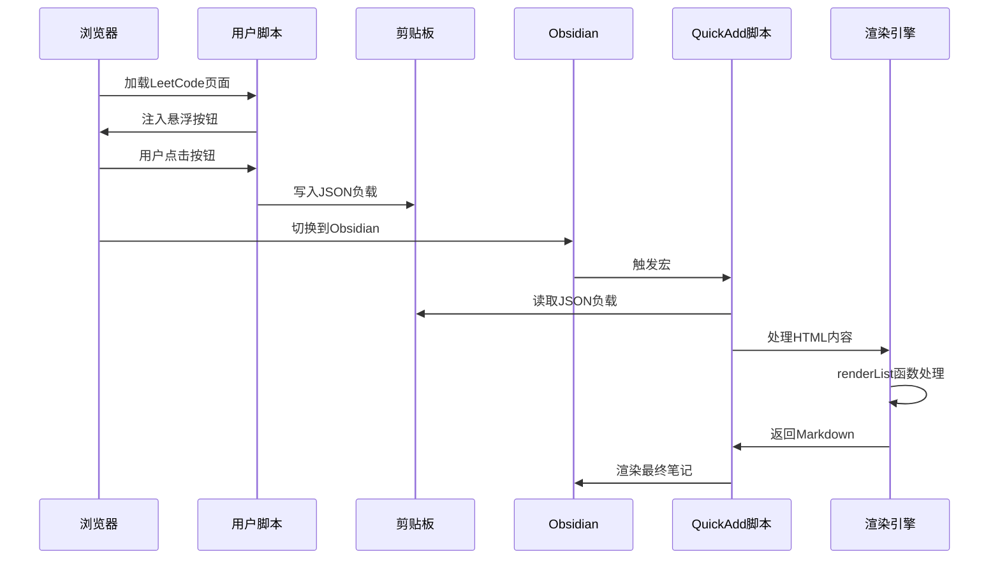
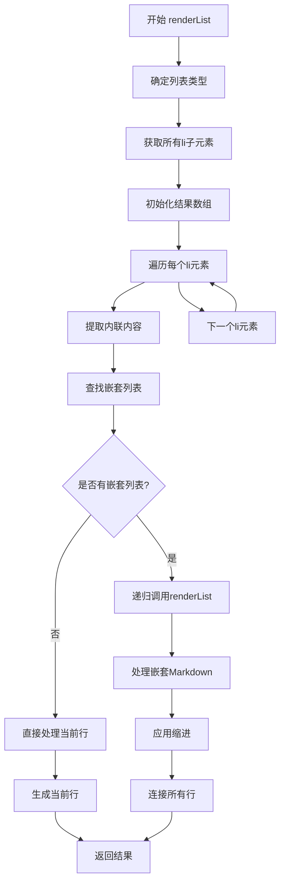
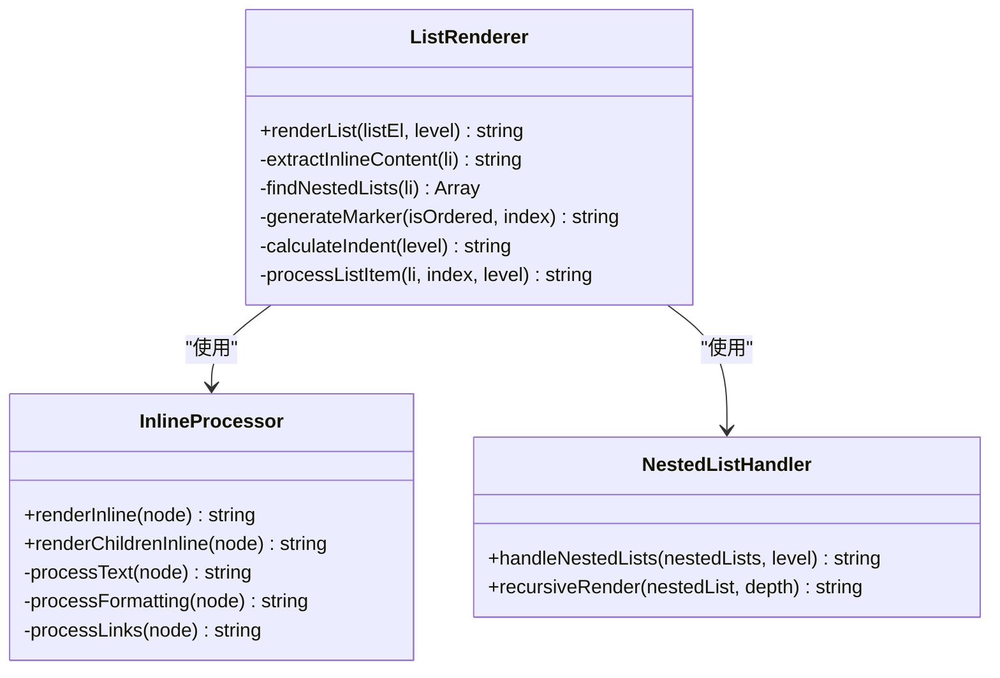
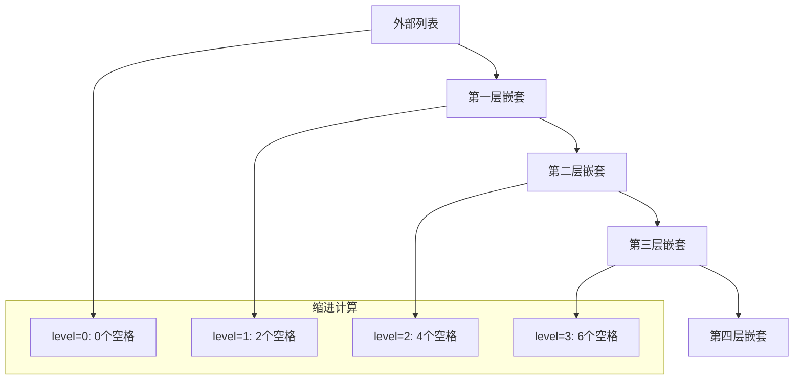
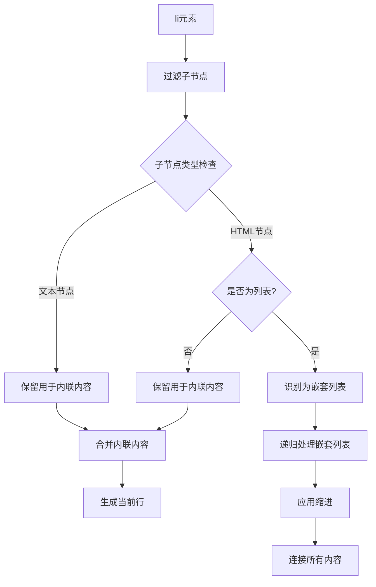
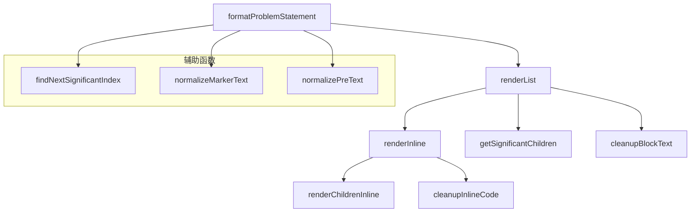

# 列表渲染引擎

<cite>
**本文档引用的文件**
- [Scripts/leetcode-quickadd.js](file://Scripts/leetcode-quickadd.js)
- [README.md](file://README.md)
</cite>

## 目录
1. [简介](#简介)
2. [项目结构](#项目结构)
3. [核心组件](#核心组件)
4. [架构概览](#架构概览)
5. [详细组件分析](#详细组件分析)
6. [依赖关系分析](#依赖关系分析)
7. [性能考虑](#性能考虑)
8. [故障排除指南](#故障排除指南)
9. [结论](#结论)

## 简介

本文档深入分析了LeetCode到Obsidian转换工具中的列表渲染引擎，重点解释`renderList`函数的递归列表渲染机制。该引擎负责将HTML格式的问题描述转换为Obsidian原生支持的Markdown格式，特别关注有序列表(ol)和无序列表(ul)的处理逻辑。

该系统通过Tampermonkey用户脚本从LeetCode CN网站捕获代码和问题信息，然后通过Obsidian QuickAdd脚本进行处理和渲染。列表渲染是整个转换过程中的关键环节，因为它直接影响最终笔记的可读性和结构完整性。

## 项目结构

该项目采用模块化设计，包含三个主要组件：

**图表来源**
- [README.md:27-41](file://README.md#L27-L41)
- [Scripts/leetcode-quickadd.js:1-104](file://Scripts/leetcode-quickadd.js#L1-L104)

**章节来源**
- [README.md:122-133](file://README.md#L122-L133)

## 核心组件

### 列表渲染引擎概述

列表渲染引擎的核心功能由`renderList`函数实现，该函数专门处理HTML中的有序列表和无序列表，并将其转换为Obsidian兼容的Markdown格式。该引擎具有以下关键特性：

- **递归处理**：能够处理任意深度的嵌套列表
- **类型区分**：正确识别并处理有序列表(ol)和无序列表(ul)
- **缩进管理**：根据嵌套层级动态计算缩进
- **标记符选择**：为有序列表生成数字标记符，为无序列表生成连字符标记符

### 数据流处理

**图表来源**
- [Scripts/leetcode-quickadd.js:634-667](file://Scripts/leetcode-quickadd.js#L634-L667)

**章节来源**
- [Scripts/leetcode-quickadd.js:634-667](file://Scripts/leetcode-quickadd.js#L634-L667)

## 架构概览

### 整体渲染流程

**图表来源**
- [README.md:27-41](file://README.md#L27-L41)
- [Scripts/leetcode-quickadd.js:83-104](file://Scripts/leetcode-quickadd.js#L83-L104)

### 列表渲染核心算法

**图表来源**
- [Scripts/leetcode-quickadd.js:634-667](file://Scripts/leetcode-quickadd.js#L634-L667)

## 详细组件分析

### renderList函数详解

#### 函数签名和参数

`renderList`函数接受两个参数：
- `listEl`: HTML列表元素(ol或ul)
- `level`: 当前嵌套层级，默认为0

#### 核心处理逻辑

**图表来源**
- [Scripts/leetcode-quickadd.js:634-667](file://Scripts/leetcode-quickadd.js#L634-L667)
- [Scripts/leetcode-quickadd.js:576-628](file://Scripts/leetcode-quickadd.js#L576-L628)

#### 有序列表处理机制

对于有序列表(ol)，`renderList`函数使用数字作为标记符：
- 第一个列表项标记符为"1."
- 第二个列表项标记符为"2."
- 以此类推...

这种设计保持了原始顺序的重要性，使得读者能够清楚地理解步骤的先后关系。

#### 无序列表处理机制

对于无序列表(ul)，`renderList`函数使用连字符作为标记符：
- 所有列表项都使用"-"
- 这种统一的标记符适用于要点列表和项目符号列表

#### 嵌套列表递归处理

嵌套列表的处理是`renderList`函数的核心特性之一：

**图表来源**
- [Scripts/leetcode-quickadd.js:634-667](file://Scripts/leetcode-quickadd.js#L634-L667)

#### 缩进计算算法

缩进计算遵循简单的线性规则：
- 每增加一层嵌套，缩进增加2个空格
- level参数决定了当前层级的缩进量
- 缩进字符串通过"  ".repeat(level)生成

#### 列表项过滤和处理

`renderList`函数对列表项进行精确的过滤和处理：

**图表来源**
- [Scripts/leetcode-quickadd.js:634-667](file://Scripts/leetcode-quickadd.js#L634-L667)

**章节来源**
- [Scripts/leetcode-quickadd.js:634-667](file://Scripts/leetcode-quickadd.js#L634-L667)

### 内联内容提取机制

内联内容的提取是列表渲染过程中的重要环节，它确保了列表项中的文本内容被正确保留：

#### 文本节点处理

文本节点直接被提取并清理，移除多余的空白字符和特殊字符。

#### HTML节点处理

HTML节点根据其类型进行不同的处理：
- **代码标签**: 转换为反引号包围的内联代码
- **强调标签**: 转换为Markdown强调格式
- **链接标签**: 转换为Markdown链接格式
- **换行标签**: 转换为换行符

#### 嵌套列表识别

嵌套列表的识别通过检查子节点的标签名实现：
- 仅识别"ul"和"ol"标签
- 忽略其他HTML元素
- 为后续递归处理做准备

**章节来源**
- [Scripts/leetcode-quickadd.js:576-628](file://Scripts/leetcode-quickadd.js#L576-L628)
- [Scripts/leetcode-quickadd.js:649-655](file://Scripts/leetcode-quickadd.js#L649-L655)

### 输出格式规范

#### 标记符格式

列表项的标记符格式严格遵循Markdown规范：
- **有序列表**: 数字加点号，如"1."、"2."、"3."
- **无序列表**: 连字符加空格，如"- "
- 标记符后始终跟随一个空格

#### 缩进层级

缩进层级的计算确保了嵌套列表的视觉层次：
- 每层嵌套增加2个空格
- 缩进字符串通过重复空格实现
- 保持了良好的可读性

#### 嵌套Markdown拼接

嵌套列表的Markdown内容通过换行符连接：
- 每个嵌套列表独占一行
- 与父级列表项在同一缩进级别
- 保持了清晰的层次结构

**章节来源**
- [Scripts/leetcode-quickadd.js:642-666](file://Scripts/leetcode-quickadd.js#L642-L666)

## 依赖关系分析

### 组件间依赖

**图表来源**
- [Scripts/leetcode-quickadd.js:436-546](file://Scripts/leetcode-quickadd.js#L436-L546)
- [Scripts/leetcode-quickadd.js:634-667](file://Scripts/leetcode-quickadd.js#L634-L667)

### 外部依赖

该系统主要依赖于浏览器的DOM API和Obsidian的Markdown渲染能力：

- **DOM API**: 用于解析和操作HTML内容
- **浏览器剪贴板API**: 用于数据传输
- **Obsidian Markdown渲染**: 用于最终显示效果

**章节来源**
- [Scripts/leetcode-quickadd.js:238-271](file://Scripts/leetcode-quickadd.js#L238-L271)

## 性能考虑

### 时间复杂度分析

`renderList`函数的时间复杂度为O(n)，其中n是列表中所有节点的总数。这是因为：
- 每个节点只被访问一次
- 递归调用的深度等于最大嵌套层级
- 每次递归处理都是线性的

### 空间复杂度分析

空间复杂度主要由递归调用栈决定：
- 最坏情况下为O(d)，其中d是最大嵌套深度
- 每层递归需要常数级别的额外空间
- 结果字符串的存储空间与输出大小成正比

### 优化策略

1. **早期终止**: 对空列表直接返回
2. **缓存机制**: 对重复的处理结果进行缓存
3. **批量处理**: 对大量列表项进行批量处理
4. **内存管理**: 及时释放不再使用的中间结果

## 故障排除指南

### 常见问题及解决方案

#### 列表渲染异常

**问题**: 列表项内容丢失或格式错误
**原因**: HTML结构不符合预期
**解决方案**: 
- 检查HTML结构的合法性
- 确保每个列表项都有适当的文本内容
- 验证嵌套列表的正确性

#### 嵌套层级错误

**问题**: 嵌套列表缩进不正确
**原因**: level参数传递错误
**解决方案**:
- 确保递归调用时level参数正确递增
- 检查嵌套列表的识别逻辑
- 验证缩进计算的准确性

#### 标记符错误

**问题**: 有序列表使用连字符标记符
**原因**: 列表类型识别错误
**解决方案**:
- 检查列表元素的tagName属性
- 确保大小写转换的一致性
- 验证列表类型的判断逻辑

**章节来源**
- [Scripts/leetcode-quickadd.js:634-667](file://Scripts/leetcode-quickadd.js#L634-L667)

## 结论

列表渲染引擎通过`renderList`函数实现了高效的HTML到Markdown转换，特别针对有序列表和无序列表进行了专门优化。该引擎的主要优势包括：

1. **递归处理能力**: 能够处理任意深度的嵌套列表
2. **类型区分**: 正确识别并处理不同类型的列表
3. **缩进管理**: 通过level参数精确控制缩进层级
4. **格式一致性**: 生成符合Obsidian标准的Markdown格式

该系统为LeetCode到Obsidian的转换提供了坚实的基础，确保了复杂列表结构的准确渲染和良好的用户体验。通过合理的架构设计和性能优化，该引擎能够在保持高精度的同时提供高效的处理能力。