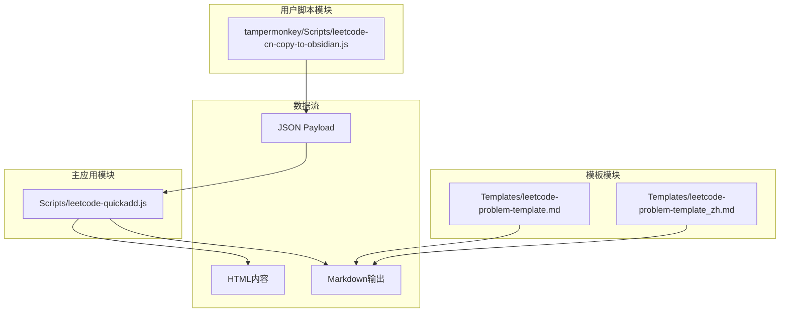
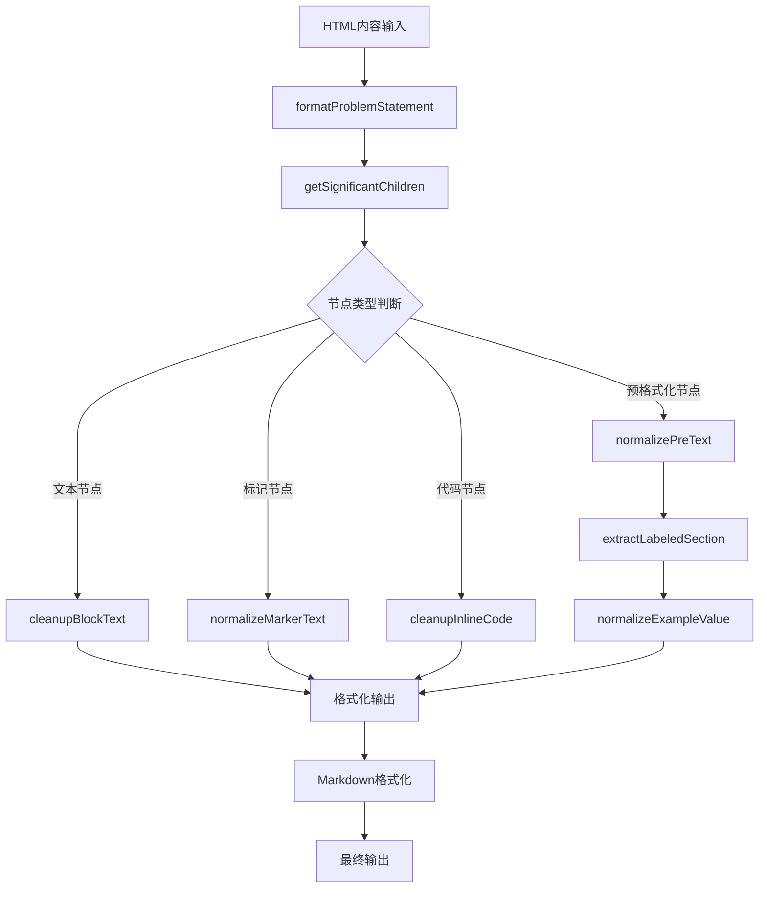
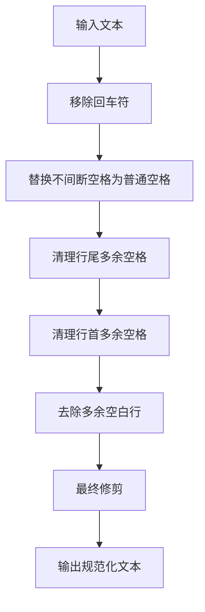
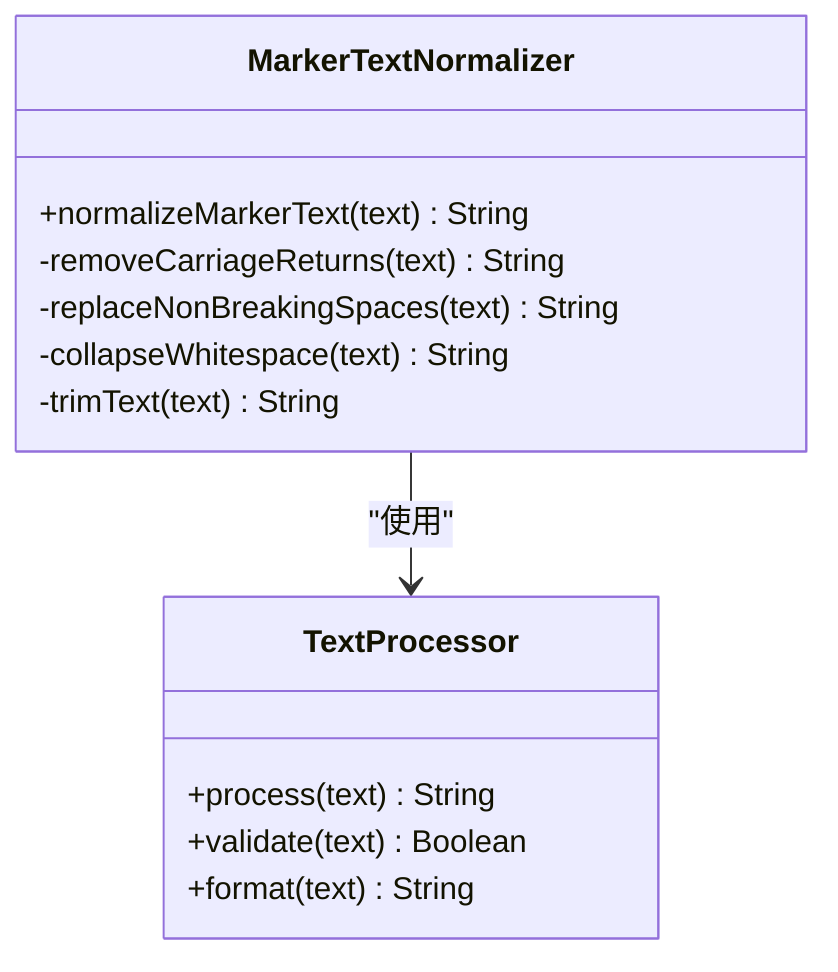
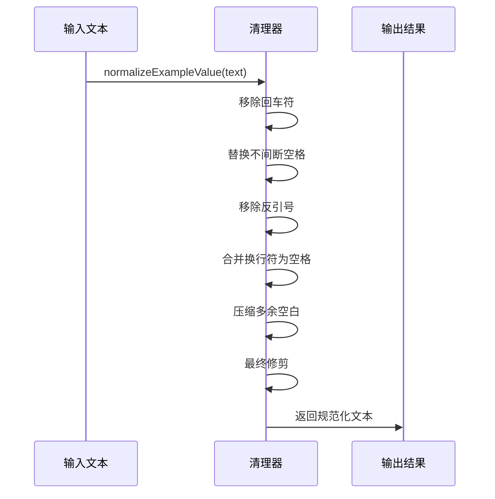
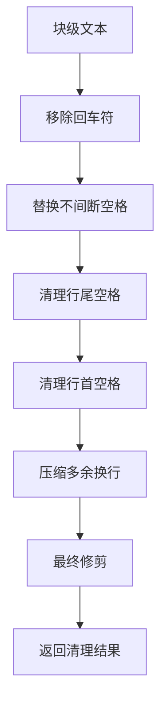
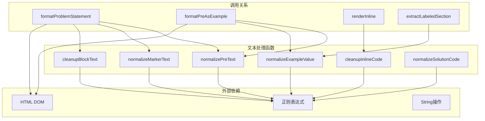

# 文本规范化处理

<cite>
**本文档引用的文件**
- [Scripts/leetcode-quickadd.js](file://Scripts/leetcode-quickadd.js)
- [tampermonkey/Scripts/leetcode-cn-copy-to-obsidian.js](file://tampermonkey/Scripts/leetcode-cn-copy-to-obsidian.js)
- [Templates/leetcode-problem-template.md](file://Templates/leetcode-problem-template.md)
- [Templates/leetcode-problem-template_zh.md](file://Templates/leetcode-problem-template_zh.md)
</cite>

## 目录
1. [简介](#简介)
2. [项目结构](#项目结构)
3. [核心组件](#核心组件)
4. [架构概览](#架构概览)
5. [详细组件分析](#详细组件分析)
6. [依赖关系分析](#依赖关系分析)
7. [性能考虑](#性能考虑)
8. [故障排除指南](#故障排除指南)
9. [结论](#结论)

## 简介

本文档深入分析了LeetCode到Obsidian笔记系统的文本规范化处理功能。该系统通过一系列精心设计的文本处理函数，将从LeetCode网站抓取的HTML内容转换为高质量的Markdown格式，确保在Obsidian中的最佳显示效果。

系统的核心功能包括：
- 预格式化文本处理（normalizePreText）
- 标记文本标准化（normalizeMarkerText）
- 示例值清理（normalizeExampleValue）
- 特殊字符处理（回车符、不间断空格、制表符）
- 代码清理（cleanupInlineCode、cleanupBlockText）

## 项目结构

该项目采用模块化架构，主要包含以下组件：



**图表来源**
- [Scripts/leetcode-quickadd.js:1-868](file://Scripts/leetcode-quickadd.js#L1-L868)
- [tampermonkey/Scripts/leetcode-cn-copy-to-obsidian.js:1-536](file://tampermonkey/Scripts/leetcode-cn-copy-to-obsidian.js#L1-L536)

**章节来源**
- [Scripts/leetcode-quickadd.js:1-868](file://Scripts/leetcode-quickadd.js#L1-L868)
- [tampermonkey/Scripts/leetcode-cn-copy-to-obsidian.js:1-536](file://tampermonkey/Scripts/leetcode-cn-copy-to-obsidian.js#L1-L536)

## 核心组件

### 文本规范化函数族

系统实现了四个核心的文本规范化函数，每个都有特定的处理目标：

1. **normalizePreText**: 预格式化文本处理
2. **normalizeMarkerText**: 标记文本标准化  
3. **normalizeExampleValue**: 示例值清理
4. **normalizeSolutionCode**: 解决方案代码规范化

### 特殊字符处理机制

系统专门处理以下特殊字符：
- 回车符（\r）替换为空字符串
- 不间断空格（\u00a0）替换为普通空格
- 制表符和多余空格的清理
- 反引号字符的处理

**章节来源**
- [Scripts/leetcode-quickadd.js:740-783](file://Scripts/leetcode-quickadd.js#L740-L783)

## 架构概览



**图表来源**
- [Scripts/leetcode-quickadd.js:436-546](file://Scripts/leetcode-quickadd.js#L436-L546)
- [Scripts/leetcode-quickadd.js:669-699](file://Scripts/leetcode-quickadd.js#L669-L699)

## 详细组件分析

### normalizePreText 函数分析

normalizePreText函数专门处理预格式化的文本内容，确保代码块和示例文本的正确格式。



**图表来源**
- [Scripts/leetcode-quickadd.js:740-747](file://Scripts/leetcode-quickadd.js#L740-L747)

**处理逻辑详解**：
1. **回车符处理**: 使用全局替换移除所有\r字符
2. **不间断空格处理**: 将\u00a0替换为标准空格字符
3. **行内空格清理**: 移除行末的多余空格和制表符
4. **行首空格清理**: 清理行首的多余空白字符
5. **空白行优化**: 将多个连续换行符压缩为双换行符

**章节来源**
- [Scripts/leetcode-quickadd.js:740-747](file://Scripts/leetcode-quickadd.js#L740-L747)

### normalizeMarkerText 函数分析

normalizeMarkerText函数用于标准化标记文本，特别是处理标题和标签文本。



**图表来源**
- [Scripts/leetcode-quickadd.js:749-755](file://Scripts/leetcode-quickadd.js#L749-L755)

**处理特点**：
- 保持单词间的单个空格
- 移除多余的空白字符
- 统一文本格式

**章节来源**
- [Scripts/leetcode-quickadd.js:749-755](file://Scripts/leetcode-quickadd.js#L749-L755)

### normalizeExampleValue 函数分析

normalizeExampleValue函数专门处理示例值的清理，确保示例数据的正确格式。



**图表来源**
- [Scripts/leetcode-quickadd.js:757-765](file://Scripts/leetcode-quickadd.js#L757-L765)

**处理流程**：
1. **字符清理**: 移除所有换行符和反引号
2. **空格统一**: 将换行符替换为空格
3. **空白压缩**: 将多个连续空白字符压缩为单个空格
4. **最终格式化**: 去除首尾空白

**章节来源**
- [Scripts/leetcode-quickadd.js:757-765](file://Scripts/leetcode-quickadd.js#L757-L765)

### cleanupInlineCode 函数分析

cleanupInlineCode函数处理内联代码的清理工作。


**图表来源**
- [Scripts/leetcode-quickadd.js:767-773](file://Scripts/leetcode-quickadd.js#L767-L773)

**特殊处理**：
- 反引号字符被转义以避免破坏Markdown代码格式
- 保持代码的可读性同时确保Markdown语法正确

**章节来源**
- [Scripts/leetcode-quickadd.js:767-773](file://Scripts/leetcode-quickadd.js#L767-L773)

### cleanupBlockText 函数分析

cleanupBlockText函数处理块级文本的清理，这是最复杂的文本清理函数。



**图表来源**
- [Scripts/leetcode-quickadd.js:775-783](file://Scripts/leetcode-quickadd.js#L775-L783)

**处理策略**：
- 维护段落结构的同时清理格式问题
- 保持适当的空白间距
- 确保文本块之间的分隔正确

**章节来源**
- [Scripts/leetcode-quickadd.js:775-783](file://Scripts/leetcode-quickadd.js#L775-L783)

### normalizeSolutionCode 函数分析

normalizeSolutionCode函数处理解决方案代码的规范化，这是代码处理的核心函数。

```mermaid
flowchart TD
A[解决方案代码] --> B{是否需要JSON解析}
B --> |是| C[尝试JSON.parse]
B --> |否| D[直接处理]
C --> E[成功？]
E --> |是| F[使用解析结果]
E --> |否| G[继续手动处理]
F --> H[执行转义序列替换]
G --> H
H --> I[替换\\r\\n为\\n]
I --> J[替换\\n为\\n]
J --> K[替换\\t为制表符]
K --> L[替换\\"为"]
L --> M[替换\\\\为\\]
M --> N[最终修剪]
N --> O[返回规范化代码]
```

**图表来源**
- [Scripts/leetcode-quickadd.js:836-868](file://Scripts/leetcode-quickadd.js#L836-L868)

**智能检测机制**：
- 自动检测被JSON.stringify过的字符串
- 处理各种转义序列
- 支持多种编码格式

**章节来源**
- [Scripts/leetcode-quickadd.js:836-868](file://Scripts/leetcode-quickadd.js#L836-L868)

## 依赖关系分析



**图表来源**
- [Scripts/leetcode-quickadd.js:436-546](file://Scripts/leetcode-quickadd.js#L436-L546)
- [Scripts/leetcode-quickadd.js:669-699](file://Scripts/leetcode-quickadd.js#L669-L699)

**关键依赖关系**：
- formatProblemStatement依赖于所有文本清理函数
- formatPreAsExample依赖于normalizePreText和normalizeExampleValue
- renderInline依赖于cleanupInlineCode
- extractLabeledSection依赖于normalizeExampleValue

**章节来源**
- [Scripts/leetcode-quickadd.js:436-546](file://Scripts/leetcode-quickadd.js#L436-L546)
- [Scripts/leetcode-quickadd.js:669-699](file://Scripts/leetcode-quickadd.js#L669-L699)

## 性能考虑

### 正则表达式优化

系统使用了高效的正则表达式模式：

1. **全局替换模式**: 使用`/g`标志确保一次性处理所有匹配项
2. **字符类优化**: 使用`[...]`字符类减少匹配复杂度
3. **零宽断言**: 在必要时使用零宽断言避免捕获组的开销

### 内存使用优化

- 所有函数都采用链式调用模式，减少中间变量的创建
- 使用原地字符串替换，避免创建大量临时字符串对象
- 合理的字符串修剪时机，防止不必要的内存分配

### 处理顺序优化

函数按照从简单到复杂的顺序处理，确保：
- 快速处理常见的格式问题
- 避免重复处理已经清理过的文本
- 最小化字符串操作的次数

## 故障排除指南

### 常见问题及解决方案

#### 1. 文本格式异常
**症状**: 文本中出现意外的空白字符或换行
**原因**: 特殊字符未正确处理
**解决方案**: 检查normalizePreText和cleanupBlockText的调用

#### 2. 代码显示错误
**症状**: 代码块中的反引号导致格式错误
**原因**: 内联代码未正确转义
**解决方案**: 确保cleanupInlineCode正确执行

#### 3. 示例数据格式问题
**症状**: 示例输入输出显示不正确
**原因**: normalizeExampleValue处理不当
**解决方案**: 验证extractLabeledSection的标签匹配

#### 4. 性能问题
**症状**: 大量文本处理时响应缓慢
**原因**: 正则表达式过于复杂
**解决方案**: 优化正则表达式模式，考虑使用更高效的算法

**章节来源**
- [Scripts/leetcode-quickadd.js:740-783](file://Scripts/leetcode-quickadd.js#L740-L783)
- [Scripts/leetcode-quickadd.js:836-868](file://Scripts/leetcode-quickadd.js#L836-L868)

## 结论

该文本规范化处理系统通过精心设计的函数族，有效地解决了从HTML到Markdown转换过程中的各种格式问题。系统的主要优势包括：

1. **模块化设计**: 每个函数都有明确的职责和清晰的接口
2. **高效处理**: 使用优化的正则表达式和字符串操作
3. **健壮性**: 包含完整的错误处理和边界情况检查
4. **可维护性**: 清晰的代码结构和详细的注释说明

通过这些文本规范化函数，系统能够可靠地处理来自LeetCode的各种内容格式，确保在Obsidian中生成高质量的笔记内容。系统的设计充分考虑了性能和可扩展性，为未来的功能增强奠定了良好的基础。