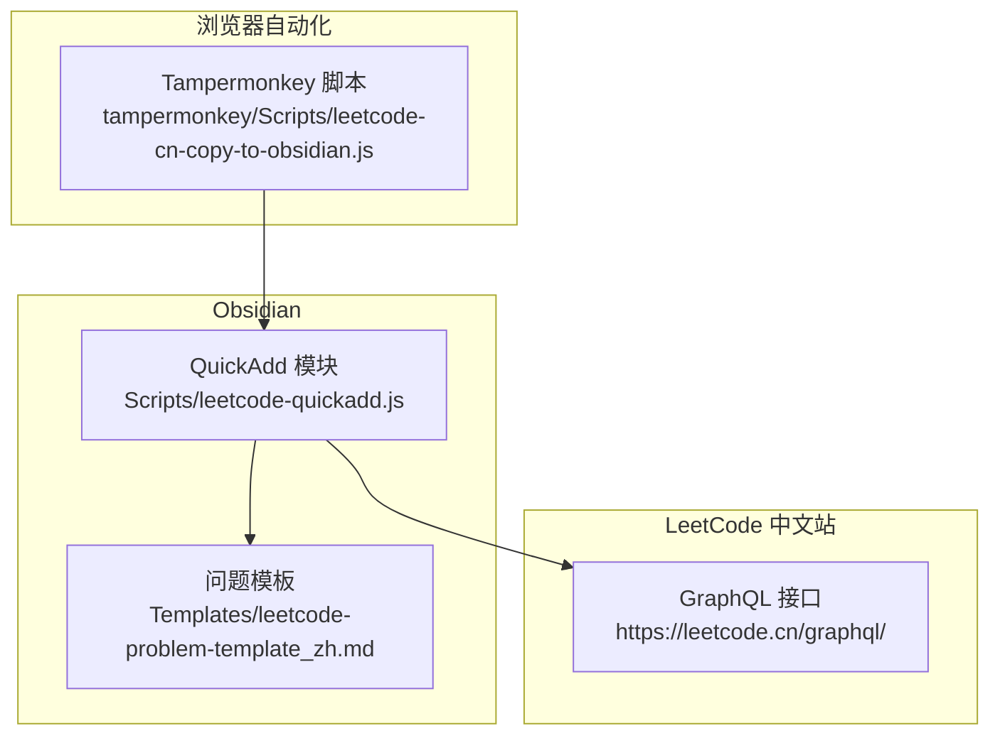
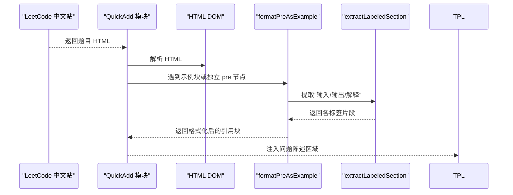
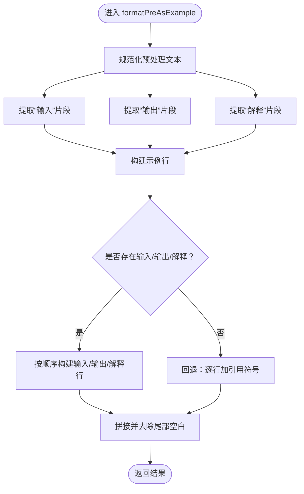
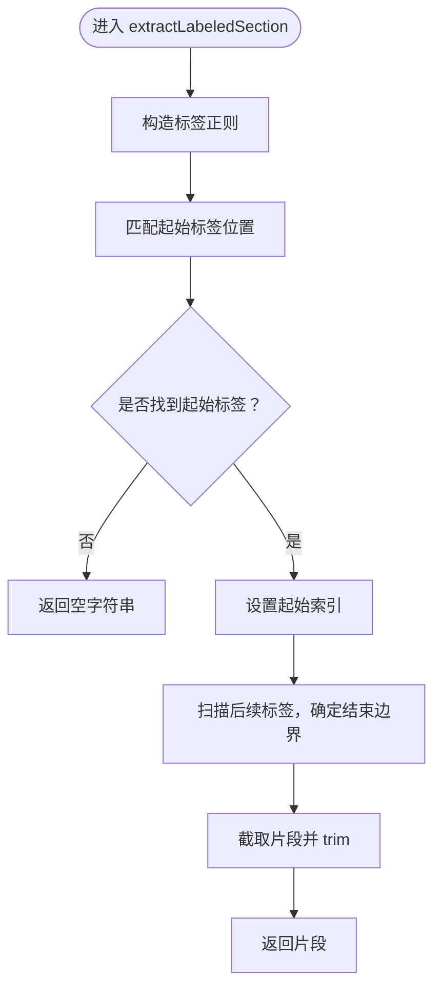
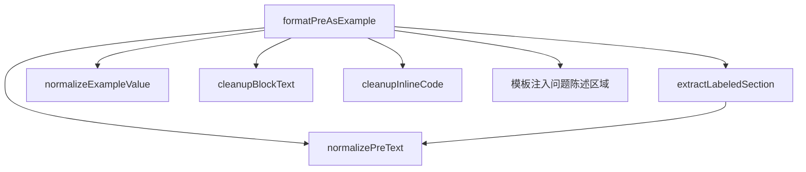

# 示例格式化处理

<cite>
**本文档引用的文件**
- [Scripts/leetcode-quickadd.js](file://Scripts/leetcode-quickadd.js)
- [Templates/leetcode-problem-template_zh.md](file://Templates/leetcode-problem-template_zh.md)
- [tampermonkey/Scripts/leetcode-cn-copy-to-obsidian.js](file://tampermonkey/Scripts/leetcode-cn-copy-to-obsidian.js)
</cite>

## 目录
1. [简介](#简介)
2. [项目结构](#项目结构)
3. [核心组件](#核心组件)
4. [架构总览](#架构总览)
5. [详细组件分析](#详细组件分析)
6. [依赖关系分析](#依赖关系分析)
7. [性能考虑](#性能考虑)
8. [故障排除指南](#故障排除指南)
9. [结论](#结论)

## 简介
本文件聚焦于示例格式化处理功能，深入解释以下两个核心函数的工作机制与格式化规则：
- formatPreAsExample 函数：将包含“输入/输出/解释”标签的代码块转换为 Obsidian 引用块格式的示例条目。
- extractLabeledSection 函数：基于标签（输入、输出、解释）的正则匹配，从原始文本中抽取对应的片段。

同时，文档还说明了示例标题格式、输入输出代码块格式、解释段落格式，以及格式化输出中引用块、加粗标记、代码标记的组合使用方式，并给出多种示例格式的处理示例与优化建议。

## 项目结构
该仓库围绕 Obsidian 快速添加（QuickAdd）与 Tampermonkey 自动复制功能协作，完成从 LeetCode 中文站抓取题目内容并生成符合模板的笔记。与示例格式化直接相关的文件如下：
- Scripts/leetcode-quickadd.js：包含 HTML 到 Markdown 的转换逻辑、示例格式化函数与标签提取函数。
- Templates/leetcode-problem-template_zh.md：Obsidian 模板，定义问题陈述区域用于承载格式化后的示例内容。
- tampermonkey/Scripts/leetcode-cn-copy-to-obsidian.js：Tampermonkey 脚本，负责从 LeetCode 页面复制题目 URL、语言与代码到剪贴板，供 QuickAdd 使用。

图表来源
- [Scripts/leetcode-quickadd.js:339-404](file://Scripts/leetcode-quickadd.js#L339-L404)
- [Templates/leetcode-problem-template_zh.md:14-41](file://Templates/leetcode-problem-template_zh.md#L14-L41)
- [tampermonkey/Scripts/leetcode-cn-copy-to-obsidian.js:316-363](file://tampermonkey/Scripts/leetcode-cn-copy-to-obsidian.js#L316-L363)

章节来源
- [Scripts/leetcode-quickadd.js:339-404](file://Scripts/leetcode-quickadd.js#L339-L404)
- [Templates/leetcode-problem-template_zh.md:14-41](file://Templates/leetcode-problem-template_zh.md#L14-L41)
- [tampermonkey/Scripts/leetcode-cn-copy-to-obsidian.js:316-363](file://tampermonkey/Scripts/leetcode-cn-copy-to-obsidian.js#L316-L363)

## 核心组件
本节聚焦于示例格式化处理的核心函数与规则，包括：
- formatPreAsExample：示例块处理主函数，负责识别输入/输出/解释三部分并格式化为 Obsidian 引用块。
- extractLabeledSection：标签提取函数，使用正则匹配“输入/输出/解释”标签及其冒号分隔符，抽取对应片段。
- 辅助函数：normalizePreText、normalizeExampleValue、cleanupBlockText、cleanupInlineCode 等，用于文本规范化与清理。

章节来源
- [Scripts/leetcode-quickadd.js:669-699](file://Scripts/leetcode-quickadd.js#L669-L699)
- [Scripts/leetcode-quickadd.js:701-723](file://Scripts/leetcode-quickadd.js#L701-L723)
- [Scripts/leetcode-quickadd.js:740-783](file://Scripts/leetcode-quickadd.js#L740-L783)

## 架构总览
示例格式化处理在整体流程中的位置如下：
- 从 LeetCode 中文站 GraphQL 接口获取题目 HTML 内容。
- 将 HTML 转换为 Markdown，期间对包含示例标题的段落进行识别与处理。
- 对独立的 pre 节点，若其包含“输入/输出/解释”标签，则调用 formatPreAsExample 进行格式化。
- 若无法识别标签，回退为保留原始内容并以引用块形式输出，避免信息丢失。

图表来源
- [Scripts/leetcode-quickadd.js:436-546](file://Scripts/leetcode-quickadd.js#L436-L546)
- [Scripts/leetcode-quickadd.js:669-699](file://Scripts/leetcode-quickadd.js#L669-L699)
- [Scripts/leetcode-quickadd.js:701-723](file://Scripts/leetcode-quickadd.js#L701-L723)

## 详细组件分析

### formatPreAsExample 函数
该函数负责将包含“输入/输出/解释”标签的代码块转换为 Obsidian 引用块格式的示例条目。其处理逻辑如下：
- 输入：一个 pre 节点的文本内容（已规范化）。
- 输出：一段以引用块形式呈现的示例内容，包含示例行、输入行、输出行与解释行。
- 处理步骤：
  1) 使用 extractLabeledSection 分别提取“输入”、“输出”、“解释”三部分。
  2) 组装示例行（示例编号）。
  3) 若存在“输入”，则以加粗“输入”与代码标记包裹的值输出。
  4) 若存在“输出”，则以加粗“输出”与代码标记包裹的值输出。
  5) 若存在“解释”，则以加粗“解释”与段落文本输出。
  6) 若三者均未识别，回退为将原始文本逐行加上引用符号，避免信息丢失。

图表来源
- [Scripts/leetcode-quickadd.js:669-699](file://Scripts/leetcode-quickadd.js#L669-L699)

章节来源
- [Scripts/leetcode-quickadd.js:669-699](file://Scripts/leetcode-quickadd.js#L669-L699)

### extractLabeledSection 函数
该函数通过正则表达式匹配标签与其冒号分隔符，从原始文本中抽取对应片段。其工作机制如下：
- 输入标签：如“输入”、“输出”、“解释”。
- 匹配规则：
  - 标签名后可带中文冒号“：”或英文冒号“:”，且前后允许空格。
  - 以标签名作为起始位置，向后扫描。
  - 若存在后续标签（如“输入”后可遇到“输出”或“解释”），则以最近的下一个标签位置作为结束边界。
- 输出：返回标签之间的文本片段，经过 trim 规范化。

图表来源
- [Scripts/leetcode-quickadd.js:701-723](file://Scripts/leetcode-quickadd.js#L701-L723)

章节来源
- [Scripts/leetcode-quickadd.js:701-723](file://Scripts/leetcode-quickadd.js#L701-L723)

### 示例格式化规则
- 示例标题格式：以引用块标题形式呈现，包含“示例编号”。例如“> 示例 1”。
- 输入/输出格式：使用加粗标签“输入/输出”，后接代码标记包裹的值，便于在 Obsidian 中高亮显示。
- 解释格式：使用加粗标签“解释”，后接段落文本，支持多行解释内容。
- 回退策略：当无法识别任何标签时，将原始文本逐行加上引用符号，避免信息丢失。

章节来源
- [Scripts/leetcode-quickadd.js:669-699](file://Scripts/leetcode-quickadd.js#L669-L699)
- [Scripts/leetcode-quickadd.js:701-723](file://Scripts/leetcode-quickadd.js#L701-L723)

### 处理示例与优化建议
- 完整示例：包含“输入”、“输出”、“解释”三部分，将分别渲染为三条引用行，分别标注加粗标签与代码标记。
- 缺失部分：仅包含“输入/输出”或仅有“解释”的示例，将仅输出存在的部分，其余省略。
- 格式化优化：
  - 输入/输出值中的换行会被替换为空格，保持单行展示。
  - 标签与冒号之间允许空格，提升容错性。
  - 解释内容保留段落格式，适合长解释文本。
  - 回退模式保证即使标签缺失也能保留原始信息。

章节来源
- [Scripts/leetcode-quickadd.js:669-699](file://Scripts/leetcode-quickadd.js#L669-L699)
- [Scripts/leetcode-quickadd.js:701-723](file://Scripts/leetcode-quickadd.js#L701-L723)
- [Scripts/leetcode-quickadd.js:740-783](file://Scripts/leetcode-quickadd.js#L740-L783)

## 依赖关系分析
示例格式化处理依赖于以下函数与数据流：
- formatPreAsExample 依赖 extractLabeledSection 进行标签片段提取。
- extractLabeledSection 依赖正则表达式匹配标签与冒号分隔符。
- 文本规范化函数（normalizePreText、normalizeExampleValue、cleanupBlockText、cleanupInlineCode）确保输入文本的一致性与可读性。
- 模板注入：格式化后的示例内容最终注入到模板的问题陈述区域，供 Obsidian 渲染。

图表来源
- [Scripts/leetcode-quickadd.js:669-699](file://Scripts/leetcode-quickadd.js#L669-L699)
- [Scripts/leetcode-quickadd.js:701-723](file://Scripts/leetcode-quickadd.js#L701-L723)
- [Scripts/leetcode-quickadd.js:740-783](file://Scripts/leetcode-quickadd.js#L740-L783)

章节来源
- [Scripts/leetcode-quickadd.js:669-699](file://Scripts/leetcode-quickadd.js#L669-L699)
- [Scripts/leetcode-quickadd.js:701-723](file://Scripts/leetcode-quickadd.js#L701-L723)
- [Scripts/leetcode-quickadd.js:740-783](file://Scripts/leetcode-quickadd.js#L740-L783)

## 性能考虑
- 正则匹配：extractLabeledSection 使用单次正则匹配定位起始标签，并在后续扫描中比较多个候选标签的最小索引作为结束边界，时间复杂度近似线性。
- 文本规范化：多次字符串替换与 trim 操作，整体仍为线性复杂度，但注意避免在大文本上重复执行不必要的规范化。
- 回退策略：当无法识别标签时，逐行加引用符号的回退逻辑避免了复杂的解析成本，同时保证信息完整性。

## 故障排除指南
- 标签未识别：
  - 检查标签是否使用了中文冒号“：”或英文冒号“:”，以及前后空格是否过多。
  - 确认“输入/输出/解释”标签与内容之间是否有额外字符干扰。
- 输入/输出值异常：
  - 输入/输出值中的换行会被替换为空格，若需要保留换行，请在源文本中调整格式。
- 解释内容格式：
  - 解释内容保留段落格式，若出现意外换行，检查源文本中的换行与缩进。
- 回退模式：
  - 当三者均未识别时，系统会将原始文本逐行加上引用符号，确保不会丢失信息。

章节来源
- [Scripts/leetcode-quickadd.js:701-723](file://Scripts/leetcode-quickadd.js#L701-L723)
- [Scripts/leetcode-quickadd.js:740-783](file://Scripts/leetcode-quickadd.js#L740-L783)

## 结论
示例格式化处理通过 formatPreAsExample 与 extractLabeledSection 的协同工作，实现了对 LeetCode 示例块的稳健解析与格式化输出。其规则简洁明确：示例标题、输入/输出代码块、解释段落，配合引用块、加粗与代码标记的组合使用，既保证了可读性，又兼顾了信息完整性。对于缺失标签的情况，回退策略确保不会丢失任何原始内容，适合在不同格式的题目内容中广泛使用。