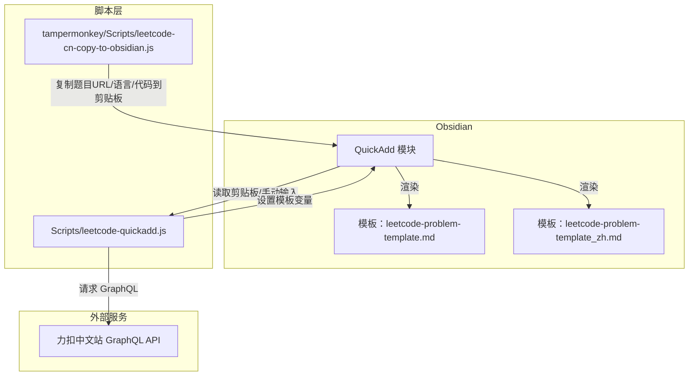
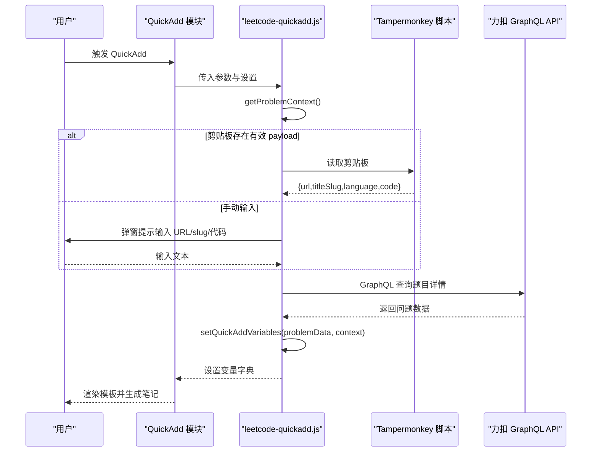
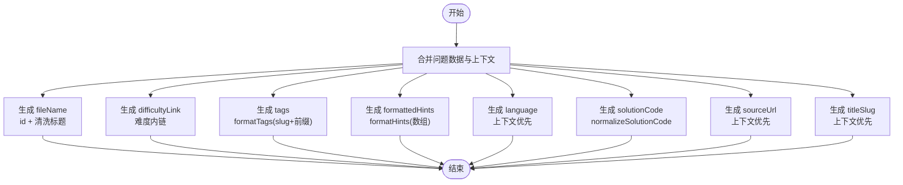
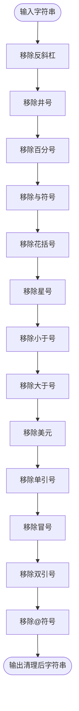
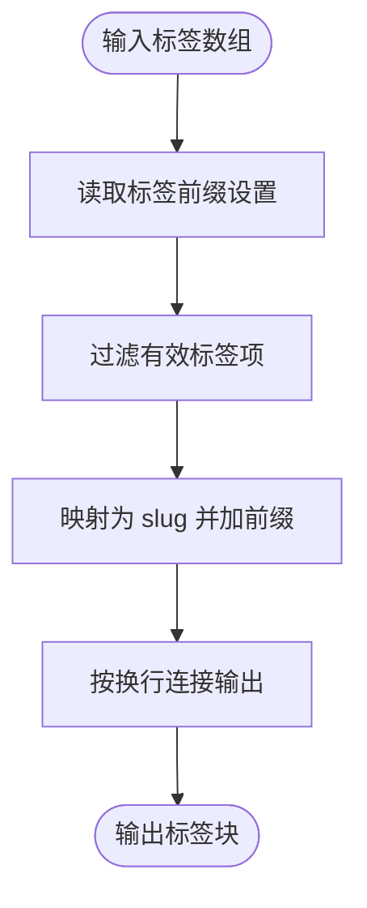
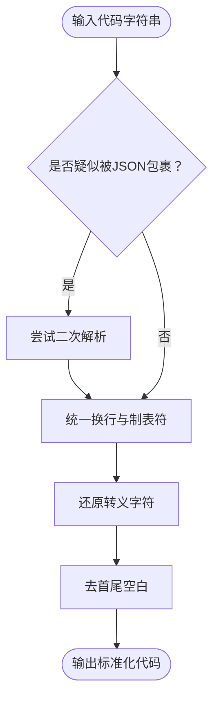
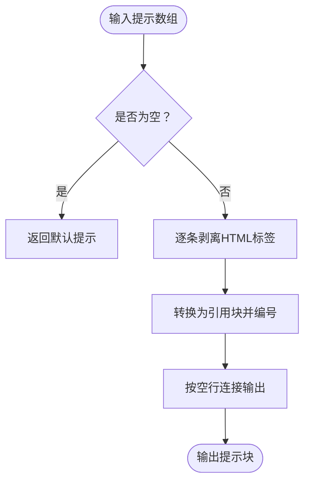
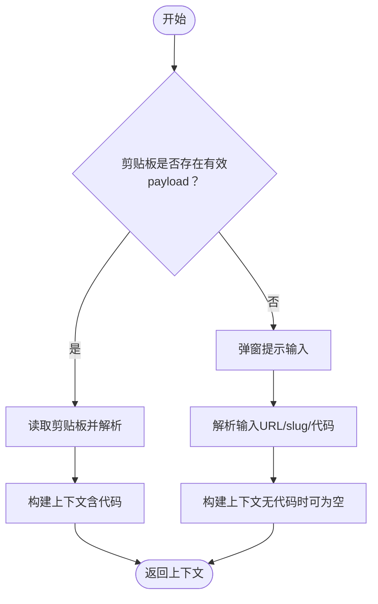
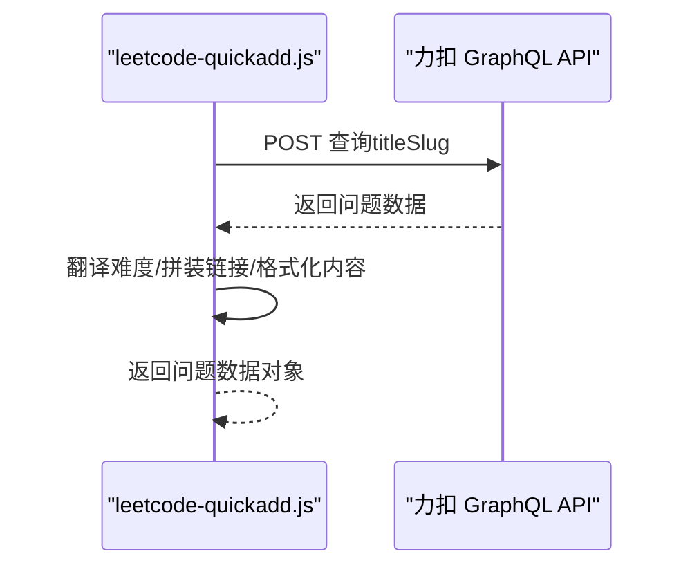
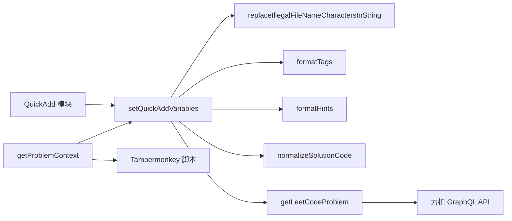

# 模板变量设置与渲染

<cite>
**本文档引用的文件**
- [Scripts/leetcode-quickadd.js](file://Scripts/leetcode-quickadd.js)
- [Templates/leetcode-problem-template.md](file://Templates/leetcode-problem-template.md)
- [Templates/leetcode-problem-template_zh.md](file://Templates/leetcode-problem-template_zh.md)
- [tampermonkey/Scripts/leetcode-cn-copy-to-obsidian.js](file://tampermonkey/Scripts/leetcode-cn-copy-to-obsidian.js)
</cite>

## 目录
1. [简介](#简介)
2. [项目结构](#项目结构)
3. [核心组件](#核心组件)
4. [架构总览](#架构总览)
5. [详细组件分析](#详细组件分析)
6. [依赖关系分析](#依赖关系分析)
7. [性能考虑](#性能考虑)
8. [故障排除指南](#故障排除指南)
9. [结论](#结论)
10. [附录](#附录)

## 简介
本文件面向 Obsidian 的 LeetCode 快速添加（QuickAdd）功能，系统性阐述模板变量的设置与渲染机制。重点覆盖以下方面：
- setQuickAddVariables 函数如何将问题数据与上下文数据合并，生成模板变量
- 各类模板变量的生成规则：fileName 文件名、difficultyLink 难度链接、tags 标签、formattedHints 提示、solutionCode 代码
- replaceIllegalFileNameCharactersInString 文件名字符清理逻辑
- formatTags 标签前缀设置与 slug 标准化处理
- normalizeSolutionCode 代码格式化与清理机制
- 完整变量映射表与使用示例
- 配置选项说明与自定义变量添加指南

## 项目结构
该仓库围绕 Obsidian 的 QuickAdd 插件构建，核心由三部分组成：
- 脚本层：负责从剪贴板/手动输入获取上下文，调用 GraphQL 拉取题目详情，设置模板变量
- 模板层：提供中英双语的 Markdown 模板，用于渲染最终笔记
- 用户脚本层：Tampermonkey 脚本负责从力扣中文站复制题目 URL、语言与代码到剪贴板，供 QuickAdd 使用

图表来源
- [Scripts/leetcode-quickadd.js:83-104](file://Scripts/leetcode-quickadd.js#L83-L104)
- [Templates/leetcode-problem-template.md:1-35](file://Templates/leetcode-problem-template.md#L1-L35)
- [Templates/leetcode-problem-template_zh.md:1-41](file://Templates/leetcode-problem-template_zh.md#L1-L41)
- [tampermonkey/Scripts/leetcode-cn-copy-to-obsidian.js:316-363](file://tampermonkey/Scripts/leetcode-cn-copy-to-obsidian.js#L316-L363)

章节来源
- [Scripts/leetcode-quickadd.js:1-104](file://Scripts/leetcode-quickadd.js#L1-L104)
- [Templates/leetcode-problem-template.md:1-35](file://Templates/leetcode-problem-template.md#L1-L35)
- [Templates/leetcode-problem-template_zh.md:1-41](file://Templates/leetcode-problem-template_zh.md#L1-L41)
- [tampermonkey/Scripts/leetcode-cn-copy-to-obsidian.js:1-536](file://tampermonkey/Scripts/leetcode-cn-copy-to-obsidian.js#L1-L536)

## 核心组件
- setQuickAddVariables：将问题数据与上下文数据合并，生成所有模板变量键值对
- replaceIllegalFileNameCharactersInString：清理文件名中的非法字符
- formatTags：根据配置为标签添加前缀并标准化 slug
- normalizeSolutionCode：统一代码换行、转义与空白
- formatHints：将提示数组转换为 Markdown 引用块
- getProblemContext：优先从剪贴板读取 Tampermonkey payload，否则进入手动模式
- getLeetCodeProblem：通过 GraphQL 拉取题目详情

章节来源
- [Scripts/leetcode-quickadd.js:410-430](file://Scripts/leetcode-quickadd.js#L410-L430)
- [Scripts/leetcode-quickadd.js:832-834](file://Scripts/leetcode-quickadd.js#L832-L834)
- [Scripts/leetcode-quickadd.js:789-799](file://Scripts/leetcode-quickadd.js#L789-L799)
- [Scripts/leetcode-quickadd.js:836-868](file://Scripts/leetcode-quickadd.js#L836-L868)
- [Scripts/leetcode-quickadd.js:801-812](file://Scripts/leetcode-quickadd.js#L801-L812)
- [Scripts/leetcode-quickadd.js:114-166](file://Scripts/leetcode-quickadd.js#L114-L166)
- [Scripts/leetcode-quickadd.js:339-404](file://Scripts/leetcode-quickadd.js#L339-L404)

## 架构总览
下图展示从用户触发到模板渲染的关键流程，以及变量生成与使用的路径。

图表来源
- [Scripts/leetcode-quickadd.js:83-104](file://Scripts/leetcode-quickadd.js#L83-L104)
- [Scripts/leetcode-quickadd.js:114-166](file://Scripts/leetcode-quickadd.js#L114-L166)
- [Scripts/leetcode-quickadd.js:339-404](file://Scripts/leetcode-quickadd.js#L339-L404)
- [Scripts/leetcode-quickadd.js:410-430](file://Scripts/leetcode-quickadd.js#L410-L430)
- [tampermonkey/Scripts/leetcode-cn-copy-to-obsidian.js:316-363](file://tampermonkey/Scripts/leetcode-cn-copy-to-obsidian.js#L316-L363)

## 详细组件分析

### setQuickAddVariables：变量设置与合并逻辑
该函数将问题数据与上下文数据合并，生成模板变量字典。合并策略如下：
- 以问题数据为基础对象，使用展开运算符将问题字段直接注入
- 对关键字段进行二次加工，形成模板变量
- 优先使用上下文中的语言、代码、URL、slug，若缺失则回退到问题数据

变量生成要点
- fileName：由问题 id 与清洗后的标题拼接而成，避免文件名非法字符
- difficultyLink：将难度封装为 Obsidian 内链格式
- tags：调用 formatTags，按配置前缀与 slug 标准化输出
- formattedHints：调用 formatHints，将提示数组转换为带引用的 Markdown
- language：优先使用上下文语言，否则默认 C++
- solutionCode：调用 normalizeSolutionCode，统一换行与转义
- sourceUrl：优先使用上下文 URL，否则回退到标准链接
- titleSlug：优先使用上下文 slug，否则回退到问题 slug

图表来源
- [Scripts/leetcode-quickadd.js:410-430](file://Scripts/leetcode-quickadd.js#L410-L430)

章节来源
- [Scripts/leetcode-quickadd.js:410-430](file://Scripts/leetcode-quickadd.js#L410-L430)

### replaceIllegalFileNameCharactersInString：文件名字符清理
- 目标：确保生成的文件名在操作系统与 Obsidian 中可安全使用
- 处理规则：移除反斜杠、井号、百分号、与符号、花括号、星号、小于号、大于号、美元、单引号、冒号、双引号、@ 符号
- 适用场景：fileName 变量的标题部分

图表来源
- [Scripts/leetcode-quickadd.js:832-834](file://Scripts/leetcode-quickadd.js#L832-L834)

章节来源
- [Scripts/leetcode-quickadd.js:832-834](file://Scripts/leetcode-quickadd.js#L832-L834)

### formatTags：标签前缀与 slug 标准化
- 前缀设置：从插件设置中读取“标签前缀”，默认值为 leetcode/
- 标准化：优先使用 slug（英文稳定标识），并去除首尾空白
- 输出格式：每行一个标签，缩进与连字符格式，便于 Obsidian 与 Dataview 使用

图表来源
- [Scripts/leetcode-quickadd.js:789-799](file://Scripts/leetcode-quickadd.js#L789-L799)

章节来源
- [Scripts/leetcode-quickadd.js:789-799](file://Scripts/leetcode-quickadd.js#L789-L799)

### normalizeSolutionCode：代码格式化与清理
- 目标：统一来自不同来源（剪贴板、手动输入、Tampermonkey JSON）的代码格式
- 处理步骤：
  - 尝试对可能被 JSON.stringify 包裹的字符串再次解析
  - 统一换行符（Windows、Unix）
  - 还原转义字符（引号、反斜杠、制表符）
  - 去除首尾空白
- 适用场景：solutionCode 变量

图表来源
- [Scripts/leetcode-quickadd.js:836-868](file://Scripts/leetcode-quickadd.js#L836-L868)

章节来源
- [Scripts/leetcode-quickadd.js:836-868](file://Scripts/leetcode-quickadd.js#L836-L868)

### formatHints：提示格式化
- 输入：提示数组（HTML 文本）
- 处理：剥离 HTML 标签，逐条转换为 Obsidian 引用块，编号提示
- 输出：Markdown 引用块列表；若为空返回“暂无提示”

图表来源
- [Scripts/leetcode-quickadd.js:801-812](file://Scripts/leetcode-quickadd.js#L801-L812)

章节来源
- [Scripts/leetcode-quickadd.js:801-812](file://Scripts/leetcode-quickadd.js#L801-L812)

### getProblemContext：上下文获取与优先级
- 优先级：
  1) 从剪贴板读取 Tampermonkey payload（包含 URL、slug、语言、代码）
  2) 手动输入 URL/slug
  3) 手动粘贴代码（可选）
- 产出：包含 titleSlug、sourceUrl、language、solutionCode、fromClipboard 标记的对象

图表来源
- [Scripts/leetcode-quickadd.js:114-166](file://Scripts/leetcode-quickadd.js#L114-L166)

章节来源
- [Scripts/leetcode-quickadd.js:114-166](file://Scripts/leetcode-quickadd.js#L114-L166)

### getLeetCodeProblem：GraphQL 数据拉取
- 请求：向力扣中文站 GraphQL 发送查询，获取题目详情（标题、难度、标签、提示、内容等）
- 处理：翻译难度、拼装链接、格式化题目内容
- 输出：问题数据对象（包含 id、title、titleSlug、difficulty、link、topicTags、problemStatement、hints）

图表来源
- [Scripts/leetcode-quickadd.js:339-404](file://Scripts/leetcode-quickadd.js#L339-L404)

章节来源
- [Scripts/leetcode-quickadd.js:339-404](file://Scripts/leetcode-quickadd.js#L339-L404)

## 依赖关系分析
- QuickAdd 模块依赖 setQuickAddVariables 生成变量字典
- setQuickAddVariables 依赖多个工具函数：文件名清理、标签格式化、代码标准化、提示格式化
- getProblemContext 依赖 Tampermonkey 脚本提供的剪贴板 payload
- getLeetCodeProblem 依赖力扣 GraphQL API

图表来源
- [Scripts/leetcode-quickadd.js:410-430](file://Scripts/leetcode-quickadd.js#L410-L430)
- [Scripts/leetcode-quickadd.js:832-834](file://Scripts/leetcode-quickadd.js#L832-L834)
- [Scripts/leetcode-quickadd.js:789-799](file://Scripts/leetcode-quickadd.js#L789-L799)
- [Scripts/leetcode-quickadd.js:801-812](file://Scripts/leetcode-quickadd.js#L801-L812)
- [Scripts/leetcode-quickadd.js:836-868](file://Scripts/leetcode-quickadd.js#L836-L868)
- [Scripts/leetcode-quickadd.js:114-166](file://Scripts/leetcode-quickadd.js#L114-L166)
- [Scripts/leetcode-quickadd.js:339-404](file://Scripts/leetcode-quickadd.js#L339-L404)
- [tampermonkey/Scripts/leetcode-cn-copy-to-obsidian.js:316-363](file://tampermonkey/Scripts/leetcode-cn-copy-to-obsidian.js#L316-L363)

章节来源
- [Scripts/leetcode-quickadd.js:410-430](file://Scripts/leetcode-quickadd.js#L410-L430)
- [Scripts/leetcode-quickadd.js:114-166](file://Scripts/leetcode-quickadd.js#L114-L166)
- [Scripts/leetcode-quickadd.js:339-404](file://Scripts/leetcode-quickadd.js#L339-L404)

## 性能考虑
- GraphQL 查询仅在需要时发起，减少网络开销
- HTML 到 Markdown 的转换采用 DOM 解析与遍历，建议避免在超大内容上重复调用
- 标签与提示处理为线性扫描，时间复杂度 O(n)，在标签数量有限的情况下开销可忽略
- 代码标准化包含一次可选的 JSON 解析尝试，失败时走常规替换，整体为 O(n) 复杂度

## 故障排除指南
- 剪贴板读取失败
  - 现象：无法从剪贴板读取 payload
  - 排查：确认浏览器支持 clipboard API；检查 Tampermonkey 脚本是否成功复制 payload
  - 参考路径：[Scripts/leetcode-quickadd.js:238-271](file://Scripts/leetcode-quickadd.js#L238-L271)
- GraphQL 请求失败
  - 现象：无法获取题目详情
  - 排查：检查网络连通性；确认 titleSlug 正确；查看返回数据结构
  - 参考路径：[Scripts/leetcode-quickadd.js:339-404](file://Scripts/leetcode-quickadd.js#L339-L404)
- 标签未显示或格式异常
  - 现象：标签未出现在笔记中或格式不正确
  - 排查：确认标签数组非空且包含 slug；检查标签前缀设置
  - 参考路径：[Scripts/leetcode-quickadd.js:789-799](file://Scripts/leetcode-quickadd.js#L789-L799)
- 文件名包含非法字符
  - 现象：生成的文件名无法保存
  - 排查：确认标题中未包含非法字符；检查 fileName 生成逻辑
  - 参考路径：[Scripts/leetcode-quickadd.js:832-834](file://Scripts/leetcode-quickadd.js#L832-L834)
- 代码格式错乱
  - 现象：代码换行、缩进或转义异常
  - 排查：确认代码来源（剪贴板/Tampermonkey/手动输入）；检查 normalizeSolutionCode 处理
  - 参考路径：[Scripts/leetcode-quickadd.js:836-868](file://Scripts/leetcode-quickadd.js#L836-L868)

章节来源
- [Scripts/leetcode-quickadd.js:238-271](file://Scripts/leetcode-quickadd.js#L238-L271)
- [Scripts/leetcode-quickadd.js:339-404](file://Scripts/leetcode-quickadd.js#L339-L404)
- [Scripts/leetcode-quickadd.js:789-799](file://Scripts/leetcode-quickadd.js#L789-L799)
- [Scripts/leetcode-quickadd.js:832-834](file://Scripts/leetcode-quickadd.js#L832-L834)
- [Scripts/leetcode-quickadd.js:836-868](file://Scripts/leetcode-quickadd.js#L836-L868)

## 结论
本系统通过清晰的变量生成流程与稳健的清理/标准化机制，实现了从力扣中文站到 Obsidian 的高质量笔记生成。setQuickAddVariables 作为核心枢纽，将问题数据与上下文数据有机融合，配合各专项工具函数，确保模板渲染的一致性与可靠性。通过合理配置标签前缀与使用内置清理函数，用户可在不同环境下稳定复用模板。

## 附录

### 模板变量映射表
- id：问题前端 ID
- title：题目标题（中文）
- titleSlug：题目 slug
- difficulty：难度（中文）
- difficultyLink：难度内链格式
- link：题目链接
- sourceUrl：来源 URL（优先于上下文）
- problemStatement：格式化后的题目描述
- formattedHints：格式化后的提示块
- tags：格式化后的标签块
- language：编程语言（Markdown 语法高亮）
- solutionCode：标准化后的代码
- fileName：文件名（id + 清洗标题）

章节来源
- [Scripts/leetcode-quickadd.js:410-430](file://Scripts/leetcode-quickadd.js#L410-L430)
- [Templates/leetcode-problem-template.md:1-35](file://Templates/leetcode-problem-template.md#L1-L35)
- [Templates/leetcode-problem-template_zh.md:1-41](file://Templates/leetcode-problem-template_zh.md#L1-L41)

### 使用示例
- 剪贴板模式
  - 在力扣中文站打开题目，点击 Tampermonkey 按钮复制 payload
  - 在 Obsidian 中触发 QuickAdd，脚本自动从剪贴板读取并生成笔记
  - 参考路径：[tampermonkey/Scripts/leetcode-cn-copy-to-obsidian.js:316-363](file://tampermonkey/Scripts/leetcode-cn-copy-to-obsidian.js#L316-L363)
- 手动模式
  - 若剪贴板无 payload，脚本会弹窗提示输入 URL/slug 或直接粘贴代码
  - 参考路径：[Scripts/leetcode-quickadd.js:114-166](file://Scripts/leetcode-quickadd.js#L114-L166)

### 配置选项说明
- 标签前缀（LeetCode Tag Prefix）
  - 类型：文本
  - 默认值：leetcode/
  - 作用：为标签添加统一前缀，便于分类与检索
  - 参考路径：[Scripts/leetcode-quickadd.js:50-69](file://Scripts/leetcode-quickadd.js#L50-L69)

### 自定义变量添加指南
- 新增变量
  - 在 setQuickAddVariables 中添加新的键值对
  - 如需额外数据，可在 getLeetCodeProblem 中扩展 GraphQL 查询字段
  - 参考路径：[Scripts/leetcode-quickadd.js:410-430](file://Scripts/leetcode-quickadd.js#L410-L430)
- 模板中使用
  - 在模板文件中使用 {{VALUE:变量名}} 即可渲染
  - 参考路径：[Templates/leetcode-problem-template.md:1-35](file://Templates/leetcode-problem-template.md#L1-L35)
  - 参考路径：[Templates/leetcode-problem-template_zh.md:1-41](file://Templates/leetcode-problem-template_zh.md#L1-L41)