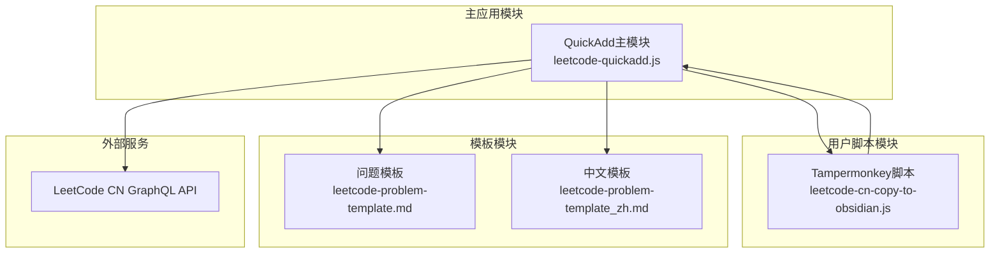
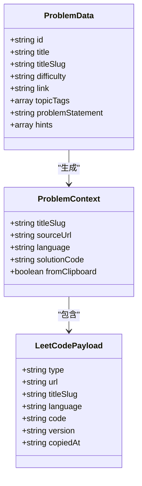
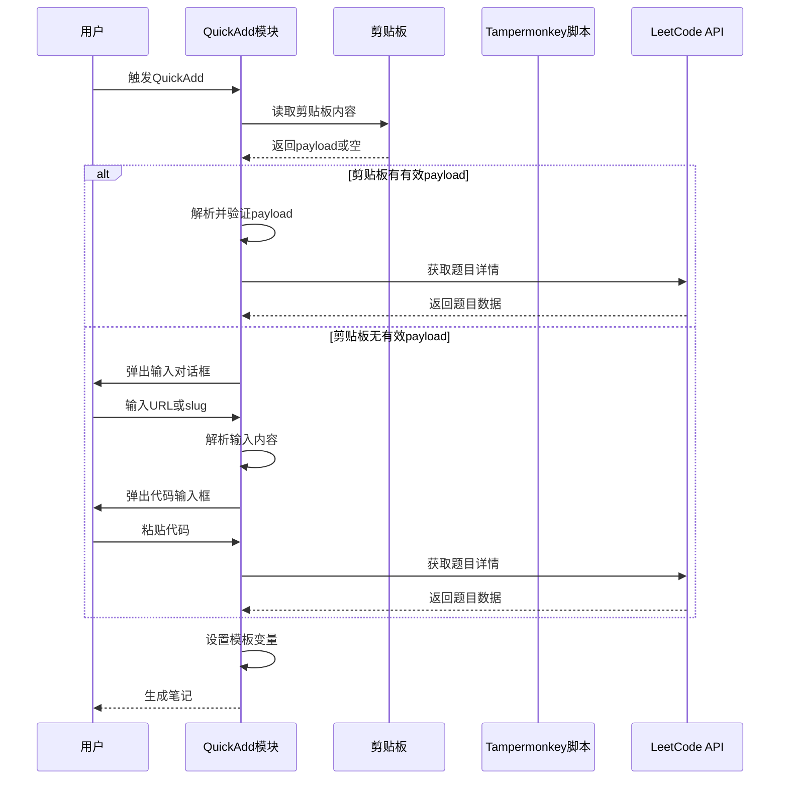
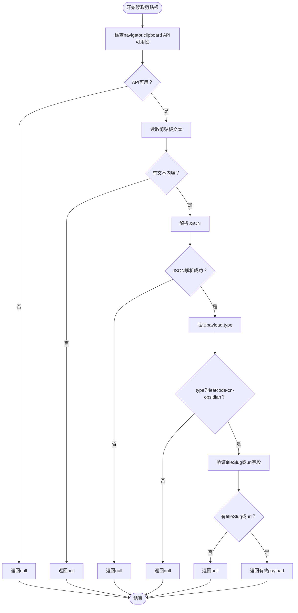
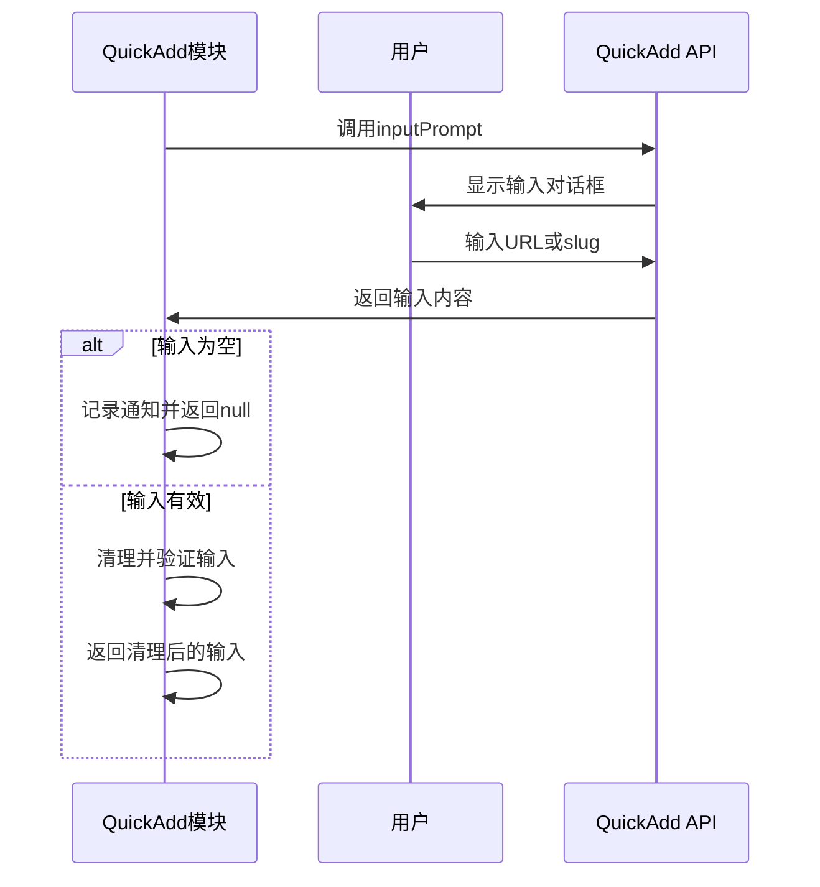
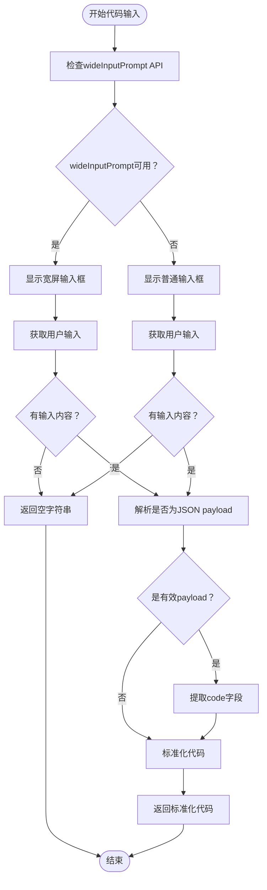
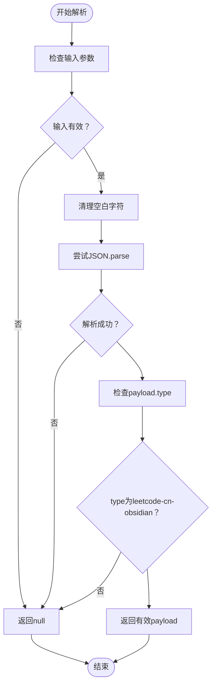
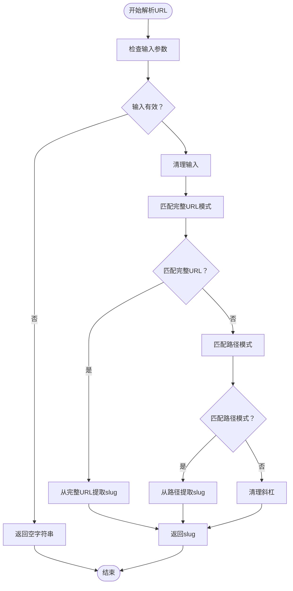
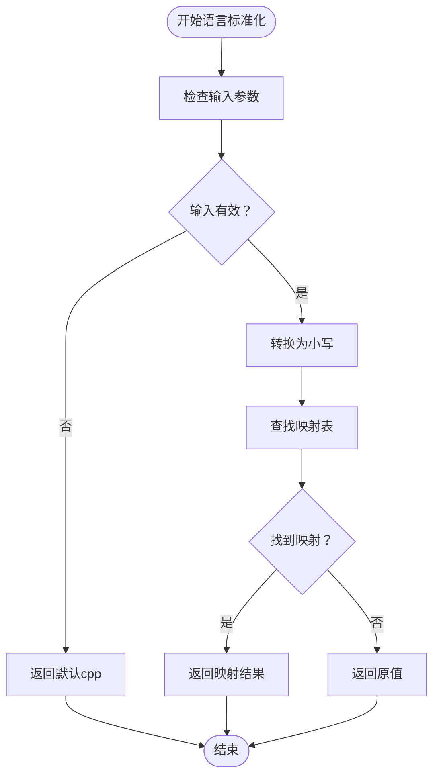
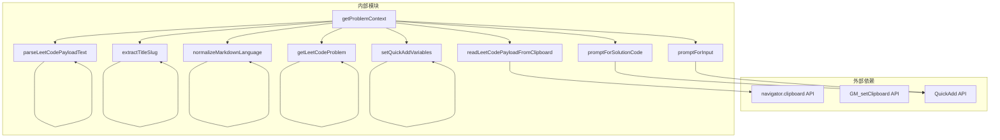

# 输入处理机制

<cite>
**本文档引用的文件**
- [Scripts/leetcode-quickadd.js](file://Scripts/leetcode-quickadd.js)
- [tampermonkey/Scripts/leetcode-cn-copy-to-obsidian.js](file://tampermonkey/Scripts/leetcode-cn-copy-to-obsidian.js)
- [Templates/leetcode-problem-template.md](file://Templates/leetcode-problem-template.md)
- [Templates/leetcode-problem-template_zh.md](file://Templates/leetcode-problem-template_zh.md)
</cite>

## 目录
1. [简介](#简介)
2. [项目结构](#项目结构)
3. [核心组件](#核心组件)
4. [架构概览](#架构概览)
5. [详细组件分析](#详细组件分析)
6. [依赖关系分析](#依赖关系分析)
7. [性能考虑](#性能考虑)
8. [故障排除指南](#故障排除指南)
9. [结论](#结论)

## 简介

本文档详细解释了LeetCode到Obsidian的输入处理机制，重点分析了三种输入方式的实现原理：剪贴板payload读取、手动输入URL/slug、手动粘贴代码。系统通过Tampermonkey脚本自动捕获LeetCode题目信息和代码，然后通过Obsidian QuickAdd插件进行处理和模板渲染。

该系统的核心优势在于提供了无缝的多步骤输入流程，从剪贴板自动读取到手动输入的完整回退机制，确保用户在不同场景下都能高效地创建LeetCode题目笔记。

## 项目结构

项目采用模块化设计，主要包含以下组件：

**图表来源**
- [Scripts/leetcode-quickadd.js:1-868](file://Scripts/leetcode-quickadd.js#L1-L868)
- [tampermonkey/Scripts/leetcode-cn-copy-to-obsidian.js:1-536](file://tampermonkey/Scripts/leetcode-cn-copy-to-obsidian.js#L1-L536)

**章节来源**
- [Scripts/leetcode-quickadd.js:1-868](file://Scripts/leetcode-quickadd.js#L1-L868)
- [tampermonkey/Scripts/leetcode-cn-copy-to-obsidian.js:1-536](file://tampermonkey/Scripts/leetcode-cn-copy-to-obsidian.js#L1-L536)

## 核心组件

### 输入处理主流程

系统实现了三层输入处理机制，按优先级顺序执行：

1. **剪贴板优先读取**：自动检测并解析Tampermonkey复制的payload
2. **手动URL输入**：用户直接输入LeetCode题目URL或slug
3. **手动代码粘贴**：用户粘贴代码或JSON格式的payload

### 关键数据结构

**图表来源**
- [Scripts/leetcode-quickadd.js:114-166](file://Scripts/leetcode-quickadd.js#L114-L166)
- [Scripts/leetcode-quickadd.js:339-404](file://Scripts/leetcode-quickadd.js#L339-L404)

**章节来源**
- [Scripts/leetcode-quickadd.js:114-166](file://Scripts/leetcode-quickadd.js#L114-L166)
- [Scripts/leetcode-quickadd.js:339-404](file://Scripts/leetcode-quickadd.js#L339-L404)

## 架构概览

系统采用分层架构设计，每个层次都有明确的职责分工：

**图表来源**
- [Scripts/leetcode-quickadd.js:83-104](file://Scripts/leetcode-quickadd.js#L83-L104)
- [Scripts/leetcode-quickadd.js:114-166](file://Scripts/leetcode-quickadd.js#L114-L166)

## 详细组件分析

### 剪贴板payload读取机制

#### readLeetCodePayloadFromClipboard函数工作流程

该函数实现了完整的剪贴板读取和验证流程：

**图表来源**
- [Scripts/leetcode-quickadd.js:238-271](file://Scripts/leetcode-quickadd.js#L238-L271)

**章节来源**
- [Scripts/leetcode-quickadd.js:238-271](file://Scripts/leetcode-quickadd.js#L238-L271)

#### navigator.clipboard API使用策略

系统采用了渐进式增强的API使用策略：

1. **API可用性检测**：首先检查`navigator.clipboard`对象和`readText`方法是否存在
2. **降级处理**：当API不可用时，记录警告日志并优雅降级
3. **错误处理**：使用try-catch包装异步操作，确保异常不会中断整个流程

### 手动输入处理机制

#### promptForInput函数用户交互逻辑

该函数负责处理用户的URL或slug输入：

**图表来源**
- [Scripts/leetcode-quickadd.js:172-184](file://Scripts/leetcode-quickadd.js#L172-L184)

**章节来源**
- [Scripts/leetcode-quickadd.js:172-184](file://Scripts/leetcode-quickadd.js#L172-L184)

#### promptForSolutionCode函数代码输入逻辑

该函数实现了智能的代码输入处理：

**图表来源**
- [Scripts/leetcode-quickadd.js:186-214](file://Scripts/leetcode-quickadd.js#L186-L214)

**章节来源**
- [Scripts/leetcode-quickadd.js:186-214](file://Scripts/leetcode-quickadd.js#L186-L214)

### JSON解析和验证机制

#### parseLeetCodePayloadText函数实现

该函数专门用于解析用户粘贴的JSON格式payload：

**图表来源**
- [Scripts/leetcode-quickadd.js:216-232](file://Scripts/leetcode-quickadd.js#L216-L232)

**章节来源**
- [Scripts/leetcode-quickadd.js:216-232](file://Scripts/leetcode-quickadd.js#L216-L232)

### URL解析算法

#### extractTitleSlug函数实现

该函数实现了灵活的URL解析算法：

**图表来源**
- [Scripts/leetcode-quickadd.js:277-293](file://Scripts/leetcode-quickadd.js#L277-L293)

**章节来源**
- [Scripts/leetcode-quickadd.js:277-293](file://Scripts/leetcode-quickadd.js#L277-L293)

### 语言标准化规则

#### normalizeMarkdownLanguage函数实现

该函数提供了完整的编程语言名称标准化功能：

**图表来源**
- [Scripts/leetcode-quickadd.js:295-323](file://Scripts/leetcode-quickadd.js#L295-L323)

**章节来源**
- [Scripts/leetcode-quickadd.js:295-323](file://Scripts/leetcode-quickadd.js#L295-L323)

## 依赖关系分析

系统的主要依赖关系如下：

**图表来源**
- [Scripts/leetcode-quickadd.js:83-104](file://Scripts/leetcode-quickadd.js#L83-L104)
- [Scripts/leetcode-quickadd.js:238-271](file://Scripts/leetcode-quickadd.js#L238-L271)

**章节来源**
- [Scripts/leetcode-quickadd.js:83-104](file://Scripts/leetcode-quickadd.js#L83-L104)
- [Scripts/leetcode-quickadd.js:238-271](file://Scripts/leetcode-quickadd.js#L238-L271)

## 性能考虑

### 异步操作优化

系统大量使用Promise和async/await模式，确保UI响应性：

1. **非阻塞I/O**：剪贴板读取和网络请求都是异步操作
2. **超时处理**：GraphQL API请求设置了合理的超时时间
3. **缓存策略**：使用`cache: "no-cache"`确保数据新鲜度

### 错误处理策略

系统实现了多层次的错误处理机制：

1. **API降级**：当navigator.clipboard不可用时，优雅降级到其他输入方式
2. **输入验证**：对所有用户输入进行严格的验证和清理
3. **回退机制**：从剪贴板到手动输入的完整回退流程

## 故障排除指南

### 常见问题及解决方案

#### 剪贴板读取失败

**问题症状**：系统无法从剪贴板读取LeetCode payload

**可能原因**：
1. 浏览器不支持navigator.clipboard API
2. 用户拒绝了剪贴板访问权限
3. 剪贴板中没有有效的JSON payload

**解决步骤**：
1. 检查浏览器兼容性
2. 确认剪贴板中有正确的payload格式
3. 尝试手动输入URL或slug

#### URL解析失败

**问题症状**：系统无法从用户输入中提取正确的titleSlug

**可能原因**：
1. 输入的URL格式不正确
2. 使用了非标准的slug格式

**解决步骤**：
1. 确保输入完整的LeetCode URL
2. 直接输入题目slug（如"two-sum"）
3. 检查URL中的特殊字符

#### 代码标准化问题

**问题症状**：粘贴的代码格式不正确

**可能原因**：
1. 代码包含转义字符
2. JSON字符串格式不正确

**解决步骤**：
1. 确保代码没有多余的转义字符
2. 检查JSON格式的正确性
3. 使用简单的代码格式

**章节来源**
- [Scripts/leetcode-quickadd.js:267-271](file://Scripts/leetcode-quickadd.js#L267-L271)
- [Scripts/leetcode-quickadd.js:216-232](file://Scripts/leetcode-quickadd.js#L216-L232)

## 结论

该输入处理机制展现了优秀的软件工程实践：

1. **多层回退设计**：从剪贴板自动读取到手动输入的完整流程确保了高成功率
2. **健壮的错误处理**：完善的异常处理和降级机制提升了用户体验
3. **灵活的数据处理**：支持多种输入格式和标准化处理
4. **清晰的架构设计**：模块化的设计便于维护和扩展

系统通过Tampermonkey脚本和QuickAdd插件的协同工作，为用户提供了无缝的LeetCode题目处理体验，无论是专业开发者还是普通用户都能轻松创建高质量的学习笔记。