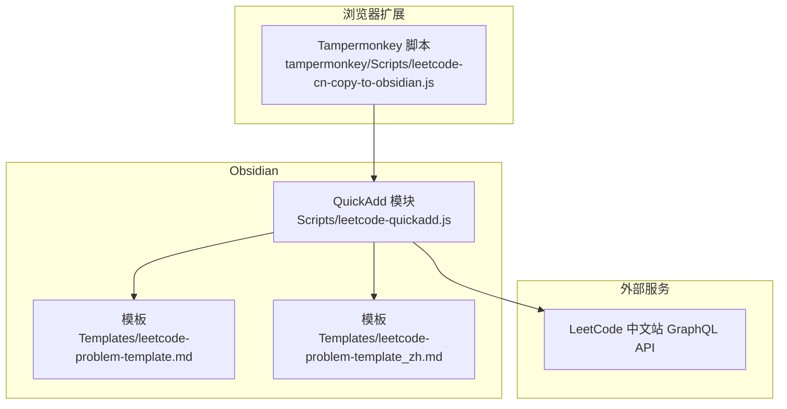
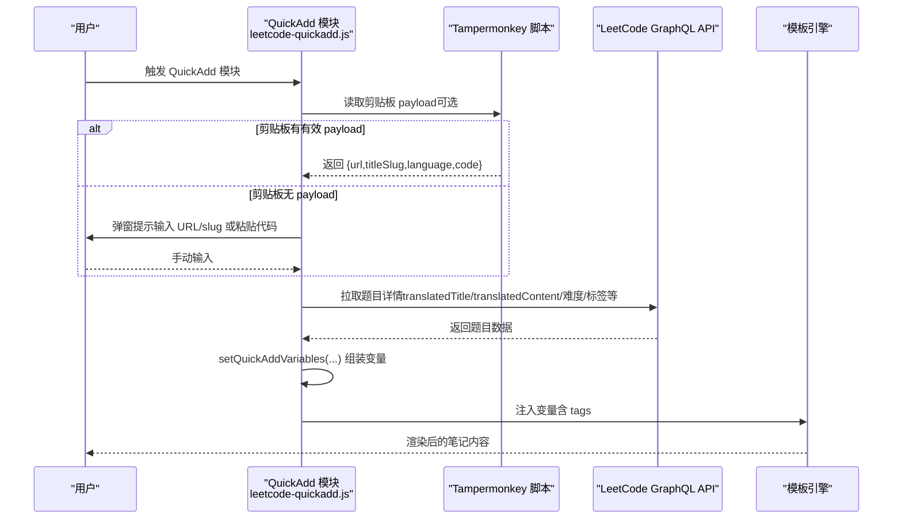
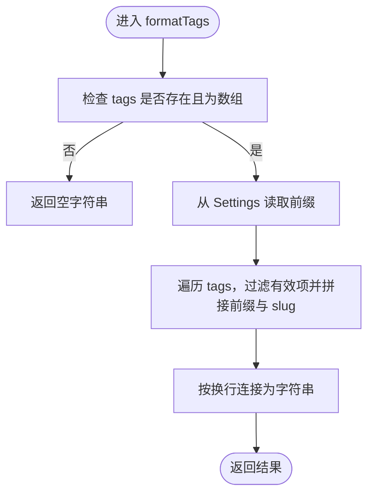
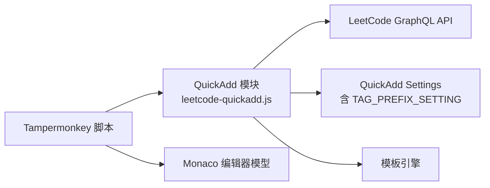

# 配置选项与定制

<cite>
**本文引用的文件**
- [Scripts/leetcode-quickadd.js](file://Scripts/leetcode-quickadd.js)
- [Templates/leetcode-problem-template.md](file://Templates/leetcode-problem-template.md)
- [Templates/leetcode-problem-template_zh.md](file://Templates/leetcode-problem-template_zh.md)
- [tampermonkey/Scripts/leetcode-cn-copy-to-obsidian.js](file://tampermonkey/Scripts/leetcode-cn-copy-to-obsidian.js)
</cite>

## 目录
1. [简介](#简介)
2. [项目结构](#项目结构)
3. [核心组件](#核心组件)
4. [架构总览](#架构总览)
5. [详细组件分析](#详细组件分析)
6. [依赖关系分析](#依赖关系分析)
7. [性能考量](#性能考量)
8. [故障排除指南](#故障排除指南)
9. [结论](#结论)
10. [附录](#附录)

## 简介
本文件面向 Obsidian QuickAdd 用户，系统性说明配置选项与定制能力，重点围绕以下主题展开：
- TAG_PREFIX_SETTING 常量的标签前缀配置机制：设置项定义、默认值、用户自定义选项及在格式化标签中的使用方式。
- QuickAdd 模块的 settings 配置结构：name、author、options 等字段的作用与最佳实践。
- 配置项的数据类型、默认值与描述信息的设置方法。
- 配置修改的最佳实践与注意事项。
- 完整的配置示例与常见配置场景。
- Settings 参数在 formatTags 函数中的使用方式。
- 配置故障排除指南与常见问题解决方案。

## 项目结构
该仓库由三部分组成：
- Scripts/leetcode-quickadd.js：Obsidian QuickAdd 模块入口，负责从剪贴板或手动输入获取题目上下文，拉取 LeetCode 中文站数据，并通过 QuickAdd 变量模板渲染笔记。
- Templates/leetcode-problem-template.md 与 leetcode-problem-template_zh.md：模板文件，用于在 QuickAdd 渲染阶段注入变量（如 tags、problemStatement、solutionCode 等）。
- tampermonkey/Scripts/leetcode-cn-copy-to-obsidian.js：Tampermonkey 脚本，负责将当前题目 URL、语言与代码复制到剪贴板，形成 QuickAdd 可识别的 payload，从而实现“剪贴板优先”的自动化流程。

图表来源
- [Scripts/leetcode-quickadd.js:1-104](file://Scripts/leetcode-quickadd.js#L1-L104)
- [Templates/leetcode-problem-template.md:1-35](file://Templates/leetcode-problem-template.md#L1-L35)
- [Templates/leetcode-problem-template_zh.md:1-41](file://Templates/leetcode-problem-template_zh.md#L1-L41)
- [tampermonkey/Scripts/leetcode-cn-copy-to-obsidian.js:305-363](file://tampermonkey/Scripts/leetcode-cn-copy-to-obsidian.js#L305-L363)

章节来源
- [Scripts/leetcode-quickadd.js:1-104](file://Scripts/leetcode-quickadd.js#L1-L104)
- [Templates/leetcode-problem-template.md:1-35](file://Templates/leetcode-problem-template.md#L1-L35)
- [Templates/leetcode-problem-template_zh.md:1-41](file://Templates/leetcode-problem-template_zh.md#L1-L41)
- [tampermonkey/Scripts/leetcode-cn-copy-to-obsidian.js:1-536](file://tampermonkey/Scripts/leetcode-cn-copy-to-obsidian.js#L1-L536)

## 核心组件
本节聚焦 QuickAdd 模块的配置结构与标签前缀设置机制。

- QuickAdd 模块导出结构
  - module.exports 包含 entry 与 settings 两个关键字段。entry 指向主流程函数，settings 描述模块的可配置项。
  - settings.options 下定义了 TAG_PREFIX_SETTING 对应的配置项，包含 type、defaultValue、placeholder、description 等元信息。

- TAG_PREFIX_SETTING 常量与标签前缀
  - TAG_PREFIX_SETTING 作为键名，用于在 QuickAdd 的 Settings 对象中读取用户自定义的标签前缀。
  - 在 formatTags 函数中，Settings[TAG_PREFIX_SETTING] 会被读取并拼接到每个标签的 slug 前面，形成最终的标签文本。

- QuickAdd 模块的 settings 字段
  - name：模块显示名称。
  - author：作者信息。
  - options：配置项集合，其中包含 TAG_PREFIX_SETTING 的定义，类型为文本（text），默认值为 leetcode/，占位符与描述信息分别用于 UI 提示与说明。

章节来源
- [Scripts/leetcode-quickadd.js:56-70](file://Scripts/leetcode-quickadd.js#L56-L70)
- [Scripts/leetcode-quickadd.js:789-799](file://Scripts/leetcode-quickadd.js#L789-L799)

## 架构总览
下图展示了 QuickAdd 模块的配置与数据流关系，以及模板渲染阶段如何消费变量。

图表来源
- [Scripts/leetcode-quickadd.js:83-104](file://Scripts/leetcode-quickadd.js#L83-L104)
- [Scripts/leetcode-quickadd.js:339-404](file://Scripts/leetcode-quickadd.js#L339-L404)
- [Scripts/leetcode-quickadd.js:410-430](file://Scripts/leetcode-quickadd.js#L410-L430)
- [tampermonkey/Scripts/leetcode-cn-copy-to-obsidian.js:316-363](file://tampermonkey/Scripts/leetcode-cn-copy-to-obsidian.js#L316-L363)

## 详细组件分析

### 标签前缀配置机制（TAG_PREFIX_SETTING）
- 设置项定义
  - 键名：TAG_PREFIX_SETTING（字符串常量）
  - 类型：text
  - 默认值：leetcode/
  - 占位符：Enter tag prefix, e.g. leetcode/
  - 描述：Prefix to be added to LeetCode tags.
- 使用位置
  - 在 formatTags 函数中，Settings[TAG_PREFIX_SETTING] 作为前缀拼接到每个标签 slug 前面，最终生成符合用户期望的标签列表。
- 数据类型与默认值
  - 数据类型：字符串（text）
  - 默认值：leetcode/
  - 用户自定义：在 QuickAdd 模块设置界面中修改该文本框，保存后生效。
- 最佳实践
  - 建议使用斜杠结尾（如 leetcode/）以保持标签层级清晰。
  - 若希望区分不同来源或语言，可在前缀中加入标识（如 leetcode/c++/）。
  - 保持前缀简洁，避免过长导致标签难以管理。
- 常见场景
  - 将所有 LeetCode 标签统一归类到 leetcode/ 命名空间。
  - 结合语言前缀，形成 leetcode/cpp/、leetcode/python/ 等分组。
  - 仅保留 slug（留空），直接使用英文 slug 作为标签。

章节来源
- [Scripts/leetcode-quickadd.js:50-70](file://Scripts/leetcode-quickadd.js#L50-L70)
- [Scripts/leetcode-quickadd.js:789-799](file://Scripts/leetcode-quickadd.js#L789-L799)

### QuickAdd 模块 settings 配置结构
- 字段说明
  - name：模块名称，用于在 QuickAdd 列表中显示。
  - author：作者信息，便于识别与维护。
  - options：配置项集合，包含 TAG_PREFIX_SETTING 的定义，用于声明 UI 控件类型、默认值、占位符与描述。
- 数据类型与描述信息设置方法
  - type：text（文本输入）
  - defaultValue：默认值
  - placeholder：输入提示
  - description：配置项用途说明
- 最佳实践
  - 为每个配置项提供清晰的 description，帮助用户理解其作用。
  - placeholder 应给出示例值，降低用户理解成本。
  - 默认值应兼顾通用性与安全性（如避免空字符串导致的渲染异常）。
- 注意事项
  - 修改 settings 后需重新加载 QuickAdd 模块或重启 Obsidian 以使更改生效。
  - 若需要新增配置项，应在 settings.options 中添加，并在使用处增加健壮性判断（如默认值回退）。

章节来源
- [Scripts/leetcode-quickadd.js:56-70](file://Scripts/leetcode-quickadd.js#L56-L70)

### Settings 参数在 formatTags 函数中的使用方式
- 读取方式
  - 通过 Settings[TAG_PREFIX_SETTING] 获取用户自定义前缀。
- 处理逻辑
  - 过滤有效标签对象（包含 slug），去除前后空白，拼接前缀与 slug，生成带缩进的标签条目。
  - 最终返回按换行分隔的标签列表字符串。
- 健壮性
  - 当 Settings 中未提供该键或为空时，回退为空字符串，保证不会污染标签列表。
- 输出形态
  - 每个标签以固定缩进与短横线开头，便于模板渲染时正确识别为列表项。

图表来源
- [Scripts/leetcode-quickadd.js:789-799](file://Scripts/leetcode-quickadd.js#L789-L799)

章节来源
- [Scripts/leetcode-quickadd.js:789-799](file://Scripts/leetcode-quickadd.js#L789-L799)

### 模板变量与配置联动
- 模板中使用 {{VALUE:tags}} 注入标签列表，该变量由 setQuickAddVariables 中的 tags 字段提供。
- 标签列表由 formatTags 生成，受 TAG_PREFIX_SETTING 影响。
- 模板中还包含其他变量（如 id、title、problemStatement、solutionCode、language 等），均由 setQuickAddVariables 统一注入。

章节来源
- [Scripts/leetcode-quickadd.js:410-430](file://Scripts/leetcode-quickadd.js#L410-L430)
- [Templates/leetcode-problem-template.md:8-9](file://Templates/leetcode-problem-template.md#L8-L9)
- [Templates/leetcode-problem-template_zh.md:8-9](file://Templates/leetcode-problem-template_zh.md#L8-L9)

### 剪贴板 payload 与配置的关系
- Tampermonkey 脚本将题目 URL、slug、语言与代码封装为特定类型的 payload 并写入剪贴板。
- QuickAdd 优先从剪贴板读取该 payload，若成功则无需手动输入，直接进入数据拉取与变量注入流程。
- 该流程与 TAG_PREFIX_SETTING 无直接耦合，但共同影响最终笔记的生成质量与一致性。

章节来源
- [tampermonkey/Scripts/leetcode-cn-copy-to-obsidian.js:336-344](file://tampermonkey/Scripts/leetcode-cn-copy-to-obsidian.js#L336-L344)
- [Scripts/leetcode-quickadd.js:238-271](file://Scripts/leetcode-quickadd.js#L238-L271)

## 依赖关系分析
- QuickAdd 模块依赖
  - 外部 API：LeetCode 中文站 GraphQL API，用于获取题目详情与标签。
  - 浏览器环境：navigator.clipboard 用于读取剪贴板内容。
  - 模板系统：Obsidian 的 QuickAdd 变量注入与模板渲染。
- 配置依赖
  - TAG_PREFIX_SETTING 依赖 QuickAdd 的 Settings 对象，后者由用户在模块设置界面配置。
- 外部脚本依赖
  - Tampermonkey 脚本依赖 LeetCode 页面的 Monaco 编辑器模型，用于提取代码与语言。

图表来源
- [Scripts/leetcode-quickadd.js:339-404](file://Scripts/leetcode-quickadd.js#L339-L404)
- [Scripts/leetcode-quickadd.js:238-271](file://Scripts/leetcode-quickadd.js#L238-L271)
- [tampermonkey/Scripts/leetcode-cn-copy-to-obsidian.js:147-303](file://tampermonkey/Scripts/leetcode-cn-copy-to-obsidian.js#L147-L303)

章节来源
- [Scripts/leetcode-quickadd.js:339-404](file://Scripts/leetcode-quickadd.js#L339-L404)
- [Scripts/leetcode-quickadd.js:238-271](file://Scripts/leetcode-quickadd.js#L238-L271)
- [tampermonkey/Scripts/leetcode-cn-copy-to-obsidian.js:147-303](file://tampermonkey/Scripts/leetcode-cn-copy-to-obsidian.js#L147-L303)

## 性能考量
- API 请求
  - GraphQL 查询仅请求必要字段，减少网络与解析开销。
- 剪贴板读取
  - 优先使用剪贴板读取，避免重复输入与手动粘贴，提升整体效率。
- 模板渲染
  - 标签列表在 formatTags 中一次性生成，避免在模板中进行复杂计算。
- 代码规范化
  - normalizeSolutionCode 对输入进行预处理，减少后续渲染的不确定性。

[本节为通用建议，不涉及具体文件分析]

## 故障排除指南
- 剪贴板读取失败
  - 现象：无法从剪贴板读取 payload。
  - 排查：确认浏览器支持 navigator.clipboard，且页面处于安全上下文（HTTPS）。检查 Tampermonkey 脚本是否成功将 payload 写入剪贴板。
  - 参考路径
    - [Scripts/leetcode-quickadd.js:238-271](file://Scripts/leetcode-quickadd.js#L238-L271)
    - [tampermonkey/Scripts/leetcode-cn-copy-to-obsidian.js:305-314](file://tampermonkey/Scripts/leetcode-cn-copy-to-obsidian.js#L305-L314)
- API 拉取失败
  - 现象：无法获取题目详情。
  - 排查：检查网络连通性与 LeetCode GraphQL API 的可用性；确认请求头与 referer 设置正确。
  - 参考路径
    - [Scripts/leetcode-quickadd.js:339-404](file://Scripts/leetcode-quickadd.js#L339-L404)
- 标签为空或异常
  - 现象：模板中 tags 为空或格式异常。
  - 排查：确认 TAG_PREFIX_SETTING 的值是否合理；检查 topicTags 数据结构是否包含 slug 字段；验证 formatTags 的过滤与拼接逻辑。
  - 参考路径
    - [Scripts/leetcode-quickadd.js:789-799](file://Scripts/leetcode-quickadd.js#L789-L799)
- 模板变量未生效
  - 现象：模板中 {{VALUE:tags}} 等变量未被替换。
  - 排查：确认 setQuickAddVariables 是否正确注入变量；检查模板中变量名是否一致。
  - 参考路径
    - [Scripts/leetcode-quickadd.js:410-430](file://Scripts/leetcode-quickadd.js#L410-L430)
    - [Templates/leetcode-problem-template.md:8-9](file://Templates/leetcode-problem-template.md#L8-L9)
    - [Templates/leetcode-problem-template_zh.md:8-9](file://Templates/leetcode-problem-template_zh.md#L8-L9)

章节来源
- [Scripts/leetcode-quickadd.js:238-271](file://Scripts/leetcode-quickadd.js#L238-L271)
- [Scripts/leetcode-quickadd.js:339-404](file://Scripts/leetcode-quickadd.js#L339-L404)
- [Scripts/leetcode-quickadd.js:789-799](file://Scripts/leetcode-quickadd.js#L789-L799)
- [Scripts/leetcode-quickadd.js:410-430](file://Scripts/leetcode-quickadd.js#L410-L430)
- [Templates/leetcode-problem-template.md:8-9](file://Templates/leetcode-problem-template.md#L8-L9)
- [Templates/leetcode-problem-template_zh.md:8-9](file://Templates/leetcode-problem-template_zh.md#L8-L9)

## 结论
通过合理配置 QuickAdd 模块的 settings 与 TAG_PREFIX_SETTING，用户可以在不修改源码的前提下，灵活定制标签前缀策略，从而提升笔记组织的一致性与可检索性。结合 Tampermonkey 脚本的剪贴板 payload，整个工作流实现了从“复制题目与代码”到“自动生成笔记”的端到端自动化，显著提升效率。

[本节为总结性内容，不涉及具体文件分析]

## 附录

### 配置示例与常见场景
- 场景一：统一标签命名空间
  - 设置：TAG_PREFIX_SETTING = leetcode/
  - 效果：标签呈现为 leetcode/xxx 的形式，便于在 Obsidian 中按命名空间筛选。
- 场景二：按语言分组
  - 设置：TAG_PREFIX_SETTING = leetcode/cpp/
  - 效果：标签呈现为 leetcode/cpp/xxx，进一步细化分类。
- 场景三：仅保留 slug
  - 设置：TAG_PREFIX_SETTING = （留空）
  - 效果：标签直接使用英文 slug，适合已有标签体系的用户。

[本节为概念性示例，不涉及具体文件分析]

### 配置修改最佳实践
- 明确目标：先确定标签命名策略（命名空间、分组维度、是否保留 slug）。
- 逐步验证：修改后运行一次 QuickAdd，检查模板中 tags 的渲染效果。
- 保持一致性：团队内统一前缀风格，避免混用不同前缀导致检索困难。
- 备份与回滚：在大规模调整前备份现有笔记，以便出现问题快速回滚。

[本节为通用建议，不涉及具体文件分析]