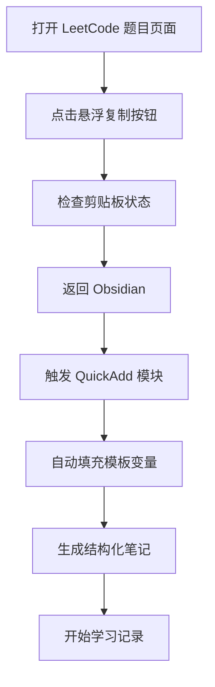
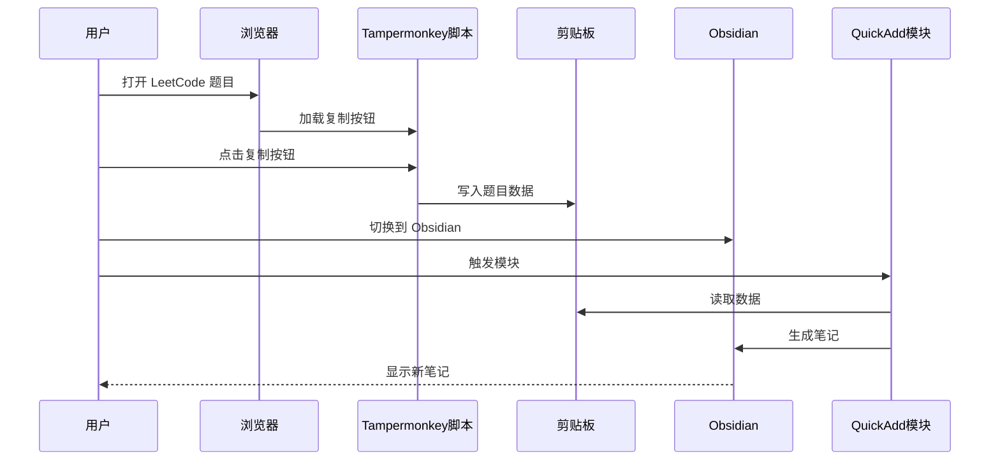

# 快速开始

<cite>
**本文档引用的文件**
- [Scripts/leetcode-quickadd.js](file://Scripts/leetcode-quickadd.js)
- [Templates/leetcode-problem-template.md](file://Templates/leetcode-problem-template.md)
- [Templates/leetcode-problem-template_zh.md](file://Templates/leetcode-problem-template_zh.md)
- [tampermonkey/Scripts/leetcode-cn-copy-to-obsidian.js](file://tampermonkey/Scripts/leetcode-cn-copy-to-obsidian.js)
</cite>

## 目录
1. [简介](#简介)
2. [环境要求](#环境要求)
3. [安装步骤](#安装步骤)
4. [配置步骤](#配置步骤)
5. [首次使用流程](#首次使用流程)
6. [模板文件说明](#模板文件说明)
7. [常见问题解答](#常见问题解答)
8. [使用示例](#使用示例)
9. [故障排除](#故障排除)
10. [总结](#总结)

## 简介

这是一个将 LeetCode 题目从浏览器直接复制到 Obsidian 笔记应用的自动化工具集。该系统通过两个主要组件协作工作：

- **Tampermonkey 脚本**：在 LeetCode 页面上添加一个悬浮按钮，一键复制题目信息和代码到剪贴板
- **Obsidian QuickAdd 插件**：从剪贴板读取数据，自动填充预定义模板，生成结构化的学习笔记

该工具支持中英文界面，提供完整的题目信息提取、代码格式化和标签管理功能。

## 环境要求

### 浏览器支持
- **Chrome/Chromium**：推荐使用最新版本
- **Firefox**：支持 Tampermonkey 扩展
- **Edge**：支持 Tampermonkey 扩展

### Obsidian 版本要求
- **Obsidian v0.16.0 或更高版本**
- **QuickAdd 插件**：必须安装并启用
- **Tampermonkey 扩展**：用于浏览器端代码复制

### 系统要求
- **操作系统**：Windows、macOS、Linux
- **内存**：至少 4GB RAM
- **网络**：稳定的互联网连接（用于访问 LeetCode API）

## 安装步骤

### 步骤 1：安装 Tampermonkey 扩展

1. 打开浏览器扩展商店
2. 搜索 "Tampermonkey"
3. 点击安装并重启浏览器
4. 在浏览器地址栏验证扩展图标显示正常

### 步骤 2：安装 LeetCode 复制脚本

1. 访问脚本文件路径：`tampermonkey/Scripts/leetcode-cn-copy-to-obsidian.js`
2. 点击右键选择"另存为"保存到本地
3. 打开浏览器扩展管理页面
4. 点击"管理用户脚本"
5. 选择"导入用户脚本"
6. 选择下载的 JS 文件
7. 确认安装并允许访问 LeetCode 网站

### 步骤 3：安装 Obsidian QuickAdd 插件

1. 打开 Obsidian 应用
2. 进入设置 → 插件
3. 启用"社区插件"模式
4. 搜索 "QuickAdd"
5. 点击安装并重启 Obsidian
6. 在设置中启用 QuickAdd 插件

### 步骤 4：配置 QuickAdd 模块

1. 在 Obsidian 中打开 QuickAdd 设置
2. 点击"添加模块"
3. 选择"从文件导入"
4. 导航到 `Scripts/leetcode-quickadd.js`
5. 选择文件并确认导入
6. 重新启动 Obsidian 以确保模块完全加载

## 配置步骤

### 配置标签前缀

1. 打开 Obsidian 设置 → QuickAdd
2. 找到 "LeetCode Puller CN" 模块
3. 编辑 "LeetCode Tag Prefix" 设置
4. 默认值为 "leetcode/"，可自定义其他前缀
5. 点击保存设置

### 配置模板文件

1. 将模板文件复制到 Obsidian 库中的任意位置
2. 在 QuickAdd 中创建新的模板组
3. 添加两个模板：
   - `leetcode-problem-template.md`（英文版）
   - `leetcode-problem-template_zh.md`（中文版）
4. 为每个模板设置合适的快捷键或触发方式

### 权限设置

#### 浏览器权限
- **剪贴板访问**：脚本需要访问剪贴板权限
- **网站访问**：需要访问 leetcode.cn 网站
- **扩展权限**：Tampermonkey 需要修改页面内容

#### Obsidian 权限
- **文件系统访问**：需要写入笔记文件
- **模板访问**：需要读取模板文件
- **网络访问**：需要访问 LeetCode API

## 首次使用流程

### 流程概述



**图表来源**
- [Scripts/leetcode-quickadd.js:83-104](file://Scripts/leetcode-quickadd.js#L83-L104)
- [tampermonkey/Scripts/leetcode-cn-copy-to-obsidian.js:316-363](file://tampermonkey/Scripts/leetcode-cn-copy-to-obsidian.js#L316-L363)

### 详细操作步骤

#### 第一步：在 LeetCode 页面复制代码

1. 打开任意 LeetCode 题目页面
2. 确认页面右下角出现蓝色悬浮按钮
3. 点击按钮进行复制
4. 观察按钮颜色变化确认复制成功
5. 按钮会短暂变为绿色表示成功

#### 第二步：在 Obsidian 中触发 QuickAdd

1. 切换到 Obsidian 应用
2. 打开目标笔记库
3. 使用以下任一方式触发：
   - 快捷键：`Ctrl/Cmd + Shift + Q`
   - 命令面板：搜索 "QuickAdd"
   - 模块菜单：选择 "LeetCode Puller CN"

#### 第三步：自动填充和生成笔记

1. 系统自动从剪贴板读取数据
2. 从 LeetCode API 获取题目详情
3. 自动填充模板变量
4. 生成结构化的笔记文件
5. 打开新生成的笔记进行编辑

## 模板文件说明

### 英文模板 (`leetcode-problem-template.md`)

该模板适用于英文界面的用户，提供标准的笔记结构：

```mermaid
classDiagram
class EnglishTemplate {
+created : {{DATE}}
+modified :
+completed : false
+leetcode-index : {{VALUE : id}}
+link : {{VALUE : link}}
+difficulty : {{VALUE : difficulty}}
+tags : {{VALUE : tags}}
+title : {{VALUE : title}}
+problemStatement : {{VALUE : problemStatement}}
+hints : {{VALUE : formattedHints}}
+solution : {{VALUE : solutionCode}}
}
class TemplateVariables {
+VALUE : id : 题目编号
+VALUE : title : 题目标题
+VALUE : link : 题目链接
+VALUE : difficulty : 难度等级
+VALUE : problemStatement : 题目描述
+VALUE : formattedHints : 格式化提示
+VALUE : tags : 标签列表
+VALUE : fileName : 文件名
+VALUE : language : 编程语言
+VALUE : solutionCode : 解决方案代码
+VALUE : sourceUrl : 源URL
+VALUE : titleSlug : 题目slug
}
EnglishTemplate --> TemplateVariables : "使用"
```

**图表来源**
- [Templates/leetcode-problem-template.md:1-35](file://Templates/leetcode-problem-template.md#L1-L35)

### 中文模板 (`leetcode-problem-template_zh.md`)

该模板专为中文用户设计，包含中文界面的术语：

- **题目描述**：对应英文的 Problem Statement
- **提示**：对应英文的 Hints  
- **解题思路**：专门的中文标注
- **代码实现**：包含动态编程语言标签
- **复杂度分析**：时间与空间复杂度
- **复盘总结**：学习反思区域

**章节来源**
- [Templates/leetcode-problem-template_zh.md:1-41](file://Templates/leetcode-problem-template_zh.md#L1-L41)

### 模板变量映射

| 变量名称 | 数据来源 | 描述 |
|---------|---------|------|
| `{{VALUE:id}}` | LeetCode API | 题目编号 |
| `{{VALUE:title}}` | LeetCode API | 题目标题 |
| `{{VALUE:link}}` | LeetCode API | 题目链接 |
| `{{VALUE:difficulty}}` | LeetCode API | 难度等级 |
| `{{VALUE:problemStatement}}` | HTML → Markdown | 格式化题目描述 |
| `{{VALUE:formattedHints}}` | LeetCode API | 格式化提示 |
| `{{VALUE:tags}}` | LeetCode API | 话题标签 |
| `{{VALUE:fileName}}` | 组合生成 | 文件命名 |
| `{{VALUE:language}}` | 剪贴板数据 | 编程语言 |
| `{{VALUE:solutionCode}}` | 剪贴板数据 | 解决方案代码 |
| `{{VALUE:sourceUrl}}` | 剪贴板数据 | 源URL |
| `{{VALUE:titleSlug}}` | 剪贴板数据 | 题目slug |

**章节来源**
- [Scripts/leetcode-quickadd.js:410-430](file://Scripts/leetcode-quickadd.js#L410-L430)

## 常见问题解答

### 问题1：剪贴板无法读取数据

**症状**：QuickAdd 显示 "没有识别到 LeetCode 题目 slug"

**解决方案**：
1. 确认 Tampermonkey 按钮已正确复制数据
2. 检查浏览器剪贴板权限设置
3. 重新点击复制按钮
4. 在 Obsidian 中手动输入题目URL或slug

**章节来源**
- [Scripts/leetcode-quickadd.js:114-166](file://Scripts/leetcode-quickadd.js#L114-L166)

### 问题2：LeetCode API 请求失败

**症状**：显示 "获取题目信息失败"

**解决方案**：
1. 检查网络连接是否正常
2. 确认 LeetCode 服务器可访问
3. 等待几分钟后重试
4. 检查是否有网络代理阻止请求

**章节来源**
- [Scripts/leetcode-quickadd.js:339-404](file://Scripts/leetcode-quickadd.js#L339-L404)

### 问题3：代码语言识别错误

**症状**：代码块语言标签不正确

**解决方案**：
1. 检查 Tampermonkey 脚本的语言映射
2. 确认代码编辑器中选择了正确的语言
3. 手动在模板中调整语言标签
4. 更新脚本以支持新的编程语言

**章节来源**
- [Scripts/leetcode-quickadd.js:295-323](file://Scripts/leetcode-quickadd.js#L295-L323)

### 问题4：模板变量未正确填充

**症状**：笔记中包含 {{VALUE:...}} 占位符

**解决方案**：
1. 确认 QuickAdd 模块已正确导入
2. 检查模板文件中的变量语法
3. 重新启动 Obsidian 应用
4. 验证模板文件路径正确

**章节来源**
- [Scripts/leetcode-quickadd.js:410-430](file://Scripts/leetcode-quickadd.js#L410-L430)

## 使用示例

### 示例1：完整的学习流程



**图表来源**
- [tampermonkey/Scripts/leetcode-cn-copy-to-obsidian.js:316-363](file://tampermonkey/Scripts/leetcode-cn-copy-to-obsidian.js#L316-L363)
- [Scripts/leetcode-quickadd.js:83-104](file://Scripts/leetcode-quickadd.js#L83-L104)

### 示例2：手动输入模式

当剪贴板无数据时，系统会自动切换到手动输入模式：

1. **输入题目链接**：`https://leetcode.cn/problems/two-sum/`
2. **或输入题目 slug**：`two-sum`
3. **粘贴代码**：直接粘贴解决方案代码
4. **确认生成**：系统自动处理并生成笔记

**章节来源**
- [Scripts/leetcode-quickadd.js:134-166](file://Scripts/leetcode-quickadd.js#L134-L166)

### 预期结果

成功完成后，您将在 Obsidian 中看到：

- **结构化笔记**：包含完整的题目信息
- **格式化内容**：题目描述和提示的 Markdown 格式
- **代码块**：带有正确语言标签的代码
- **标签系统**：自动添加的 LeetCode 标签
- **文件命名**：基于题目编号和标题的规范命名

## 故障排除

### 网络连接问题

**症状**：API 请求超时或失败

**诊断步骤**：
1. 检查网络连接状态
2. 尝试访问其他网站确认网络正常
3. 检查防火墙或代理设置
4. 尝试使用不同的网络环境

**解决方法**：
- 等待网络恢复
- 配置代理服务器
- 使用 VPN 连接
- 检查 DNS 设置

### 权限问题

**症状**：剪贴板访问被拒绝

**解决方法**：
1. 在浏览器设置中授权剪贴板访问
2. 检查安全设置
3. 尝试使用 HTTPS 页面
4. 重新安装 Tampermonkey 扩展

### 模板加载问题

**症状**：模板文件无法找到

**解决方法**：
1. 确认模板文件路径正确
2. 检查文件权限
3. 验证文件编码格式
4. 重新导入模板文件

### 版本兼容性问题

**症状**：功能异常或崩溃

**解决方法**：
1. 检查 Obsidian 版本要求
2. 更新 QuickAdd 插件到最新版本
3. 检查 Tampermonkey 版本
4. 查看插件更新日志

## 总结

这个 LeetCode 到 Obsidian 的自动化工具集提供了完整的解决方案，帮助用户高效地管理和学习算法题目。通过合理的配置和使用，您可以：

- **节省时间**：自动化的数据提取和笔记生成
- **保持一致性**：标准化的笔记格式和结构
- **提高效率**：减少手动输入和格式化的工作量
- **增强学习效果**：结构化的学习记录和反思

### 下一步建议

1. **完善个人模板**：根据个人需求定制模板样式
2. **建立标签体系**：创建个性化的标签分类
3. **集成其他工具**：结合 Anki、Notion 等其他学习工具
4. **定期备份**：确保学习数据的安全存储

通过遵循本指南的步骤，您应该能够顺利完成安装和配置，开始享受高效的算法学习体验。