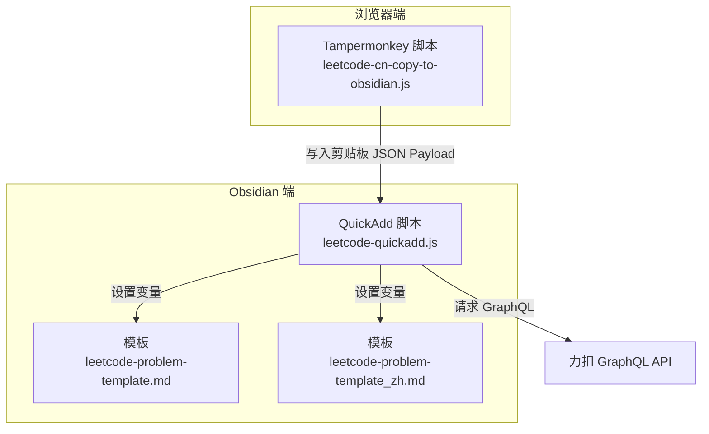
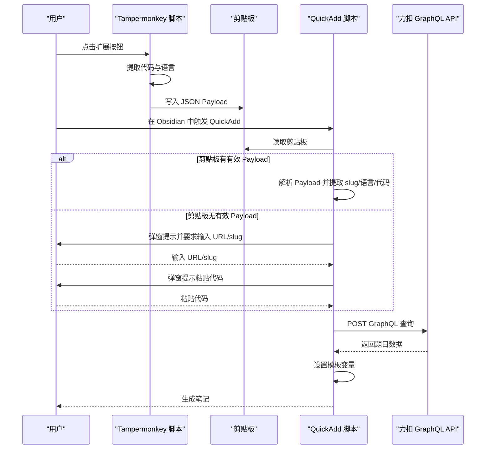
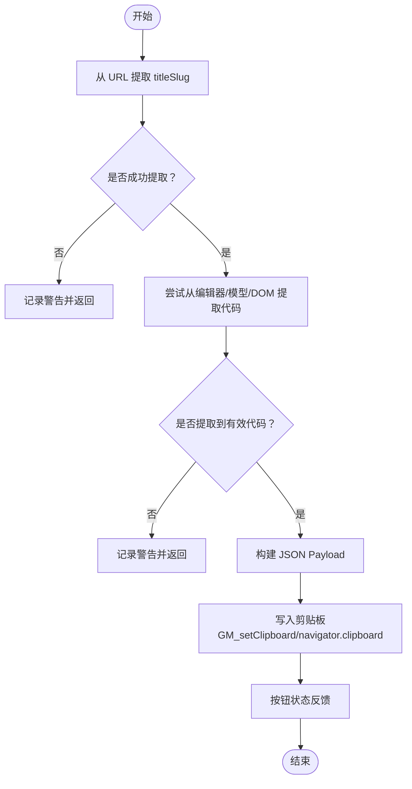
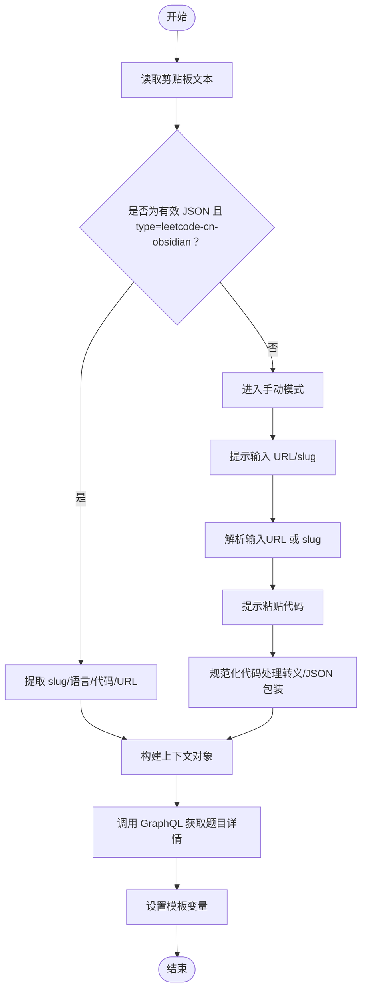
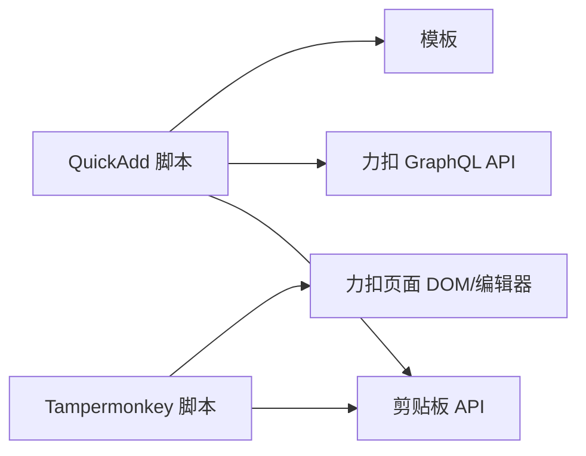

# 故障排除与常见问题

<cite>
**本文引用的文件**
- [Scripts/leetcode-quickadd.js](file://Scripts/leetcode-quickadd.js)
- [tampermonkey/Scripts/leetcode-cn-copy-to-obsidian.js](file://tampermonkey/Scripts/leetcode-cn-copy-to-obsidian.js)
- [Templates/leetcode-problem-template.md](file://Templates/leetcode-problem-template.md)
- [Templates/leetcode-problem-template_zh.md](file://Templates/leetcode-problem-template_zh.md)
</cite>

## 目录
1. [简介](#简介)
2. [项目结构](#项目结构)
3. [核心组件](#核心组件)
4. [架构总览](#架构总览)
5. [详细组件分析](#详细组件分析)
6. [依赖关系分析](#依赖关系分析)
7. [性能考虑](#性能考虑)
8. [故障排除指南](#故障排除指南)
9. [常见问题解答（FAQ）](#常见问题解答faq)
10. [结论](#结论)
11. [附录](#附录)

## 简介
本指南面向使用 LeetCode 到 Obsidian 工作流的用户，聚焦于以下典型问题的系统化诊断与解决：
- 浏览器扩展无法正常工作（Tampermonkey 脚本）
- 剪贴板访问权限问题
- API 调用失败（力扣 GraphQL）
- 模板渲染异常（变量未填充、格式错乱）
- 快速添加（QuickAdd）流程中断
- 日志与调试技巧
- 性能优化与最佳实践
- 问题报告标准格式与渠道

目标是帮助你快速定位问题根因并给出可操作的修复步骤。

## 项目结构
该仓库由三部分组成：
- Tampermonkey 扩展脚本：负责从力扣页面抓取代码并写入剪贴板，供 Obsidian 使用
- Obsidian QuickAdd 脚本：负责从剪贴板或手动输入读取题目信息，拉取力扣数据并设置模板变量
- 模板文件：定义笔记的 YAML 头部、章节与占位符，用于渲染最终笔记

图表来源
- [Scripts/leetcode-quickadd.js:1-104](file://Scripts/leetcode-quickadd.js#L1-L104)
- [tampermonkey/Scripts/leetcode-cn-copy-to-obsidian.js:305-363](file://tampermonkey/Scripts/leetcode-cn-copy-to-obsidian.js#L305-L363)
- [Templates/leetcode-problem-template.md:1-35](file://Templates/leetcode-problem-template.md#L1-L35)
- [Templates/leetcode-problem-template_zh.md:1-41](file://Templates/leetcode-problem-template_zh.md#L1-L41)

章节来源
- [Scripts/leetcode-quickadd.js:1-104](file://Scripts/leetcode-quickadd.js#L1-L104)
- [tampermonkey/Scripts/leetcode-cn-copy-to-obsidian.js:1-536](file://tampermonkey/Scripts/leetcode-cn-copy-to-obsidian.js#L1-L536)
- [Templates/leetcode-problem-template.md:1-35](file://Templates/leetcode-problem-template.md#L1-L35)
- [Templates/leetcode-problem-template_zh.md:1-41](file://Templates/leetcode-problem-template_zh.md#L1-L41)

## 核心组件
- Tampermonkey 脚本：从力扣页面提取当前题目代码与语言，构造标准化 JSON Payload 并写入剪贴板
- QuickAdd 脚本：优先从剪贴板读取 Payload，否则进入手动模式；随后调用力扣 GraphQL 拉取题目详情，设置模板变量
- 模板：提供中英文两种模板，包含占位符（如 {{VALUE:id}}、{{VALUE:title}} 等），用于渲染笔记

章节来源
- [Scripts/leetcode-quickadd.js:56-70](file://Scripts/leetcode-quickadd.js#L56-L70)
- [Scripts/leetcode-quickadd.js:83-104](file://Scripts/leetcode-quickadd.js#L83-L104)
- [tampermonkey/Scripts/leetcode-cn-copy-to-obsidian.js:316-363](file://tampermonkey/Scripts/leetcode-cn-copy-to-obsidian.js#L316-L363)

## 架构总览
整体流程如下：
- 用户在力扣页面点击扩展按钮，脚本提取代码与语言，写入剪贴板 JSON Payload
- 在 Obsidian 中通过 QuickAdd 触发，脚本先尝试读取剪贴板，若失败则进入手动输入 URL/slug 与代码
- 脚本调用力扣 GraphQL 获取题目详情（标题、内容、难度、标签、提示等）
- 将结果注入模板变量，生成笔记

图表来源
- [tampermonkey/Scripts/leetcode-cn-copy-to-obsidian.js:316-363](file://tampermonkey/Scripts/leetcode-cn-copy-to-obsidian.js#L316-L363)
- [Scripts/leetcode-quickadd.js:114-166](file://Scripts/leetcode-quickadd.js#L114-L166)
- [Scripts/leetcode-quickadd.js:339-404](file://Scripts/leetcode-quickadd.js#L339-L404)

## 详细组件分析

### 组件一：Tampermonkey 脚本（复制到剪贴板）
职责与关键点：
- 从力扣页面提取当前题目代码与语言，构造标准化 JSON Payload
- 支持多种编辑器模型选择策略，具备降级方案
- 通过 GM_setClipboard 或 navigator.clipboard 写入剪贴板
- 提供调试辅助函数，可列出所有模型并评分

图表来源
- [tampermonkey/Scripts/leetcode-cn-copy-to-obsidian.js:316-363](file://tampermonkey/Scripts/leetcode-cn-copy-to-obsidian.js#L316-L363)
- [tampermonkey/Scripts/leetcode-cn-copy-to-obsidian.js:280-303](file://tampermonkey/Scripts/leetcode-cn-copy-to-obsidian.js#L280-L303)

章节来源
- [tampermonkey/Scripts/leetcode-cn-copy-to-obsidian.js:280-303](file://tampermonkey/Scripts/leetcode-cn-copy-to-obsidian.js#L280-L303)
- [tampermonkey/Scripts/leetcode-cn-copy-to-obsidian.js:305-363](file://tampermonkey/Scripts/leetcode-cn-copy-to-obsidian.js#L305-L363)
- [tampermonkey/Scripts/leetcode-cn-copy-to-obsidian.js:498-536](file://tampermonkey/Scripts/leetcode-cn-copy-to-obsidian.js#L498-L536)

### 组件二：QuickAdd 脚本（从剪贴板/手动输入获取题目信息）
职责与关键点：
- 优先从剪贴板读取 JSON Payload，解析出 slug、语言、代码、URL
- 若剪贴板无有效 Payload，进入手动模式：输入 URL/slug、粘贴代码
- 调用力扣 GraphQL 获取题目详情（标题、内容、难度、标签、提示）
- 设置模板变量（id、title、link、difficulty、problemStatement、formattedHints、tags、fileName、language、solutionCode、sourceUrl、titleSlug）

图表来源
- [Scripts/leetcode-quickadd.js:114-166](file://Scripts/leetcode-quickadd.js#L114-L166)
- [Scripts/leetcode-quickadd.js:339-404](file://Scripts/leetcode-quickadd.js#L339-L404)
- [Scripts/leetcode-quickadd.js:410-430](file://Scripts/leetcode-quickadd.js#L410-L430)

章节来源
- [Scripts/leetcode-quickadd.js:114-166](file://Scripts/leetcode-quickadd.js#L114-L166)
- [Scripts/leetcode-quickadd.js:238-271](file://Scripts/leetcode-quickadd.js#L238-L271)
- [Scripts/leetcode-quickadd.js:339-404](file://Scripts/leetcode-quickadd.js#L339-L404)
- [Scripts/leetcode-quickadd.js:410-430](file://Scripts/leetcode-quickadd.js#L410-L430)

### 组件三：模板（Markdown 渲染）
职责与关键点：
- 定义 YAML 头部字段（如 leetcode-index、link、difficulty、tags 等）
- 定义章节（Problem Statement、Hints、Approach、Solution、Complexity Analysis、Reflections）
- 模板中使用 {{VALUE:...}} 占位符，由 QuickAdd 注入变量值
- 中文模板支持按语言动态插入代码块

章节来源
- [Templates/leetcode-problem-template.md:1-35](file://Templates/leetcode-problem-template.md#L1-L35)
- [Templates/leetcode-problem-template_zh.md:1-41](file://Templates/leetcode-problem-template_zh.md#L1-L41)

## 依赖关系分析
- QuickAdd 脚本依赖浏览器剪贴板 API（navigator.clipboard）或 Tampermonkey 的 GM_setClipboard
- QuickAdd 脚本依赖力扣 GraphQL API（https://leetcode.cn/graphql/）
- 模板依赖 QuickAdd 注入的变量（{{VALUE:...}}）
- Tampermonkey 脚本依赖力扣页面的 Monaco 编辑器模型与 DOM 结构

图表来源
- [Scripts/leetcode-quickadd.js:238-271](file://Scripts/leetcode-quickadd.js#L238-L271)
- [Scripts/leetcode-quickadd.js:339-404](file://Scripts/leetcode-quickadd.js#L339-L404)
- [tampermonkey/Scripts/leetcode-cn-copy-to-obsidian.js:305-363](file://tampermonkey/Scripts/leetcode-cn-copy-to-obsidian.js#L305-L363)

## 性能考虑
- 减少不必要的 DOM 解析与正则匹配，尽量在必要时才进行
- GraphQL 查询仅请求所需字段，避免过度查询
- 代码规范化与 HTML 渲染逻辑应避免重复计算
- 模板渲染前对大段文本进行必要的清理与裁剪，减少 Markdown 渲染压力

[本节为通用建议，无需特定文件来源]

## 故障排除指南

### 1. 浏览器扩展无法正常工作（Tampermonkey 脚本）
常见症状
- 点击扩展按钮无反应
- 按钮颜色未变化或报错
- 控制台出现“monaco.editor 不存在”等警告

排查步骤
- 确认当前页面为力扣题目页（匹配规则为 https://leetcode.cn/problems/*）
- 检查浏览器是否启用 Tampermonkey 扩展
- 打开开发者工具，查看控制台是否有错误
- 使用调试辅助函数列出所有模型，确认是否存在有效代码模型
- 若自动选择模型不准确，可在脚本中设置 MODEL_INDEX_OVERRIDE 指定索引

定位与修复
- 页面匹配与注入：确认页面 URL 符合 @match 规则
- 编辑器模型读取：检查 monaco.editor 是否可用，编辑器是否已初始化
- 剪贴板写入：优先使用 GM_setClipboard，若不可用则回退到 navigator.clipboard

章节来源
- [tampermonkey/Scripts/leetcode-cn-copy-to-obsidian.js:6-10](file://tampermonkey/Scripts/leetcode-cn-copy-to-obsidian.js#L6-L10)
- [tampermonkey/Scripts/leetcode-cn-copy-to-obsidian.js:280-303](file://tampermonkey/Scripts/leetcode-cn-copy-to-obsidian.js#L280-L303)
- [tampermonkey/Scripts/leetcode-cn-copy-to-obsidian.js:305-363](file://tampermonkey/Scripts/leetcode-cn-copy-to-obsidian.js#L305-L363)
- [tampermonkey/Scripts/leetcode-cn-copy-to-obsidian.js:498-536](file://tampermonkey/Scripts/leetcode-cn-copy-to-obsidian.js#L498-L536)

### 2. 剪贴板访问权限问题
常见症状
- QuickAdd 无法从剪贴板读取 JSON Payload
- 控制台提示剪贴板 API 不可用或读取失败

排查步骤
- 确保浏览器支持 navigator.clipboard.readText
- 在 HTTPS 环境下运行（现代浏览器要求安全上下文）
- 检查浏览器隐私设置是否阻止了剪贴板访问
- 尝试手动复制 JSON 到剪贴板，再在 Obsidian 中触发 QuickAdd

定位与修复
- API 可用性检测：当 readText 不可用时，脚本会记录日志并回退到手动模式
- 权限与环境：确保在受支持的安全上下文中使用

章节来源
- [Scripts/leetcode-quickadd.js:238-271](file://Scripts/leetcode-quickadd.js#L238-L271)

### 3. API 调用失败（力扣 GraphQL）
常见症状
- “没有从力扣中国站获取到题目信息”
- 控制台显示网络错误或解析失败

排查步骤
- 检查网络连通性与代理设置
- 确认 GraphQL 地址与 Referer/Origin 头正确
- 查看返回的 JSON 是否包含 data.question
- 若返回为空，可能是题目 slug 错误或网络限制

定位与修复
- 请求头与缓存：设置 Content-Type、Referer、Origin，禁用缓存
- 错误处理：捕获异常并提示用户重新尝试

章节来源
- [Scripts/leetcode-quickadd.js:339-404](file://Scripts/leetcode-quickadd.js#L339-L404)

### 4. 模板渲染异常（变量未填充、格式错乱）
常见症状
- 模板中的 {{VALUE:...}} 未被替换
- 标题、难度、标签、代码块格式异常

排查步骤
- 确认 QuickAdd 已成功设置变量（fileName、difficultyLink、tags、formattedHints、language、solutionCode、sourceUrl、titleSlug）
- 检查模板中占位符拼写是否一致
- 对于中文模板，确认 language 变量已正确设置，以便动态插入代码块语言

定位与修复
- 变量设置：检查 setQuickAddVariables 的赋值逻辑
- 标签与提示：确认 formatTags 与 formatHints 的输出格式
- 代码块语言：中文模板使用 {{VALUE:language}}，需保证 language 正确

章节来源
- [Scripts/leetcode-quickadd.js:410-430](file://Scripts/leetcode-quickadd.js#L410-L430)
- [Scripts/leetcode-quickadd.js:789-800](file://Scripts/leetcode-quickadd.js#L789-L800)
- [Scripts/leetcode-quickadd.js:801-812](file://Scripts/leetcode-quickadd.js#L801-L812)
- [Templates/leetcode-problem-template_zh.md:30-32](file://Templates/leetcode-problem-template_zh.md#L30-L32)

### 5. 快速添加（QuickAdd）流程中断
常见症状
- 手动模式无法继续（输入 URL/slug 后无响应）
- 代码粘贴后未规范化导致渲染异常

排查步骤
- 确认 QuickAdd 的 inputPrompt/wideInputPrompt 是否可用
- 检查 parseLeetCodePayloadText 是否能正确解析 JSON
- 验证 normalizeSolutionCode 是否正确处理转义字符

定位与修复
- 输入提示：根据 QuickAdd 版本选择 wideInputPrompt 或 inputPrompt
- JSON 解析：严格校验 type 字段与必需字段
- 代码规范化：处理转义字符与 JSON 包装

章节来源
- [Scripts/leetcode-quickadd.js:172-214](file://Scripts/leetcode-quickadd.js#L172-L214)
- [Scripts/leetcode-quickadd.js:216-232](file://Scripts/leetcode-quickadd.js#L216-L232)
- [Scripts/leetcode-quickadd.js:836-868](file://Scripts/leetcode-quickadd.js#L836-L868)

### 6. 日志与调试技巧
- 启用 Tampermonkey 脚本的调试辅助函数，查看模型评分与预览
- 在 QuickAdd 脚本中关注控制台输出的日志与警告
- 检查浏览器开发者工具的 Network 面板，确认 GraphQL 请求与响应
- 在 HTTPS 环境下测试剪贴板 API

章节来源
- [tampermonkey/Scripts/leetcode-cn-copy-to-obsidian.js:498-536](file://tampermonkey/Scripts/leetcode-cn-copy-to-obsidian.js#L498-L536)
- [Scripts/leetcode-quickadd.js:42-43](file://Scripts/leetcode-quickadd.js#L42-L43)

## 常见问题解答（FAQ）

Q1: 为什么点击扩展按钮没有反应？
- 检查页面是否为 https://leetcode.cn/problems/*
- 确认 Tampermonkey 已启用
- 查看控制台是否有“monaco.editor 不存在”的提示

Q2: 剪贴板读取总是失败怎么办？
- 确保在 HTTPS 环境下使用
- 检查浏览器隐私设置是否允许剪贴板访问
- 尝试手动复制 JSON 到剪贴板

Q3: GraphQL 请求报错如何处理？
- 检查网络连通性与代理
- 确认 Referer/Origin 头设置正确
- 校验题目 slug 是否正确

Q4: 模板中的 {{VALUE:...}} 未替换？
- 确认 QuickAdd 已成功设置变量
- 检查模板占位符拼写
- 中文模板需确保 language 变量正确

Q5: 如何提高复制成功率？
- 使用调试辅助函数列出模型并选择最佳索引
- 在自动选择不准确时手动指定 MODEL_INDEX_OVERRIDE

章节来源
- [tampermonkey/Scripts/leetcode-cn-copy-to-obsidian.js:6-10](file://tampermonkey/Scripts/leetcode-cn-copy-to-obsidian.js#L6-L10)
- [Scripts/leetcode-quickadd.js:238-271](file://Scripts/leetcode-quickadd.js#L238-L271)
- [Scripts/leetcode-quickadd.js:339-404](file://Scripts/leetcode-quickadd.js#L339-L404)
- [Templates/leetcode-problem-template_zh.md:30-32](file://Templates/leetcode-problem-template_zh.md#L30-L32)

## 结论
通过以上分层分析与系统化排查，你可以快速定位并解决从力扣到 Obsidian 的常见问题。建议在日常使用中：
- 保持 HTTPS 环境与最新浏览器版本
- 定期检查剪贴板权限与网络连通性
- 使用调试工具与日志辅助定位问题
- 遵循模板规范，确保变量正确注入

[本节为总结性内容，无需特定文件来源]

## 附录

### A. 调试工具与日志分析
- Tampermonkey 调试：使用 __LC_OBSIDIAN_DEBUG_MODELS__ 查看模型评分与预览
- Obsidian 日志：关注控制台输出的 "[LeetCode QuickAdd]" 与 "[LeetCode Copy to Obsidian]" 日志
- 网络面板：检查 GraphQL 请求与响应体，确认 data.question 是否存在

章节来源
- [tampermonkey/Scripts/leetcode-cn-copy-to-obsidian.js:498-536](file://tampermonkey/Scripts/leetcode-cn-copy-to-obsidian.js#L498-L536)
- [Scripts/leetcode-quickadd.js:42-43](file://Scripts/leetcode-quickadd.js#L42-L43)

### B. 性能优化建议
- 仅在需要时解析 HTML，避免全量 DOM 遍历
- 对正则表达式与字符串处理进行缓存或去重
- 控制模板渲染前的文本长度，减少 Markdown 渲染负担
- 合理使用宽输入提示，避免一次性处理过大数据

[本节为通用建议，无需特定文件来源]

### C. 问题报告标准格式
当你需要向社区或维护者反馈问题时，请包含以下信息：
- 环境信息：浏览器名称与版本、操作系统、Obsidian 版本、Tampermonkey 版本
- 复现步骤：具体的操作流程与截图/录屏
- 日志与错误信息：控制台输出、网络面板截图
- 模板与设置：使用的模板文件、QuickAdd 设置项
- 期望行为与实际行为：明确对比

[本节为通用建议，无需特定文件来源]