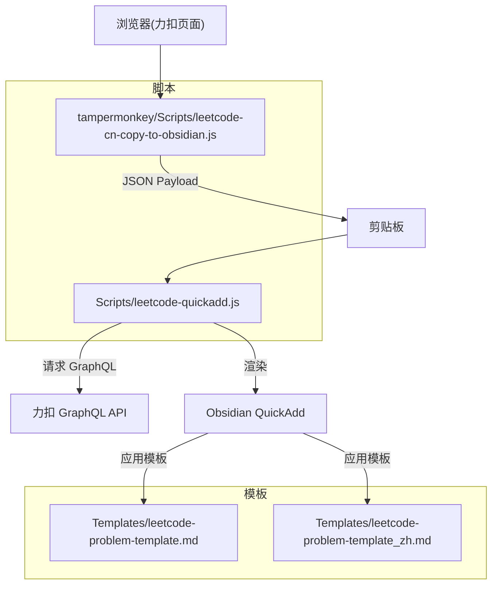
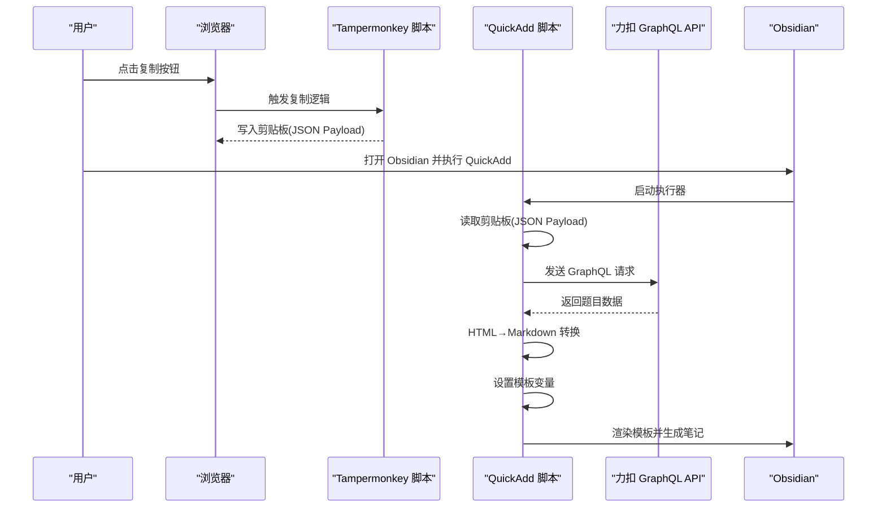
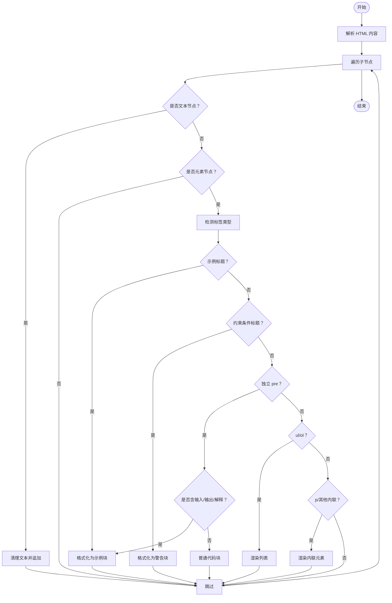
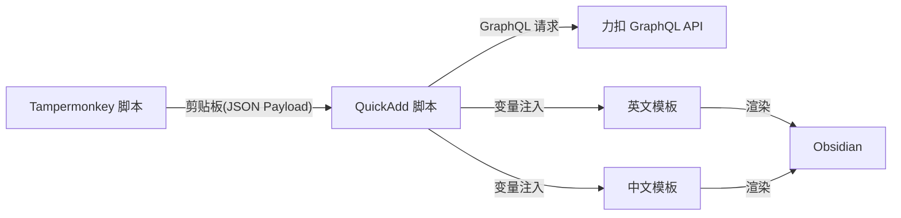

# 模板系统设计

<cite>
**本文引用的文件**
- [Templates/leetcode-problem-template.md](file://Templates/leetcode-problem-template.md)
- [Templates/leetcode-problem-template_zh.md](file://Templates/leetcode-problem-template_zh.md)
- [Scripts/leetcode-quickadd.js](file://Scripts/leetcode-quickadd.js)
- [tampermonkey/Scripts/leetcode-cn-copy-to-obsidian.js](file://tampermonkey/Scripts/leetcode-cn-copy-to-obsidian.js)
</cite>

## 目录
1. [简介](#简介)
2. [项目结构](#项目结构)
3. [核心组件](#核心组件)
4. [架构总览](#架构总览)
5. [详细组件分析](#详细组件分析)
6. [依赖关系分析](#依赖关系分析)
7. [性能考量](#性能考量)
8. [故障排查指南](#故障排查指南)
9. [结论](#结论)
10. [附录](#附录)

## 简介
本模板系统旨在为 LeetCode 题目在 Obsidian 中建立结构化笔记，支持中英双语模板与自动化数据填充。系统通过 Tampermonkey 脚本从力扣中文站复制题目与代码到剪贴板，再由 Obsidian 的 QuickAdd 执行器读取剪贴板内容并抓取题目详情，最终以模板变量驱动的方式生成标准化的笔记内容。模板采用 YAML Front Matter 定义元数据，正文部分通过占位符注入动态数据，实现“所见即所得”的高质量笔记。

## 项目结构
- Templates：存放模板文件，包含英文模板与中文模板，分别用于不同语言环境下的笔记生成。
- Scripts：包含 Obsidian QuickAdd 执行脚本，负责从剪贴板读取数据、调用 GraphQL 获取题目信息、设置模板变量并触发模板渲染。
- tampermonkey/Scripts：包含用户脚本，负责在力扣页面上一键复制当前题目 URL、语言与代码到剪贴板，供 QuickAdd 使用。

图表来源
- [Templates/leetcode-problem-template.md:1-35](file://Templates/leetcode-problem-template.md#L1-L35)
- [Templates/leetcode-problem-template_zh.md:1-41](file://Templates/leetcode-problem-template_zh.md#L1-L41)
- [Scripts/leetcode-quickadd.js:1-104](file://Scripts/leetcode-quickadd.js#L1-L104)
- [tampermonkey/Scripts/leetcode-cn-copy-to-obsidian.js:1-536](file://tampermonkey/Scripts/leetcode-cn-copy-to-obsidian.js#L1-L536)

章节来源
- [Templates/leetcode-problem-template.md:1-35](file://Templates/leetcode-problem-template.md#L1-L35)
- [Templates/leetcode-problem-template_zh.md:1-41](file://Templates/leetcode-problem-template_zh.md#L1-L41)
- [Scripts/leetcode-quickadd.js:1-104](file://Scripts/leetcode-quickadd.js#L1-L104)
- [tampermonkey/Scripts/leetcode-cn-copy-to-obsidian.js:1-536](file://tampermonkey/Scripts/leetcode-cn-copy-to-obsidian.js#L1-L536)

## 核心组件
- 模板引擎与变量系统
  - 模板采用 YAML Front Matter + Markdown 正文的结构，Front Matter 用于存储元数据，正文通过占位符注入动态内容。
  - 占位符语法：
    - {{DATE}}：日期占位符，由 Obsidian QuickAdd 在渲染时注入当前时间。
    - {{VALUE:xxx}}：模板变量占位符，由脚本在运行时注入具体值。
- 数据源与抓取流程
  - 剪贴板数据：Tampermonkey 脚本将题目 URL、语言与代码封装为 JSON Payload 写入剪贴板。
  - GraphQL 抓取：QuickAdd 从力扣 GraphQL API 拉取题目标题、内容、难度、标签与提示等信息。
- 格式化与适配
  - HTML 到 Markdown 的转换：将力扣返回的富文本内容转换为 Obsidian 友好的 Markdown。
  - 国际化适配：英文模板与中文模板在标题、章节名与默认提示文案上区分，但共享同一套变量体系。

章节来源
- [Templates/leetcode-problem-template.md:1-35](file://Templates/leetcode-problem-template.md#L1-L35)
- [Templates/leetcode-problem-template_zh.md:1-41](file://Templates/leetcode-problem-template_zh.md#L1-L41)
- [Scripts/leetcode-quickadd.js:1-104](file://Scripts/leetcode-quickadd.js#L1-L104)
- [Scripts/leetcode-quickadd.js:409-430](file://Scripts/leetcode-quickadd.js#L409-L430)
- [Scripts/leetcode-quickadd.js:436-546](file://Scripts/leetcode-quickadd.js#L436-L546)
- [Scripts/leetcode-quickadd.js:801-812](file://Scripts/leetcode-quickadd.js#L801-L812)

## 架构总览
系统整体工作流如下：
- 用户在力扣页面点击 Tampermonkey 按钮，将题目 URL、语言与代码写入剪贴板。
- Obsidian QuickAdd 执行器启动，优先从剪贴板读取 JSON Payload，若无则进入手动模式（输入 URL/slug 并可选粘贴代码）。
- QuickAdd 调用 GraphQL 获取题目详情（标题、内容、难度、标签、提示等），并对内容进行 HTML 到 Markdown 的转换。
- 将处理后的数据作为模板变量注入模板，渲染生成笔记。

图表来源
- [Scripts/leetcode-quickadd.js:83-104](file://Scripts/leetcode-quickadd.js#L83-L104)
- [Scripts/leetcode-quickadd.js:339-404](file://Scripts/leetcode-quickadd.js#L339-L404)
- [Scripts/leetcode-quickadd.js:409-430](file://Scripts/leetcode-quickadd.js#L409-L430)
- [tampermonkey/Scripts/leetcode-cn-copy-to-obsidian.js:316-363](file://tampermonkey/Scripts/leetcode-cn-copy-to-obsidian.js#L316-L363)

## 详细组件分析

### 模板变量系统
模板变量由 QuickAdd 脚本在运行时注入，变量命名统一使用 {{VALUE:xxx}} 形式。以下为所有可用变量的定义、用途与格式化规则概览（变量名与含义均来自脚本实现）：

- 基础元数据
  - {{VALUE:id}}：题目编号（前端 ID 或后端 ID）
  - {{VALUE:title}}：题目标题（优先使用翻译后的标题）
  - {{VALUE:link}}：力扣题目链接
  - {{VALUE:difficulty}}：难度（英文：Easy/Medium/Hard；中文模板中会被翻译为“简单/中等/困难”）
  - {{VALUE:difficultyLink}}：难度的内部链接形式（如 [[难度]]）
  - {{VALUE:titleSlug}}：题目 slug
  - {{VALUE:sourceUrl}}：来源 URL（优先使用剪贴板中的 URL，否则回退到 link）

- 内容与结构
  - {{VALUE:problemStatement}}：经过 HTML→Markdown 转换后的题目描述
  - {{VALUE:formattedHints}}：格式化后的提示列表，每条提示以 Obsidian 的提示块形式呈现
  - {{VALUE:tags}}：格式化后的标签列表，每个标签前缀由设置项决定（默认为 leetcode/）

- 文件与代码
  - {{VALUE:fileName}}：规范化后的文件名（去除非法字符）
  - {{VALUE:language}}：代码语言（经归一化处理）
  - {{VALUE:solutionCode}}：解决方案代码（经转义与清理）

- 日期占位符
  - {{DATE}}：由 Obsidian QuickAdd 在渲染时注入当前时间

章节来源
- [Scripts/leetcode-quickadd.js:409-430](file://Scripts/leetcode-quickadd.js#L409-L430)
- [Scripts/leetcode-quickadd.js:789-804](file://Scripts/leetcode-quickadd.js#L789-L804)
- [Scripts/leetcode-quickadd.js:832-834](file://Scripts/leetcode-quickadd.js#L832-L834)
- [Scripts/leetcode-quickadd.js:836-868](file://Scripts/leetcode-quickadd.js#L836-L868)

### 模板结构与章节设计
- 英文模板（Templates/leetcode-problem-template.md）
  - Front Matter：包含创建时间、完成状态、LeetCode 编号、链接、难度、标签等元数据字段。
  - 正文：包含“Problem Statement”、“Hints”、“Approach”、“Solution”、“Complexity Analysis”、“Reflections”等章节。
  - 代码块：固定语言为 Python，便于统一风格。
- 中文模板（Templates/leetcode-problem-template_zh.md）
  - Front Matter：与英文模板一致，但章节标题与默认提示文案为中文。
  - 正文：包含“题目描述”、“提示”、“解题思路”、“代码实现”、“复杂度分析”、“复盘总结”等章节。
  - 代码块：语言占位符随 {{VALUE:language}} 注入，便于适配不同语言。

章节来源
- [Templates/leetcode-problem-template.md:1-35](file://Templates/leetcode-problem-template.md#L1-L35)
- [Templates/leetcode-problem-template_zh.md:1-41](file://Templates/leetcode-problem-template_zh.md#L1-L41)

### 国际化实现方案
- 模板层面
  - 英文模板与中文模板并存，分别针对不同语言环境的用户习惯设计章节标题与默认提示文案。
- 数据层面
  - 难度字段在脚本中进行中英映射（如 Easy→简单），确保 Front Matter 与正文显示一致。
- 代码高亮
  - 中文模板的代码块语言由 {{VALUE:language}} 注入，避免硬编码导致的语言不匹配。

章节来源
- [Scripts/leetcode-quickadd.js:325-333](file://Scripts/leetcode-quickadd.js#L325-L333)
- [Templates/leetcode-problem-template_zh.md:29-32](file://Templates/leetcode-problem-template_zh.md#L29-L32)

### HTML 到 Markdown 转换机制
- 转换目标
  - 将力扣返回的 HTML 内容转换为 Obsidian 友好的 Markdown，同时保留示例、列表、强调、图片等结构。
- 关键处理
  - 示例识别：根据“示例 N”标题与后续代码块识别题目示例，转换为 Obsidian 的提示块。
  - 约束条件：识别“提示”标题并转换为警告提示块。
  - 列表与段落：递归渲染 ul/ol/li 结构，保持嵌套层级。
  - 内联元素：处理 strong/em/code/sup/a/img 等标签，生成对应的 Markdown 语法。
  - 文本清理：统一空白字符、去除多余换行，保证渲染一致性。

图表来源
- [Scripts/leetcode-quickadd.js:436-546](file://Scripts/leetcode-quickadd.js#L436-L546)
- [Scripts/leetcode-quickadd.js:548-574](file://Scripts/leetcode-quickadd.js#L548-L574)
- [Scripts/leetcode-quickadd.js:576-628](file://Scripts/leetcode-quickadd.js#L576-L628)
- [Scripts/leetcode-quickadd.js:634-667](file://Scripts/leetcode-quickadd.js#L634-L667)
- [Scripts/leetcode-quickadd.js:669-723](file://Scripts/leetcode-quickadd.js#L669-L723)
- [Scripts/leetcode-quickadd.js:725-738](file://Scripts/leetcode-quickadd.js#L725-L738)
- [Scripts/leetcode-quickadd.js:740-783](file://Scripts/leetcode-quickadd.js#L740-L783)

章节来源
- [Scripts/leetcode-quickadd.js:436-546](file://Scripts/leetcode-quickadd.js#L436-L546)

### 模板适配与差异
- 章节标题与默认文案
  - 英文模板：Problem Statement、Hints、Approach、Complexity Analysis、Reflections
  - 中文模板：题目描述、提示、解题思路、复杂度分析、复盘总结
- 代码块语言
  - 英文模板：固定 Python
  - 中文模板：由 {{VALUE:language}} 注入
- 默认标签
  - 模板中包含固定标签项，便于统一分类与检索。

章节来源
- [Templates/leetcode-problem-template.md:14-35](file://Templates/leetcode-problem-template.md#L14-L35)
- [Templates/leetcode-problem-template_zh.md:14-41](file://Templates/leetcode-problem-template_zh.md#L14-L41)

### 模板定制指南
- 修改模板结构
  - 在模板文件中调整章节顺序与标题，确保与正文占位符一一对应。
  - 注意 Front Matter 中的字段与模板变量的映射关系，避免遗漏或冲突。
- 添加自定义变量
  - 在 QuickAdd 脚本的 setQuickAddVariables 函数中扩展变量集合，确保变量名与模板占位符一致。
  - 对新增变量进行必要的格式化处理（如 HTML→Markdown、标签前缀、难度翻译等）。
- 调整格式化规则
  - 如需改变提示块、示例块或列表的渲染样式，可在相应格式化函数中调整。
  - 对于文件名、语言归一化等通用规则，可在对应工具函数中修改。
- 语言适配
  - 为新语言创建独立模板文件，保持变量体系一致，仅调整章节标题与默认文案。
  - 在脚本中增加语言映射或翻译逻辑，确保 Front Matter 与正文一致。

章节来源
- [Scripts/leetcode-quickadd.js:409-430](file://Scripts/leetcode-quickadd.js#L409-L430)
- [Scripts/leetcode-quickadd.js:789-804](file://Scripts/leetcode-quickadd.js#L789-L804)
- [Scripts/leetcode-quickadd.js:832-834](file://Scripts/leetcode-quickadd.js#L832-L834)
- [Scripts/leetcode-quickadd.js:836-868](file://Scripts/leetcode-quickadd.js#L836-L868)

### 实际使用效果与最佳实践
- 自动化优先：优先使用 Tampermonkey 脚本复制，减少手工输入错误。
- 模板选择：根据语言偏好选择对应模板，中文模板更适合中文用户阅读与检索。
- 标签管理：利用标签前缀设置统一标签风格，便于跨工具同步与查询。
- 代码高亮：中文模板的代码块语言由变量注入，确保高亮正确。
- 内容质量：HTML→Markdown 转换尽量保留原意，必要时手动微调渲染结果。

章节来源
- [Scripts/leetcode-quickadd.js:1-104](file://Scripts/leetcode-quickadd.js#L1-L104)
- [Scripts/leetcode-quickadd.js:789-804](file://Scripts/leetcode-quickadd.js#L789-L804)

### 维护与更新指导
- 版本兼容：关注 QuickAdd 与 Obsidian 的版本更新，确保模板变量语法与渲染行为不受影响。
- 模板演进：当模板结构变更时，同步更新脚本中的变量注入与格式化逻辑。
- 语言扩展：新增语言模板时，保持变量体系一致，完善翻译与默认文案。
- 错误处理：对网络请求、剪贴板读取与 HTML 解析过程增加健壮性检查，提升稳定性。

章节来源
- [Scripts/leetcode-quickadd.js:1-104](file://Scripts/leetcode-quickadd.js#L1-L104)
- [Scripts/leetcode-quickadd.js:339-404](file://Scripts/leetcode-quickadd.js#L339-L404)
- [Scripts/leetcode-quickadd.js:238-271](file://Scripts/leetcode-quickadd.js#L238-L271)

## 依赖关系分析
- 模板依赖
  - 英文模板依赖 {{VALUE:xxx}} 与 {{DATE}} 占位符，Front Matter 依赖元数据字段。
  - 中文模板依赖 {{VALUE:xxx}} 与 {{DATE}} 占位符，且代码块语言由 {{VALUE:language}} 注入。
- 脚本依赖
  - QuickAdd 脚本依赖 Tampermonkey 脚本提供的剪贴板数据，以及力扣 GraphQL API 的题目数据。
  - HTML→Markdown 转换依赖 DOM 解析与正则匹配，确保内容结构清晰。
- 外部依赖
  - 浏览器剪贴板 API 与 Tampermonkey GM_setClipboard。
  - Obsidian QuickAdd 的变量注入与模板渲染能力。

图表来源
- [Scripts/leetcode-quickadd.js:1-104](file://Scripts/leetcode-quickadd.js#L1-L104)
- [Scripts/leetcode-quickadd.js:339-404](file://Scripts/leetcode-quickadd.js#L339-L404)
- [Scripts/leetcode-quickadd.js:409-430](file://Scripts/leetcode-quickadd.js#L409-L430)
- [Templates/leetcode-problem-template.md:1-35](file://Templates/leetcode-problem-template.md#L1-L35)
- [Templates/leetcode-problem-template_zh.md:1-41](file://Templates/leetcode-problem-template_zh.md#L1-L41)

章节来源
- [Scripts/leetcode-quickadd.js:1-104](file://Scripts/leetcode-quickadd.js#L1-L104)
- [Scripts/leetcode-quickadd.js:339-404](file://Scripts/leetcode-quickadd.js#L339-L404)
- [Scripts/leetcode-quickadd.js:409-430](file://Scripts/leetcode-quickadd.js#L409-L430)
- [Templates/leetcode-problem-template.md:1-35](file://Templates/leetcode-problem-template.md#L1-L35)
- [Templates/leetcode-problem-template_zh.md:1-41](file://Templates/leetcode-problem-template_zh.md#L1-L41)

## 性能考量
- 网络请求
  - GraphQL 请求为单次调用，建议在模板生成前缓存必要字段，减少重复请求。
- 剪贴板读取
  - 剪贴板读取为异步操作，应设置超时与降级策略，避免阻塞主流程。
- HTML 解析
  - 大段 HTML 的解析与渲染可能带来性能压力，建议对长内容分段处理或延迟渲染。
- 模板渲染
  - 模板变量数量与复杂度直接影响渲染时间，建议精简变量与格式化逻辑。

## 故障排查指南
- 剪贴板无数据
  - 检查 Tampermonkey 按钮是否成功写入 JSON Payload，确认浏览器剪贴板权限与 GM_setClipboard 可用性。
  - 若无剪贴板数据，QuickAdd 将进入手动模式，需手动输入 URL/slug 并粘贴代码。
- GraphQL 请求失败
  - 检查网络连通性与 API 地址，确认请求头与 Referer/Origin 设置正确。
  - 若返回数据为空，检查题目 slug 是否正确。
- HTML→Markdown 转换异常
  - 检查 HTML 内容结构，确认标签闭合与文本清理逻辑生效。
  - 对于特殊格式（如复杂表格），考虑在模板中手动补充或调整格式化规则。
- 模板变量未生效
  - 确认变量名与模板占位符一致，检查 setQuickAddVariables 中的赋值逻辑。
  - 对于日期占位符 {{DATE}}，确认 QuickAdd 的渲染时机与变量注入顺序。

章节来源
- [Scripts/leetcode-quickadd.js:238-271](file://Scripts/leetcode-quickadd.js#L238-L271)
- [Scripts/leetcode-quickadd.js:339-404](file://Scripts/leetcode-quickadd.js#L339-L404)
- [Scripts/leetcode-quickadd.js:436-546](file://Scripts/leetcode-quickadd.js#L436-L546)
- [Scripts/leetcode-quickadd.js:409-430](file://Scripts/leetcode-quickadd.js#L409-L430)

## 结论
该模板系统通过“剪贴板数据 + GraphQL 抓取 + 模板变量注入”的组合，实现了从力扣到 Obsidian 的高效笔记生成。英文与中文模板在章节设计与默认文案上体现差异化适配，同时共享统一的变量体系与格式化规则。通过合理定制变量、优化格式化逻辑与增强错误处理，用户可获得稳定、一致且高质量的学习笔记体验。

## 附录
- 快速参考
  - 模板变量：id、title、link、difficulty、difficultyLink、titleSlug、sourceUrl、problemStatement、formattedHints、tags、fileName、language、solutionCode、{{DATE}}
  - 模板文件：Templates/leetcode-problem-template.md（英文）、Templates/leetcode-problem-template_zh.md（中文）
  - 执行脚本：Scripts/leetcode-quickadd.js
  - 用户脚本：tampermonkey/Scripts/leetcode-cn-copy-to-obsidian.js