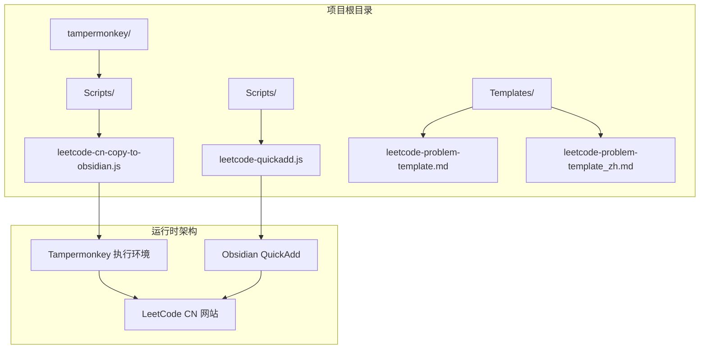
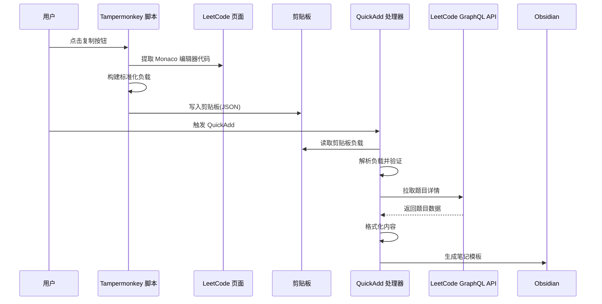
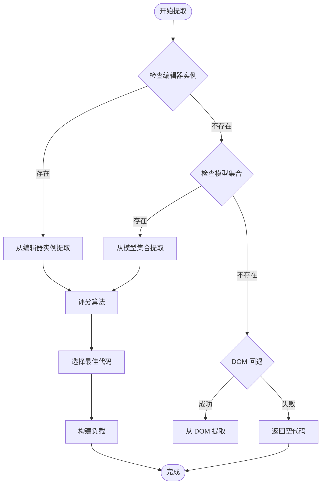
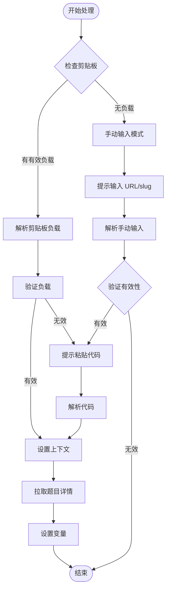
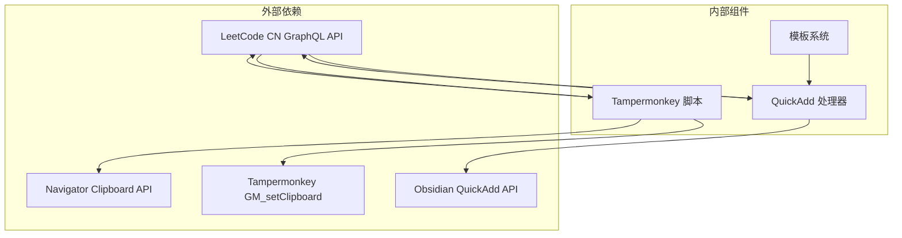

# 浏览器扩展功能

<cite>
**本文档引用的文件**
- [Scripts/leetcode-quickadd.js](file://Scripts/leetcode-quickadd.js)
- [tampermonkey/Scripts/leetcode-cn-copy-to-obsidian.js](file://tampermonkey/Scripts/leetcode-cn-copy-to-obsidian.js)
- [Templates/leetcode-problem-template.md](file://Templates/leetcode-problem-template.md)
- [Templates/leetcode-problem-template_zh.md](file://Templates/leetcode-problem-template_zh.md)
</cite>

## 目录
1. [简介](#简介)
2. [项目结构](#项目结构)
3. [核心组件](#核心组件)
4. [架构概览](#架构概览)
5. [详细组件分析](#详细组件分析)
6. [依赖关系分析](#依赖关系分析)
7. [性能考虑](#性能考虑)
8. [故障排除指南](#故障排除指南)
9. [结论](#结论)
10. [附录](#附录)

## 简介

这是一个专为 LeetCode 中文站设计的浏览器扩展系统，旨在简化从在线编程平台到本地知识管理工具（如 Obsidian）的数据迁移过程。该系统由两个主要组件构成：

1. **Tampermonkey 脚本**：负责从 LeetCode 页面提取代码并封装为标准化的 JSON 负载
2. **Obsidian QuickAdd 插件**：负责从剪贴板读取负载并生成结构化的笔记模板

该扩展支持多种编程语言，能够智能识别 Monaco 编辑器中的代码模型，并提供完整的错误处理和调试机制。

## 项目结构

项目采用模块化设计，包含以下关键目录和文件：

**图表来源**
- [Scripts/leetcode-quickadd.js:1-50](file://Scripts/leetcode-quickadd.js#L1-L50)
- [tampermonkey/Scripts/leetcode-cn-copy-to-obsidian.js:1-20](file://tampermonkey/Scripts/leetcode-cn-copy-to-obsidian.js#L1-L20)

**章节来源**
- [Scripts/leetcode-quickadd.js:1-100](file://Scripts/leetcode-quickadd.js#L1-L100)
- [tampermonkey/Scripts/leetcode-cn-copy-to-obsidian.js:1-50](file://tampermonkey/Scripts/leetcode-cn-copy-to-obsidian.js#L1-L50)

## 核心组件

### 1. Tampermonkey 代码提取器

**功能概述**：
- 从 LeetCode 页面的 Monaco 编辑器中提取当前解决方案代码
- 智能识别代码语言并进行标准化处理
- 构建标准化的 JSON 负载并通过剪贴板传输

**核心特性**：
- 支持多种编程语言（C++、Java、Python、JavaScript 等）
- 多层代码提取策略（编辑器实例 → 模型 → DOM 回退）
- 智能评分算法选择最佳代码片段
- 完整的错误处理和调试支持

**章节来源**
- [tampermonkey/Scripts/leetcode-cn-copy-to-obsidian.js:147-303](file://tampermonkey/Scripts/leetcode-cn-copy-to-obsidian.js#L147-L303)

### 2. Obsidian QuickAdd 处理器

**功能概述**：
- 从剪贴板读取标准化的 LeetCode 负载
- 自动从 LeetCode GraphQL API 获取题目详细信息
- 生成符合模板规范的笔记变量

**核心特性**：
- 优先级处理：剪贴板 → 手动输入 → GraphQL 拉取
- Markdown 格式转换和优化
- 标签前缀自定义配置
- 文件名安全字符处理

**章节来源**
- [Scripts/leetcode-quickadd.js:83-166](file://Scripts/leetcode-quickadd.js#L83-L166)

### 3. 模板系统

**功能概述**：
- 提供中英文双语模板支持
- 结构化的问题描述、提示和解法组织
- 自动化的变量替换和格式化

**章节来源**
- [Templates/leetcode-problem-template_zh.md:1-41](file://Templates/leetcode-problem-template_zh.md#L1-L41)

## 架构概览

整个系统采用"提取-传输-处理-生成"的流水线架构：

**图表来源**
- [tampermonkey/Scripts/leetcode-cn-copy-to-obsidian.js:316-363](file://tampermonkey/Scripts/leetcode-cn-copy-to-obsidian.js#L316-L363)
- [Scripts/leetcode-quickadd.js:87-104](file://Scripts/leetcode-quickadd.js#L87-L104)

## 详细组件分析

### Tampermonkey 代码提取器详细分析

#### 代码提取算法

该组件实现了多层次的代码提取策略，确保在不同页面状态下都能准确获取用户代码：

**图表来源**
- [tampermonkey/Scripts/leetcode-cn-copy-to-obsidian.js:147-303](file://tampermonkey/Scripts/leetcode-cn-copy-to-obsidian.js#L147-L303)

#### 评分算法实现

评分算法综合考虑多个因素来确定最佳代码片段：

| 评分因素 | 权重 | 说明 |
|---------|------|------|
| 语言识别 | 100分 | 识别为有效编程语言 |
| 类定义检测 | 100分 | 包含类定义模式 |
| 关键字匹配 | 80分 | Python/Go 函数模式 |
| 代码长度 | 最大500分 | 选择较长的完整代码 |
| 结构完整性 | -100分 | 排除纯数据结构 |

**章节来源**
- [tampermonkey/Scripts/leetcode-cn-copy-to-obsidian.js:101-145](file://tampermonkey/Scripts/leetcode-cn-copy-to-obsidian.js#L101-L145)

#### 负载构建机制

标准化的 JSON 负载包含以下字段：

| 字段名 | 类型 | 必需 | 说明 |
|--------|------|------|------|
| type | string | 是 | 负载类型标识 |
| version | number | 是 | 版本号 |
| url | string | 是 | 题目页面 URL |
| titleSlug | string | 是 | 题目唯一标识符 |
| language | string | 是 | 代码语言 |
| code | string | 是 | 解决方案代码 |
| copiedAt | string | 是 | 复制时间戳 |

**章节来源**
- [tampermonkey/Scripts/leetcode-cn-copy-to-obsidian.js:336-344](file://tampermonkey/Scripts/leetcode-cn-copy-to-obsidian.js#L336-L344)

### Obsidian QuickAdd 处理器详细分析

#### 输入处理流程

处理器支持三种输入模式，按优先级处理：

**图表来源**
- [Scripts/leetcode-quickadd.js:114-166](file://Scripts/leetcode-quickadd.js#L114-L166)

#### Markdown 转换引擎

处理器内置强大的 HTML 到 Markdown 转换器，能够处理复杂的题目内容：

**支持的元素类型**：
- 示例内容：自动识别并格式化为 Obsidian 代码块
- 约束条件：转换为警告框格式
- 标题标记：智能识别中英文标题
- 列表结构：保持嵌套层次的有序列表

**章节来源**
- [Scripts/leetcode-quickadd.js:436-546](file://Scripts/leetcode-quickadd.js#L436-L546)

### 模板系统分析

#### 模板变量映射

模板系统提供了丰富的变量替换机制：

| 模板变量 | 数据源 | 用途 |
|----------|--------|------|
| {{VALUE:id}} | 题目数据 | 显示题目编号 |
| {{VALUE:title}} | 题目数据 | 显示中文标题 |
| {{VALUE:link}} | 题目数据 | 题目链接 |
| {{VALUE:difficulty}} | 题目数据 | 难度标签 |
| {{VALUE:problemStatement}} | HTML 转换 | 题目描述 |
| {{VALUE:formattedHints}} | 题目数据 | 提示内容 |
| {{VALUE:tags}} | 题目数据 | 标签列表 |
| {{VALUE:fileName}} | 组合计算 | 文件命名 |
| {{VALUE:language}} | 上下文 | 代码语言 |
| {{VALUE:solutionCode}} | 上下文 | 解决方案代码 |
| {{VALUE:sourceUrl}} | 上下文 | 源 URL |

**章节来源**
- [Scripts/leetcode-quickadd.js:410-430](file://Scripts/leetcode-quickadd.js#L410-L430)

## 依赖关系分析

### 组件间依赖

**图表来源**
- [tampermonkey/Scripts/leetcode-cn-copy-to-obsidian.js:305-314](file://tampermonkey/Scripts/leetcode-cn-copy-to-obsidian.js#L305-L314)
- [Scripts/leetcode-quickadd.js:368-378](file://Scripts/leetcode-quickadd.js#L368-L378)

### 错误处理机制

系统实现了多层次的错误处理：

1. **网络请求错误**：GraphQL API 调用失败时的降级处理
2. **剪贴板访问错误**：浏览器权限限制和 API 不可用的处理
3. **代码提取失败**：多层回退策略确保至少返回空代码
4. **模板渲染错误**：HTML 解析失败时的容错处理

**章节来源**
- [Scripts/leetcode-quickadd.js:399-404](file://Scripts/leetcode-quickadd.js#L399-L404)
- [tampermonkey/Scripts/leetcode-cn-copy-to-obsidian.js:329-334](file://tampermonkey/Scripts/leetcode-cn-copy-to-obsidian.js#L329-L334)

## 性能考虑

### 代码提取性能优化

1. **延迟初始化**：按钮采用延迟创建和定位策略
2. **缓存机制**：避免重复的 DOM 查询操作
3. **智能评分**：通过评分算法快速筛选最佳代码
4. **内存管理**：及时清理事件监听器和定时器

### 网络请求优化

1. **请求去重**：避免重复的 GraphQL 查询
2. **超时控制**：合理的请求超时设置
3. **错误重试**：有限次数的自动重试机制

## 故障排除指南

### 常见问题及解决方案

#### 问题1：无法从剪贴板读取负载
**症状**：QuickAdd 提示没有识别到 LeetCode 题目
**解决方案**：
1. 确认 Tampermonkey 脚本已正确安装并启用
2. 检查浏览器剪贴板权限设置
3. 重新点击复制按钮并观察控制台日志

#### 问题2：代码提取为空
**症状**：复制后 QuickAdd 显示空代码
**解决方案**：
1. 使用调试模式查看可用的代码模型
2. 检查是否选择了正确的编程语言
3. 确认 Monaco 编辑器已完全加载

#### 问题3：模板变量未正确填充
**症状**：生成的笔记缺少部分内容
**解决方案**：
1. 检查模板文件中的变量语法
2. 验证 GraphQL API 的响应数据
3. 查看控制台中的错误信息

### 调试技巧

1. **启用调试模式**：在控制台执行 `__LC_OBSIDIAN_DEBUG_MODELS__()`
2. **查看评分结果**：观察代码模型的评分和预览
3. **监控网络请求**：检查 GraphQL API 的响应状态
4. **验证负载格式**：确认剪贴板中的 JSON 格式正确

**章节来源**
- [tampermonkey/Scripts/leetcode-cn-copy-to-obsidian.js:498-525](file://tampermonkey/Scripts/leetcode-cn-copy-to-obsidian.js#L498-L525)

## 结论

这个浏览器扩展系统提供了一个完整、可靠的解决方案，用于在 LeetCode 和 Obsidian 之间传输编程题目数据。其设计特点包括：

1. **多层容错机制**：确保在各种页面状态下都能正常工作
2. **智能代码识别**：通过评分算法准确选择最佳代码片段
3. **标准化数据格式**：统一的负载格式便于跨组件传输
4. **完善的错误处理**：提供详细的错误信息和降级策略

该系统为开发者提供了一个可扩展的基础框架，可以根据具体需求进行定制和增强。

## 附录

### 配置选项说明

#### Tampermonkey 脚本配置
- `MODEL_INDEX_OVERRIDE`：手动指定代码模型索引（默认 null，表示自动选择）

#### QuickAdd 插件配置
- `LeetCode Tag Prefix`：标签前缀设置，默认值为 "leetcode/"

### 使用场景示例

1. **快速笔记生成**：直接从 LeetCode 页面复制代码到 Obsidian
2. **批量学习记录**：批量导出多个题目的学习笔记
3. **团队协作**：标准化团队成员的学习资料格式
4. **个人知识管理**：建立完整的编程知识库

### 开发者建议

1. **版本兼容性**：定期更新以适配 LeetCode 页面结构变化
2. **性能监控**：关注网络请求和 DOM 操作的性能影响
3. **用户体验**：优化按钮交互和视觉反馈
4. **错误报告**：收集用户反馈以改进错误处理机制