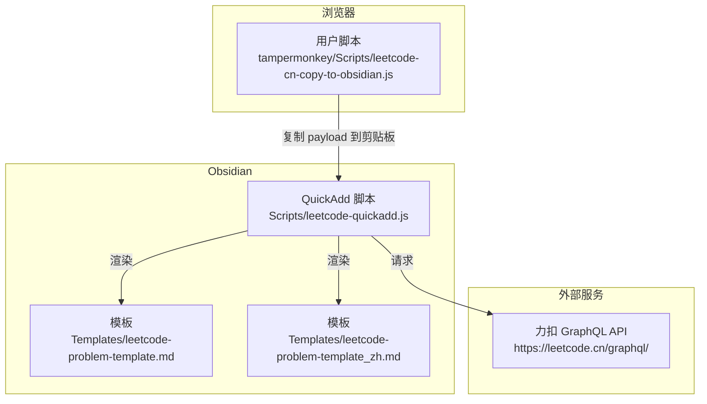
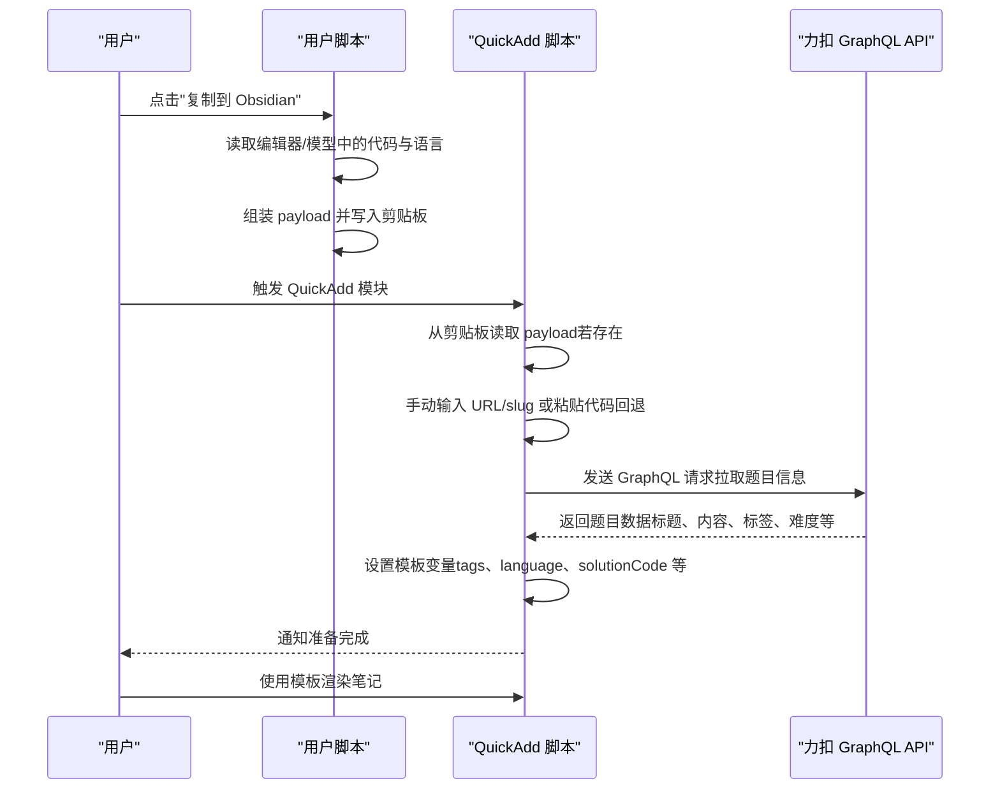
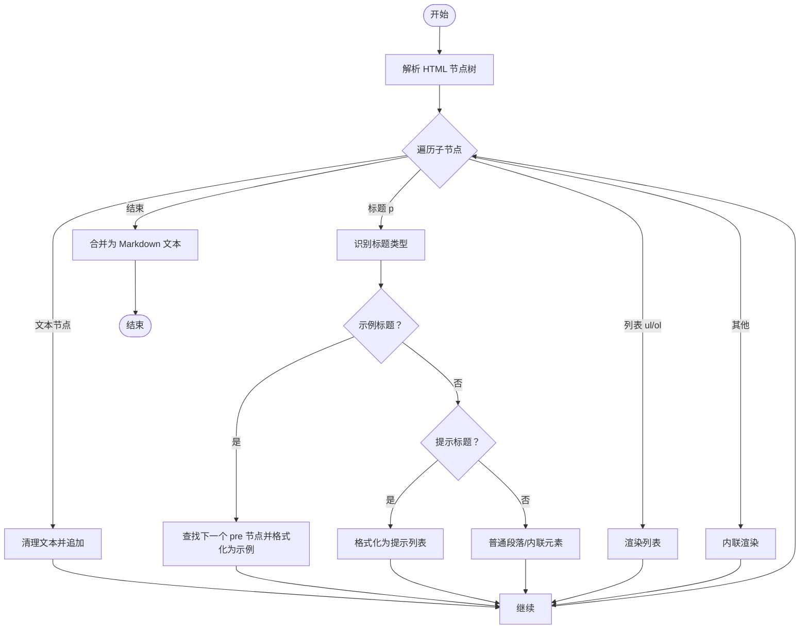
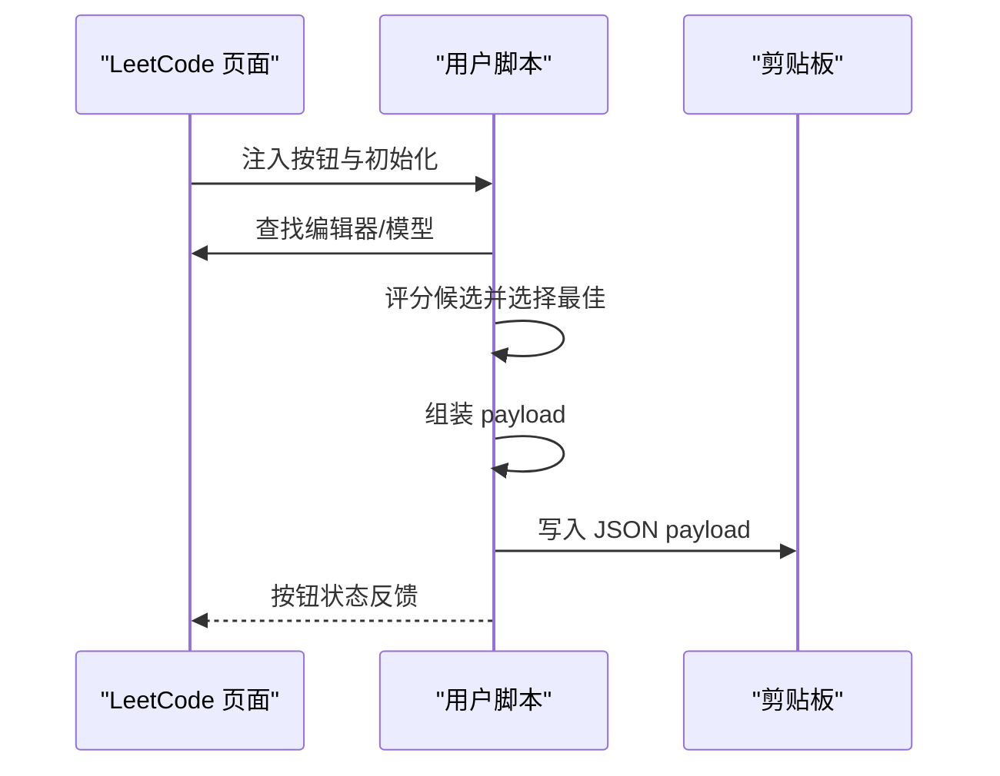
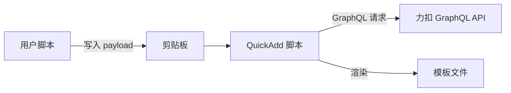

# 配置与定制

<cite>
**本文引用的文件**
- [Scripts/leetcode-quickadd.js](file://Scripts/leetcode-quickadd.js)
- [Templates/leetcode-problem-template.md](file://Templates/leetcode-problem-template.md)
- [Templates/leetcode-problem-template_zh.md](file://Templates/leetcode-problem-template_zh.md)
- [tampermonkey/Scripts/leetcode-cn-copy-to-obsidian.js](file://tampermonkey/Scripts/leetcode-cn-copy-to-obsidian.js)
- [README.md](file://README.md)
- [README.zh-CN.md](file://README.zh-CN.md)
</cite>

## 更新摘要
**变更内容**
- 更新QuickAdd脚本归属权说明，从简单的'adapted from work by Shane Zimmerman'更新为具体的GitHub仓库引用'zimmshane/leetcode-puller-obsidian'
- 增强文档透明度和溯源信息，提供明确的开发者来源和项目链接

## 目录
1. [简介](#简介)
2. [项目结构](#项目结构)
3. [核心组件](#核心组件)
4. [架构总览](#架构总览)
5. [详细组件分析](#详细组件分析)
6. [依赖关系分析](#依赖关系分析)
7. [性能考量](#性能考量)
8. [故障排查指南](#故障排查指南)
9. [结论](#结论)
10. [附录](#附录)

## 简介
本指南面向使用 LeetCode 到 Obsidian 工作流的用户，系统性讲解可配置项、默认行为、高级定制（模板变量、API 端点、格式化规则）以及迁移与备份建议。通过理解各模块职责与数据流，帮助你在 Obsidian 中高效生成与管理算法题解笔记。

## 项目结构
该项目由三部分组成：
- 快速添加脚本：负责从剪贴板或手动输入获取题目上下文，调用 GraphQL 拉取题目信息，设置 QuickAdd 模板变量。
- 模板文件：提供英文与中文两种模板，用于渲染笔记正文、标签、难度等字段。
- 用户脚本：在 LeetCode CN 页面注入"复制到 Obsidian"按钮，将题目 URL、语言、代码打包为剪贴板 payload，供快速添加脚本读取。

**图表来源**
- [Scripts/leetcode-quickadd.js:1-104](file://Scripts/leetcode-quickadd.js#L1-L104)
- [Templates/leetcode-problem-template.md:1-35](file://Templates/leetcode-problem-template.md#L1-L35)
- [Templates/leetcode-problem-template_zh.md:1-41](file://Templates/leetcode-problem-template_zh.md#L1-L41)
- [tampermonkey/Scripts/leetcode-cn-copy-to-obsidian.js:305-363](file://tampermonkey/Scripts/leetcode-cn-copy-to-obsidian.js#L305-L363)

**章节来源**
- [Scripts/leetcode-quickadd.js:1-104](file://Scripts/leetcode-quickadd.js#L1-L104)
- [Templates/leetcode-problem-template.md:1-35](file://Templates/leetcode-problem-template.md#L1-L35)
- [Templates/leetcode-problem-template_zh.md:1-41](file://Templates/leetcode-problem-template_zh.md#L1-L41)
- [tampermonkey/Scripts/leetcode-cn-copy-to-obsidian.js:1-536](file://tampermonkey/Scripts/leetcode-cn-copy-to-obsidian.js#L1-L536)

## 核心组件
- 快速添加脚本（QuickAdd 模块）
  - 提供配置项：标签前缀设置（文本类型，默认值 leetcode/）
  - 主流程：读取剪贴板 payload → 手动输入 URL/slug → 拉取题目信息 → 设置模板变量 → 通知完成
  - 数据来源：力扣 GraphQL API；语言标准化映射；HTML 转 Markdown
- 模板文件
  - 英文模板与中文模板分别定义 frontmatter、标题、段落与代码块占位
  - 模板变量：id、title、link、difficulty、tags、problemStatement、formattedHints、language、solutionCode、titleSlug、fileName 等
- 用户脚本（Tampermonkey）
  - 在 LeetCode CN 页面注入悬浮按钮，复制当前题目 URL、语言、代码到剪贴板，形成统一 payload
  - 支持调试辅助函数，便于定位模型与语言识别问题

**章节来源**
- [Scripts/leetcode-quickadd.js:56-70](file://Scripts/leetcode-quickadd.js#L56-L70)
- [Scripts/leetcode-quickadd.js:83-104](file://Scripts/leetcode-quickadd.js#L83-L104)
- [Scripts/leetcode-quickadd.js:339-404](file://Scripts/leetcode-quickadd.js#L339-L404)
- [Scripts/leetcode-quickadd.js:410-430](file://Scripts/leetcode-quickadd.js#L410-L430)
- [Templates/leetcode-problem-template.md:1-35](file://Templates/leetcode-problem-template.md#L1-L35)
- [Templates/leetcode-problem-template_zh.md:1-41](file://Templates/leetcode-problem-template_zh.md#L1-L41)
- [tampermonkey/Scripts/leetcode-cn-copy-to-obsidian.js:316-363](file://tampermonkey/Scripts/leetcode-cn-copy-to-obsidian.js#L316-L363)

## 架构总览
下图展示了从浏览器复制到 Obsidian 渲染的完整流程，包括配置项、数据流与关键处理步骤。

**图表来源**
- [Scripts/leetcode-quickadd.js:114-166](file://Scripts/leetcode-quickadd.js#L114-L166)
- [Scripts/leetcode-quickadd.js:339-404](file://Scripts/leetcode-quickadd.js#L339-L404)
- [Scripts/leetcode-quickadd.js:410-430](file://Scripts/leetcode-quickadd.js#L410-L430)
- [tampermonkey/Scripts/leetcode-cn-copy-to-obsidian.js:316-363](file://tampermonkey/Scripts/leetcode-cn-copy-to-obsidian.js#L316-L363)

## 详细组件分析

### 配置项与默认值
- 标签前缀设置（文本类型）
  - 键名：LeetCode Tag Prefix
  - 类型：text
  - 默认值：leetcode/
  - 描述：为题目标签添加统一前缀，便于分类与检索
  - 应用位置：标签格式化逻辑，拼接在每个标签 slug 前
- 语言标准化映射
  - 作用：将不同语言标识规范化为 Markdown 代码块语言别名
  - 影响：决定模板中代码块的语言高亮与后续处理
- 难度本地化
  - 作用：将英文难度 Easy/Medium/Hard 映射为中文简单/中等/困难
  - 影响：影响 frontmatter 与标签显示

**章节来源**
- [Scripts/leetcode-quickadd.js:56-70](file://Scripts/leetcode-quickadd.js#L56-L70)
- [Scripts/leetcode-quickadd.js:789-799](file://Scripts/leetcode-quickadd.js#L789-L799)
- [Scripts/leetcode-quickadd.js:295-333](file://Scripts/leetcode-quickadd.js#L295-L333)

### 模板变量与渲染
- 可用变量（来自 QuickAdd 变量设置）
  - id、title、link、difficulty、problemStatement、formattedHints、tags、fileName、language、solutionCode、titleSlug、difficultyLink、sourceUrl
- 模板文件中的占位
  - 英文模板：frontmatter 中包含 created、modified、completed、leetcode-index、link、difficulty、tags；正文包含 Problem Statement、Hints、Approach、Solution、Complexity Analysis、Reflections
  - 中文模板：frontmatter 结构类似；正文包含 题目描述、提示、解题思路、代码实现、复杂度分析、复盘总结；代码块语言由 {{VALUE:language}} 控制
- 代码块语言
  - 由模板变量 {{VALUE:language}} 决定，需与语言标准化映射一致，否则可能导致高亮异常

**章节来源**
- [Scripts/leetcode-quickadd.js:410-430](file://Scripts/leetcode-quickadd.js#L410-L430)
- [Templates/leetcode-problem-template.md:1-35](file://Templates/leetcode-problem-template.md#L1-L35)
- [Templates/leetcode-problem-template_zh.md:1-41](file://Templates/leetcode-problem-template_zh.md#L1-L41)

### API 端点与请求
- 力扣 GraphQL 端点
  - URL：https://leetcode.cn/graphql/
  - 查询：questionData（按 titleSlug 拉取题目信息）
  - 请求头：Content-Type、Referer、Origin
- 请求失败处理
  - 若返回数据为空或网络异常，脚本会发出错误通知并终止流程

**章节来源**
- [Scripts/leetcode-quickadd.js:49-49](file://Scripts/leetcode-quickadd.js#L49-L49)
- [Scripts/leetcode-quickadd.js:339-404](file://Scripts/leetcode-quickadd.js#L339-L404)

### HTML 到 Markdown 的格式化规则
- 标题与段落
  - 将 HTML 节点树转换为 Markdown 段落，保留换行与内联样式（粗体、斜体、上标、代码、图片、链接）
- 示例与提示
  - 识别"示例 X"、"提示"、"进阶"等标题，转换为 Obsidian 的提示块语法
  - 对独立的 pre 节点，若包含"输入/输出/解释"标签则按示例格式化
- 列表
  - 支持有序/无序列表，递归处理嵌套
- 文本清理
  - 去除多余空白、换行折叠、特殊字符转义

**图表来源**
- [Scripts/leetcode-quickadd.js:436-546](file://Scripts/leetcode-quickadd.js#L436-L546)
- [Scripts/leetcode-quickadd.js:548-783](file://Scripts/leetcode-quickadd.js#L548-L783)

### 用户脚本（Tampermonkey）的复制流程
- 代码提取策略
  - 优先从编辑器实例中提取代码与语言
  - 回退到模型集合评分选择最佳候选
  - 最后尝试从 DOM 中提取 textarea 的值
- payload 结构
  - 包含 type、version、url、titleSlug、language、code、copiedAt 等字段
- 调试模式
  - 提供调试函数列出所有模型及其预览，便于定位语言识别问题

**图表来源**
- [tampermonkey/Scripts/leetcode-cn-copy-to-obsidian.js:147-303](file://tampermonkey/Scripts/leetcode-cn-copy-to-obsidian.js#L147-L303)
- [tampermonkey/Scripts/leetcode-cn-copy-to-obsidian.js:305-363](file://tampermonkey/Scripts/leetcode-cn-copy-to-obsidian.js#L305-L363)

### 脚本归属权与开源信息
- QuickAdd 脚本来源
  - 该脚本基于 Shane Zimmerman 的工作（[zimmshane/leetcode-puller-obsidian](https://github.com/zimmshane/leetcode-puller-obsidian)）改造而来
  - 针对力扣中国站进行了适配，新增了剪贴板代码传递能力
  - 采用 MIT 开源许可证发布，欢迎社区贡献与改进

**章节来源**
- [README.md:140](file://README.md#L140)
- [README.zh-CN.md:140](file://README.zh-CN.md#L140)

## 依赖关系分析
- QuickAdd 脚本依赖
  - 浏览器剪贴板 API（读取用户脚本写入的 payload）
  - 力扣 GraphQL API（拉取题目信息）
  - 模板文件（渲染笔记）
- 用户脚本依赖
  - Monaco 编辑器 API（读取代码与语言）
  - 浏览器剪贴板 API（写入 payload）

**图表来源**
- [Scripts/leetcode-quickadd.js:238-271](file://Scripts/leetcode-quickadd.js#L238-L271)
- [Scripts/leetcode-quickadd.js:339-404](file://Scripts/leetcode-quickadd.js#L339-L404)
- [Templates/leetcode-problem-template.md:1-35](file://Templates/leetcode-problem-template.md#L1-L35)
- [Templates/leetcode-problem-template_zh.md:1-41](file://Templates/leetcode-problem-template_zh.md#L1-L41)
- [tampermonkey/Scripts/leetcode-cn-copy-to-obsidian.js:305-363](file://tampermonkey/Scripts/leetcode-cn-copy-to-obsidian.js#L305-L363)

## 性能考量
- 网络请求
  - GraphQL 请求仅在成功获取剪贴板 payload 或手动输入有效时触发，避免不必要的请求
- 文本处理
  - HTML 到 Markdown 的转换涉及 DOM 解析与正则匹配，建议保持输入代码简洁，减少超大文本带来的处理开销
- 模板渲染
  - 模板变量数量有限，渲染开销较低；注意语言标准化映射与代码块高亮的一致性，避免重复处理

## 故障排查指南
- 剪贴板读取失败
  - 现象：未检测到有效 payload，进入手动模式
  - 排查：确认浏览器权限允许读取剪贴板；检查用户脚本是否成功写入 payload；确认 payload 的 type 字段为 leetcode-cn-obsidian
- 无法识别题目 slug
  - 现象：提示未识别到 LeetCode 题目 slug
  - 排查：手动输入完整 URL 或 title slug；确认 URL 符合 https://leetcode.cn/problems/{slug}/ 格式
- GraphQL 请求失败
  - 现象：获取题目信息失败
  - 排查：检查网络连通性；确认端点地址与请求头；查看控制台错误信息
- 标签前缀不生效
  - 现象：标签未带前缀
  - 排查：确认配置项已保存；检查标签格式化逻辑是否正确拼接前缀
- 语言高亮异常
  - 现象：代码块语言不正确
  - 排查：确认语言标准化映射是否覆盖该语言；检查模板中 {{VALUE:language}} 的值
- 代码未正确提取
  - 现象：solutionCode 为空
  - 排查：确认用户脚本已正确选择模型；使用调试函数查看候选模型；必要时手动粘贴代码作为回退

**章节来源**
- [Scripts/leetcode-quickadd.js:89-92](file://Scripts/leetcode-quickadd.js#L89-L92)
- [Scripts/leetcode-quickadd.js:114-166](file://Scripts/leetcode-quickadd.js#L114-L166)
- [Scripts/leetcode-quickadd.js:382-403](file://Scripts/leetcode-quickadd.js#L382-L403)
- [Scripts/leetcode-quickadd.js:789-799](file://Scripts/leetcode-quickadd.js#L789-L799)
- [Scripts/leetcode-quickadd.js:295-333](file://Scripts/leetcode-quickadd.js#L295-L333)
- [tampermonkey/Scripts/leetcode-cn-copy-to-obsidian.js:316-363](file://tampermonkey/Scripts/leetcode-cn-copy-to-obsidian.js#L316-L363)

## 结论
通过合理配置标签前缀、语言映射与模板变量，结合用户脚本的 payload 机制，可实现从 LeetCode 到 Obsidian 的自动化题解笔记生成。建议在团队协作或跨设备同步场景下，固定标签前缀与语言别名，以提升检索与一致性体验。同时，感谢原作者 Shane Zimmerman 的开源贡献，为本项目提供了坚实的基础。

## 附录

### 配置清单与推荐设置
- 标签前缀设置
  - 类型：文本
  - 默认值：leetcode/
  - 推荐：团队统一使用 team/ 或自定义命名空间，便于跨库检索
- 语言映射
  - 建议：确保常用语言均在映射表中，避免出现未知语言导致高亮失效
- 模板变量
  - 建议：根据个人习惯在模板中增加/删除段落，但保留 id、title、link、difficulty、tags、problemStatement、formattedHints、language、solutionCode、titleSlug、fileName 等关键字段

**章节来源**
- [Scripts/leetcode-quickadd.js:56-70](file://Scripts/leetcode-quickadd.js#L56-L70)
- [Scripts/leetcode-quickadd.js:295-333](file://Scripts/leetcode-quickadd.js#L295-L333)
- [Templates/leetcode-problem-template.md:1-35](file://Templates/leetcode-problem-template.md#L1-L35)
- [Templates/leetcode-problem-template_zh.md:1-41](file://Templates/leetcode-problem-template_zh.md#L1-L41)

### 高级定制选项
- 自定义模板变量
  - 在 QuickAdd 变量设置处扩展字段（如新增 sourceUrl、difficultyLink），并在模板中引用
- 修改 API 端点
  - 如需切换至其他站点或自建代理，可在脚本中修改 GraphQL 端点与请求头
- 调整格式化规则
  - 可在 HTML→Markdown 转换逻辑中增加新的标题类型识别或列表渲染规则

**章节来源**
- [Scripts/leetcode-quickadd.js:410-430](file://Scripts/leetcode-quickadd.js#L410-L430)
- [Scripts/leetcode-quickadd.js:339-404](file://Scripts/leetcode-quickadd.js#L339-L404)
- [Scripts/leetcode-quickadd.js:436-546](file://Scripts/leetcode-quickadd.js#L436-L546)

### 配置迁移与备份建议
- 配置迁移
  - 记录标签前缀设置与语言映射表
  - 导出模板文件，确保中英文模板同步更新
- 备份建议
  - 定期备份 QuickAdd 模块配置与模板文件
  - 保留用户脚本版本号，以便回滚或升级

### 实际配置示例与使用场景
- 场景一：团队协作
  - 设置标签前缀为 team/，统一难度显示为中文，使用中文模板
- 场景二：个人学习
  - 使用默认前缀 leetcode/，启用英文模板，保留英文难度
- 场景三：多语言混合
  - 在语言映射表中补充新语言别名，保证代码块高亮一致

### 配置验证与测试方法
- 验证步骤
  - 使用用户脚本复制 payload，确认剪贴板内容包含 type、url、titleSlug、language、code
  - 在 QuickAdd 中触发模块，观察是否成功拉取题目信息并设置变量
  - 检查模板渲染结果，确认标签前缀、语言高亮、难度显示符合预期
- 测试建议
  - 选择几道不同难度与语言的题目进行端到端测试
  - 使用调试函数核对模型选择与语言识别

**章节来源**
- [Scripts/leetcode-quickadd.js:238-271](file://Scripts/leetcode-quickadd.js#L238-L271)
- [Scripts/leetcode-quickadd.js:83-104](file://Scripts/leetcode-quickadd.js#L83-L104)
- [Templates/leetcode-problem-template_zh.md:30-32](file://Templates/leetcode-problem-template_zh.md#L30-L32)
- [tampermonkey/Scripts/leetcode-cn-copy-to-obsidian.js:498-525](file://tampermonkey/Scripts/leetcode-cn-copy-to-obsidian.js#L498-L525)