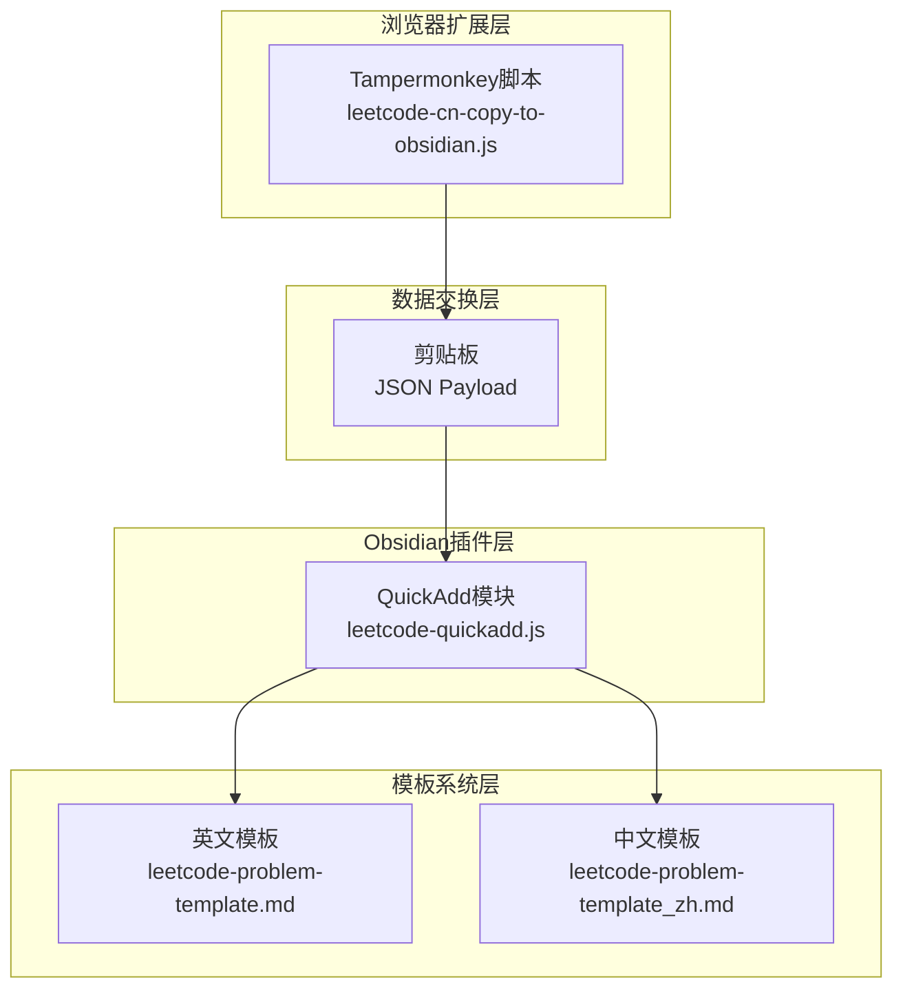
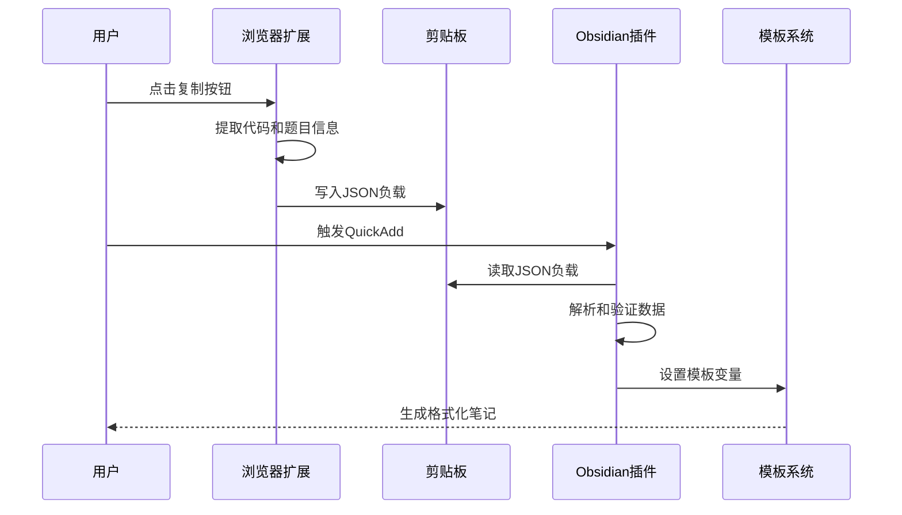
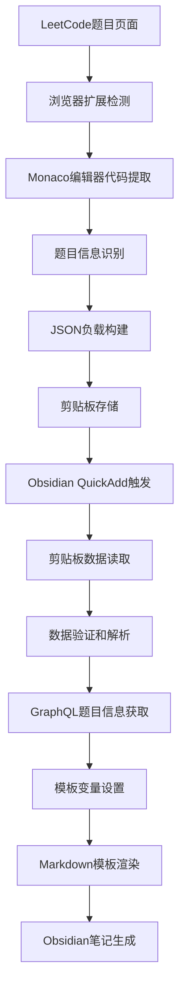
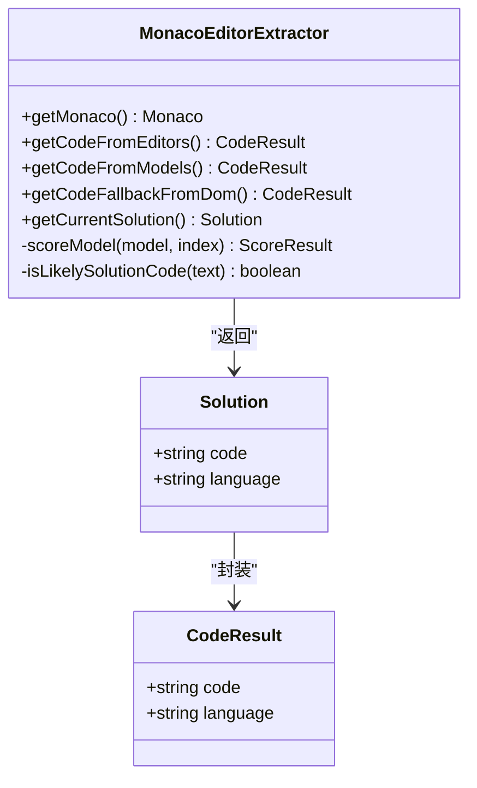
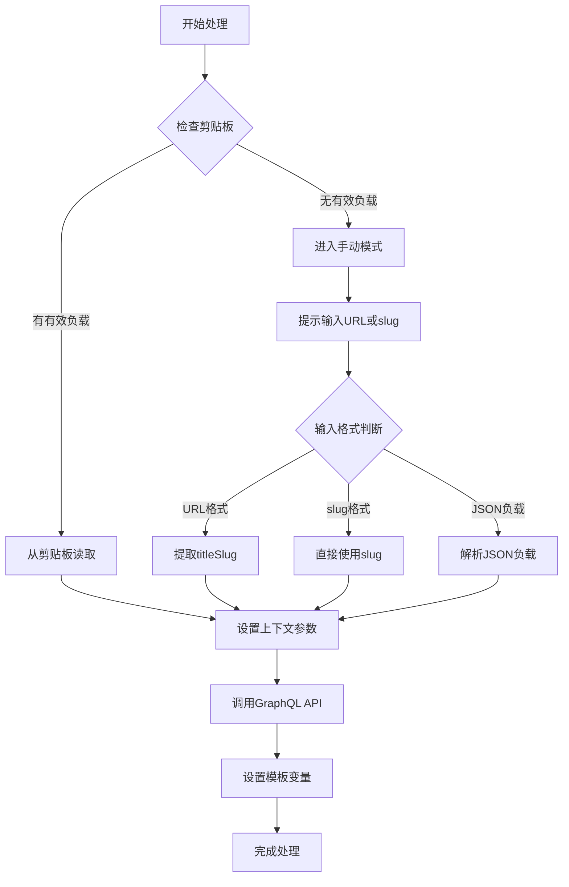
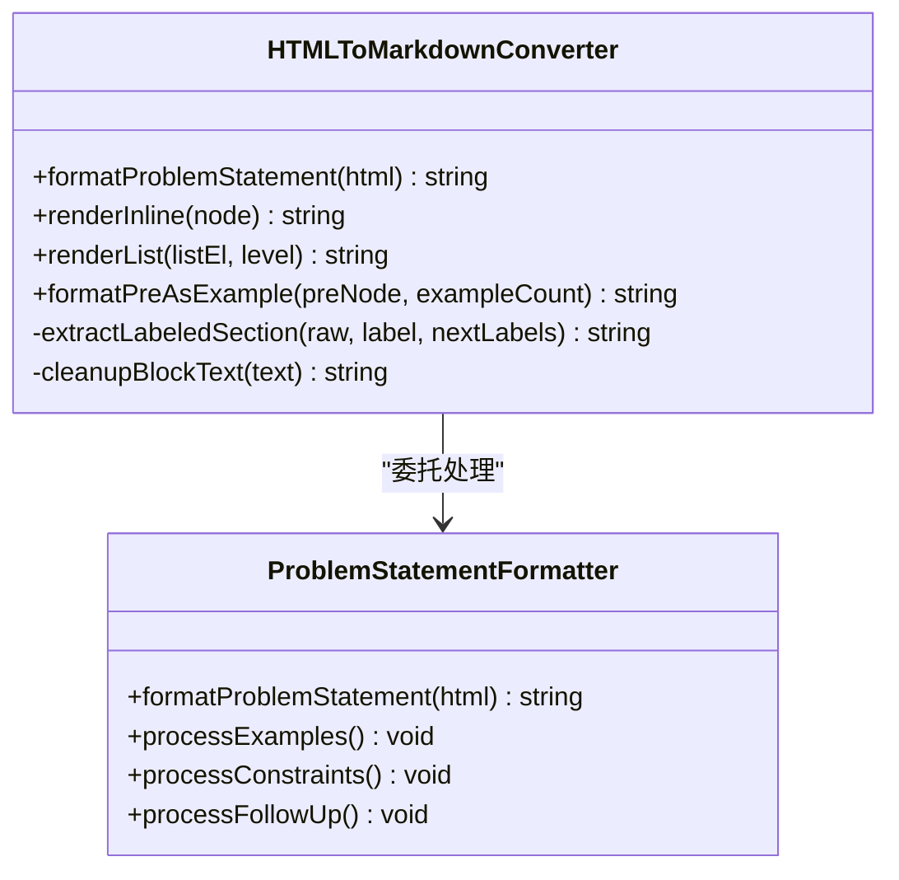
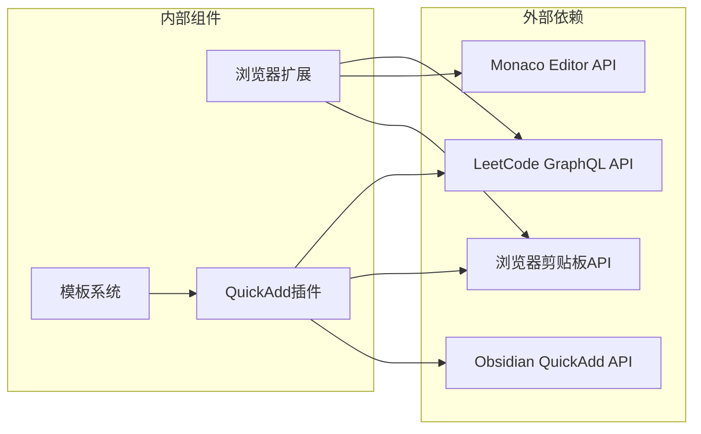

# 项目概述

<cite>
**本文档引用的文件**
- [Scripts/leetcode-quickadd.js](file://Scripts/leetcode-quickadd.js)
- [Templates/leetcode-problem-template.md](file://Templates/leetcode-problem-template.md)
- [Templates/leetcode-problem-template_zh.md](file://Templates/leetcode-problem-template_zh.md)
- [tampermonkey/Scripts/leetcode-cn-copy-to-obsidian.js](file://tampermonkey/Scripts/leetcode-cn-copy-to-obsidian.js)
</cite>

## 目录
1. [项目简介](#项目简介)
2. [项目结构](#项目结构)
3. [核心组件](#核心组件)
4. [架构概览](#架构概览)
5. [详细组件分析](#详细组件分析)
6. [依赖关系分析](#依赖关系分析)
7. [性能考虑](#性能考虑)
8. [故障排除指南](#故障排除指南)
9. [结论](#结论)

## 项目简介

LeetCode到Obsidian自动化集成项目是一个创新的开发工具链，旨在彻底简化编程学习笔记的创建流程。该项目通过三个关键组件的无缝协作，实现了从LeetCode在线编程平台到Obsidian笔记系统的自动化数据流转：

- **浏览器扩展**：Tampermonkey脚本负责从LeetCode界面捕获代码和题目信息
- **Obsidian插件**：QuickAdd模块提供智能的笔记生成和模板填充功能  
- **模板系统**：预定义的Markdown模板确保笔记格式的一致性和专业性

该解决方案的核心价值在于消除了手动复制粘贴的繁琐步骤，将原本需要数分钟的笔记创建过程缩短到几秒钟，显著提升了编程学习的效率和体验。

## 项目结构

项目采用模块化设计，每个组件都有明确的职责分工：

**图表来源**
- [Scripts/leetcode-quickadd.js:1-868](file://Scripts/leetcode-quickadd.js#L1-L868)
- [tampermonkey/Scripts/leetcode-cn-copy-to-obsidian.js:1-536](file://tampermonkey/Scripts/leetcode-cn-copy-to-obsidian.js#L1-L536)

**章节来源**
- [Scripts/leetcode-quickadd.js:1-868](file://Scripts/leetcode-quickadd.js#L1-L868)
- [Templates/leetcode-problem-template.md:1-35](file://Templates/leetcode-problem-template.md#L1-L35)
- [Templates/leetcode-problem-template_zh.md:1-41](file://Templates/leetcode-problem-template_zh.md#L1-L41)
- [tampermonkey/Scripts/leetcode-cn-copy-to-obsidian.js:1-536](file://tampermonkey/Scripts/leetcode-cn-copy-to-obsidian.js#L1-L536)

## 核心组件

### 浏览器扩展组件

**组件名称**：LeetCode CN Copy to Obsidian
**技术栈**：Tampermonkey + Monaco Editor API + JavaScript

该组件的主要职责是：
- 从LeetCode界面的Monaco编辑器中提取当前题目的完整代码
- 识别题目URL中的titleSlug标识符
- 将提取的数据封装为标准化的JSON负载格式
- 通过剪贴板与Obsidian进行数据交换

**章节来源**
- [tampermonkey/Scripts/leetcode-cn-copy-to-obsidian.js:1-536](file://tampermonkey/Scripts/leetcode-cn-copy-to-obsidian.js#L1-L536)

### Obsidian插件组件

**组件名称**：LeetCode Puller CN
**技术栈**：JavaScript + Obsidian QuickAdd API + GraphQL

该组件的核心功能包括：
- 从剪贴板读取和解析LeetCode数据负载
- 回退到手动输入模式以支持离线操作
- 通过GraphQL API获取完整的题目信息
- 设置QuickAdd模板变量供模板渲染使用

**章节来源**
- [Scripts/leetcode-quickadd.js:1-868](file://Scripts/leetcode-quickadd.js#L1-L868)

### 模板系统组件

**组件名称**：LeetCode问题模板
**技术栈**：Markdown + Obsidian模板语法

项目包含两个版本的模板：
- 英文模板：适用于国际用户和多语言环境
- 中文模板：专为中国用户优化的本地化版本

**章节来源**
- [Templates/leetcode-problem-template.md:1-35](file://Templates/leetcode-problem-template.md#L1-L35)
- [Templates/leetcode-problem-template_zh.md:1-41](file://Templates/leetcode-problem-template_zh.md#L1-L41)

## 架构概览

项目采用分层架构设计，确保各组件之间的松耦合和高内聚：

**图表来源**
- [Scripts/leetcode-quickadd.js:83-104](file://Scripts/leetcode-quickadd.js#L83-L104)
- [tampermonkey/Scripts/leetcode-cn-copy-to-obsidian.js:316-363](file://tampermonkey/Scripts/leetcode-cn-copy-to-obsidian.js#L316-L363)

### 数据流架构

**图表来源**
- [Scripts/leetcode-quickadd.js:114-166](file://Scripts/leetcode-quickadd.js#L114-L166)
- [tampermonkey/Scripts/leetcode-cn-copy-to-obsidian.js:280-303](file://tampermonkey/Scripts/leetcode-cn-copy-to-obsidian.js#L280-L303)

## 详细组件分析

### 浏览器扩展组件深度分析

#### Monaco Editor集成机制

浏览器扩展通过直接访问LeetCode页面的Monaco编辑器实例来提取代码：

**图表来源**
- [tampermonkey/Scripts/leetcode-cn-copy-to-obsidian.js:29-303](file://tampermonkey/Scripts/leetcode-cn-copy-to-obsidian.js#L29-L303)

#### 代码质量评分算法

扩展使用复杂的评分算法来确定最佳代码源：

| 评分因素 | 权重 | 说明 |
|---------|------|------|
| 语言识别准确性 | 100 | 通过正则表达式匹配编程语言特征 |
| 代码结构完整性 | 100 | 检测类定义、函数声明等代码结构 |
| 代码长度权重 | 0-500 | 优先选择较长且完整的代码片段 |
| 特征关键词匹配 | 0-100 | 匹配编程语言特有的关键字 |
| URI路径信息 | 0-40 | 通过文件路径判断代码来源 |

**章节来源**
- [tampermonkey/Scripts/leetcode-cn-copy-to-obsidian.js:101-145](file://tampermonkey/Scripts/leetcode-cn-copy-to-obsidian.js#L101-L145)

### Obsidian插件组件深度分析

#### 多模式输入处理机制

QuickAdd插件实现了智能的输入处理策略：

**图表来源**
- [Scripts/leetcode-quickadd.js:114-166](file://Scripts/leetcode-quickadd.js#L114-L166)

#### HTML到Markdown转换引擎

插件内置了强大的HTML到Markdown转换器，能够准确处理LeetCode的复杂内容结构：

**图表来源**
- [Scripts/leetcode-quickadd.js:436-546](file://Scripts/leetcode-quickadd.js#L436-L546)

**章节来源**
- [Scripts/leetcode-quickadd.js:339-404](file://Scripts/leetcode-quickadd.js#L339-L404)
- [Scripts/leetcode-quickadd.js:436-783](file://Scripts/leetcode-quickadd.js#L436-L783)

### 模板系统组件深度分析

#### 模板变量系统

模板系统提供了丰富的变量替换机制：

| 变量名 | 类型 | 描述 | 示例值 |
|-------|------|------|--------|
| {{VALUE:id}} | 文本 | 题目编号 | 1 |
| {{VALUE:title}} | 文本 | 题目标题 | Two Sum |
| {{VALUE:link}} | 链接 | 题目链接 | https://leetcode.cn/problems/two-sum/ |
| {{VALUE:difficulty}} | 文本 | 题目难度 | 简单 |
| {{VALUE:problemStatement}} | HTML | 题目描述 | 完整的HTML内容 |
| {{VALUE:formattedHints}} | HTML | 格式化提示 | Markdown格式 |
| {{VALUE:tags}} | 列表 | 题目标签 | leetcode/array |
| {{VALUE:fileName}} | 文本 | 文件名 | 1. Two Sum |
| {{VALUE:language}} | 文本 | 编程语言 | python |
| {{VALUE:solutionCode}} | 代码 | 解决方案代码 | 完整代码块 |
| {{VALUE:sourceUrl}} | 链接 | 源URL | 同上 |
| {{VALUE:titleSlug}} | 文本 | URL slug | two-sum |

**章节来源**
- [Scripts/leetcode-quickadd.js:410-430](file://Scripts/leetcode-quickadd.js#L410-L430)
- [Templates/leetcode-problem-template_zh.md:30-32](file://Templates/leetcode-problem-template_zh.md#L30-L32)

## 依赖关系分析

项目各组件之间的依赖关系清晰明确：

**图表来源**
- [Scripts/leetcode-quickadd.js:49](file://Scripts/leetcode-quickadd.js#L49)
- [Scripts/leetcode-quickadd.js:368-378](file://Scripts/leetcode-quickadd.js#L368-L378)
- [tampermonkey/Scripts/leetcode-cn-copy-to-obsidian.js:29](file://tampermonkey/Scripts/leetcode-cn-copy-to-obsidian.js#L29)

### 技术栈概览

| 组件 | 技术栈 | 版本要求 | 用途 |
|------|--------|----------|------|
| 浏览器扩展 | Tampermonkey | 4.0+ | 用户脚本执行 |
| Monaco Editor | Monaco Editor API | 最新版本 | 代码编辑器访问 |
| Obsidian插件 | QuickAdd | 0.5+ | 笔记生成 |
| 模板系统 | Markdown | 标准语法 | 笔记格式化 |
| 数据交换 | JSON | 标准格式 | 组件间通信 |

**章节来源**
- [Scripts/leetcode-quickadd.js:56-70](file://Scripts/leetcode-quickadd.js#L56-L70)
- [tampermonkey/Scripts/leetcode-cn-copy-to-obsidian.js:1-10](file://tampermonkey/Scripts/leetcode-cn-copy-to-obsidian.js#L1-L10)

## 性能考虑

### 数据提取优化

浏览器扩展采用了多层代码提取策略，确保在不同页面状态下都能获取到最佳代码：

- **编辑器优先**：优先从活动编辑器获取代码，确保实时性
- **模型回退**：当编辑器不可用时，尝试从编辑器模型获取
- **DOM降级**：最后通过DOM查询获取代码
- **智能评分**：使用评分算法选择最合适的代码源

### 网络请求优化

QuickAdd插件实现了高效的GraphQL查询：

- **单次请求**：一次性获取所有需要的题目信息
- **缓存友好**：合理的请求头设置
- **错误处理**：完善的异常处理机制

## 故障排除指南

### 常见问题及解决方案

| 问题类型 | 症状 | 可能原因 | 解决方案 |
|----------|------|----------|----------|
| 代码未复制 | 点击按钮无响应 | Monaco编辑器未加载 | 刷新页面或等待编辑器加载 |
| 剪贴板权限 | 复制失败 | 浏览器安全限制 | 允许剪贴板访问权限 |
| 题目信息缺失 | 难度或标签为空 | GraphQL API失败 | 检查网络连接或稍后重试 |
| 模板变量未替换 | 模板显示原始变量名 | QuickAdd配置错误 | 检查QuickAdd设置和模板语法 |

### 调试模式

项目提供了专门的调试功能：

1. **浏览器扩展调试**：通过`__LC_OBSIDIAN_DEBUG_MODELS__()`函数查看所有编辑器模型
2. **日志输出**：详细的控制台日志记录
3. **状态指示**：复制按钮的颜色变化反馈

**章节来源**
- [tampermonkey/Scripts/leetcode-cn-copy-to-obsidian.js:498-525](file://tampermonkey/Scripts/leetcode-cn-copy-to-obsidian.js#L498-L525)
- [Scripts/leetcode-quickadd.js:42-43](file://Scripts/leetcode-quickadd.js#L42-L43)

## 结论

LeetCode到Obsidian自动化集成项目代表了现代开发者工具链的创新实践。通过精心设计的三层架构，该项目成功解决了编程学习笔记创建过程中的核心痛点：

**技术优势**：
- **自动化程度高**：从代码提取到笔记生成的全自动化流程
- **兼容性强**：支持多种编程语言和编辑器环境
- **可扩展性好**：模块化设计便于功能扩展和维护

**用户体验优势**：
- **操作简便**：仅需点击按钮即可完成复杂的笔记创建
- **格式统一**：标准化的模板确保笔记的专业性和一致性
- **学习效率提升**：显著减少笔记创建时间，专注于学习本身

**适用场景**：
- 编程学习者日常练习记录
- 技术面试准备的题解整理
- 编程技能复盘和知识管理
- 在线编程课程的学习笔记

该项目不仅是一个实用的工具，更是开发者工具生态创新的典范，展示了如何通过技术手段提升学习和工作效率。随着项目的不断完善，它有望成为编程学习社区的标准工具之一。